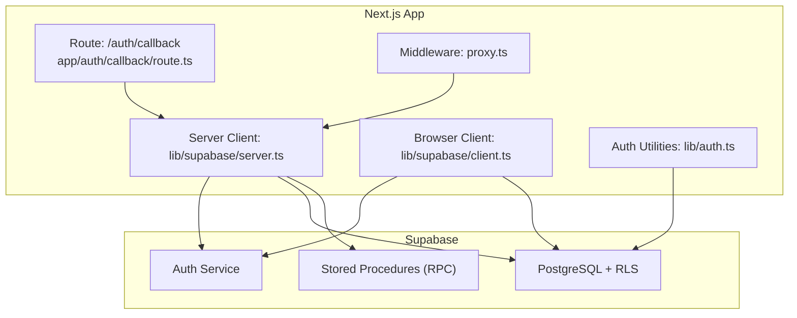
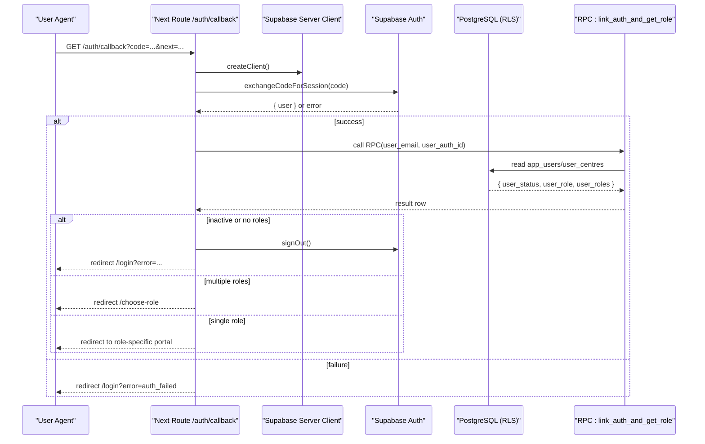
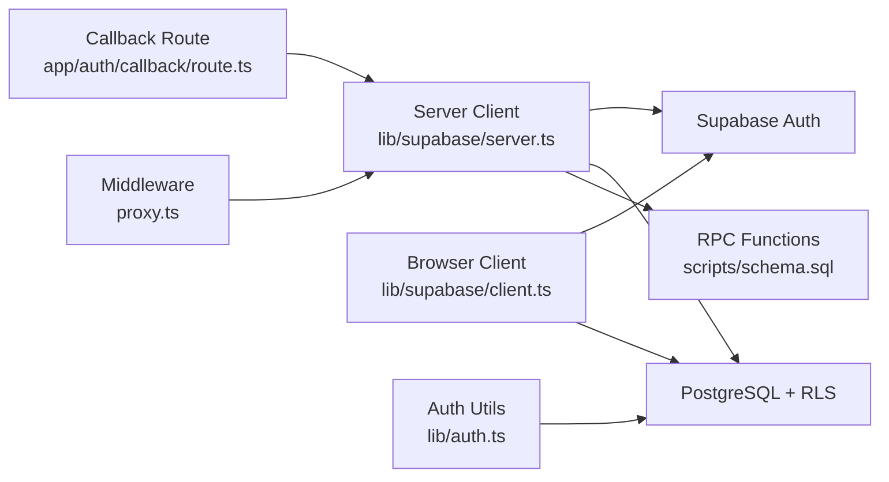

# API Reference

<cite>
**Referenced Files in This Document**
- [route.ts](file://app/auth/callback/route.ts)
- [server.ts](file://lib/supabase/server.ts)
- [client.ts](file://lib/supabase/client.ts)
- [proxy.ts](file://proxy.ts)
- [auth.ts](file://lib/auth.ts)
- [schema.sql](file://scripts/schema.sql)
</cite>

## Table of Contents
1. Introduction
2. Project Structure
3. Core Components
4. Architecture Overview
5. Detailed Component Analysis
6. Dependency Analysis
7. Performance Considerations
8. Troubleshooting Guide
9. Conclusion

## Introduction
This document describes the internal APIs and Supabase integrations used by the Superclass Portal, focusing on:
- Authentication endpoints, including magic link processing at /auth/callback
- Supabase RPC functions for faculty lookups and role resolution
- Database query patterns used across the application
- Request/response schemas, error handling patterns, authentication methods, and rate limiting considerations
- Client integration examples and common scenarios

The portal uses Next.js App Router server routes and middleware to enforce authentication and authorization, with Supabase providing authentication, database access, and stored procedures (RPC).

## Project Structure
Key areas relevant to this API reference:
- Authentication callback route: app/auth/callback/route.ts
- Supabase client configuration: lib/supabase/server.ts, lib/supabase/client.ts
- Middleware-based authorization: proxy.ts
- Application user utilities: lib/auth.ts
- Database schema and RPC definitions: scripts/schema.sql

**Diagram sources**
- [route.ts:1-68](file://app/auth/callback/route.ts#L1-L68)
- [server.ts:1-29](file://lib/supabase/server.ts#L1-L29)
- [client.ts:1-8](file://lib/supabase/client.ts#L1-L8)
- [proxy.ts:1-103](file://proxy.ts#L1-L103)
- [auth.ts:1-69](file://lib/auth.ts#L1-L69)
- [schema.sql:168-213](file://scripts/schema.sql#L168-L213)

**Section sources**
- [route.ts:1-68](file://app/auth/callback/route.ts#L1-L68)
- [server.ts:1-29](file://lib/supabase/server.ts#L1-L29)
- [client.ts:1-8](file://lib/supabase/client.ts#L1-L8)
- [proxy.ts:1-103](file://proxy.ts#L1-L103)
- [auth.ts:1-69](file://lib/auth.ts#L1-L69)
- [schema.sql:168-213](file://scripts/schema.sql#L168-L213)

## Core Components
- Magic Link Callback Endpoint (/auth/callback): Exchanges a one-time code for a session, links the auth identity to an application user, resolves roles, and redirects based on role(s).
- Server-side Supabase Client: Creates a Supabase client bound to request cookies for authenticated requests in server routes and middleware.
- Browser-side Supabase Client: Creates a Supabase client for client components using the public anon key.
- Authorization Middleware: Enforces login and role-based path access before rendering protected pages.
- Application User Utilities: Helper functions to resolve app user profiles, centre membership, and role checks.
- Supabase RPC Functions: Stored procedures for faculty listing and email-based lookup within a centre context.

**Section sources**
- [route.ts:1-68](file://app/auth/callback/route.ts#L1-L68)
- [server.ts:1-29](file://lib/supabase/server.ts#L1-L29)
- [client.ts:1-8](file://lib/supabase/client.ts#L1-L8)
- [proxy.ts:1-103](file://proxy.ts#L1-L103)
- [auth.ts:1-69](file://lib/auth.ts#L1-L69)
- [schema.sql:168-213](file://scripts/schema.sql#L168-L213)

## Architecture Overview
End-to-end flow for magic link authentication and role-based routing:

**Diagram sources**
- [route.ts:1-68](file://app/auth/callback/route.ts#L1-L68)
- [server.ts:1-29](file://lib/supabase/server.ts#L1-L29)
- [schema.sql:168-213](file://scripts/schema.sql#L168-L213)

## Detailed Component Analysis

### Authentication Endpoints
- Endpoint: GET /auth/callback
  - Purpose: Exchange magic link code for a session, link auth identity to app user, resolve roles, and redirect.
  - Query Parameters:
    - code: string (required) — One-time code from the magic link
    - next: string (optional) — Fallback destination if role resolution fails
  - Behavior:
    - Validates presence of code
    - Exchanges code for session via Supabase Auth
    - Ensures user has an email
    - Calls RPC to link auth identity and retrieve role information
    - Handles inactive users and missing roles
    - Redirects to role-specific portals or /choose-role when multiple roles exist
  - Response: HTTP 302 redirects to:
    - /login?error=auth_failed
    - /login?error=no_email
    - /login?error=not_registered
    - /login?error=inactive
    - /login?error=no_access
    - /choose-role
    - Role-specific portal paths (/admin, /central, /faculty, /branch, /batch-manager) or provided next

Error Codes and Meanings:
- auth_failed: Code exchange failed or no user returned
- no_email: Authenticated user lacks email
- not_registered: No matching app user found after linking attempt
- inactive: App user is marked inactive
- no_access: App user exists but has no active roles

Authentication Methods:
- Magic link via Supabase Auth
- Session established server-side using cookie-bound Supabase client

Rate Limiting:
- Not implemented in the callback route; rely on Supabase Auth provider limits and infrastructure-level throttling.

Request/Response Schema:
- Request:
  - Method: GET
  - Path: /auth/callback
  - Query:
    - code: string
    - next: string (optional)
- Response:
  - Type: Redirect (HTTP 302)
  - Destination: See behavior above

Integration Example (Conceptual):
- Frontend triggers magic link send through Supabase Auth UI or SDK
- After click, browser navigates to /auth/callback with code and optional next
- Server validates and redirects accordingly

**Section sources**
- [route.ts:1-68](file://app/auth/callback/route.ts#L1-L68)

### Supabase RPC Functions
- Function: list_active_faculty(p_centre_id UUID)
  - Returns: Table of active faculty members, optionally filtered by centre
  - Columns: id (UUID), full_name (TEXT), email (TEXT), centre_id (UUID)
  - Notes:
    - If p_centre_id is NULL, returns all active faculty
    - Filters by status = 'active' and role membership ('faculty' in roles or role = 'faculty')
    - Uses SECURITY DEFINER to run with elevated privileges

- Function: lookup_faculty_by_email(faculty_email TEXT, p_centre_id UUID)
  - Returns: UUID (faculty id) or null
  - Notes:
    - Matches email case-insensitively
    - Requires active status and faculty role membership
    - Requires association with the specified centre via user_centres
    - Uses SECURITY DEFINER

Usage Patterns:
- Call via supabase.rpc('list_active_faculty', { p_centre_id })
- Call via supabase.rpc('lookup_faculty_by_email', { faculty_email, p_centre_id })

Security:
- Both functions are SECURITY DEFINER, allowing controlled access to data behind RLS policies.

**Section sources**
- [schema.sql:168-213](file://scripts/schema.sql#L168-L213)

### Database Query Patterns
- Application User Resolution:
  - Lookup by auth_id first; fallback to email match
  - Auto-link auth_id on successful email match for future fast lookups
  - Select fields include profile, role(s), and centre memberships

- Centre Membership:
  - user_centres junction supports multi-centre assignments
  - Utility function aggregates centre IDs from user_centres or legacy centre_id field

- Role Checks:
  - Support both single role field and roles array
  - Utility function provides boolean check for a specific role

- Row Level Security (RLS):
  - All core tables have RLS enabled
  - Policies allow authenticated users to read and mutate data; application-level role checks enforced in code

Example Patterns (paths only):
- Get app user by auth_id or email: [auth.ts:18-51](file://lib/auth.ts#L18-L51)
- Resolve centre IDs: [auth.ts:53-61](file://lib/auth.ts#L53-L61)
- Check role: [auth.ts:63-68](file://lib/auth.ts#L63-L68)
- RLS policies overview: [schema.sql:219-263](file://scripts/schema.sql#L219-L263)

**Section sources**
- [auth.ts:1-69](file://lib/auth.ts#L1-L69)
- [schema.sql:219-263](file://scripts/schema.sql#L219-L263)

### Authorization Middleware
- File: proxy.ts
- Responsibilities:
  - Create a server-side Supabase client bound to request cookies
  - Allow public routes (/login, /auth/*, /) without authentication
  - Redirect unauthenticated users to /login
  - For protected paths (/admin, /central, /faculty, /branch, /batch-manager):
    - Look up app user by email
    - Reject inactive users
    - Validate required role against user’s role(s)
    - Redirect to appropriate portal if mismatched

Protected Paths Mapping:
- /admin → admin
- /central → central_team
- /faculty → faculty
- /branch → branch_head
- /batch-manager → batch_manager

Behavior:
- On missing user: redirect to /login
- On inactive user: redirect to /login?error=no_access
- On wrong role: redirect to user’s correct portal or /login

**Section sources**
- [proxy.ts:1-103](file://proxy.ts#L1-L103)

### Supabase Client Configuration
- Server Client:
  - Binds to request cookies for authenticated sessions
  - Used in server routes and middleware
  - File: [server.ts:1-29](file://lib/supabase/server.ts#L1-L29)

- Browser Client:
  - Uses NEXT_PUBLIC_SUPABASE_ANON_KEY
  - Used in client components for direct DB calls
  - File: [client.ts:1-8](file://lib/supabase/client.ts#L1-L8)

**Section sources**
- [server.ts:1-29](file://lib/supabase/server.ts#L1-L29)
- [client.ts:1-8](file://lib/supabase/client.ts#L1-L8)

## Dependency Analysis
High-level dependencies between components:

**Diagram sources**
- [route.ts:1-68](file://app/auth/callback/route.ts#L1-L68)
- [server.ts:1-29](file://lib/supabase/server.ts#L1-L29)
- [client.ts:1-8](file://lib/supabase/client.ts#L1-L8)
- [proxy.ts:1-103](file://proxy.ts#L1-L103)
- [auth.ts:1-69](file://lib/auth.ts#L1-L69)
- [schema.sql:168-213](file://scripts/schema.sql#L168-L213)

**Section sources**
- [route.ts:1-68](file://app/auth/callback/route.ts#L1-L68)
- [server.ts:1-29](file://lib/supabase/server.ts#L1-L29)
- [client.ts:1-8](file://lib/supabase/client.ts#L1-L8)
- [proxy.ts:1-103](file://proxy.ts#L1-L103)
- [auth.ts:1-69](file://lib/auth.ts#L1-L69)
- [schema.sql:168-213](file://scripts/schema.sql#L168-L213)

## Performance Considerations
- Prefer RPC functions for complex queries that require joins and role checks to minimize client-side logic and network round-trips.
- Use indexes defined in the schema (e.g., user_centres, audit_log) to optimize lookups.
- Avoid excessive client-side filtering; push filtering into server-side queries or RPC where possible.
- Cache frequently accessed reference data (centres, subjects) at the edge or in memory if needed, while respecting RLS and data freshness requirements.

[No sources needed since this section provides general guidance]

## Troubleshooting Guide
Common issues and resolutions:
- Missing code parameter in /auth/callback:
  - Ensure the magic link includes the code query parameter
  - Verify Supabase Auth settings for magic link redirect URL
- Auth exchange failures:
  - Confirm NEXT_PUBLIC_SUPABASE_URL and NEXT_PUBLIC_SUPABASE_ANON_KEY are set
  - Check Supabase project logs for auth errors
- Inactive or no-access errors:
  - Verify app user status and role(s) in app_users
  - Ensure user_centres associations exist for centre-scoped operations
- Wrong portal redirection:
  - Confirm role mapping in middleware matches expected roles
  - Validate user’s roles array or role field contains the required value

Operational references:
- Error redirects and role resolution: [route.ts:9-66](file://app/auth/callback/route.ts#L9-L66)
- Middleware role enforcement: [proxy.ts:55-91](file://proxy.ts#L55-L91)
- App user resolution and role helpers: [auth.ts:18-68](file://lib/auth.ts#L18-L68)

**Section sources**
- [route.ts:9-66](file://app/auth/callback/route.ts#L9-L66)
- [proxy.ts:55-91](file://proxy.ts#L55-L91)
- [auth.ts:18-68](file://lib/auth.ts#L18-L68)

## Conclusion
The Superclass Portal integrates Supabase Auth and PostgreSQL with Next.js server routes and middleware to provide secure, role-based access. The /auth/callback endpoint orchestrates magic link authentication, role resolution via RPC, and safe redirection. Supabase RPC functions encapsulate business logic for faculty lookups, while RLS policies protect data access. Following the documented patterns ensures consistent authentication, authorization, and efficient database interactions.

[No sources needed since this section summarizes without analyzing specific files]