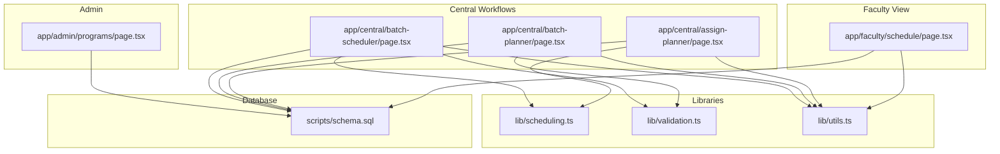
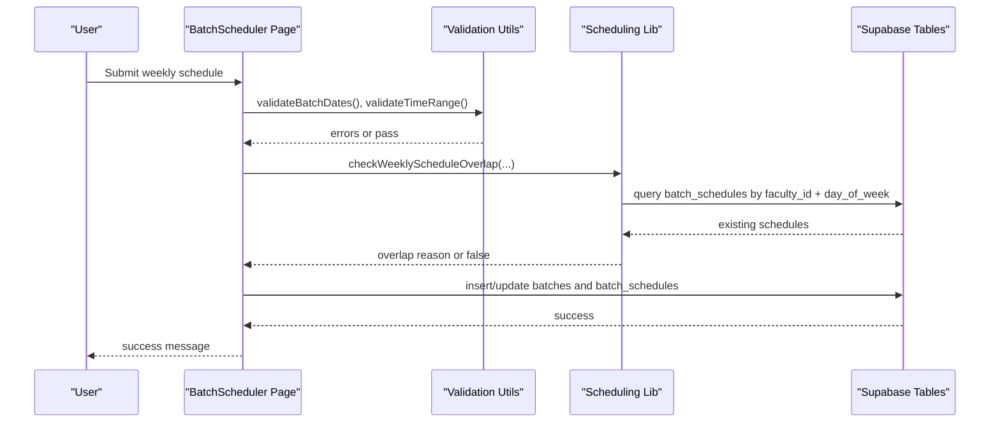
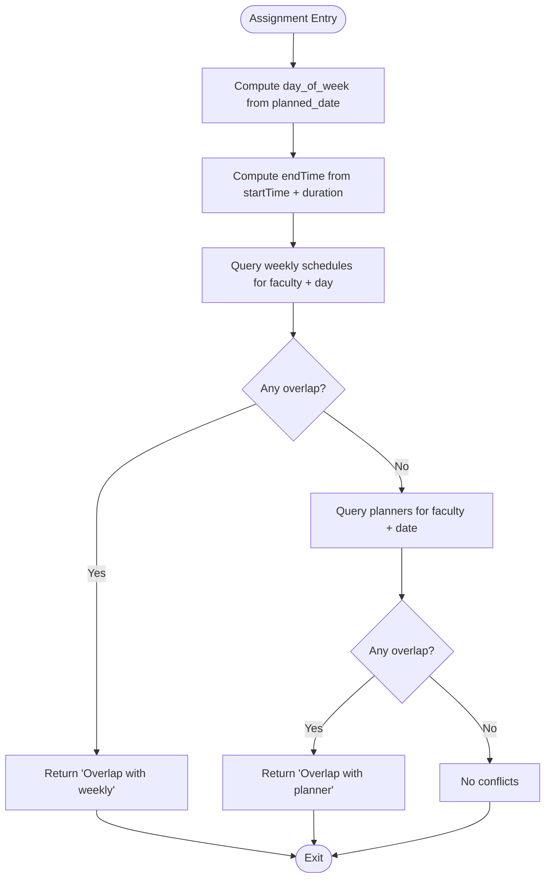
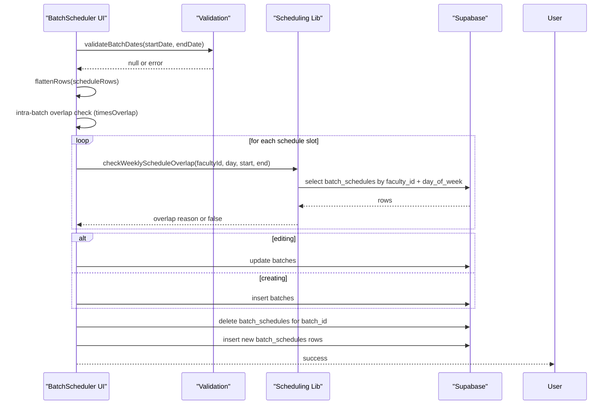
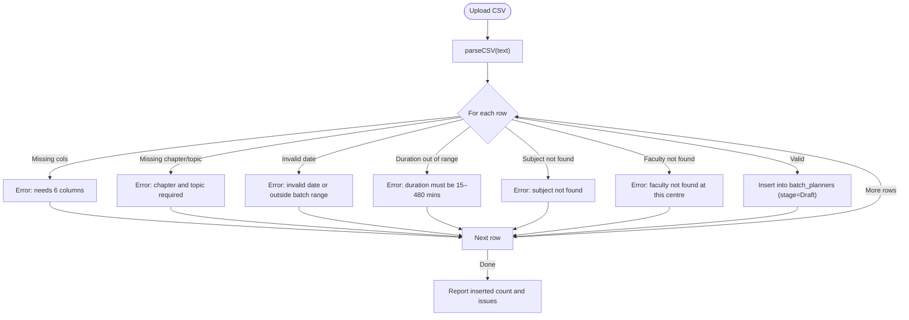
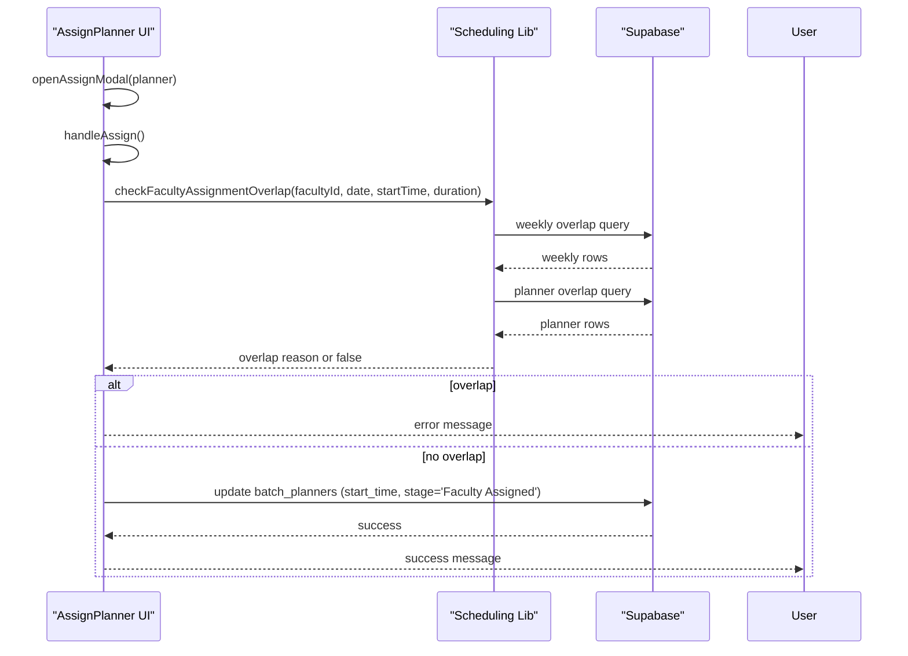
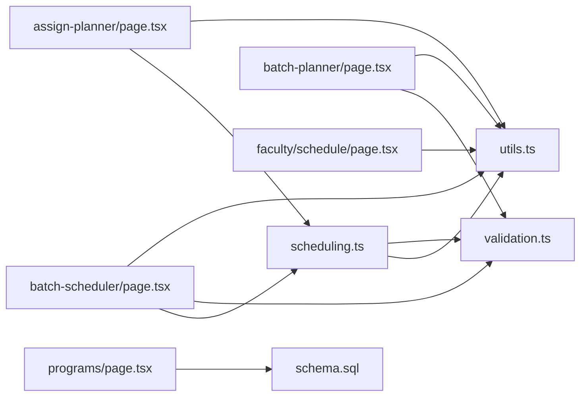

# Core Features

<cite>
**Referenced Files in This Document**
- [scheduling.ts](file://lib/scheduling.ts)
- [validation.ts](file://lib/validation.ts)
- [utils.ts](file://lib/utils.ts)
- [batch-scheduler/page.tsx](file://app/central/batch-scheduler/page.tsx)
- [batch-planner/page.tsx](file://app/central/batch-planner/page.tsx)
- [assign-planner/page.tsx](file://app/central/assign-planner/page.tsx)
- [faculty/schedule/page.tsx](file://app/faculty/schedule/page.tsx)
- [programs/page.tsx](file://app/admin/programs/page.tsx)
- [schema.sql](file://scripts/schema.sql)
</cite>

## Table of Contents
1. [Introduction](#introduction)
2. [Project Structure](#project-structure)
3. [Core Components](#core-components)
4. [Architecture Overview](#architecture-overview)
5. [Detailed Component Analysis](#detailed-component-analysis)
6. [Dependency Analysis](#dependency-analysis)
7. [Performance Considerations](#performance-considerations)
8. [Troubleshooting Guide](#troubleshooting-guide)
9. [Conclusion](#conclusion)

## Introduction
This document explains the core business features of the Superclass Portal with a focus on:
- Scheduling engine and overlap detection algorithms for weekly schedules and one-off lectures
- Time conflict resolution during faculty assignment
- Weekly schedule management for batches
- Data validation system ensuring integrity across inputs
- Utility functions used throughout the application
- Academic program management (programs and subjects)
- Batch scheduling workflow, lecture planning processes, and faculty assignment logic
- Integration points with the database layer (Supabase tables and RPC functions)

The goal is to provide both high-level understanding and code-level detail so that developers and domain users can confidently extend or operate these features.

## Project Structure
The relevant modules are organized by feature and concern:
- lib: shared libraries for scheduling algorithms, validation rules, and utilities
- app/central: central team workflows for batch scheduling, lecture planning, and planner assignment
- app/faculty: faculty-facing schedule view and interactions
- app/admin: academic program management
- scripts: database schema and helper scripts

**Diagram sources**
- [scheduling.ts:1-113](file://lib/scheduling.ts#L1-L113)
- [validation.ts:1-33](file://lib/validation.ts#L1-L33)
- [utils.ts:1-74](file://lib/utils.ts#L1-L74)
- [batch-scheduler/page.tsx:1-583](file://app/central/batch-scheduler/page.tsx#L1-L583)
- [batch-planner/page.tsx:1-218](file://app/central/batch-planner/page.tsx#L1-L218)
- [assign-planner/page.tsx:1-226](file://app/central/assign-planner/page.tsx#L1-L226)
- [faculty/schedule/page.tsx:1-194](file://app/faculty/schedule/page.tsx#L1-L194)
- [programs/page.tsx:1-290](file://app/admin/programs/page.tsx#L1-L290)
- [schema.sql:1-269](file://scripts/schema.sql#L1-L269)

**Section sources**
- [scheduling.ts:1-113](file://lib/scheduling.ts#L1-L113)
- [validation.ts:1-33](file://lib/validation.ts#L1-L33)
- [utils.ts:1-74](file://lib/utils.ts#L1-L74)
- [batch-scheduler/page.tsx:1-583](file://app/central/batch-scheduler/page.tsx#L1-L583)
- [batch-planner/page.tsx:1-218](file://app/central/batch-planner/page.tsx#L1-L218)
- [assign-planner/page.tsx:1-226](file://app/central/assign-planner/page.tsx#L1-L226)
- [faculty/schedule/page.tsx:1-194](file://app/faculty/schedule/page.tsx#L1-L194)
- [programs/page.tsx:1-290](file://app/admin/programs/page.tsx#L1-L290)
- [schema.sql:1-269](file://scripts/schema.sql#L1-L269)

## Core Components
- Scheduling Engine
  - Weekly recurring schedule overlap detection against batch_schedules
  - One-off planner time overlap detection against batch_planners
  - Combined assignment overlap check merging weekly and planner checks
- Validation System
  - Date parsing and range checks
  - Time range validation
  - Duration normalization helpers
- Utilities
  - Day constants, stage enumerations
  - Time conversion and overlap primitives
  - CSV parser for bulk imports
  - UI badge class generator
- Academic Program Management
  - CRUD for programs and subjects
  - Referential integrity via foreign keys
- Central Workflows
  - Batch Scheduler: create/update batches and weekly schedules with validations
  - Batch Planner: CSV-based lecture plan import with validation and faculty lookup
  - Assign Planner: assign start times with full overlap checks and stage transitions
- Faculty Schedule View
  - Display recurring weekly classes and assigned planned lectures

**Section sources**
- [scheduling.ts:10-112](file://lib/scheduling.ts#L10-L112)
- [validation.ts:1-33](file://lib/validation.ts#L1-L33)
- [utils.ts:1-74](file://lib/utils.ts#L1-L74)
- [batch-scheduler/page.tsx:85-404](file://app/central/batch-scheduler/page.tsx#L85-L404)
- [batch-planner/page.tsx:19-162](file://app/central/batch-planner/page.tsx#L19-L162)
- [assign-planner/page.tsx:22-118](file://app/central/assign-planner/page.tsx#L22-L118)
- [faculty/schedule/page.tsx:29-79](file://app/faculty/schedule/page.tsx#L29-L79)
- [programs/page.tsx:9-100](file://app/admin/programs/page.tsx#L9-L100)

## Architecture Overview
The scheduling subsystem integrates three layers:
- Presentation Layer: React pages orchestrate user flows and display results
- Business Logic Layer: Shared libraries implement overlap detection, validation, and utilities
- Data Layer: Supabase tables store entities; RPC functions assist with queries

**Diagram sources**
- [batch-scheduler/page.tsx:249-404](file://app/central/batch-scheduler/page.tsx#L249-L404)
- [scheduling.ts:11-43](file://lib/scheduling.ts#L11-L43)
- [validation.ts:16-26](file://lib/validation.ts#L16-L26)
- [schema.sql:118-131](file://scripts/schema.sql#L118-L131)

## Detailed Component Analysis

### Scheduling Engine: Overlap Detection Algorithms
The scheduling engine provides three primary functions:
- Weekly recurring overlap detection
- One-off planner overlap detection
- Full assignment overlap combining both

Algorithm details:
- Weekly overlap:
  - Query existing batch_schedules for the same faculty_id and day_of_week
  - Convert time strings to minutes and apply interval intersection rule
  - Return error message including batch name if overlap found
- Planner overlap:
  - For a specific planned_date, query scheduled planners with non-null start_time
  - Compute new interval from startTime and duration_minutes
  - Apply interval intersection rule against existing intervals
- Full assignment:
  - Derive day_of_week from planned_date
  - Compute endTime from startTime and duration
  - Check weekly overlap first, then planner overlap
  - Return combined error message if any overlap exists

Complexity:
- Weekly check: O(N) where N is number of existing weekly slots for the faculty on that day
- Planner check: O(M) where M is number of already-assigned planners on that date
- Full check: O(N + M)

**Diagram sources**
- [scheduling.ts:79-112](file://lib/scheduling.ts#L79-L112)
- [scheduling.ts:11-43](file://lib/scheduling.ts#L11-L43)
- [scheduling.ts:45-77](file://lib/scheduling.ts#L45-L77)
- [utils.ts:7-18](file://lib/utils.ts#L7-L18)
- [validation.ts:28-32](file://lib/validation.ts#L28-L32)

**Section sources**
- [scheduling.ts:10-112](file://lib/scheduling.ts#L10-L112)
- [utils.ts:7-18](file://lib/utils.ts#L7-L18)
- [validation.ts:28-32](file://lib/validation.ts#L28-L32)

### Weekly Schedule Management (Batch Scheduler)
Responsibilities:
- Create and update batches with program, centre, dates, and manager
- Manage weekly recurring schedules per batch
- Validate input data and detect overlaps before persisting
- Persist changes atomically by deleting old schedules and inserting new ones

Key behaviors:
- Centre scoping filters available faculty and managers
- Row-level validation ensures each row has faculty and at least one day selected
- Intra-batch overlap detection prevents same-faculty double booking on the same day within the same batch
- Cross-batch overlap detection uses the scheduling library to prevent faculty conflicts across all batches
- On save, deletes existing schedules for the batch and inserts flattened schedule rows

Data flow:
- Load reference data (programs, centres, faculty, managers, user_centres)
- Build flat schedule representation from UI rows
- Validate dates and times
- Perform intra-batch and cross-batch overlap checks
- Insert or update batch entity
- Delete previous schedules and insert new schedule rows

**Diagram sources**
- [batch-scheduler/page.tsx:249-404](file://app/central/batch-scheduler/page.tsx#L249-L404)
- [scheduling.ts:11-43](file://lib/scheduling.ts#L11-L43)
- [utils.ts:12-18](file://lib/utils.ts#L12-L18)
- [schema.sql:118-131](file://scripts/schema.sql#L118-L131)

**Section sources**
- [batch-scheduler/page.tsx:85-404](file://app/central/batch-scheduler/page.tsx#L85-L404)
- [scheduling.ts:11-43](file://lib/scheduling.ts#L11-L43)
- [utils.ts:12-18](file://lib/utils.ts#L12-L18)
- [schema.sql:118-131](file://scripts/schema.sql#L118-L131)

### Lecture Planning Workflow (Batch Planner)
Responsibilities:
- Upload CSV containing lecture plans
- Validate each row for required fields, date format, date range, duration bounds, subject existence, and faculty association
- Resolve faculty by email using an RPC function with centre scoping, with fallback to direct user lookup
- Insert validated rows into batch_planners with stage set to Draft

CSV format expectations:
- Columns: Subject, Chapter, Topic Name, Faculty Email, Planned Date (YYYY-MM-DD), Duration (minutes)

Validation rules:
- Minimum 6 columns per row
- Chapter and topic must be present
- Date must match YYYY-MM-DD and fall within batch start/end dates
- Duration must be between 15 and 480 minutes
- Subject must exist in subjects table
- Faculty must be active and associated with the batch’s centre

**Diagram sources**
- [batch-planner/page.tsx:50-162](file://app/central/batch-planner/page.tsx#L50-L162)
- [utils.ts:32-58](file://lib/utils.ts#L32-L58)
- [validation.ts:2-14](file://lib/validation.ts#L2-L14)
- [schema.sql:135-150](file://scripts/schema.sql#L135-L150)
- [schema.sql:196-213](file://scripts/schema.sql#L196-L213)

**Section sources**
- [batch-planner/page.tsx:19-162](file://app/central/batch-planner/page.tsx#L19-L162)
- [utils.ts:32-58](file://lib/utils.ts#L32-L58)
- [validation.ts:2-14](file://lib/validation.ts#L2-L14)
- [schema.sql:135-150](file://scripts/schema.sql#L135-L150)
- [schema.sql:196-213](file://scripts/schema.sql#L196-L213)

### Faculty Assignment Logic (Assign Planner)
Responsibilities:
- List planned lectures with stage filtering
- Assign a start time to a planner after performing full overlap checks
- Update stage to “Faculty Assigned” upon successful assignment
- Allow confirmation or rework transitions

Assignment process:
- Validate start time provided
- Compute overlap against weekly schedules and other planners using the scheduling library
- If no overlap, update start_time and stage
- Provide feedback to the user

**Diagram sources**
- [assign-planner/page.tsx:73-118](file://app/central/assign-planner/page.tsx#L73-L118)
- [scheduling.ts:79-112](file://lib/scheduling.ts#L79-L112)
- [schema.sql:135-150](file://scripts/schema.sql#L135-L150)

**Section sources**
- [assign-planner/page.tsx:22-118](file://app/central/assign-planner/page.tsx#L22-L118)
- [scheduling.ts:79-112](file://lib/scheduling.ts#L79-L112)
- [schema.sql:135-150](file://scripts/schema.sql#L135-L150)

### Faculty Schedule View
Responsibilities:
- Fetch current faculty profile and load their recurring weekly schedules
- Load assigned planned lectures filtered by stages
- Present weekly cards and upcoming lectures with status badges

Integration points:
- Reads from batch_schedules and batch_planners
- Uses utility functions for formatting and stage badges

**Section sources**
- [faculty/schedule/page.tsx:29-79](file://app/faculty/schedule/page.tsx#L29-L79)
- [utils.ts:1-6](file://lib/utils.ts#L1-L6)

### Academic Program Management
Responsibilities:
- Create, edit, and delete programs
- Add and remove subjects linked to programs
- Enforce referential integrity via foreign keys

Notes:
- Deleting a program may fail if batches reference it due to ON DELETE RESTRICT constraints
- Subjects are stored with unique constraint per program

**Section sources**
- [programs/page.tsx:9-100](file://app/admin/programs/page.tsx#L9-L100)
- [schema.sql:73-88](file://scripts/schema.sql#L73-L88)
- [schema.sql:103-113](file://scripts/schema.sql#L103-L113)

## Dependency Analysis
High-level dependencies:
- Pages depend on shared libraries for validation and scheduling
- Scheduling library depends on utils and validation helpers
- All pages interact with Supabase tables defined in schema.sql
- CSV parsing relies on a custom utility

**Diagram sources**
- [batch-scheduler/page.tsx:1-10](file://app/central/batch-scheduler/page.tsx#L1-L10)
- [batch-planner/page.tsx:1-10](file://app/central/batch-planner/page.tsx#L1-L10)
- [assign-planner/page.tsx:1-10](file://app/central/assign-planner/page.tsx#L1-L10)
- [faculty/schedule/page.tsx:1-10](file://app/faculty/schedule/page.tsx#L1-L10)
- [programs/page.tsx:1-10](file://app/admin/programs/page.tsx#L1-L10)
- [scheduling.ts:1-4](file://lib/scheduling.ts#L1-L4)
- [schema.sql:1-20](file://scripts/schema.sql#L1-L20)

**Section sources**
- [batch-scheduler/page.tsx:1-10](file://app/central/batch-scheduler/page.tsx#L1-L10)
- [batch-planner/page.tsx:1-10](file://app/central/batch-planner/page.tsx#L1-L10)
- [assign-planner/page.tsx:1-10](file://app/central/assign-planner/page.tsx#L1-L10)
- [faculty/schedule/page.tsx:1-10](file://app/faculty/schedule/page.tsx#L1-L10)
- [programs/page.tsx:1-10](file://app/admin/programs/page.tsx#L1-L10)
- [scheduling.ts:1-4](file://lib/scheduling.ts#L1-L4)
- [schema.sql:1-20](file://scripts/schema.sql#L1-L20)

## Performance Considerations
- Index usage:
  - batch_schedules indexed on (faculty_id, day_of_week) and (batch_id)
  - batch_planners indexed on (faculty_id, planned_date) and (batch_id)
- Overlap checks:
  - Weekly and planner checks are linear scans over relevant subsets; indexes ensure efficient retrieval
- CSV import:
  - Row-by-row validation and insertion; consider batching inserts for large files to reduce round-trips
- UI rendering:
  - Flatten/map operations for schedule rows are O(n); acceptable for typical batch sizes

[No sources needed since this section provides general guidance]

## Troubleshooting Guide
Common issues and resolutions:
- Overlap errors when saving weekly schedules:
  - Ensure no conflicting faculty assignments on the same day/time across batches
  - Verify intra-batch overlaps are not present
- Planner assignment blocked:
  - Confirm no weekly or planner conflicts for the chosen date/time/duration
  - Adjust start time or duration to resolve conflicts
- CSV import failures:
  - Validate column count and required fields
  - Ensure dates are within batch range and durations are within allowed bounds
  - Confirm subject names exist and faculty emails map to active users at the correct centre
- Program deletion fails:
  - Batches may still reference the program; remove or reassign those batches first

**Section sources**
- [batch-scheduler/page.tsx:249-404](file://app/central/batch-scheduler/page.tsx#L249-L404)
- [assign-planner/page.tsx:73-118](file://app/central/assign-planner/page.tsx#L73-L118)
- [batch-planner/page.tsx:50-162](file://app/central/batch-planner/page.tsx#L50-L162)
- [programs/page.tsx:120-128](file://app/admin/programs/page.tsx#L120-L128)

## Conclusion
The Superclass Portal’s core features center around robust scheduling and planning workflows:
- The scheduling engine enforces conflict-free assignments across weekly and one-off lectures
- Validation and utilities ensure data integrity and consistent processing
- Central workflows support batch creation, CSV-driven lecture planning, and careful faculty assignment
- Academic program management maintains structured curricula with referential integrity
- Database design and indexing support efficient queries and reliable performance

These components together provide a scalable foundation for managing academic schedules and lecture planning across multiple centres and faculties.