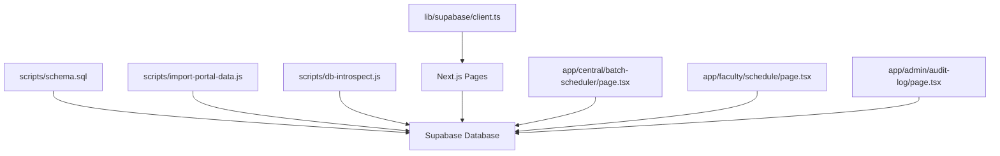
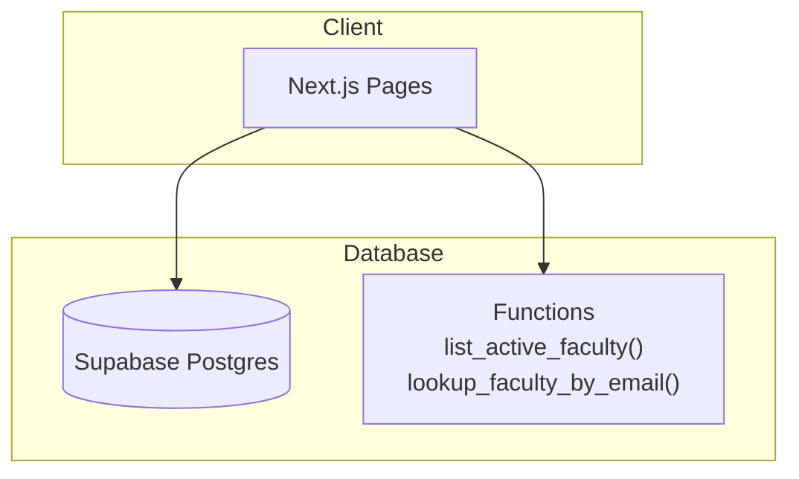
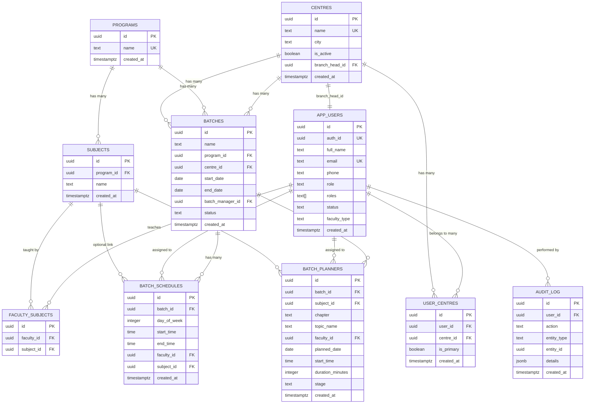
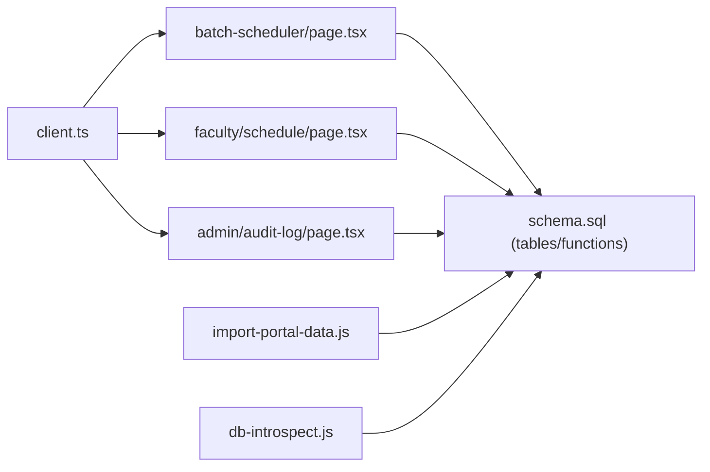
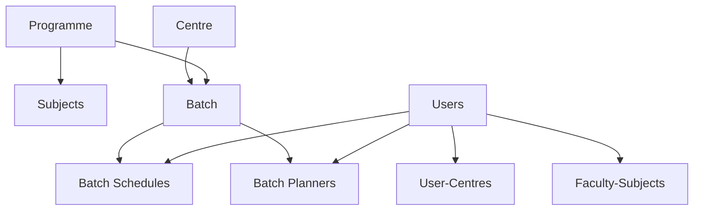
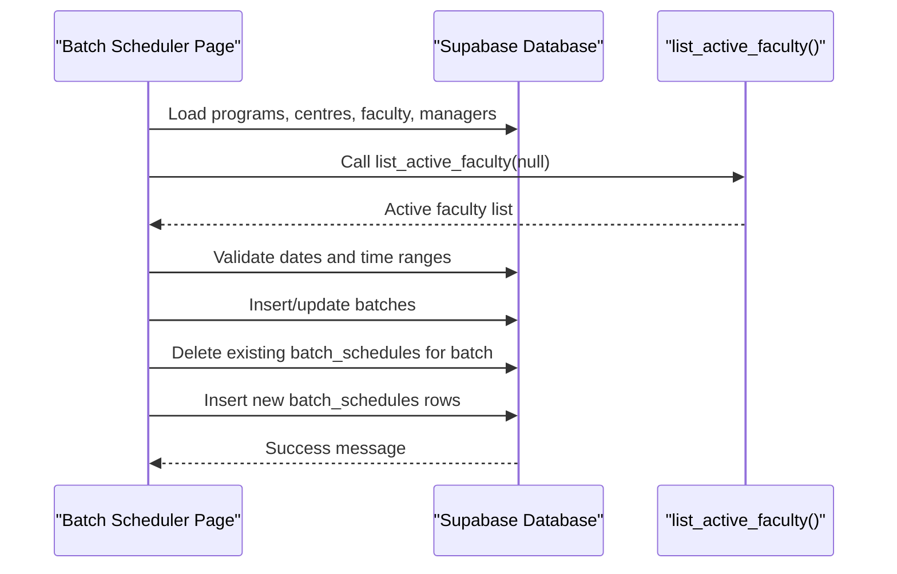

# Database Schema

<cite>
**Referenced Files in This Document**
- [schema.sql](file://scripts/schema.sql)
- [import-portal-data.js](file://scripts/import-portal-data.js)
- [db-introspect.js](file://scripts/db-introspect.js)
- [client.ts](file://lib/supabase/client.ts)
- [scheduling.ts](file://lib/scheduling.ts)
- [batch-scheduler/page.tsx](file://app/central/batch-scheduler/page.tsx)
- [faculty/schedule/page.tsx](file://app/faculty/schedule/page.tsx)
- [admin/audit-log/page.tsx](file://app/admin/audit-log/page.tsx)
</cite>

## Table of Contents
1. [Introduction](#introduction)
2. [Project Structure](#project-structure)
3. [Core Components](#core-components)
4. [Architecture Overview](#architecture-overview)
5. [Detailed Component Analysis](#detailed-component-analysis)
6. [Dependency Analysis](#dependency-analysis)
7. [Performance Considerations](#performance-considerations)
8. [Troubleshooting Guide](#troubleshooting-guide)
9. [Conclusion](#conclusion)
10. [Appendices](#appendices)

## Introduction
This document provides comprehensive data model documentation for the Superclass Portal database schema. It details all tables, entity relationships, foreign key constraints, indexes, and row-level security policies. It explains the academic hierarchy from programmes to batches, faculty assignments, and scheduling relationships. It also includes database diagrams, sample queries for common operations, and data migration strategies. Finally, it documents stored procedures (functions) that implement business logic and how they are used by the application.

## Project Structure
The database schema is defined in a single SQL file and is consumed by both server-side import scripts and client-side pages through Supabase clients. The following diagram maps the primary files involved in schema definition and usage:

**Diagram sources**
- [schema.sql:1-269](file://scripts/schema.sql#L1-L269)
- [import-portal-data.js:1-843](file://scripts/import-portal-data.js#L1-L843)
- [db-introspect.js:1-56](file://scripts/db-introspect.js#L1-L56)
- [client.ts:1-8](file://lib/supabase/client.ts#L1-L8)
- [batch-scheduler/page.tsx:1-583](file://app/central/batch-scheduler/page.tsx#L1-L583)
- [faculty/schedule/page.tsx:1-194](file://app/faculty/schedule/page.tsx#L1-L194)
- [admin/audit-log/page.tsx:1-75](file://app/admin/audit-log/page.tsx#L1-L75)

**Section sources**
- [schema.sql:1-269](file://scripts/schema.sql#L1-L269)
- [import-portal-data.js:1-843](file://scripts/import-portal-data.js#L1-L843)
- [db-introspect.js:1-56](file://scripts/db-introspect.js#L1-L56)
- [client.ts:1-8](file://lib/supabase/client.ts#L1-L8)
- [batch-scheduler/page.tsx:1-583](file://app/central/batch-scheduler/page.tsx#L1-L583)
- [faculty/schedule/page.tsx:1-194](file://app/faculty/schedule/page.tsx#L1-L194)
- [admin/audit-log/page.tsx:1-75](file://app/admin/audit-log/page.tsx#L1-L75)

## Core Components
The database consists of the following core entities:
- Centres: Academic centres with optional branch head assignment.
- App Users: System users with roles and status; supports multi-centre membership via user_centres.
- User-Centres: Junction table linking users to centres with a primary flag.
- Programs: Academic programs.
- Subjects: Subjects optionally linked to programs.
- Faculty-Subjects: Many-to-many mapping between users and subjects.
- Batches: Time-bound instances of a program at a centre with an assigned manager.
- Batch Schedules: Recurring weekly timetable entries per batch.
- Batch Planners: One-off planned lectures with stage workflow.
- Audit Log: Immutable log of actions with JSONB details.

Key design highlights:
- Hierarchical structure: Program -> Subject; Centre -> Batch; Batch -> Schedule/Planner.
- Role-based access: Users have role(s), enabling faculty, batch managers, central team, and branch heads.
- Row-Level Security (RLS): All tables enable RLS with broad authenticated read/write policies; app-level checks enforce finer permissions.
- Indexes: Optimized for frequent queries on user-centre mappings, schedules, planners, and audit logs.

**Section sources**
- [schema.sql:25-166](file://scripts/schema.sql#L25-L166)

## Architecture Overview
The system uses Supabase as the database backend. Client applications connect via Supabase browser client and call RPC functions where needed. Import scripts use service role keys to seed data.

**Diagram sources**
- [client.ts:1-8](file://lib/supabase/client.ts#L1-L8)
- [batch-scheduler/page.tsx:137-172](file://app/central/batch-scheduler/page.tsx#L137-L172)
- [schema.sql:172-213](file://scripts/schema.sql#L172-L213)

## Detailed Component Analysis

### Entity Relationship Model
The ER diagram below captures the primary relationships among entities:

**Diagram sources**
- [schema.sql:25-166](file://scripts/schema.sql#L25-L166)

### Table Definitions and Constraints

- centres
  - Primary key: id (UUID)
  - Unique: name
  - Foreign key: branch_head_id references app_users(id) ON DELETE SET NULL
  - Notes: Represents physical or virtual teaching locations.

- app_users
  - Primary key: id (UUID)
  - Unique: auth_id, email
  - Roles: role (primary) and roles[] (array)
  - Status: active/inactive
  - Faculty type: Permanent/Hourly/Contract

- user_centres
  - Primary key: id (UUID)
  - Unique: (user_id, centre_id)
  - Foreign keys: user_id references app_users(id) ON DELETE CASCADE; centre_id references centres(id) ON DELETE CASCADE
  - Indexes: idx_user_centres_user(user_id), idx_user_centres_centre(centre_id)

- programs
  - Primary key: id (UUID)
  - Unique: name

- subjects
  - Primary key: id (UUID)
  - Foreign key: program_id references programs(id) ON DELETE SET NULL
  - Unique: (program_id, name)

- faculty_subjects
  - Primary key: id (UUID)
  - Unique: (faculty_id, subject_id)
  - Foreign keys: faculty_id references app_users(id) ON DELETE CASCADE; subject_id references subjects(id) ON DELETE CASCADE

- batches
  - Primary key: id (UUID)
  - Foreign keys: program_id references programs(id) ON DELETE RESTRICT; centre_id references centres(id) ON DELETE RESTRICT; batch_manager_id references app_users(id) ON DELETE SET NULL

- batch_schedules
  - Primary key: id (UUID)
  - Check constraint: day_of_week BETWEEN 0 AND 6
  - Foreign keys: batch_id references batches(id) ON DELETE CASCADE; faculty_id references app_users(id) ON DELETE CASCADE; subject_id references subjects(id) ON DELETE SET NULL
  - Indexes: idx_batch_schedules_faculty_day(faculty_id, day_of_week), idx_batch_schedules_batch(batch_id)

- batch_planners
  - Primary key: id (UUID)
  - Foreign keys: batch_id references batches(id) ON DELETE CASCADE; subject_id references subjects(id) ON DELETE SET NULL; faculty_id references app_users(id) ON DELETE CASCADE
  - Indexes: idx_batch_planners_faculty_date(faculty_id, planned_date), idx_batch_planners_batch(batch_id)

- audit_log
  - Primary key: id (UUID)
  - Foreign key: user_id references app_users(id) ON DELETE SET NULL
  - Index: idx_audit_log_created(created_at DESC)

**Section sources**
- [schema.sql:25-166](file://scripts/schema.sql#L25-L166)

### Row-Level Security Policies
All tables enable RLS. Default policies allow authenticated users to read and mutate reference data; fine-grained authorization is enforced at the application layer.

- Read policies: SELECT allowed for authenticated users across all tables.
- Write policies: INSERT/UPDATE/DELETE allowed for authenticated users across relevant tables.

Service role bypasses RLS automatically, which allows import scripts to operate without policy restrictions.

**Section sources**
- [schema.sql:219-263](file://scripts/schema.sql#L219-L263)

### Stored Procedures and Functions
Two PL/pgSQL functions are provided:

- list_active_faculty(p_centre_id UUID)
  - Returns active faculty members, optionally filtered by centre.
  - Uses user_centres junction and filters by role presence in roles array or primary role.

- lookup_faculty_by_email(faculty_email TEXT, p_centre_id UUID)
  - Returns a single faculty user ID by normalized email and centre context.

Both functions are SECURITY DEFINER, allowing controlled access patterns.

**Section sources**
- [schema.sql:172-213](file://scripts/schema.sql#L172-L213)

### Data Migration Strategy
Data seeding is performed by import scripts that parse CSV files and upsert records into the database using service role credentials.

- Programs & Subjects: Upsert programs by name; upsert subjects by (program_id, name).
- Centres: Upsert centres by name; create branch heads and batch managers; set centre.branch_head_id.
- Central Team: Create users with central_team role.
- Faculty: Upsert users; normalize phone and faculty type; map multiple centres; link subjects; clear old links before inserting new ones.

The import script ensures idempotency via upserts and conflict handling.

**Section sources**
- [import-portal-data.js:144-435](file://scripts/import-portal-data.js#L144-L435)
- [import-portal-data.js:676-843](file://scripts/import-portal-data.js#L676-L843)

### Sample Queries
Below are representative queries aligned with the schema and application usage. Replace placeholders with actual values when executing.

- List active faculty for a centre
  - Use function: select * from list_active_faculty(:centre_id);
  - Alternative direct query: join app_users with user_centres filtering by centre_id and role presence.

- Lookup faculty by email at a centre
  - Use function: select lookup_faculty_by_email(:email, :centre_id);

- Get weekly schedule for a faculty member
  - Select batch_schedules rows where faculty_id = :faculty_id; join batches for names.

- Get planned lectures for a faculty member
  - Select batch_planners rows where faculty_id = :faculty_id and stage in ('Faculty Assigned','Confirmed','Rework'); order by planned_date.

- View recent audit log entries
  - Select from audit_log ordered by created_at desc limit 100; join app_users(full_name).

These queries reflect the patterns used in the application pages and functions.

**Section sources**
- [batch-scheduler/page.tsx:137-172](file://app/central/batch-scheduler/page.tsx#L137-L172)
- [faculty/schedule/page.tsx:60-75](file://app/faculty/schedule/page.tsx#L60-L75)
- [admin/audit-log/page.tsx:21-26](file://app/admin/audit-log/page.tsx#L21-L26)
- [schema.sql:172-213](file://scripts/schema.sql#L172-L213)

### Business Logic Integration Points
- Overlap detection for recurring schedules:
  - checkWeeklyScheduleOverlap validates conflicts within batch_schedules for a given faculty, day, and time window.
- Overlap detection for one-off planners:
  - checkPlannerTimeOverlap validates conflicts within batch_planners for a specific date and duration.
- Combined overlap check:
  - checkFacultyAssignmentOverlap integrates both checks when assigning planner times.

These utilities are called from the scheduler and assign planner flows to prevent scheduling conflicts.

**Section sources**
- [scheduling.ts:10-87](file://lib/scheduling.ts#L10-L87)
- [batch-scheduler/page.tsx:321-339](file://app/central/batch-scheduler/page.tsx#L321-L339)
- [assign-planner/page.tsx:91-118](file://app/central/assign-planner/page.tsx#L91-L118)

## Dependency Analysis
The following diagram shows runtime dependencies between client code and database objects:

**Diagram sources**
- [client.ts:1-8](file://lib/supabase/client.ts#L1-L8)
- [batch-scheduler/page.tsx:1-583](file://app/central/batch-scheduler/page.tsx#L1-L583)
- [faculty/schedule/page.tsx:1-194](file://app/faculty/schedule/page.tsx#L1-L194)
- [admin/audit-log/page.tsx:1-75](file://app/admin/audit-log/page.tsx#L1-L75)
- [schema.sql:1-269](file://scripts/schema.sql#L1-L269)
- [import-portal-data.js:1-843](file://scripts/import-portal-data.js#L1-L843)
- [db-introspect.js:1-56](file://scripts/db-introspect.js#L1-L56)

**Section sources**
- [client.ts:1-8](file://lib/supabase/client.ts#L1-L8)
- [batch-scheduler/page.tsx:1-583](file://app/central/batch-scheduler/page.tsx#L1-L583)
- [faculty/schedule/page.tsx:1-194](file://app/faculty/schedule/page.tsx#L1-L194)
- [admin/audit-log/page.tsx:1-75](file://app/admin/audit-log/page.tsx#L1-L75)
- [schema.sql:1-269](file://scripts/schema.sql#L1-L269)
- [import-portal-data.js:1-843](file://scripts/import-portal-data.js#L1-L843)
- [db-introspect.js:1-56](file://scripts/db-introspect.js#L1-L56)

## Performance Considerations
- Indexes:
  - user_centres: user_id and centre_id for fast joins.
  - batch_schedules: faculty_id+day_of_week and batch_id for schedule lookups.
  - batch_planners: faculty_id+planned_date and batch_id for planner queries.
  - audit_log: created_at DESC for efficient pagination.
- Query patterns:
  - Prefer selecting only needed columns and using Supabase’s relational selects to reduce payload size.
  - Use functions like list_active_faculty to encapsulate complex joins and role checks.
- Concurrency:
  - Avoid long-running transactions during imports; rely on upserts and conflict resolution.
- Validation:
  - Perform overlap checks on the client side before writes to minimize round trips and failures.

[No sources needed since this section provides general guidance]

## Troubleshooting Guide
Common issues and resolutions:
- Missing environment variables:
  - Ensure NEXT_PUBLIC_SUPABASE_URL and SUPABASE_SERVICE_ROLE_KEY are set for import scripts.
- Duplicate emails or names:
  - Import scripts handle upserts; verify unique constraints and normalization logic.
- RLS denials:
  - Service role bypasses RLS; if using anon key, ensure policies allow required operations.
- Overlap errors:
  - Use scheduling utilities to detect conflicts before saving; review error messages indicating conflicting batches or dates.

**Section sources**
- [import-portal-data.js:33-41](file://scripts/import-portal-data.js#L33-L41)
- [schema.sql:219-263](file://scripts/schema.sql#L219-L263)
- [scheduling.ts:10-87](file://lib/scheduling.ts#L10-L87)

## Conclusion
The Superclass Portal database schema models a structured academic environment with robust relationships, constraints, and security policies. The design supports hierarchical programs and subjects, multi-centre user memberships, flexible scheduling, and detailed planning workflows. Stored functions encapsulate common queries, while import scripts provide reliable data seeding. Application layers integrate validation and overlap checks to maintain data integrity and usability.

[No sources needed since this section summarizes without analyzing specific files]

## Appendices

### Academic Hierarchy and Assignments
- Programmes contain subjects.
- Batches represent time-bound offerings of a programme at a centre.
- Faculty are assigned to batches via schedules (recurring) and planners (one-off).
- Multi-centre support is achieved through user_centres.

**Diagram sources**
- [schema.sql:73-147](file://scripts/schema.sql#L73-L147)

### Sequence Diagram: Creating a Batch and Weekly Schedule

**Diagram sources**
- [batch-scheduler/page.tsx:137-172](file://app/central/batch-scheduler/page.tsx#L137-L172)
- [batch-scheduler/page.tsx:341-398](file://app/central/batch-scheduler/page.tsx#L341-L398)
- [schema.sql:172-194](file://scripts/schema.sql#L172-L194)