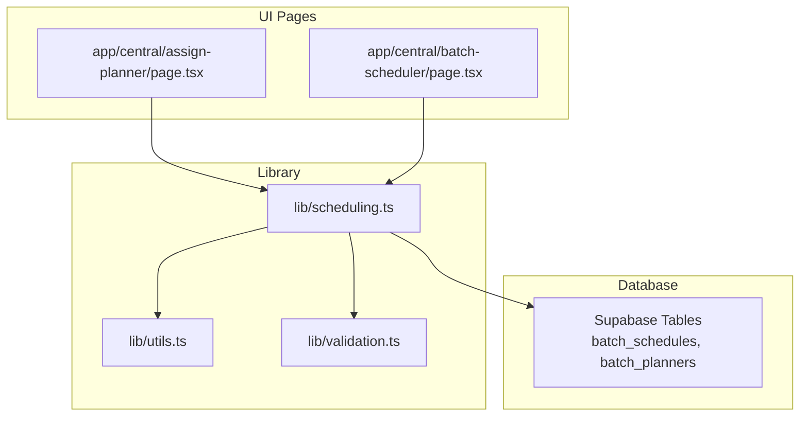
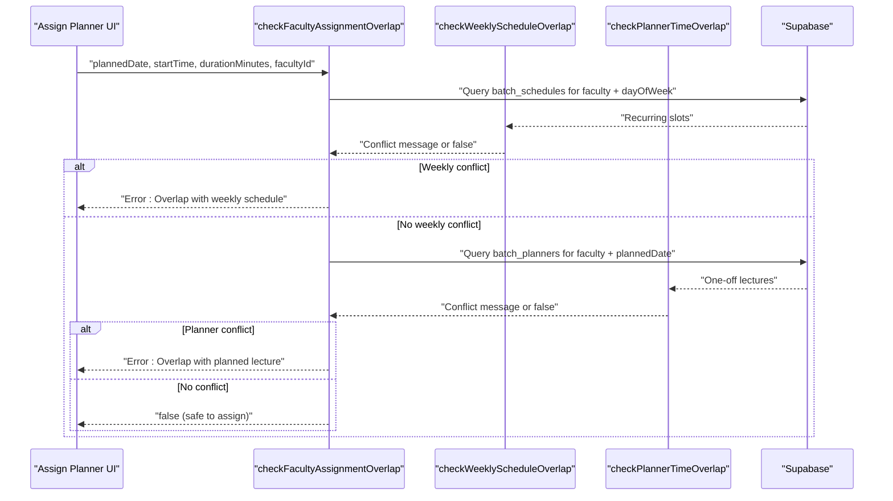
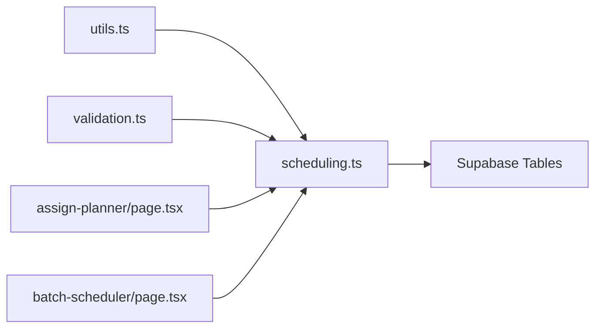

# Scheduling Engine

<cite>
**Referenced Files in This Document**
- [scheduling.ts](file://lib/scheduling.ts)
- [utils.ts](file://lib/utils.ts)
- [validation.ts](file://lib/validation.ts)
- [assign-planner/page.tsx](file://app/central/assign-planner/page.tsx)
- [batch-scheduler/page.tsx](file://app/central/batch-scheduler/page.tsx)
- [schema.sql](file://scripts/schema.sql)
</cite>

## Table of Contents
1. [Introduction](#introduction)
2. [Project Structure](#project-structure)
3. [Core Components](#core-components)
4. [Architecture Overview](#architecture-overview)
5. [Detailed Component Analysis](#detailed-component-analysis)
6. [Dependency Analysis](#dependency-analysis)
7. [Performance Considerations](#performance-considerations)
8. [Troubleshooting Guide](#troubleshooting-guide)
9. [Conclusion](#conclusion)

## Introduction
This document explains the scheduling engine that prevents faculty double-booking by detecting time conflicts across recurring weekly schedules and one-off planned lectures. It covers:
- The three core functions for overlap detection
- Time conversion utilities used to normalize and compare times
- How the system integrates with the database layer via Supabase
- Batch name extraction logic and data format handling
- Example conflict scenarios, error messages, and integration patterns

## Project Structure
The scheduling engine is implemented as a small library module with clear separation between:
- Overlap detection logic (scheduling.ts)
- Time utilities and shared helpers (utils.ts)
- Validation helpers including minutes-to-time formatting (validation.ts)
- UI integrations that call the engine during assignment and batch scheduling workflows

**Diagram sources**
- [scheduling.ts:1-112](file://lib/scheduling.ts#L1-L112)
- [utils.ts:1-74](file://lib/utils.ts#L1-L74)
- [validation.ts:1-33](file://lib/validation.ts#L1-L33)
- [assign-planner/page.tsx:70-118](file://app/central/assign-planner/page.tsx#L70-L118)
- [batch-scheduler/page.tsx:266-341](file://app/central/batch-scheduler/page.tsx#L266-L341)

**Section sources**
- [scheduling.ts:1-112](file://lib/scheduling.ts#L1-L112)
- [utils.ts:1-74](file://lib/utils.ts#L1-L74)
- [validation.ts:1-33](file://lib/validation.ts#L1-L33)
- [assign-planner/page.tsx:1-226](file://app/central/assign-planner/page.tsx#L1-L226)
- [batch-scheduler/page.tsx:1-583](file://app/central/batch-scheduler/page.tsx#L1-L583)

## Core Components
- checkWeeklyScheduleOverlap: Detects conflicts against recurring weekly schedules stored per day-of-week.
- checkPlannerTimeOverlap: Detects conflicts against one-off planned lectures on a specific date.
- checkFacultyAssignmentOverlap: Orchestrates both checks to validate a complete assignment before committing.

These functions return either false (no conflict) or a human-readable string describing the conflict source.

**Section sources**
- [scheduling.ts:10-43](file://lib/scheduling.ts#L10-L43)
- [scheduling.ts:45-77](file://lib/scheduling.ts#L45-L77)
- [scheduling.ts:79-112](file://lib/scheduling.ts#L79-L112)

## Architecture Overview
The scheduling engine sits between the UI and the database. UI pages pass user inputs (faculty ID, date/time, duration) into the engine, which queries Supabase tables and applies overlap algorithms. If a conflict is found, the UI displays an error; otherwise, it proceeds to persist changes.

**Diagram sources**
- [scheduling.ts:79-112](file://lib/scheduling.ts#L79-L112)
- [scheduling.ts:10-43](file://lib/scheduling.ts#L10-L43)
- [scheduling.ts:45-77](file://lib/scheduling.ts#L45-L77)
- [assign-planner/page.tsx:90-118](file://app/central/assign-planner/page.tsx#L90-L118)

## Detailed Component Analysis

### checkWeeklyScheduleOverlap
Purpose:
- Prevents assigning a recurring weekly slot that overlaps with existing weekly schedules for the same faculty on the same day-of-week.

Algorithm:
- Queries batch_schedules for the given faculty_id and day_of_week.
- For each row, compares the proposed start/end with the stored start/end using timesOverlap.
- Returns a descriptive message if any overlap is found; otherwise returns false.

Key behaviors:
- Accepts ignoreBatchId to exclude the current batch when editing.
- Uses only HH:MM portions of times for comparison.

Data access:
- Reads from batch_schedules table, joining batches(name).

Return values:
- false if no conflict.
- String like "Recurring class in batch \"...\"" if conflict detected.

**Section sources**
- [scheduling.ts:10-43](file://lib/scheduling.ts#L10-L43)
- [schema.sql:129-131](file://scripts/schema.sql#L129-L131)

### checkPlannerTimeOverlap
Purpose:
- Prevents assigning a one-off lecture that overlaps with other planned lectures for the same faculty on the same date.

Algorithm:
- Converts startTime to minutes and adds durationMinutes to compute newEnd.
- Queries batch_planners for the faculty and planned_date where start_time is not null.
- Compares intervals using the standard overlap condition: newStart < exEnd && newEnd > exStart.
- Returns a descriptive message if any overlap is found; otherwise returns false.

Key behaviors:
- Accepts ignorePlannerId to exclude the current planner when re-assigning.
- Uses minutes-based arithmetic for precise comparisons.

Data access:
- Reads from batch_planners table, joining batches(name).

Return values:
- false if no conflict.
- String like "Planned lecture in batch \"...\" on same date" if conflict detected.

**Section sources**
- [scheduling.ts:45-77](file://lib/scheduling.ts#L45-L77)
- [schema.sql:149-150](file://scripts/schema.sql#L149-L150)

### checkFacultyAssignmentOverlap
Purpose:
- Full validation before assigning a planner time. Checks both recurring weekly schedules and one-off planners.

Algorithm:
- Derives day_of_week from plannedDate.
- Computes endTime from startTime and durationMinutes using minutesToTimeString.
- Calls checkWeeklyScheduleOverlap first; if conflict, returns immediately.
- Otherwise calls checkPlannerTimeOverlap; if conflict, returns immediately.
- Returns false if no conflicts are found.

Integration:
- Used by the Assign Planner UI to gate updates to batch_planners.start_time and stage.

Return values:
- false if safe to assign.
- String prefixed with "Overlap with ..." indicating the reason.

**Section sources**
- [scheduling.ts:79-112](file://lib/scheduling.ts#L79-L112)
- [assign-planner/page.tsx:90-118](file://app/central/assign-planner/page.tsx#L90-L118)

### Overlap Detection Algorithms
- Interval overlap rule: Two intervals [aStart, aEnd) and [bStart, bEnd) overlap if aStart < bEnd AND aEnd > bStart.
- All comparisons use normalized minute-of-day integers to avoid timezone and formatting issues.

Complexity:
- O(N) per function where N is the number of existing records for the given faculty/day/date.
- Typically small due to targeted indexes on faculty_id and day/date columns.

**Section sources**
- [utils.ts:7-18](file://lib/utils.ts#L7-L18)

### Time Conversion Utilities
- toMinutes(t): Parses "HH:MM" to total minutes since midnight.
- minutesToTimeString(totalMinutes): Converts total minutes back to "HH:MM".
- timesOverlap(startA, endA, startB, endB): Applies the interval overlap rule using toMinutes.

Usage:
- checkPlannerTimeOverlap uses toMinutes to compute exact boundaries.
- checkFacultyAssignmentOverlap uses minutesToTimeString to produce endTime for weekly checks.

**Section sources**
- [utils.ts:7-18](file://lib/utils.ts#L7-L18)
- [validation.ts:28-32](file://lib/validation.ts#L28-L32)
- [scheduling.ts:54-56](file://lib/scheduling.ts#L54-L56)
- [scheduling.ts:88-91](file://lib/scheduling.ts#L88-L91)

### Batch Name Extraction Logic
- batchName(value): Extracts a readable batch name from query results.
- Handles both array and object forms returned by Supabase joins.
- Falls back to a default label when name is missing.

Data formats handled:
- Array form: [{ name }]
- Object form: { name }

This ensures consistent user-facing messages regardless of join shape.

**Section sources**
- [scheduling.ts:5-8](file://lib/scheduling.ts#L5-L8)

### Integration Patterns with the Database Layer
- Supabase client is passed into each function to perform queries.
- Queries select only necessary fields and leverage indexes:
  - batch_schedules(faculty_id, day_of_week)
  - batch_planners(faculty_id, planned_date)
- Optional ignore parameters allow editing without self-conflict.

Example flows:
- Assign Planner page calls checkFacultyAssignmentOverlap before updating batch_planners.
- Batch Scheduler page calls checkWeeklyScheduleOverlap while validating batch schedules.

**Section sources**
- [scheduling.ts:19-27](file://lib/scheduling.ts#L19-L27)
- [scheduling.ts:57-66](file://lib/scheduling.ts#L57-L66)
- [assign-planner/page.tsx:90-118](file://app/central/assign-planner/page.tsx#L90-L118)
- [batch-scheduler/page.tsx:321-339](file://app/central/batch-scheduler/page.tsx#L321-L339)
- [schema.sql:129-131](file://scripts/schema.sql#L129-L131)
- [schema.sql:149-150](file://scripts/schema.sql#L149-L150)

## Dependency Analysis
High-level dependencies:
- scheduling.ts depends on utils.ts (toMinutes, timesOverlap) and validation.ts (minutesToTimeString).
- UI pages depend on scheduling.ts for conflict checks.
- Database schema provides indexed columns used by the queries.

**Diagram sources**
- [scheduling.ts:1-3](file://lib/scheduling.ts#L1-L3)
- [assign-planner/page.tsx:4-6](file://app/central/assign-planner/page.tsx#L4-L6)
- [batch-scheduler/page.tsx:4-7](file://app/central/batch-scheduler/page.tsx#L4-L7)

**Section sources**
- [scheduling.ts:1-3](file://lib/scheduling.ts#L1-L3)
- [assign-planner/page.tsx:1-226](file://app/central/assign-planner/page.tsx#L1-L226)
- [batch-scheduler/page.tsx:1-583](file://app/central/batch-scheduler/page.tsx#L1-L583)

## Performance Considerations
- Targeted queries: Each function filters by faculty_id and either day_of_week or planned_date, leveraging indexes defined in the schema.
- Minimal payload: Only required fields are selected, reducing network overhead.
- Early exit: Functions return immediately upon finding the first conflict, avoiding unnecessary iterations.
- Complexity: O(N) per function with small N typical for a single faculty/day/date scope.

[No sources needed since this section provides general guidance]

## Troubleshooting Guide
Common conflict scenarios and messages:
- Recurring weekly conflict:
  - Message pattern: "Recurring class in batch \"...\""
  - Trigger: Proposed weekly slot overlaps an existing weekly schedule for the same faculty on the same day-of-week.
- One-off planner conflict:
  - Message pattern: "Planned lecture in batch \"...\" on same date"
  - Trigger: Proposed one-off lecture overlaps another planned lecture for the same faculty on the same date.
- Combined assignment conflict:
  - Message pattern: "Overlap with ..."
  - Trigger: Either of the above conditions detected by checkFacultyAssignmentOverlap.

Where errors surface:
- Assign Planner page shows an error modal and blocks assignment until resolved.
- Batch Scheduler page shows inline alerts and prevents saving invalid schedules.

Validation helpers:
- validateTimeRange ensures start < end.
- validateBatchDates ensures valid date ranges.
- parsePlannedDate validates YYYY-MM-DD format.

**Section sources**
- [scheduling.ts:30-42](file://lib/scheduling.ts#L30-L42)
- [scheduling.ts:69-76](file://lib/scheduling.ts#L69-L76)
- [scheduling.ts:92-109](file://lib/scheduling.ts#L92-L109)
- [assign-planner/page.tsx:100-118](file://app/central/assign-planner/page.tsx#L100-L118)
- [batch-scheduler/page.tsx:321-339](file://app/central/batch-scheduler/page.tsx#L321-L339)
- [validation.ts:16-26](file://lib/validation.ts#L16-L26)

## Conclusion
The scheduling engine provides robust, efficient conflict detection for both recurring weekly schedules and one-off planned lectures. By normalizing times to minutes and using targeted database queries with proper indexes, it reliably prevents faculty double-booking. The modular design separates concerns between overlap logic, time utilities, and validation, making it easy to maintain and extend.

[No sources needed since this section summarizes without analyzing specific files]