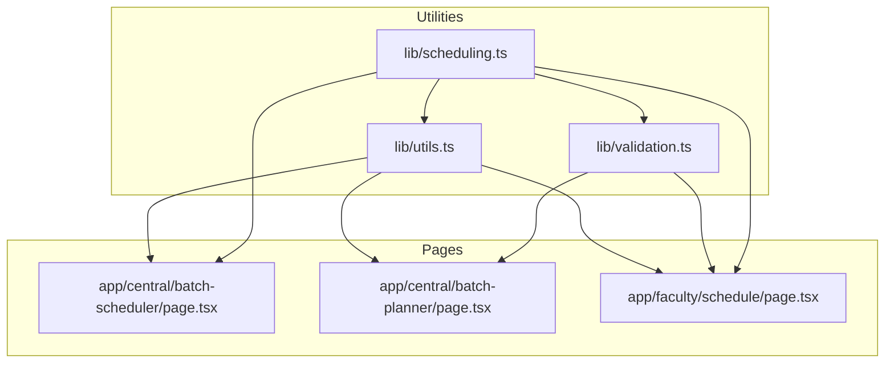
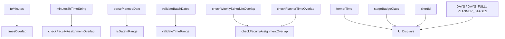
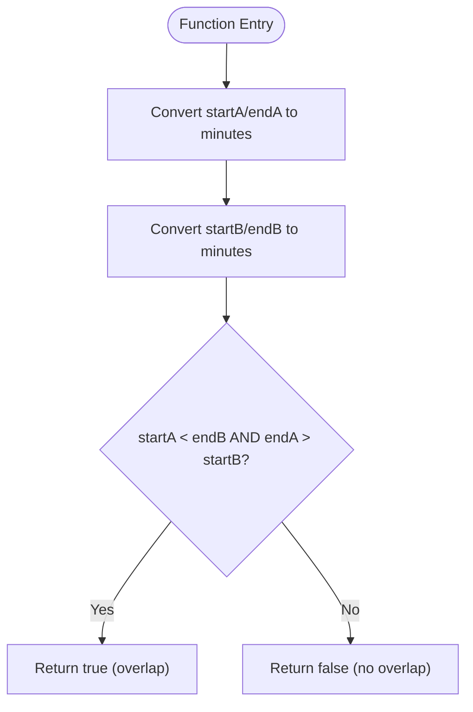
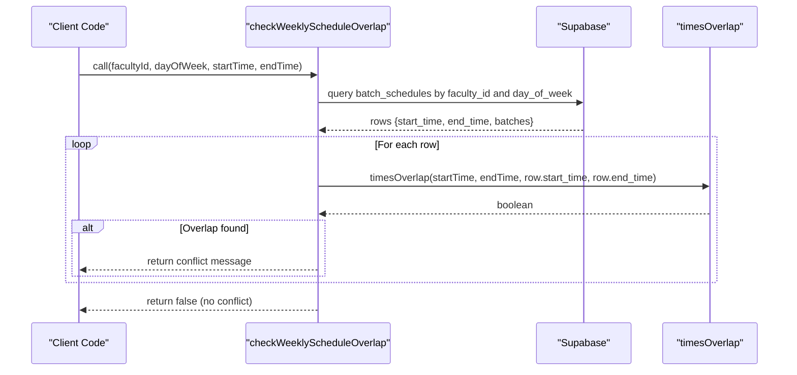
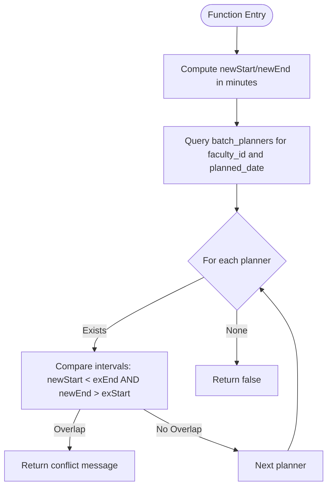
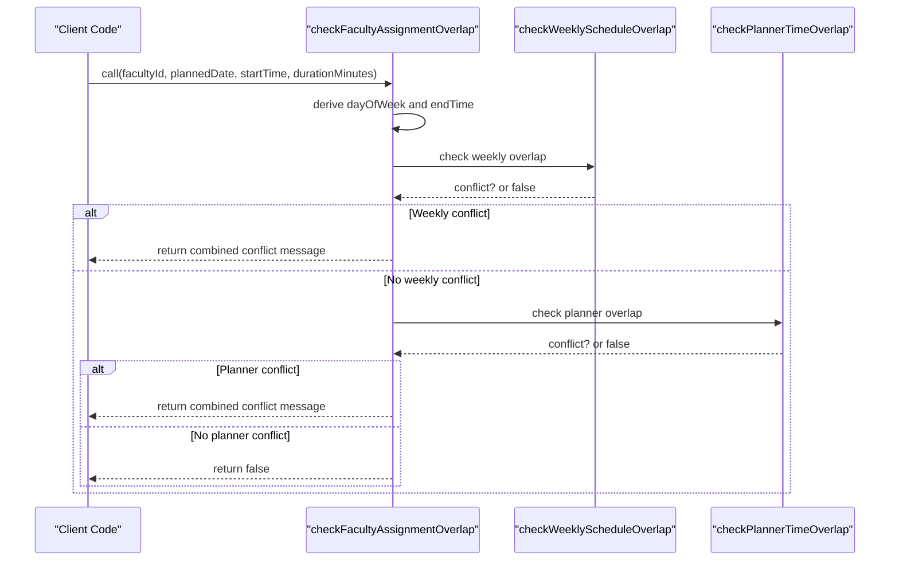
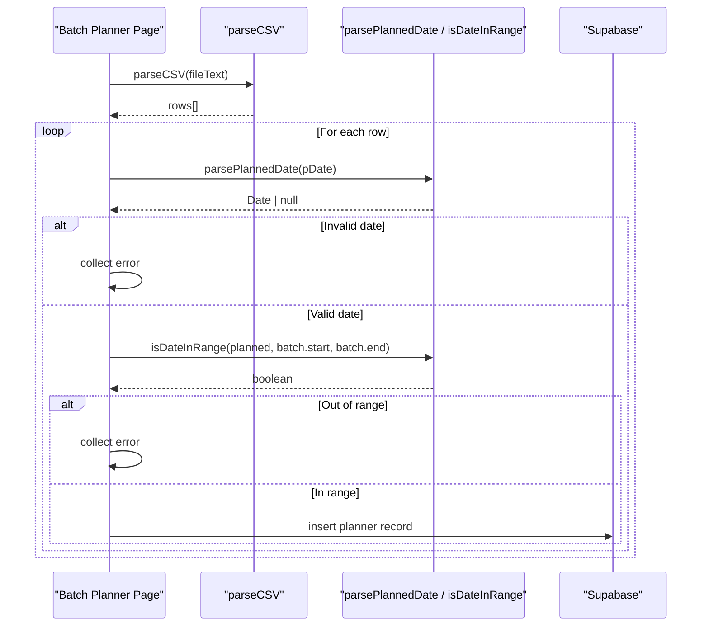
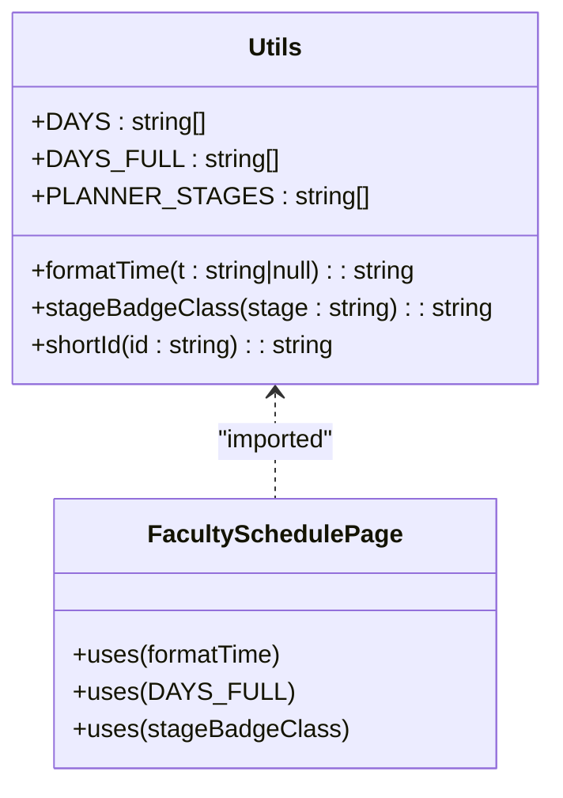
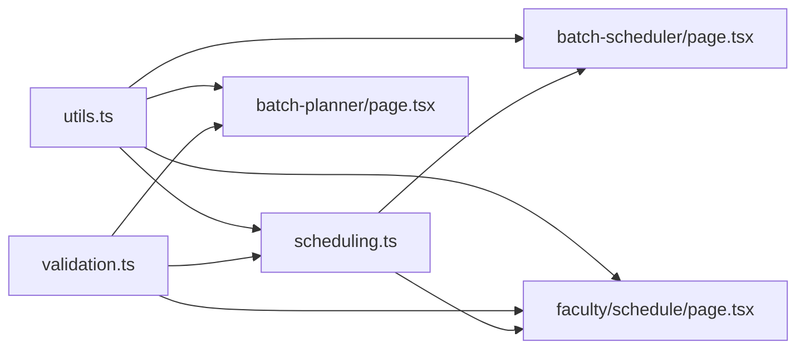

# Utility Functions

<cite>
**Referenced Files in This Document**
- [utils.ts](file://lib/utils.ts)
- [validation.ts](file://lib/validation.ts)
- [scheduling.ts](file://lib/scheduling.ts)
- [batch-scheduler/page.tsx](file://app/central/batch-scheduler/page.tsx)
- [batch-planner/page.tsx](file://app/central/batch-planner/page.tsx)
- [faculty/schedule/page.tsx](file://app/faculty/schedule/page.tsx)
</cite>

## Table of Contents
1. [Introduction](#introduction)
2. [Project Structure](#project-structure)
3. [Core Components](#core-components)
4. [Architecture Overview](#architecture-overview)
5. [Detailed Component Analysis](#detailed-component-analysis)
6. [Dependency Analysis](#dependency-analysis)
7. [Performance Considerations](#performance-considerations)
8. [Troubleshooting Guide](#troubleshooting-guide)
9. [Conclusion](#conclusion)

## Introduction
This document provides comprehensive documentation for shared utility functions used across the application, focusing on time manipulation, date handling, and common helpers that power both the scheduling engine and validation system. It explains the algorithmic logic behind time calculations, demonstrates usage patterns, and highlights integration points with other modules.

## Project Structure
The utilities are organized into focused modules:
- lib/utils.ts: Time conversion, overlap detection, formatting, CSV parsing, and UI helper constants/functions
- lib/validation.ts: Date/time validation and minute-to-time formatting
- lib/scheduling.ts: Overlap checks combining weekly schedules and one-off planners

**Diagram sources**
- [utils.ts:1-74](file://lib/utils.ts#L1-L74)
- [validation.ts:1-33](file://lib/validation.ts#L1-L33)
- [scheduling.ts:1-113](file://lib/scheduling.ts#L1-L113)
- [batch-scheduler/page.tsx:1-341](file://app/central/batch-scheduler/page.tsx#L1-L341)
- [batch-planner/page.tsx:1-200](file://app/central/batch-planner/page.tsx#L1-L200)
- [faculty/schedule/page.tsx:1-194](file://app/faculty/schedule/page.tsx#L1-L194)

**Section sources**
- [utils.ts:1-74](file://lib/utils.ts#L1-L74)
- [validation.ts:1-33](file://lib/validation.ts#L1-L33)
- [scheduling.ts:1-113](file://lib/scheduling.ts#L1-L113)

## Core Components
This section documents each utility function, its purpose, inputs/outputs, and behavior.

### Time Utilities (lib/utils.ts)
- toMinutes(t: string): number
  - Converts a "HH:MM" time string to total minutes since midnight.
  - Complexity: O(1).
  - Usage examples:
    - Converting start/end times before arithmetic or comparisons.
    - Used by scheduling overlap checks.
  - Section sources
    - [utils.ts:7-10](file://lib/utils.ts#L7-L10)

- timesOverlap(startA: string, endA: string, startB: string, endB: string): boolean
  - Detects if two time intervals overlap using the standard interval intersection rule.
  - Algorithm: Two intervals [aStart, aEnd) and [bStart, bEnd) overlap when aStart < bEnd AND aEnd > bStart.
  - Complexity: O(1).
  - Usage examples:
    - Preventing same-faculty conflicts within a batch schedule.
    - Validating recurring weekly slots.
  - Section sources
    - [utils.ts:12-18](file://lib/utils.ts#L12-L18)

- formatTime(t: string | null): string
  - Formats a "HH:MM" string into a locale-aware time string; returns "TBA" for null.
  - Uses local browser settings for hour/minute display.
  - Complexity: O(1).
  - Usage examples:
    - Displaying class times in faculty schedule views.
  - Section sources
    - [utils.ts:20-26](file://lib/utils.ts#L20-L26)

- shortId(id: string): string
  - Returns an uppercase, truncated identifier for compact display.
  - Complexity: O(1).
  - Usage examples:
    - Showing abbreviated IDs in planner lists.
  - Section sources
    - [utils.ts:28-30](file://lib/utils.ts#L28-L30)

- parseCSV(text: string): string[][]
  - Parses CSV text respecting quoted fields and trimming cells.
  - Skips header row and empty lines.
  - Complexity: O(n) where n is number of characters.
  - Usage examples:
    - Bulk importing lecture plans from CSV files.
  - Section sources
    - [utils.ts:32-58](file://lib/utils.ts#L32-L58)

- stageBadgeClass(stage: string): string
  - Maps planner stages to CSS classes for consistent UI badges.
  - Complexity: O(1).
  - Usage examples:
    - Rendering status badges in planner lists.
  - Section sources
    - [utils.ts:60-73](file://lib/utils.ts#L60-L73)

- Constants
  - DAYS, DAYS_FULL: Day-of-week labels for display.
  - PLANNER_STAGES: Enumerated stages for planning workflow.
  - Section sources
    - [utils.ts:1-5](file://lib/utils.ts#L1-L5)

### Validation Utilities (lib/validation.ts)
- parsePlannedDate(value: string): Date | null
  - Validates YYYY-MM-DD strings and returns a Date object or null.
  - Normalizes to noon to avoid timezone edge effects.
  - Complexity: O(1).
  - Usage examples:
    - Validating planned lecture dates during CSV import.
  - Section sources
    - [validation.ts:1-8](file://lib/validation.ts#L1-L8)

- isDateInRange(date: Date, start: string, end: string): boolean
  - Checks whether a Date falls within a given inclusive range of ISO date strings.
  - Complexity: O(1).
  - Usage examples:
    - Ensuring planned dates fall within batch ranges.
  - Section sources
    - [validation.ts:10-14](file://lib/validation.ts#L10-L14)

- validateBatchDates(startDate: string, endDate: string): string | null
  - Validates presence and ordering of batch start/end dates.
  - Returns error message string or null if valid.
  - Complexity: O(1).
  - Usage examples:
    - Pre-save validation in batch scheduler.
  - Section sources
    - [validation.ts:16-20](file://lib/validation.ts#L16-L20)

- validateTimeRange(startTime: string, endTime: string): string | null
  - Validates presence and ordering of time strings ("HH:MM").
  - Returns error message string or null if valid.
  - Complexity: O(1).
  - Usage examples:
    - Pre-save validation in batch scheduler.
  - Section sources
    - [validation.ts:22-26](file://lib/validation.ts#L22-L26)

- minutesToTimeString(totalMinutes: number): string
  - Converts total minutes to "HH:MM" string, wrapping at 24 hours.
  - Complexity: O(1).
  - Usage examples:
    - Computing end time from start time plus duration.
  - Section sources
    - [validation.ts:28-32](file://lib/validation.ts#L28-L32)

### Scheduling Utilities (lib/scheduling.ts)
- checkWeeklyScheduleOverlap(supabase, facultyId, dayOfWeek, startTime, endTime, ignoreBatchId?): Promise<string | false>
  - Queries existing weekly schedules for a faculty member on a specific day and checks overlaps using timesOverlap.
  - Returns a descriptive conflict message or false if no overlap.
  - Complexity: O(k) where k is number of existing weekly entries for the faculty/day.
  - Integration:
    - Called by batch scheduler page before saving.
  - Section sources
    - [scheduling.ts:10-43](file://lib/scheduling.ts#L10-L43)

- checkPlannerTimeOverlap(supabase, facultyId, plannedDate, startTime, durationMinutes, ignorePlannerId?): Promise<string | false>
  - Computes new interval in minutes and compares against existing one-off planners on the same date.
  - Returns a descriptive conflict message or false if no overlap.
  - Complexity: O(m) where m is number of existing planners for the faculty/date.
  - Integration:
    - Called by assignment flow to prevent double-booking.
  - Section sources
    - [scheduling.ts:45-77](file://lib/scheduling.ts#L45-L77)

- checkFacultyAssignmentOverlap(supabase, facultyId, plannedDate, startTime, durationMinutes, ignorePlannerId?): Promise<string | false>
  - Orchestrates both weekly and planner overlap checks.
  - Derives day-of-week and end time, then delegates to weekly and planner checks.
  - Complexity: O(k + m) plus overhead for date/time conversions.
  - Integration:
    - Used by central assignment flows.
  - Section sources
    - [scheduling.ts:79-112](file://lib/scheduling.ts#L79-L112)

**Section sources**
- [utils.ts:1-74](file://lib/utils.ts#L1-L74)
- [validation.ts:1-33](file://lib/validation.ts#L1-L33)
- [scheduling.ts:1-113](file://lib/scheduling.ts#L1-L113)

## Architecture Overview
The utilities form a layered foundation:
- Low-level primitives: toMinutes, minutesToTimeString, timesOverlap
- Validation layer: parsePlannedDate, isDateInRange, validateBatchDates, validateTimeRange
- Scheduling orchestration: checkWeeklyScheduleOverlap, checkPlannerTimeOverlap, checkFacultyAssignmentOverlap
- UI helpers: formatTime, stageBadgeClass, shortId, DAYS/DAYS_FULL/PLANNER_STAGES

**Diagram sources**
- [utils.ts:7-18](file://lib/utils.ts#L7-L18)
- [utils.ts:20-30](file://lib/utils.ts#L20-L30)
- [utils.ts:60-73](file://lib/utils.ts#L60-L73)
- [validation.ts:1-32](file://lib/validation.ts#L1-L32)
- [scheduling.ts:10-112](file://lib/scheduling.ts#L10-L112)

## Detailed Component Analysis

### Time Overlap Detection Algorithm
The core overlap logic uses the canonical interval intersection test after converting times to minutes.

**Diagram sources**
- [utils.ts:7-18](file://lib/utils.ts#L7-L18)

**Section sources**
- [utils.ts:7-18](file://lib/utils.ts#L7-L18)

### Weekly Schedule Overlap Check
This function queries existing weekly schedules and detects conflicts.

**Diagram sources**
- [scheduling.ts:10-43](file://lib/scheduling.ts#L10-L43)
- [utils.ts:12-18](file://lib/utils.ts#L12-L18)

**Section sources**
- [scheduling.ts:10-43](file://lib/scheduling.ts#L10-L43)

### One-off Planner Overlap Check
Computes new interval in minutes and compares against existing planners on the same date.

**Diagram sources**
- [scheduling.ts:45-77](file://lib/scheduling.ts#L45-L77)
- [utils.ts:7-10](file://lib/utils.ts#L7-L10)

**Section sources**
- [scheduling.ts:45-77](file://lib/scheduling.ts#L45-L77)

### Full Assignment Overlap Orchestration
Combines weekly and planner checks to ensure no conflicts exist.

**Diagram sources**
- [scheduling.ts:79-112](file://lib/scheduling.ts#L79-L112)
- [validation.ts:28-32](file://lib/validation.ts#L28-L32)
- [utils.ts:7-10](file://lib/utils.ts#L7-L10)

**Section sources**
- [scheduling.ts:79-112](file://lib/scheduling.ts#L79-L112)

### CSV Import Flow Using Utilities
Demonstrates how parseCSV and validation utilities collaborate during bulk imports.

**Diagram sources**
- [utils.ts:32-58](file://lib/utils.ts#L32-L58)
- [validation.ts:1-14](file://lib/validation.ts#L1-L14)
- [batch-planner/page.tsx:50-162](file://app/central/batch-planner/page.tsx#L50-L162)

**Section sources**
- [utils.ts:32-58](file://lib/utils.ts#L32-L58)
- [validation.ts:1-14](file://lib/validation.ts#L1-L14)
- [batch-planner/page.tsx:50-162](file://app/central/batch-planner/page.tsx#L50-L162)

### UI Formatting and Badge Helpers
These helpers improve readability and consistency in user interfaces.

**Diagram sources**
- [utils.ts:20-30](file://lib/utils.ts#L20-L30)
- [utils.ts:60-73](file://lib/utils.ts#L60-L73)
- [utils.ts:1-5](file://lib/utils.ts#L1-L5)
- [faculty/schedule/page.tsx:1-194](file://app/faculty/schedule/page.tsx#L1-L194)

**Section sources**
- [utils.ts:20-30](file://lib/utils.ts#L20-L30)
- [utils.ts:60-73](file://lib/utils.ts#L60-L73)
- [faculty/schedule/page.tsx:1-194](file://app/faculty/schedule/page.tsx#L1-L194)

## Dependency Analysis
- utils.ts is consumed by multiple pages and the scheduling module.
- validation.ts is consumed by pages and scheduling orchestrators.
- scheduling.ts depends on utils.ts and validation.ts for time math and formatting.

**Diagram sources**
- [utils.ts:1-74](file://lib/utils.ts#L1-L74)
- [validation.ts:1-33](file://lib/validation.ts#L1-L33)
- [scheduling.ts:1-113](file://lib/scheduling.ts#L1-L113)
- [batch-scheduler/page.tsx:1-341](file://app/central/batch-scheduler/page.tsx#L1-L341)
- [batch-planner/page.tsx:1-200](file://app/central/batch-planner/page.tsx#L1-L200)
- [faculty/schedule/page.tsx:1-194](file://app/faculty/schedule/page.tsx#L1-L194)

**Section sources**
- [utils.ts:1-74](file://lib/utils.ts#L1-L74)
- [validation.ts:1-33](file://lib/validation.ts#L1-L33)
- [scheduling.ts:1-113](file://lib/scheduling.ts#L1-L113)
- [batch-scheduler/page.tsx:1-341](file://app/central/batch-scheduler/page.tsx#L1-L341)
- [batch-planner/page.tsx:1-200](file://app/central/batch-planner/page.tsx#L1-L200)
- [faculty/schedule/page.tsx:1-194](file://app/faculty/schedule/page.tsx#L1-L194)

## Performance Considerations
- toMinutes and minutesToTimeString are constant-time operations and should be used wherever numeric comparisons or arithmetic are needed.
- timesOverlap is O(1) per pair; when validating many pairs (e.g., all combinations in a batch), complexity becomes O(n^2). Consider early exits or indexing strategies if datasets grow large.
- CSV parsing is linear in input size; for very large files, consider streaming or chunked processing.
- Database-backed overlap checks iterate over existing records; ensure appropriate database indexes on faculty_id, day_of_week, and planned_date to keep queries efficient.

[No sources needed since this section provides general guidance]

## Troubleshooting Guide
Common issues and resolutions:
- Invalid time formats: Ensure all times are "HH:MM". Use validateTimeRange before saving.
- Date mismatches: Use parsePlannedDate and isDateInRange to catch invalid or out-of-range dates during CSV import.
- Unexpected overlaps: Verify that timesOverlap is called with correctly normalized "HH:MM" values and that durations are computed consistently via minutesToTimeString.
- Display anomalies: formatTime returns "TBA" for null inputs; ensure non-null values are passed when displaying scheduled times.

**Section sources**
- [validation.ts:16-26](file://lib/validation.ts#L16-L26)
- [validation.ts:1-8](file://lib/validation.ts#L1-L8)
- [utils.ts:20-26](file://lib/utils.ts#L20-L26)
- [utils.ts:12-18](file://lib/utils.ts#L12-L18)

## Conclusion
The utility functions provide a robust foundation for time and date handling, overlap detection, and UI formatting across the application. By centralizing these operations, the codebase maintains consistency, reduces duplication, and simplifies maintenance. The documented algorithms and integration patterns enable developers to extend functionality safely while preserving correctness and performance.

[No sources needed since this section summarizes without analyzing specific files]