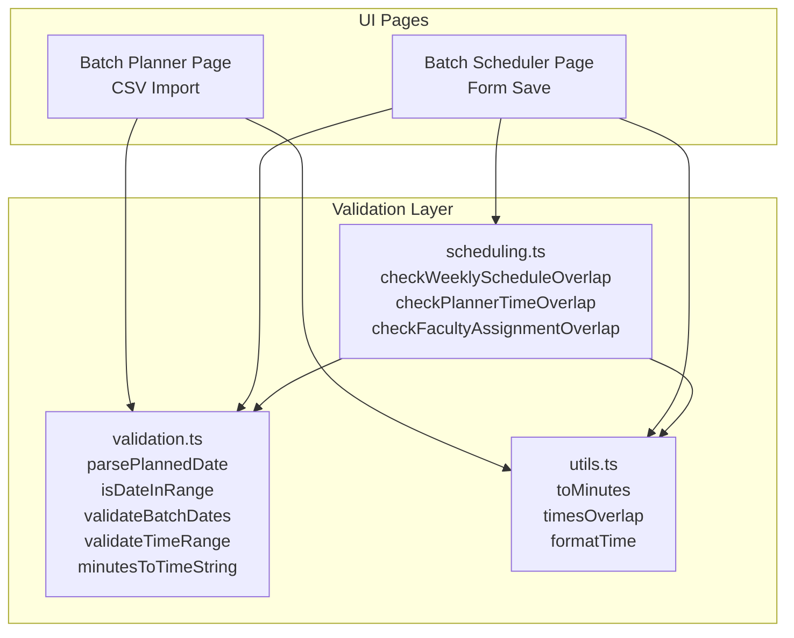
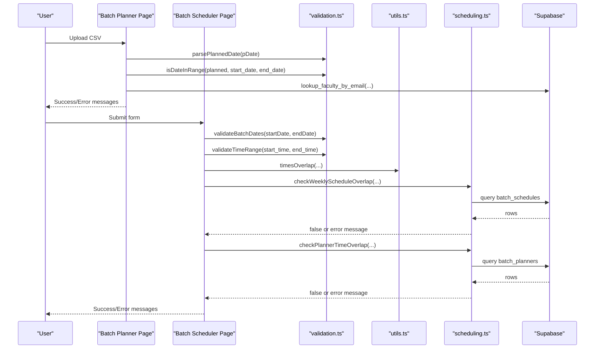
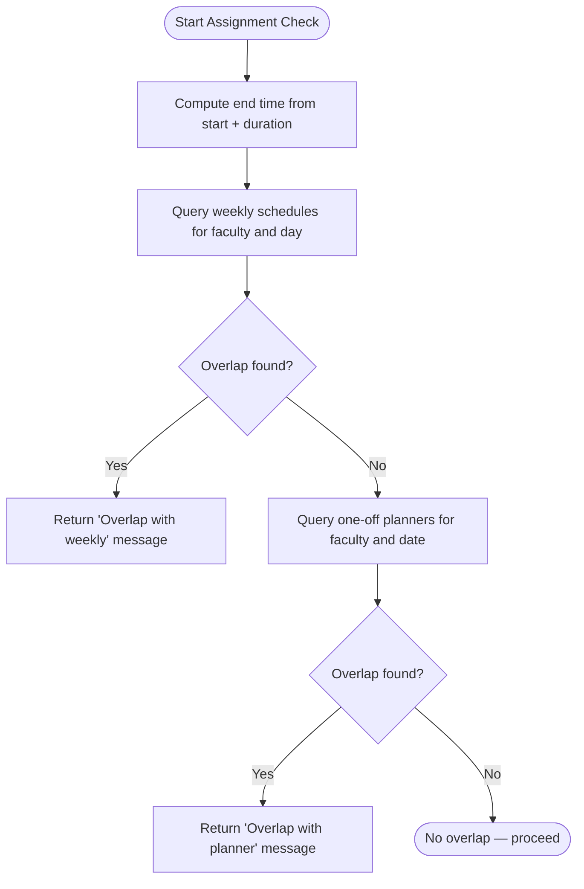
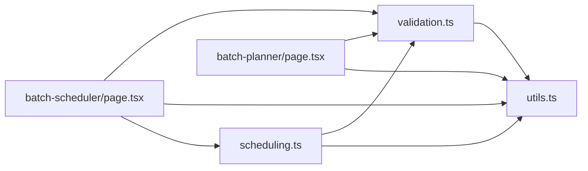

# Validation System

<cite>
**Referenced Files in This Document**
- [validation.ts](file://lib/validation.ts)
- [scheduling.ts](file://lib/scheduling.ts)
- [utils.ts](file://lib/utils.ts)
- [batch-planner/page.tsx](file://app/central/batch-planner/page.tsx)
- [batch-scheduler/page.tsx](file://app/central/batch-scheduler/page.tsx)
</cite>

## Table of Contents
1. [Introduction](#introduction)
2. [Project Structure](#project-structure)
3. [Core Components](#core-components)
4. [Architecture Overview](#architecture-overview)
5. [Detailed Component Analysis](#detailed-component-analysis)
6. [Dependency Analysis](#dependency-analysis)
7. [Performance Considerations](#performance-considerations)
8. [Troubleshooting Guide](#troubleshooting-guide)
9. [Conclusion](#conclusion)
10. [Appendices](#appendices)

## Introduction
This document explains the data validation system that ensures integrity across scheduling and planning features. It covers:
- Time format validation and conversion utilities
- Date parsing and range checks
- Business rule enforcement for schedules and planners
- The validation pipeline from React forms to API calls
- Error message formatting and user feedback
- Examples of valid and invalid inputs
- Custom validation rules used by the application
- Integration with React forms and Supabase-backed services

The goal is to make the validation logic clear, testable, and extensible while keeping it accessible to both developers and non-technical readers.

## Project Structure
Validation-related code is organized into focused modules:
- lib/validation.ts: Core validation functions (date parsing, time range checks, minutes-to-time conversion)
- lib/utils.ts: Shared time utilities (minutes conversion, overlap detection, display helpers)
- lib/scheduling.ts: Overlap checks against existing schedules and planners
- app/central/batch-planner/page.tsx: CSV-based planner import with validation
- app/central/batch-scheduler/page.tsx: Batch creation/editing with schedule validation

**Diagram sources**
- [validation.ts:1-32](file://lib/validation.ts#L1-L32)
- [utils.ts:7-18](file://lib/utils.ts#L7-L18)
- [scheduling.ts:11-112](file://lib/scheduling.ts#L11-L112)
- [batch-planner/page.tsx:4-10](file://app/central/batch-planner/page.tsx#L4-L10)
- [batch-scheduler/page.tsx:5-8](file://app/central/batch-scheduler/page.tsx#L5-L8)

**Section sources**
- [validation.ts:1-32](file://lib/validation.ts#L1-L32)
- [utils.ts:1-74](file://lib/utils.ts#L1-L74)
- [scheduling.ts:1-113](file://lib/scheduling.ts#L1-L113)
- [batch-planner/page.tsx:1-218](file://app/central/batch-planner/page.tsx#L1-L218)
- [batch-scheduler/page.tsx:1-583](file://app/central/batch-scheduler/page.tsx#L1-L583)

## Core Components
- parsePlannedDate(value): Validates a YYYY-MM-DD string and returns a Date or null. Used to normalize planned dates before further checks.
- isDateInRange(date, start, end): Checks if a parsed date falls within a batch’s start_date and end_date.
- validateBatchDates(startDate, endDate): Ensures both dates are provided and end is not before start.
- validateTimeRange(startTime, endTime): Ensures both times are provided and end is after start.
- minutesToTimeString(totalMinutes): Converts total minutes to HH:mm format; used when computing end times from durations.

Complementary utilities:
- toMinutes(t): Converts HH:mm to minutes since midnight.
- timesOverlap(startA, endA, startB, endB): Detects overlapping time intervals using minute arithmetic.

Scheduling overlap checks:
- checkWeeklyScheduleOverlap(supabase, facultyId, dayOfWeek, startTime, endTime, ignoreBatchId?): Returns an error message if a recurring weekly slot overlaps.
- checkPlannerTimeOverlap(supabase, facultyId, plannedDate, startTime, durationMinutes, ignorePlannerId?): Returns an error message if a one-off planner overlaps on the same date.
- checkFacultyAssignmentOverlap(supabase, facultyId, plannedDate, startTime, durationMinutes, ignorePlannerId?): Orchestrates both weekly and planner overlap checks.

**Section sources**
- [validation.ts:1-32](file://lib/validation.ts#L1-L32)
- [utils.ts:7-18](file://lib/utils.ts#L7-L18)
- [scheduling.ts:11-112](file://lib/scheduling.ts#L11-L112)

## Architecture Overview
The validation pipeline integrates UI forms and CSV imports with shared validation functions and database-backed overlap checks.

**Diagram sources**
- [batch-planner/page.tsx:86-108](file://app/central/batch-planner/page.tsx#L86-L108)
- [batch-scheduler/page.tsx:265-339](file://app/central/batch-scheduler/page.tsx#L265-L339)
- [validation.ts:1-32](file://lib/validation.ts#L1-L32)
- [utils.ts:12-18](file://lib/utils.ts#L12-L18)
- [scheduling.ts:11-112](file://lib/scheduling.ts#L11-L112)

## Detailed Component Analysis

### Date Parsing and Range Validation
- parsePlannedDate(value)
  - Normalizes input by trimming whitespace.
  - Enforces strict YYYY-MM-DD format via regex.
  - Constructs a Date at noon to avoid timezone pitfalls and validates it is a real date.
  - Returns null on invalid input.
- isDateInRange(date, start, end)
  - Compares a Date against a start/end pair by constructing boundary Dates at midnight and end-of-day.
  - Returns true if the date is within the inclusive range.

Usage examples:
- Valid: "2025-01-15" within a batch spanning "2025-01-01" to "2025-01-31".
- Invalid: "2025-13-01", "Jan 15 2025", or any date outside the batch range.

Integration points:
- Batch Planner page uses these functions to validate each row’s planned date during CSV import.

**Section sources**
- [validation.ts:1-14](file://lib/validation.ts#L1-L14)
- [batch-planner/page.tsx:86-96](file://app/central/batch-planner/page.tsx#L86-L96)

### Time Range Validation and Conversion Utilities
- validateTimeRange(startTime, endTime)
  - Requires both fields.
  - Ensures end is strictly after start using string comparison of "HH:mm".
- minutesToTimeString(totalMinutes)
  - Converts total minutes to "HH:mm" with zero-padding.
  - Used to compute end times from start time plus duration.

Complementary utility:
- toMinutes(t) converts "HH:mm" to minutes since midnight for arithmetic.

Examples:
- Valid: start "09:00", end "10:30".
- Invalid: start "10:00", end "09:00"; missing values.

Integration points:
- Batch Scheduler validates per-row time ranges and computes end times for overlap checks.

**Section sources**
- [validation.ts:22-32](file://lib/validation.ts#L22-L32)
- [utils.ts:7-10](file://lib/utils.ts#L7-L10)
- [batch-scheduler/page.tsx:275-283](file://app/central/batch-scheduler/page.tsx#L275-L283)

### Business Rule Enforcement: Overlap Detection
- timesOverlap(startA, endA, startB, endB)
  - Uses minute arithmetic to detect overlapping intervals.
- checkWeeklyScheduleOverlap(supabase, facultyId, dayOfWeek, startTime, endTime, ignoreBatchId?)
  - Queries existing weekly schedules for the same faculty and day.
  - Returns a descriptive error message if overlap exists.
- checkPlannerTimeOverlap(supabase, facultyId, plannedDate, startTime, durationMinutes, ignorePlannerId?)
  - Queries one-off planners for the same faculty and date.
  - Computes new interval using start time + duration and compares with existing entries.
- checkFacultyAssignmentOverlap(supabase, facultyId, plannedDate, startTime, durationMinutes, ignorePlannerId?)
  - Combines weekly and planner overlap checks.
  - Uses minutesToTimeString to derive end time for weekly checks.

Examples:
- Valid: Faculty has no other classes on Tuesday 10:00–11:00.
- Invalid: Faculty already scheduled for Tuesday 10:30–11:30.

Integration points:
- Batch Scheduler enforces intra-batch overlap checks and then calls server-side overlap checks before persisting.

**Diagram sources**
- [scheduling.ts:11-112](file://lib/scheduling.ts#L11-L112)
- [validation.ts:28-32](file://lib/validation.ts#L28-L32)
- [utils.ts:7-10](file://lib/utils.ts#L7-L10)

**Section sources**
- [utils.ts:12-18](file://lib/utils.ts#L12-L18)
- [scheduling.ts:11-112](file://lib/scheduling.ts#L11-L112)
- [batch-scheduler/page.tsx:307-339](file://app/central/batch-scheduler/page.tsx#L307-L339)

### Email Handling and Validation
- The application uses HTML email inputs and normalizes emails to lowercase for lookups.
- There is no dedicated email regex validator in the core validation module; instead, the app relies on browser-native type="email" behavior and backend resolution.
- In the Batch Planner, emails are normalized and resolved via a Supabase RPC function to find faculty by email within the selected centre.

Examples:
- Valid: "name@pw.live" resolves to a faculty member at the centre.
- Invalid: Missing email, unrecognized email, or email not associated with the centre.

Integration points:
- Batch Planner page normalizes and looks up faculty by email before inserting planner records.

**Section sources**
- [batch-planner/page.tsx:79-134](file://app/central/batch-planner/page.tsx#L79-L134)

### Minutes-to-Time Conversion Utilities and Schedule Validation
- minutesToTimeString(totalMinutes)
  - Produces "HH:mm" strings suitable for storage and comparison.
  - Used when converting duration to end time for overlap checks.
- toMinutes(t)
  - Converts "HH:mm" to minutes for arithmetic comparisons.

Role in schedule validation:
- When checking one-off planners, the system converts start time to minutes, adds duration, and compares with existing entries’ minute ranges.
- For weekly checks, the system computes end time using minutesToTimeString and compares intervals.

Examples:
- Start "09:45", duration 75 minutes → End "11:00".
- Overlap detected if another entry spans "10:00–11:30".

**Section sources**
- [validation.ts:28-32](file://lib/validation.ts#L28-L32)
- [utils.ts:7-10](file://lib/utils.ts#L7-L10)
- [scheduling.ts:54-76](file://lib/scheduling.ts#L54-L76)
- [scheduling.ts:88-98](file://lib/scheduling.ts#L88-L98)

### Integration with React Forms and API Calls
- Batch Planner
  - Parses CSV rows, validates chapter/topic presence, parses and validates planned date, checks date range, validates duration bounds, resolves faculty by email, and inserts planner records.
  - Aggregates errors per row and reports them alongside success counts.
- Batch Scheduler
  - Validates required fields, batch date range, per-row time ranges, faculty assignment constraints, intra-batch overlaps, and server-side overlap checks.
  - Persists batch and schedule rows only after all validations pass.

Error message formatting:
- Consistent structure: { type: 'success' | 'error' | 'info', text: string }.
- Messages are concise, actionable, and include context such as faculty names and days.

API integration:
- Uses Supabase client methods to query and insert data.
- Leverages RPC functions for specialized lookups.

**Section sources**
- [batch-planner/page.tsx:50-162](file://app/central/batch-planner/page.tsx#L50-L162)
- [batch-scheduler/page.tsx:249-404](file://app/central/batch-scheduler/page.tsx#L249-L404)

## Dependency Analysis
The validation layer depends on shared utilities and is consumed by UI pages and scheduling services.

**Diagram sources**
- [validation.ts:1-32](file://lib/validation.ts#L1-L32)
- [utils.ts:1-74](file://lib/utils.ts#L1-L74)
- [scheduling.ts:1-113](file://lib/scheduling.ts#L1-L113)
- [batch-planner/page.tsx:4-10](file://app/central/batch-planner/page.tsx#L4-L10)
- [batch-scheduler/page.tsx:5-8](file://app/central/batch-scheduler/page.tsx#L5-L8)

**Section sources**
- [validation.ts:1-32](file://lib/validation.ts#L1-L32)
- [utils.ts:1-74](file://lib/utils.ts#L1-L74)
- [scheduling.ts:1-113](file://lib/scheduling.ts#L1-L113)
- [batch-planner/page.tsx:1-218](file://app/central/batch-planner/page.tsx#L1-L218)
- [batch-scheduler/page.tsx:1-583](file://app/central/batch-scheduler/page.tsx#L1-L583)

## Performance Considerations
- Use of minute arithmetic avoids expensive date parsing for time comparisons.
- Overlap checks are O(n) per faculty/day combination; batching queries reduces round-trips.
- Client-side validation prevents unnecessary network requests and provides immediate feedback.
- Avoid redundant computations by memoizing derived lists where possible (e.g., filtered faculty).

[No sources needed since this section provides general guidance]

## Troubleshooting Guide
Common issues and resolutions:
- Invalid planned date format
  - Symptom: Row rejected with “invalid date” message.
  - Fix: Ensure YYYY-MM-DD format without extra spaces.
- Planned date outside batch range
  - Symptom: Row rejected with “outside batch range”.
  - Fix: Adjust the planned date to fall within the batch’s start_date and end_date.
- Duration out of bounds
  - Symptom: Row rejected with “duration must be 15–480 minutes”.
  - Fix: Provide a duration between 15 and 480 minutes.
- Faculty not found at centre
  - Symptom: Row rejected with “faculty not found at this centre”.
  - Fix: Confirm the email belongs to a faculty member assigned to the selected centre.
- Time range invalid
  - Symptom: “End time must be after start time.”
  - Fix: Ensure end > start for each row.
- Overlap detected
  - Symptom: “Overlap with weekly/planner” message.
  - Fix: Shift the time or day to resolve conflicts.

Where to inspect:
- Batch Planner validation flow and error aggregation.
- Batch Scheduler validation sequence and overlap checks.

**Section sources**
- [batch-planner/page.tsx:86-155](file://app/central/batch-planner/page.tsx#L86-L155)
- [batch-scheduler/page.tsx:265-339](file://app/central/batch-scheduler/page.tsx#L265-L339)

## Conclusion
The validation system combines robust client-side checks with targeted server-side overlap detection to maintain data integrity across scheduling and planning workflows. By centralizing reusable validation functions and utilities, the application achieves consistent behavior, clear error messaging, and efficient performance. Extending the system involves adding new validators in lib/validation.ts and integrating them into the relevant UI flows.

[No sources needed since this section summarizes without analyzing specific files]

## Appendices

### Validation Function Reference
- parsePlannedDate(value: string): Date | null
- isDateInRange(date: Date, start: string, end: string): boolean
- validateBatchDates(startDate: string, endDate: string): string | null
- validateTimeRange(startTime: string, endTime: string): string | null
- minutesToTimeString(totalMinutes: number): string
- toMinutes(t: string): number
- timesOverlap(startA: string, endA: string, startB: string, endB: string): boolean
- checkWeeklyScheduleOverlap(...)
- checkPlannerTimeOverlap(...)
- checkFacultyAssignmentOverlap(...)

**Section sources**
- [validation.ts:1-32](file://lib/validation.ts#L1-L32)
- [utils.ts:7-18](file://lib/utils.ts#L7-L18)
- [scheduling.ts:11-112](file://lib/scheduling.ts#L11-L112)