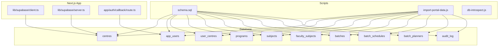
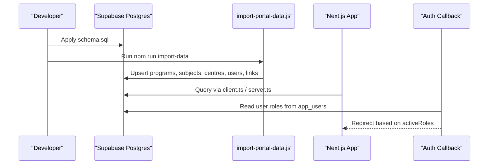
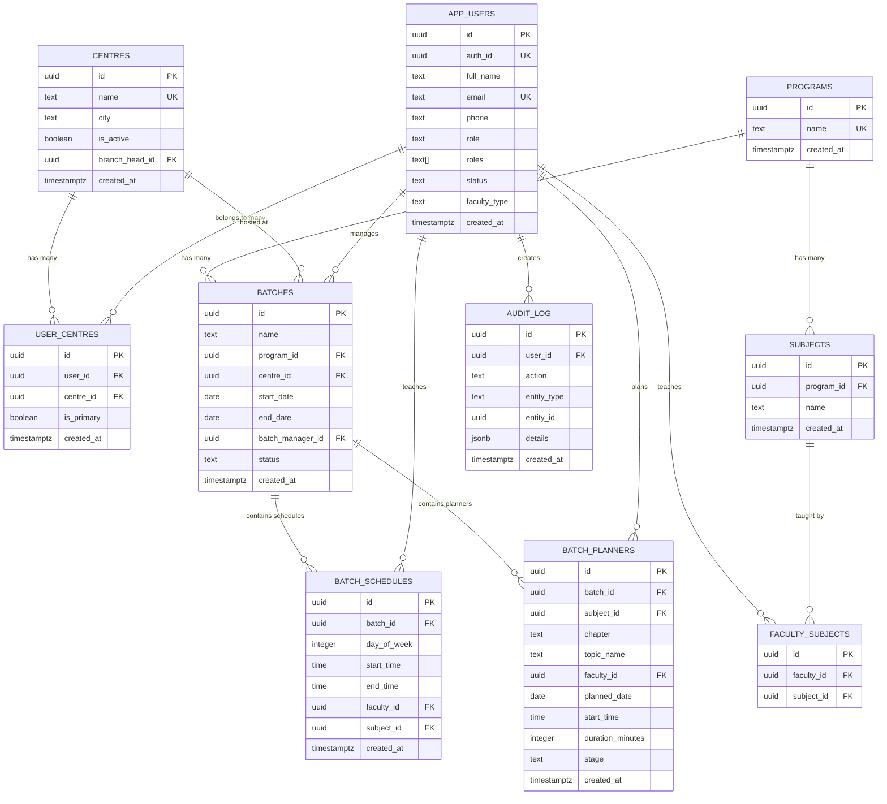
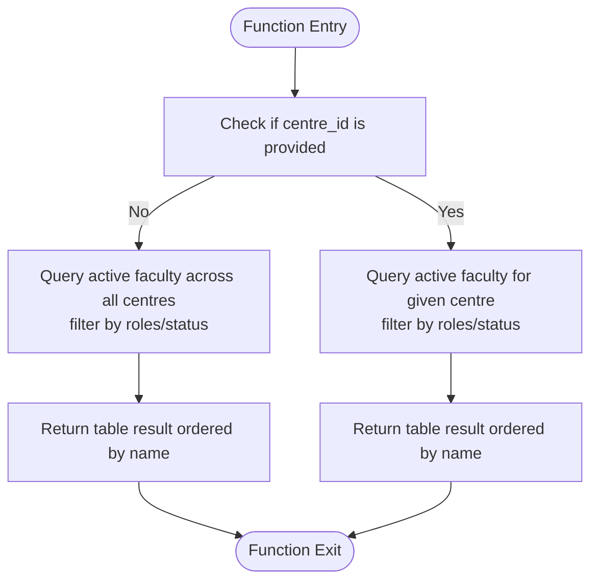
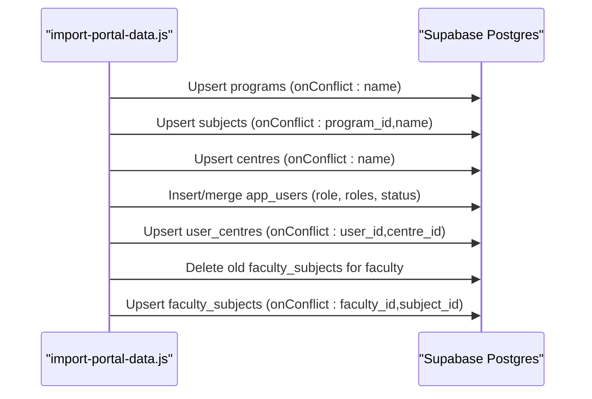
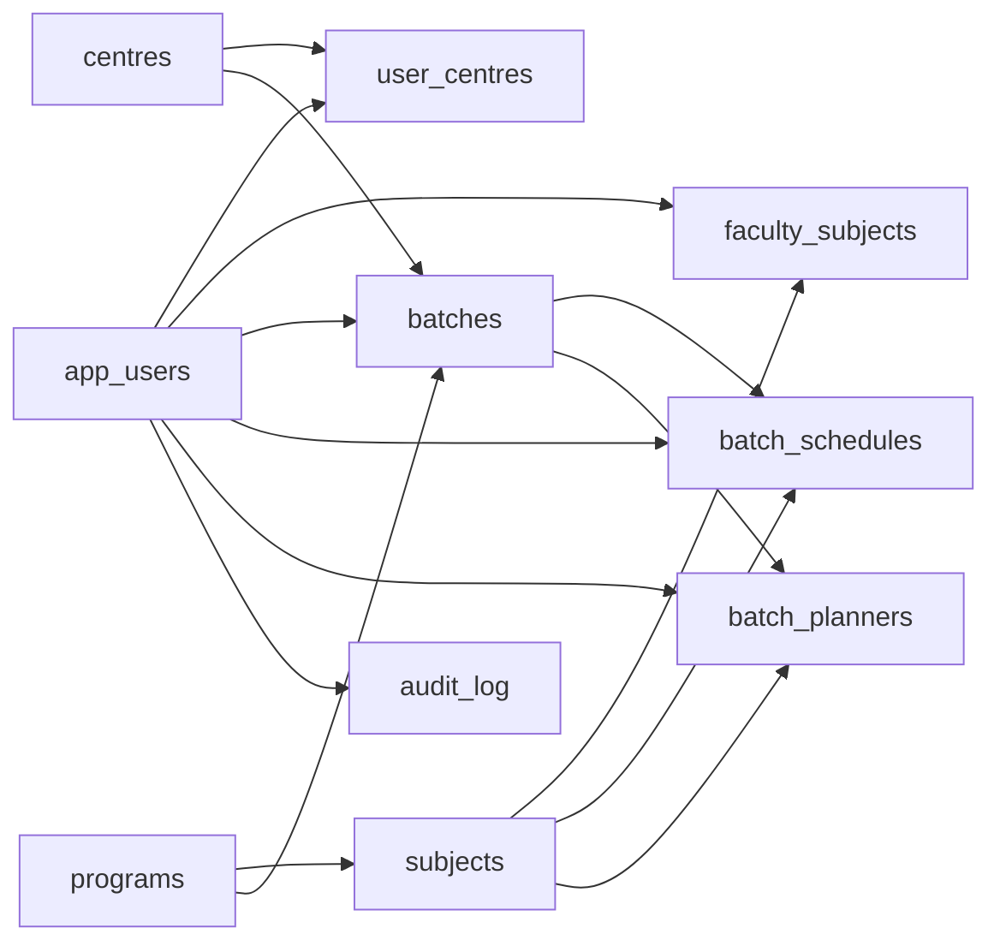

# Database Schema

<cite>
**Referenced Files in This Document**
- [schema.sql](file://scripts/schema.sql)
- [import-portal-data.js](file://scripts/import-portal-data.js)
- [db-introspect.js](file://scripts/db-introspect.js)
- [client.ts](file://lib/supabase/client.ts)
- [server.ts](file://lib/supabase/server.ts)
- [route.ts](file://app/auth/callback/route.ts)
- [package.json](file://package.json)
</cite>

## Table of Contents
1. [Introduction](#introduction)
2. [Project Structure](#project-structure)
3. [Core Components](#core-components)
4. [Architecture Overview](#architecture-overview)
5. [Detailed Component Analysis](#detailed-component-analysis)
6. [Dependency Analysis](#dependency-analysis)
7. [Performance Considerations](#performance-considerations)
8. [Troubleshooting Guide](#troubleshooting-guide)
9. [Conclusion](#conclusion)
10. [Appendices](#appendices)

## Introduction
This document describes the Superclass Portal database schema, focusing on entity relationships among Users, Centres, Programs, Subjects, Batches, Schedules, and Planners. It details primary and foreign keys, constraints, indexes, row-level security policies, custom RPC functions, and stored procedures used for business logic. It also includes diagrams, sample queries, and data migration strategies grounded in the repository’s artifacts.

## Project Structure
The database schema is defined as a single SQL script and is applied to a Supabase Postgres instance. Data import utilities are provided as Node scripts that use the Supabase client. The Next.js application integrates with Supabase via SSR/SSR clients.

**Diagram sources**
- [schema.sql:1-269](file://scripts/schema.sql#L1-L269)
- [import-portal-data.js:1-843](file://scripts/import-portal-data.js#L1-L843)
- [db-introspect.js:1-55](file://scripts/db-introspect.js#L1-L55)
- [client.ts:1-8](file://lib/supabase/client.ts#L1-L8)
- [server.ts:1-29](file://lib/supabase/server.ts#L1-L29)
- [route.ts:41-67](file://app/auth/callback/route.ts#L41-L67)

**Section sources**
- [schema.sql:1-269](file://scripts/schema.sql#L1-L269)
- [import-portal-data.js:1-843](file://scripts/import-portal-data.js#L1-L843)
- [client.ts:1-8](file://lib/supabase/client.ts#L1-L8)
- [server.ts:1-29](file://lib/supabase/server.ts#L1-L29)
- [route.ts:41-67](file://app/auth/callback/route.ts#L41-L67)

## Core Components
- Entities: centres, app_users, user_centres, programs, subjects, faculty_subjects, batches, batch_schedules, batch_planners, audit_log.
- Relationships:
  - Centre has many users (via user_centres junction).
  - Program has many subjects; subject belongs to program.
  - Faculty (app_users) teaches subjects (faculty_subjects).
  - Batch belongs to program and centre; schedule entries belong to batch; planner entries belong to batch.
- Security: Row-Level Security enabled across all tables with permissive authenticated policies; role enforcement occurs at the application layer.
- Functions: list_active_faculty and lookup_faculty_by_email provide role-aware faculty lookups using user roles and centre associations.

**Section sources**
- [schema.sql:25-163](file://scripts/schema.sql#L25-L163)
- [schema.sql:171-213](file://scripts/schema.sql#L171-L213)
- [schema.sql:219-262](file://scripts/schema.sql#L219-L262)

## Architecture Overview
The database is managed by a declarative schema script and seeded via an import script. The Next.js app uses Supabase clients to interact with the database. Authentication callbacks determine user roles and redirect accordingly.

**Diagram sources**
- [schema.sql:1-269](file://scripts/schema.sql#L1-L269)
- [import-portal-data.js:1-843](file://scripts/import-portal-data.js#L1-L843)
- [client.ts:1-8](file://lib/supabase/client.ts#L1-L8)
- [server.ts:1-29](file://lib/supabase/server.ts#L1-L29)
- [route.ts:41-67](file://app/auth/callback/route.ts#L41-L67)

## Detailed Component Analysis

### Entity Relationship Model

**Diagram sources**
- [schema.sql:25-163](file://scripts/schema.sql#L25-L163)

**Section sources**
- [schema.sql:25-163](file://scripts/schema.sql#L25-L163)

### Primary Keys, Foreign Keys, Constraints, and Indexes
- Primary Keys: All tables define UUID primary keys generated by gen_random_uuid().
- Unique Constraints:
  - centres.name
  - app_users.email
  - programs.name
  - subjects.unique(program_id, name)
  - user_centres.unique(user_id, centre_id)
  - faculty_subjects.unique(faculty_id, subject_id)
- Foreign Keys:
  - centres.branch_head_id -> app_users(id) ON DELETE SET NULL
  - user_centres.user_id -> app_users(id) ON DELETE CASCADE
  - user_centres.centre_id -> centres(id) ON DELETE CASCADE
  - subjects.program_id -> programs(id) ON DELETE SET NULL
  - faculty_subjects.faculty_id -> app_users(id) ON DELETE CASCADE
  - faculty_subjects.subject_id -> subjects(id) ON DELETE CASCADE
  - batches.program_id -> programs(id) ON DELETE RESTRICT
  - batches.centre_id -> centres(id) ON DELETE RESTRICT
  - batches.batch_manager_id -> app_users(id) ON DELETE SET NULL
  - batch_schedules.batch_id -> batches(id) ON DELETE CASCADE
  - batch_schedules.faculty_id -> app_users(id) ON DELETE CASCADE
  - batch_schedules.subject_id -> subjects(id) ON DELETE SET NULL
  - batch_planners.batch_id -> batches(id) ON DELETE CASCADE
  - batch_planners.subject_id -> subjects(id) ON DELETE SET NULL
  - batch_planners.faculty_id -> app_users(id) ON DELETE CASCADE
  - audit_log.user_id -> app_users(id) ON DELETE SET NULL
- Check Constraints:
  - batch_schedules.day_of_week BETWEEN 0 AND 6
- Indexes:
  - user_centres(user_id), user_centres(centre_id)
  - batch_schedules(faculty_id, day_of_week), batch_schedules(batch_id)
  - batch_planners(faculty_id, planned_date), batch_planners(batch_id)
  - audit_log(created_at DESC)

**Section sources**
- [schema.sql:25-163](file://scripts/schema.sql#L25-L163)

### Row-Level Security Policies
- RLS is enabled on all core tables.
- Permissive authenticated policies allow SELECT, INSERT, UPDATE, and DELETE operations for authenticated users. Role-based access control is enforced in application code rather than in RLS USING clauses.
- Service role bypasses RLS automatically, enabling import scripts to operate without policy restrictions.

**Section sources**
- [schema.sql:219-262](file://scripts/schema.sql#L219-L262)

### Custom RPC Functions
- list_active_faculty(p_centre_id UUID): Returns active faculty members optionally filtered by centre. Uses user roles array and primary role to identify faculty.
- lookup_faculty_by_email(faculty_email TEXT, p_centre_id UUID): Resolves a faculty user ID by normalized email within a specific centre, considering active status and roles.

Both functions are SECURITY DEFINER and encapsulate business rules around faculty identification and centre scoping.

**Diagram sources**
- [schema.sql:171-194](file://scripts/schema.sql#L171-L194)

**Section sources**
- [schema.sql:171-213](file://scripts/schema.sql#L171-L213)

### Stored Procedures and Business Logic
- No explicit stored procedures are defined in the schema file. Complex business logic is implemented in the import script (e.g., upserting programs/subjects, mapping centre names, merging roles, linking faculty to subjects and centres).
- The import script orchestrates multi-step data transformations and writes to multiple tables atomically per operation.

**Section sources**
- [import-portal-data.js:144-435](file://scripts/import-portal-data.js#L144-L435)

### Data Flows and Processing Logic
- Import Flow:
  - Parse CSV files for programs/subjects, centres, central team, and faculty.
  - Upsert programmes and subjects with unique constraints.
  - Upsert centres and create branch heads/batch managers as users.
  - Create or merge faculty users, link them to multiple centres via user_centres, and associate subjects via faculty_subjects.
- Authentication Flow:
  - On callback, read user roles from app_users and redirect to appropriate dashboards.

**Diagram sources**
- [import-portal-data.js:144-435](file://scripts/import-portal-data.js#L144-L435)

**Section sources**
- [import-portal-data.js:144-435](file://scripts/import-portal-data.js#L144-L435)

## Dependency Analysis
- Schema dependencies:
  - centres depends on app_users (branch_head_id).
  - user_centres depends on app_users and centres.
  - subjects depends on programs.
  - faculty_subjects depends on app_users and subjects.
  - batches depends on programs, centres, app_users.
  - batch_schedules depends on batches, app_users, subjects.
  - batch_planners depends on batches, subjects, app_users.
  - audit_log depends on app_users.
- Application dependencies:
  - Next.js app uses Supabase SSR/Client libraries to query/mutate tables.
  - Auth callback reads user roles from app_users to determine routing.

**Diagram sources**
- [schema.sql:25-163](file://scripts/schema.sql#L25-L163)

**Section sources**
- [schema.sql:25-163](file://scripts/schema.sql#L25-L163)

## Performance Considerations
- Indexes:
  - user_centres(user_id), user_centres(centre_id) optimize joins between users and centres.
  - batch_schedules(faculty_id, day_of_week) supports weekly timetable queries by faculty.
  - batch_planners(faculty_id, planned_date) supports planning queries by faculty and date.
  - audit_log(created_at DESC) optimizes recent audit log retrieval.
- Constraints:
  - Unique constraints prevent duplicates and reduce validation overhead.
  - ON DELETE behaviors ensure referential integrity while controlling cascade effects.
- Queries:
  - Prefer indexed columns in WHERE/JOIN clauses (e.g., faculty_id, centre_id, batch_id).
  - Use functions like list_active_faculty and lookup_faculty_by_email to encapsulate filtering and reduce client-side complexity.

[No sources needed since this section provides general guidance]

## Troubleshooting Guide
- Missing environment variables:
  - Ensure NEXT_PUBLIC_SUPABASE_URL and SUPABASE_SERVICE_ROLE_KEY are set for import scripts.
- Duplicate key errors:
  - Unique constraints on centres.name, app_users.email, programs.name, subjects(program_id,name), user_centres(user_id,centre_id), and faculty_subjects(faculty_id,subject_id) may cause conflicts during imports.
- Role resolution issues:
  - If authentication redirects fail, verify app_users.role and app_users.roles fields and ensure they include expected values.
- Introspection:
  - Use db-introspect.js to inspect column metadata and constraints for debugging.

**Section sources**
- [import-portal-data.js:33-41](file://scripts/import-portal-data.js#L33-L41)
- [db-introspect.js:33-50](file://scripts/db-introspect.js#L33-L50)
- [route.ts:41-67](file://app/auth/callback/route.ts#L41-L67)

## Conclusion
The Superclass Portal database schema is designed with clear entity relationships, robust constraints, and targeted indexes to support scheduling and planning workflows. Row-level security is broadly permissive for authenticated users, with role-based access enforced in application code. Custom functions encapsulate common faculty lookup logic, and the import script provides a comprehensive data seeding strategy.

[No sources needed since this section summarizes without analyzing specific files]

## Appendices

### Sample Queries
- List active faculty for a centre:
  - Call function: list_active_faculty(centre_id)
- Lookup faculty by email at a centre:
  - Call function: lookup_faculty_by_email(email, centre_id)
- Get weekly schedule for a batch:
  - Select from batch_schedules where batch_id = ? and day_of_week between 0 and 6
- Get planned topics for a faculty member on a date:
  - Select from batch_planners where faculty_id = ? and planned_date = ?

**Section sources**
- [schema.sql:171-213](file://scripts/schema.sql#L171-L213)

### Data Migration Strategy
- Fresh start:
  - Drop existing tables and functions, then recreate schema using schema.sql.
- Seed data:
  - Run npm run import-data to populate programs, subjects, centres, users, and relationships from CSV files.
- Incremental changes:
  - Maintain versioned SQL migrations outside this repository when evolving the schema beyond the initial setup.

**Section sources**
- [schema.sql:1-21](file://scripts/schema.sql#L1-L21)
- [package.json:10-11](file://package.json#L10-L11)
- [import-portal-data.js:439-456](file://scripts/import-portal-data.js#L439-L456)