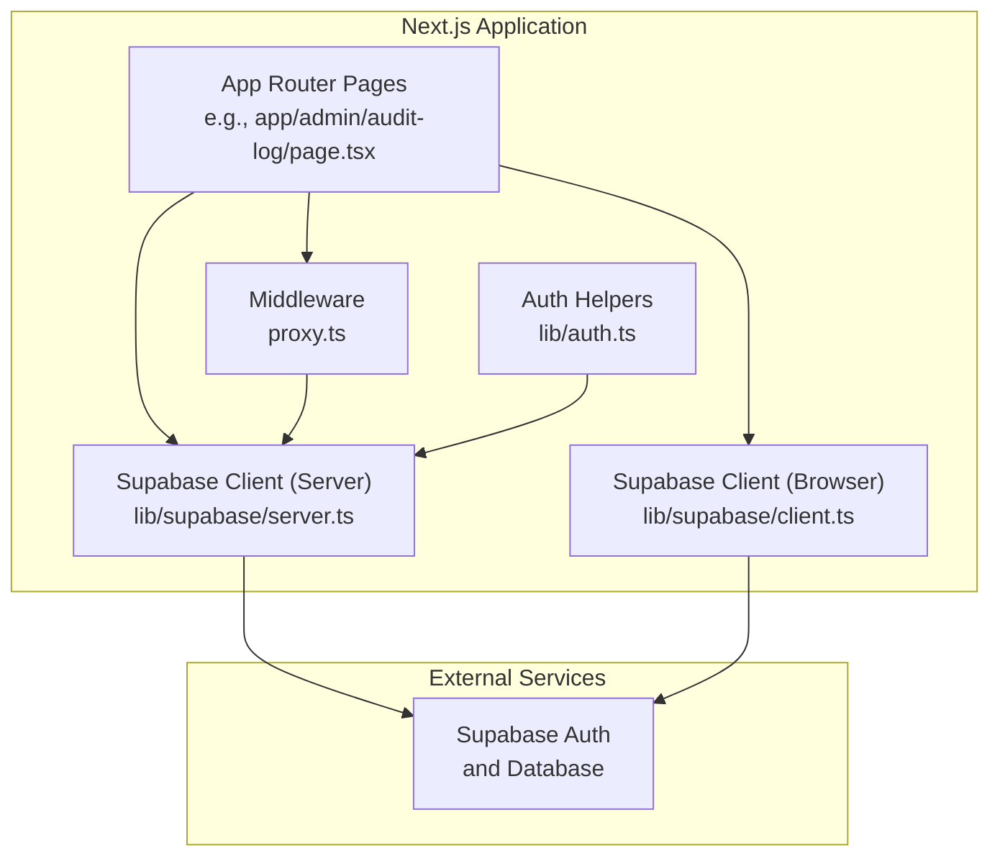
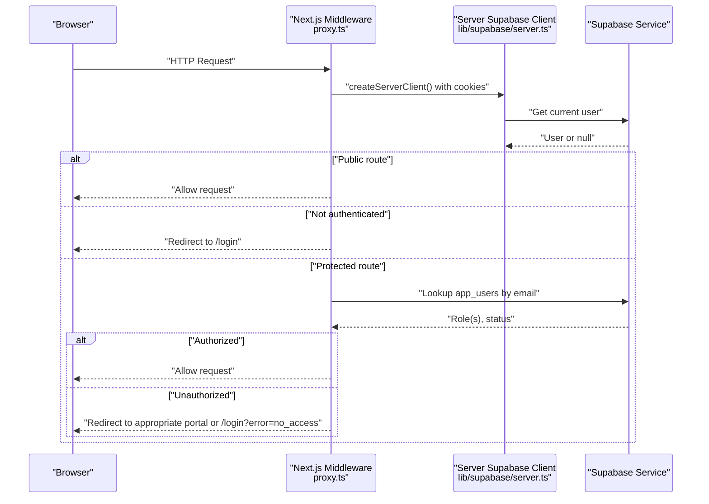
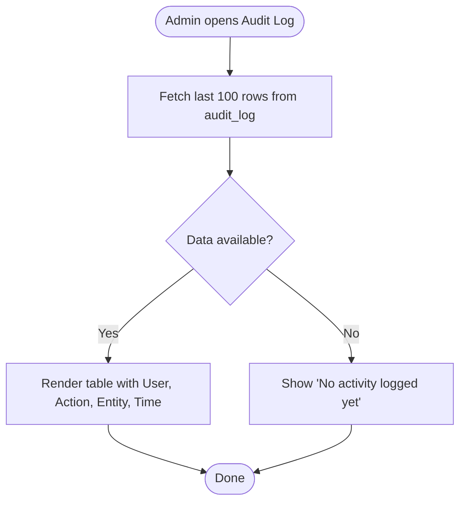
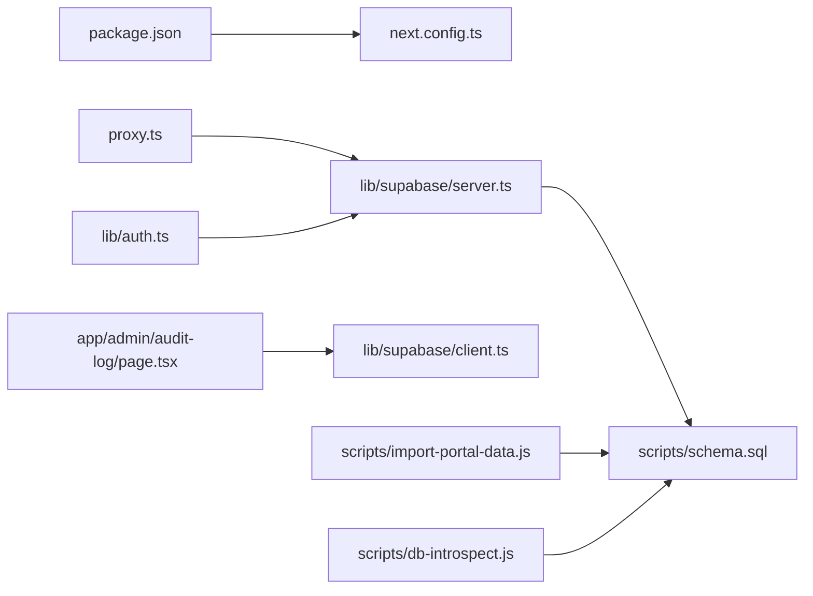

# Deployment & Operations

<cite>
**Referenced Files in This Document**
- [package.json](file://package.json)
- [next.config.ts](file://next.config.ts)
- [README.md](file://README.md)
- [proxy.ts](file://proxy.ts)
- [lib/supabase/client.ts](file://lib/supabase/client.ts)
- [lib/supabase/server.ts](file://lib/supabase/server.ts)
- [lib/auth.ts](file://lib/auth.ts)
- [app/admin/audit-log/page.tsx](file://app/admin/audit-log/page.tsx)
- [scripts/schema.sql](file://scripts/schema.sql)
- [scripts/import-portal-data.js](file://scripts/import-portal-data.js)
- [scripts/db-introspect.js](file://scripts/db-introspect.js)
</cite>

## Table of Contents
1. [Introduction](#introduction)
2. [Project Structure](#project-structure)
3. [Core Components](#core-components)
4. [Architecture Overview](#architecture-overview)
5. [Detailed Component Analysis](#detailed-component-analysis)
6. [Dependency Analysis](#dependency-analysis)
7. [Performance Considerations](#performance-considerations)
8. [Troubleshooting Guide](#troubleshooting-guide)
9. [Conclusion](#conclusion)
10. [Appendices](#appendices)

## Introduction
This document provides deployment and operations guidance for the Superclass Portal, a Next.js application integrated with Supabase for authentication and data storage. It covers build configuration, environment variable management, monitoring via audit logging, backup strategies, performance optimization, caching, scaling considerations, troubleshooting, log analysis, and maintenance tasks.

## Project Structure
The project is a Next.js App Router application with:
- Middleware-based access control and session propagation
- Supabase client libraries for browser and server contexts
- Admin UI including an audit log viewer
- Database schema and import scripts for seeding and introspection

**Diagram sources**
- [proxy.ts:1-103](file://proxy.ts#L1-L103)
- [lib/supabase/client.ts:1-8](file://lib/supabase/client.ts#L1-L8)
- [lib/supabase/server.ts:1-29](file://lib/supabase/server.ts#L1-L29)
- [lib/auth.ts:1-69](file://lib/auth.ts#L1-L69)
- [app/admin/audit-log/page.tsx:1-75](file://app/admin/audit-log/page.tsx#L1-L75)

**Section sources**
- [README.md:1-37](file://README.md#L1-L37)
- [package.json:1-31](file://package.json#L1-L31)

## Core Components
- Build and runtime scripts: development, build, start, lint, and data import utilities.
- Next.js configuration file (currently minimal).
- Authentication and authorization middleware that enforces role-based access to protected routes.
- Supabase clients for browser and server contexts using environment variables.
- Audit log page for operational visibility into recent system activity.

Key responsibilities:
- proxy.ts: Enforces login and role checks; redirects users based on roles.
- lib/supabase/*: Initializes Supabase clients with correct cookie handling for SSR and CSR.
- lib/auth.ts: Resolves app user profiles and helper functions for roles and centre membership.
- app/admin/audit-log/page.tsx: Displays recent audit events from the database.

**Section sources**
- [package.json:1-31](file://package.json#L1-L31)
- [next.config.ts:1-8](file://next.config.ts#L1-L8)
- [proxy.ts:1-103](file://proxy.ts#L1-L103)
- [lib/supabase/client.ts:1-8](file://lib/supabase/client.ts#L1-L8)
- [lib/supabase/server.ts:1-29](file://lib/supabase/server.ts#L1-L29)
- [lib/auth.ts:1-69](file://lib/auth.ts#L1-L69)
- [app/admin/audit-log/page.tsx:1-75](file://app/admin/audit-log/page.tsx#L1-L75)

## Architecture Overview
The portal uses Next.js App Router with middleware for request-time authorization and Supabase for identity and data. The middleware reads cookies, validates sessions, and enforces role-based routing. Server components use a server-side Supabase client bound to request cookies; client components use a browser-side client.

**Diagram sources**
- [proxy.ts:1-103](file://proxy.ts#L1-L103)
- [lib/supabase/server.ts:1-29](file://lib/supabase/server.ts#L1-L29)

## Detailed Component Analysis

### Build Process Configuration (Next.js)
- Scripts:
  - Development: runs the dev server.
  - Build: compiles the app for production.
  - Start: serves the production build.
  - Lint: runs ESLint.
  - Import data: seeds reference data and users from CSVs.
- Next.js config: currently empty; can be extended for headers, rewrites, image optimization, and output settings.

Operational notes:
- Use the provided scripts in CI/CD pipelines: install dependencies, run build, then start.
- Ensure environment variables are present at build time if used by the app.

**Section sources**
- [package.json:1-31](file://package.json#L1-L31)
- [next.config.ts:1-8](file://next.config.ts#L1-L8)
- [README.md:1-37](file://README.md#L1-L37)

### Environment Variable Management
Required variables for production:
- NEXT_PUBLIC_SUPABASE_URL: Public Supabase URL.
- NEXT_PUBLIC_SUPABASE_ANON_KEY: Anon key for client requests.
- SUPABASE_SERVICE_ROLE_KEY: Service role key for admin scripts and server-side privileged operations.

Where they are consumed:
- Browser client initialization.
- Server client initialization.
- Data import and introspection scripts.

Best practices:
- Store secrets in your platform’s secret manager (Vercel, Docker secrets, Kubernetes Secrets, etc.).
- Do not commit .env files to version control.
- Validate presence of required variables during startup or build.

**Section sources**
- [lib/supabase/client.ts:1-8](file://lib/supabase/client.ts#L1-L8)
- [lib/supabase/server.ts:1-29](file://lib/supabase/server.ts#L1-L29)
- [scripts/import-portal-data.js:1-800](file://scripts/import-portal-data.js#L1-L800)
- [scripts/db-introspect.js:1-40](file://scripts/db-introspect.js#L1-L40)

### Monitoring Setup with Audit Logging
Audit log table and policies:
- The audit_log table stores action, entity type, optional entity id, details JSONB, and timestamp.
- RLS policies allow authenticated users to read and insert audit entries.

Admin UI:
- The audit log page fetches the latest 100 entries ordered by created_at and displays user, action, entity, and time.

Operational usage:
- Integrate application mutations to write audit entries.
- Use the admin page for quick inspection; export logs periodically for long-term retention.

**Diagram sources**
- [app/admin/audit-log/page.tsx:1-75](file://app/admin/audit-log/page.tsx#L1-L75)
- [scripts/schema.sql:154-166](file://scripts/schema.sql#L154-L166)

**Section sources**
- [app/admin/audit-log/page.tsx:1-75](file://app/admin/audit-log/page.tsx#L1-L75)
- [scripts/schema.sql:154-166](file://scripts/schema.sql#L154-L166)

### Backup Strategies for Supabase Data
Recommended approach:
- Use Supabase native backups and point-in-time recovery features provided by your hosting provider.
- Supplement with periodic logical exports using the service role key for critical datasets (e.g., app_users, centres, batches, schedules).
- Maintain schema versions in code and apply migrations consistently across environments.

Operational steps:
- Schedule regular backups through your Supabase dashboard or CLI.
- Export snapshots of key tables for compliance and disaster recovery.
- Test restore procedures regularly.

**Section sources**
- [scripts/schema.sql:1-269](file://scripts/schema.sql#L1-L269)
- [scripts/import-portal-data.js:1-800](file://scripts/import-portal-data.js#L1-L800)

### Performance Optimization Techniques
- Prefer server-side data fetching where possible to reduce client payload and leverage edge caching.
- Minimize unnecessary re-renders in React components; memoize expensive computations.
- Use efficient queries and indexes defined in the schema (e.g., audit_log.created_at index).
- Avoid heavy client-side processing; offload to server functions or RPCs when feasible.

[No sources needed since this section provides general guidance]

### Caching Strategies
- Leverage Next.js built-in caching mechanisms for static assets and API responses where applicable.
- For Supabase queries, consider client-side caching patterns (e.g., React Query or SWR) if you introduce them later.
- Keep cache keys stable and scoped to user context to avoid cross-user data leaks.

[No sources needed since this section provides general guidance]

### Scaling Considerations
- Deploy behind a CDN or edge network to serve static assets closer to users.
- Scale horizontally by running multiple instances of the Next.js app if necessary.
- Monitor database load and tune queries; ensure RLS policies remain efficient.
- Use connection pooling and rate limiting at the gateway level if exposed directly.

[No sources needed since this section provides general guidance]

## Dependency Analysis
High-level dependency relationships:
- Middleware depends on Supabase server client for session and user lookups.
- Pages depend on Supabase browser client for direct DB access.
- Scripts depend on Supabase service role key for administrative operations.

**Diagram sources**
- [package.json:1-31](file://package.json#L1-L31)
- [next.config.ts:1-8](file://next.config.ts#L1-L8)
- [proxy.ts:1-103](file://proxy.ts#L1-L103)
- [lib/supabase/server.ts:1-29](file://lib/supabase/server.ts#L1-L29)
- [lib/supabase/client.ts:1-8](file://lib/supabase/client.ts#L1-L8)
- [lib/auth.ts:1-69](file://lib/auth.ts#L1-L69)
- [app/admin/audit-log/page.tsx:1-75](file://app/admin/audit-log/page.tsx#L1-L75)
- [scripts/schema.sql:1-269](file://scripts/schema.sql#L1-L269)
- [scripts/import-portal-data.js:1-800](file://scripts/import-portal-data.js#L1-L800)
- [scripts/db-introspect.js:1-40](file://scripts/db-introspect.js#L1-L40)

**Section sources**
- [package.json:1-31](file://package.json#L1-L31)
- [proxy.ts:1-103](file://proxy.ts#L1-L103)
- [lib/supabase/server.ts:1-29](file://lib/supabase/server.ts#L1-L29)
- [lib/supabase/client.ts:1-8](file://lib/supabase/client.ts#L1-L8)
- [lib/auth.ts:1-69](file://lib/auth.ts#L1-L69)
- [app/admin/audit-log/page.tsx:1-75](file://app/admin/audit-log/page.tsx#L1-L75)
- [scripts/schema.sql:1-269](file://scripts/schema.sql#L1-L269)
- [scripts/import-portal-data.js:1-800](file://scripts/import-portal-data.js#L1-L800)
- [scripts/db-introspect.js:1-40](file://scripts/db-introspect.js#L1-L40)

## Performance Considerations
- Optimize images and fonts via Next.js defaults.
- Reduce bundle size by avoiding heavy third-party libraries unless necessary.
- Profile serverless function durations and database query latencies.
- Use pagination and limits for large datasets (e.g., audit log limited to 100 rows).

[No sources needed since this section provides general guidance]

## Troubleshooting Guide
Common issues and resolutions:
- Missing environment variables:
  - Symptoms: Build or runtime errors related to Supabase URLs or keys.
  - Resolution: Verify NEXT_PUBLIC_SUPABASE_URL, NEXT_PUBLIC_SUPABASE_ANON_KEY, and SUPABASE_SERVICE_ROLE_KEY are set in the deployment environment.
- Authentication failures:
  - Symptoms: Redirect loops or immediate logout.
  - Resolution: Ensure cookies are properly propagated by the middleware and that Supabase session cookies are valid.
- Role-based access denied:
  - Symptoms: Users redirected to wrong portal or login with error.
  - Resolution: Confirm app_users has correct role(s) and status; check middleware logic and RLS policies.
- Audit log empty:
  - Symptoms: No entries visible in admin UI.
  - Resolution: Verify audit_log inserts occur and RLS allows authenticated reads.
- Data import failures:
  - Symptoms: Script exits with missing env values or CSV parsing errors.
  - Resolution: Provide service role key and correct CSV paths; validate CSV structure.

Operational diagnostics:
- Use the audit log page to trace recent actions.
- Run the DB introspection script to inspect schema state.
- Review middleware matcher to ensure it includes all relevant routes.

**Section sources**
- [proxy.ts:1-103](file://proxy.ts#L1-L103)
- [app/admin/audit-log/page.tsx:1-75](file://app/admin/audit-log/page.tsx#L1-L75)
- [scripts/db-introspect.js:1-40](file://scripts/db-introspect.js#L1-L40)
- [scripts/import-portal-data.js:1-800](file://scripts/import-portal-data.js#L1-L800)

## Conclusion
The Superclass Portal is a Next.js application secured by Supabase with middleware-driven authorization and an audit log for observability. Production readiness hinges on proper environment configuration, robust backups, and ongoing monitoring. Follow the guidance above to deploy, scale, and maintain the system reliably.

[No sources needed since this section summarizes without analyzing specific files]

## Appendices

### Environment Variables Reference
- NEXT_PUBLIC_SUPABASE_URL
- NEXT_PUBLIC_SUPABASE_ANON_KEY
- SUPABASE_SERVICE_ROLE_KEY

**Section sources**
- [lib/supabase/client.ts:1-8](file://lib/supabase/client.ts#L1-L8)
- [lib/supabase/server.ts:1-29](file://lib/supabase/server.ts#L1-L29)
- [scripts/import-portal-data.js:1-800](file://scripts/import-portal-data.js#L1-L800)
- [scripts/db-introspect.js:1-40](file://scripts/db-introspect.js#L1-L40)

### Maintenance Tasks
- Apply schema changes via scripts/schema.sql and test in staging before production.
- Re-run import-portal-data.js after schema updates to reconcile seed data.
- Periodically review audit logs and rotate service role keys as per security policy.
- Update dependencies and Next.js version following best practices and security advisories.

**Section sources**
- [scripts/schema.sql:1-269](file://scripts/schema.sql#L1-L269)
- [scripts/import-portal-data.js:1-800](file://scripts/import-portal-data.js#L1-L800)