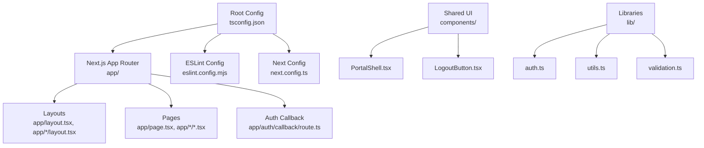
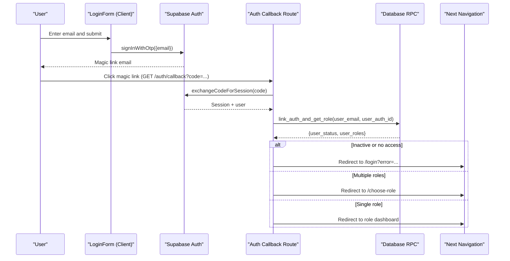
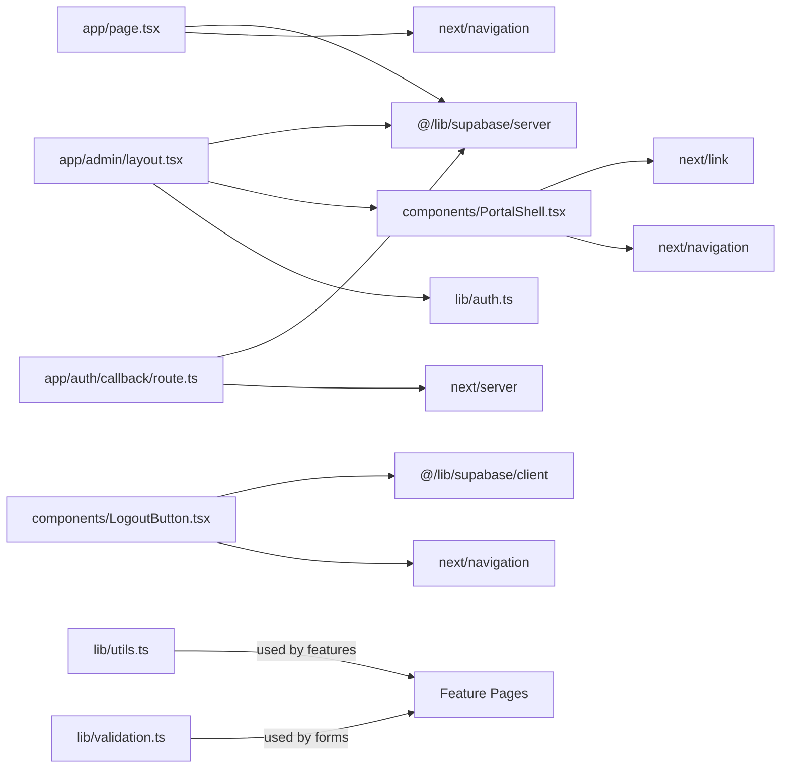

# Coding Standards & Conventions

<cite>
**Referenced Files in This Document**
- [tsconfig.json](file://tsconfig.json)
- [eslint.config.mjs](file://eslint.config.mjs)
- [next.config.ts](file://next.config.ts)
- [package.json](file://package.json)
- [README.md](file://README.md)
- [app/layout.tsx](file://app/layout.tsx)
- [app/page.tsx](file://app/page.tsx)
- [app/auth/callback/route.ts](file://app/auth/callback/route.ts)
- [app/admin/layout.tsx](file://app/admin/layout.tsx)
- [components/PortalShell.tsx](file://components/PortalShell.tsx)
- [components/LogoutButton.tsx](file://components/LogoutButton.tsx)
- [lib/auth.ts](file://lib/auth.ts)
- [lib/utils.ts](file://lib/utils.ts)
- [lib/validation.ts](file://lib/validation.ts)
</cite>

## Table of Contents
1. Introduction
2. Project Structure
3. Core Components
4. Architecture Overview
5. Detailed Component Analysis
6. Dependency Analysis
7. Performance Considerations
8. Troubleshooting Guide
9. Conclusion
10. Appendices

## Introduction
This document defines the coding standards and conventions for the Superclass Portal, a Next.js App Router application with TypeScript and React. It covers configuration, linting, file naming, component patterns, type definitions, server/client boundaries, error handling, logging, comments, performance, and security best practices. The goal is to ensure consistent, maintainable, and secure code across the team.

## Project Structure
The project follows a feature-oriented layout under app/ for routes, components/ for shared UI primitives, lib/ for reusable logic, and scripts/ for utilities. Configuration lives at the repository root (TypeScript, ESLint, Next.js).

Key organization principles:
- Route-based directories under app/ mirror URL paths. Each route can include a page.tsx and optional layout.tsx.
- Shared UI components live in components/.
- Domain-specific logic and types are placed in lib/.
- Server-only client initialization should be used on the server; browser-only clients should be used in client components.

**Diagram sources**
- [tsconfig.json](file://tsconfig.json)
- [eslint.config.mjs](file://eslint.config.mjs)
- [next.config.ts](file://next.config.ts)
- [app/layout.tsx](file://app/layout.tsx)
- [app/page.tsx](file://app/page.tsx)
- [app/auth/callback/route.ts](file://app/auth/callback/route.ts)
- [app/admin/layout.tsx](file://app/admin/layout.tsx)
- [components/PortalShell.tsx](file://components/PortalShell.tsx)
- [components/LogoutButton.tsx](file://components/LogoutButton.tsx)
- [lib/auth.ts](file://lib/auth.ts)
- [lib/utils.ts](file://lib/utils.ts)
- [lib/validation.ts](file://lib/validation.ts)

**Section sources**
- [README.md](file://README.md)
- [package.json](file://package.json)

## Core Components
- Root layout sets global metadata and font variables. Use this as the canonical place for site-wide metadata and base styles.
- Admin layout demonstrates role-scoped navigation and wrapping pages with a shared shell component.
- PortalShell provides a responsive sidebar/header, user info, logout integration, and common UI primitives (PageHeader, Alert, Card, buttons, dashboard grid).
- LogoutButton encapsulates sign-out flow and client-side navigation refresh.

Standards derived from these components:
- Prefer client components only when necessary; mark them explicitly with 'use client'.
- Keep UI primitives small, typed, and composable.
- Centralize navigation items in layout files close to their scope.
- Use shared shell components to enforce consistent UX across roles.

**Section sources**
- [app/layout.tsx](file://app/layout.tsx)
- [app/admin/layout.tsx](file://app/admin/layout.tsx)
- [components/PortalShell.tsx](file://components/PortalShell.tsx)
- [components/LogoutButton.tsx](file://components/LogoutButton.tsx)

## Architecture Overview
Authentication and routing follow a clear server-first flow:
- Client login triggers an OTP flow that redirects to an auth callback route.
- The callback exchanges the code for a session, links the auth identity to the portal user, validates status and roles, then redirects to the appropriate role-based area or role selection.
- Protected layouts validate the session and fetch app user data before rendering the shell.

**Diagram sources**
- [app/login/LoginForm.tsx](file://app/login/LoginForm.tsx)
- [app/auth/callback/route.ts](file://app/auth/callback/route.ts)

**Section sources**
- [app/auth/callback/route.ts](file://app/auth/callback/route.ts)
- [app/page.tsx](file://app/page.tsx)
- [app/admin/layout.tsx](file://app/admin/layout.tsx)

## Detailed Component Analysis

### TypeScript Configuration and Best Practices
- Strict mode enabled; prefer explicit types and avoid any.
- Module resolution set to bundler; use path aliases (@/*) consistently.
- JSX runtime configured for React 19; keep components functional and typed.
- Include generated types for Next.js and dev builds.

Recommended practices:
- Define types near usage in lib/ and export them for reuse.
- Use discriminated unions and const assertions for enums-like behavior.
- Avoid implicit any by enabling strict checks and addressing errors.

**Section sources**
- [tsconfig.json](file://tsconfig.json)

### ESLint Rules and Customizations
- Uses Next.js core web vitals and TypeScript presets.
- Ignores build artifacts and generated types.

Customization guidelines:
- Extend rules via eslint.config.mjs using defineConfig arrays.
- Add project-specific overrides for src/lib vs app boundaries if needed.
- Integrate with IDE to show warnings during development.

**Section sources**
- [eslint.config.mjs](file://eslint.config.mjs)

### File Naming Conventions
- Pages: page.tsx inside route folders (e.g., app/admin/page.tsx).
- Layouts: layout.tsx adjacent to pages they wrap.
- Client components: suffix .tsx and begin with 'use client' directive.
- Utilities: lowercase with kebab-case filenames in lib/ (e.g., utils.ts, validation.ts).
- Types: colocate with implementation or in dedicated type files; export named types.

Examples:
- [app/admin/layout.tsx](file://app/admin/layout.tsx)
- [components/PortalShell.tsx](file://components/PortalShell.tsx)
- [lib/utils.ts](file://lib/utils.ts)
- [lib/validation.ts](file://lib/validation.ts)

**Section sources**
- [app/admin/layout.tsx](file://app/admin/layout.tsx)
- [components/PortalShell.tsx](file://components/PortalShell.tsx)
- [lib/utils.ts](file://lib/utils.ts)
- [lib/validation.ts](file://lib/validation.ts)

### Component Structure Patterns
- Client components must declare 'use client' at the top.
- Props should be typed; prefer explicit interfaces over inline types for complex props.
- Separate presentational and interaction logic; keep handlers async where needed.
- Reuse shared UI primitives from components/PortalShell.tsx.

Example references:
- [components/PortalShell.tsx](file://components/PortalShell.tsx)
- [components/LogoutButton.tsx](file://components/LogoutButton.tsx)

**Section sources**
- [components/PortalShell.tsx](file://components/PortalShell.tsx)
- [components/LogoutButton.tsx](file://components/LogoutButton.tsx)

### Next.js App Router Usage Patterns
- Server components by default; use 'use client' only when required.
- Server-side data fetching via Supabase server client in layouts/pages.
- Redirects using next/navigation redirect() on the server.
- Client navigation via useRouter().push() and router.refresh() after mutations.

References:
- [app/page.tsx](file://app/page.tsx)
- [app/admin/layout.tsx](file://app/admin/layout.tsx)
- [components/LogoutButton.tsx](file://components/LogoutButton.tsx)

**Section sources**
- [app/page.tsx](file://app/page.tsx)
- [app/admin/layout.tsx](file://app/admin/layout.tsx)
- [components/LogoutButton.tsx](file://components/LogoutButton.tsx)

### Type Definitions and Validation
- Centralize domain types in lib/auth.ts (AppUser, UserCentre).
- Provide utility validators in lib/validation.ts for dates and time ranges.
- Use const arrays and inferred types for enumerations in lib/utils.ts.

Guidelines:
- Export types used across layers (server, client, API).
- Validate inputs early and return descriptive errors.
- Prefer parse functions that return null on invalid input.

**Section sources**
- [lib/auth.ts](file://lib/auth.ts)
- [lib/validation.ts](file://lib/validation.ts)
- [lib/utils.ts](file://lib/utils.ts)

### Error Handling and Logging
- Login form maps error codes to user-friendly messages and displays them contextually.
- Auth callback returns standardized error redirects with query parameters.
- Always handle RPC and network errors gracefully and inform users without leaking internals.

Patterns:
- Normalize error strings and map to stable keys.
- Avoid exposing stack traces or internal details to the client.
- For server flows, log errors centrally (see Appendix for recommended structure).

**Section sources**
- [app/login/LoginForm.tsx](file://app/login/LoginForm.tsx)
- [app/auth/callback/route.ts](file://app/auth/callback/route.ts)

### Code Comments and Documentation
- Add concise comments for non-obvious logic, especially around validation and redirections.
- Document expected inputs/outputs for utility functions.
- Keep comments up-to-date with changes.

[No sources needed since this section doesn't analyze specific files]

## Dependency Analysis
High-level dependencies among key modules:

**Diagram sources**
- [app/page.tsx](file://app/page.tsx)
- [app/admin/layout.tsx](file://app/admin/layout.tsx)
- [components/PortalShell.tsx](file://components/PortalShell.tsx)
- [components/LogoutButton.tsx](file://components/LogoutButton.tsx)
- [app/auth/callback/route.ts](file://app/auth/callback/route.ts)
- [lib/utils.ts](file://lib/utils.ts)
- [lib/validation.ts](file://lib/validation.ts)

**Section sources**
- [app/page.tsx](file://app/page.tsx)
- [app/admin/layout.tsx](file://app/admin/layout.tsx)
- [components/PortalShell.tsx](file://components/PortalShell.tsx)
- [components/LogoutButton.tsx](file://components/LogoutButton.tsx)
- [app/auth/callback/route.ts](file://app/auth/callback/route.ts)
- [lib/utils.ts](file://lib/utils.ts)
- [lib/validation.ts](file://lib/validation.ts)

## Performance Considerations
- Prefer server components for data-heavy pages; move interactivity to minimal client components.
- Use next/font for optimized font loading (already configured in root layout).
- Minimize client-side state; leverage server state and revalidation where possible.
- Avoid unnecessary re-renders by memoizing expensive computations and splitting large components.
- Keep navigation payloads small; pass only required props to components.

[No sources needed since this section provides general guidance]

## Troubleshooting Guide
Common issues and resolutions:
- Authentication loop or missing redirect: Ensure callback handles all error cases and redirects correctly.
- Role mismatch or no access: Verify active roles extraction and mapping to destinations.
- Client vs server client misuse: Confirm server client is used in server components/layouts and client client in 'use client' components.
- Form validation failures: Check date/time validators and normalize inputs before submission.

Operational tips:
- Inspect query parameters for error codes in login flows.
- Log server-side errors with contextual information (without secrets).
- Reproduce with minimal steps and verify environment variables.

**Section sources**
- [app/auth/callback/route.ts](file://app/auth/callback/route.ts)
- [app/login/LoginForm.tsx](file://app/login/LoginForm.tsx)
- [lib/validation.ts](file://lib/validation.ts)

## Conclusion
Adhering to these standards ensures consistency, safety, and performance across the Superclass Portal. By following the TypeScript, ESLint, file naming, component, and App Router patterns outlined here—and applying robust error handling, logging, and security practices—the team can deliver reliable features efficiently.

[No sources needed since this section summarizes without analyzing specific files]

## Appendices

### TypeScript Configuration Summary
- Target ES2017, strict mode, moduleResolution bundler, path alias @/*, incremental builds.
- Include Next.js generated types and dev types.

**Section sources**
- [tsconfig.json](file://tsconfig.json)

### ESLint Configuration Summary
- Extends Next.js core web vitals and TypeScript configs.
- Ignores build outputs and generated types.

**Section sources**
- [eslint.config.mjs](file://eslint.config.mjs)

### Next.js Configuration Summary
- Minimal Next config placeholder; extend as needed (e.g., headers, redirects, env).

**Section sources**
- [next.config.ts](file://next.config.ts)

### Scripts and Tooling
- Development, build, start, lint scripts provided.
- Data import scripts available under scripts/.

**Section sources**
- [package.json](file://package.json)