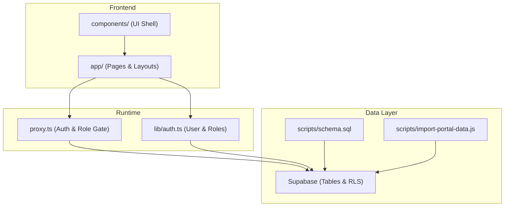
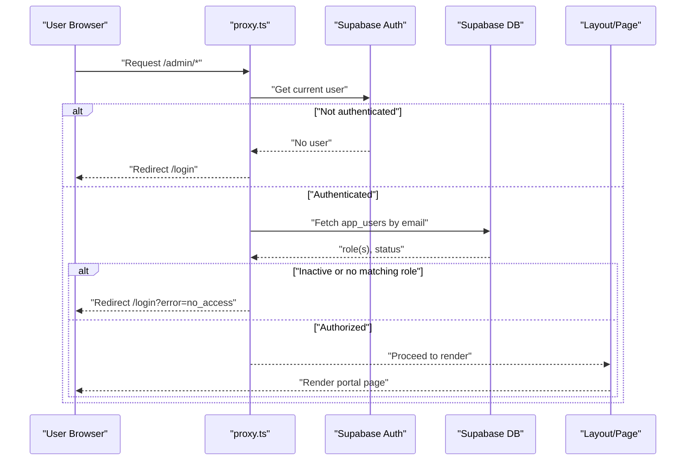
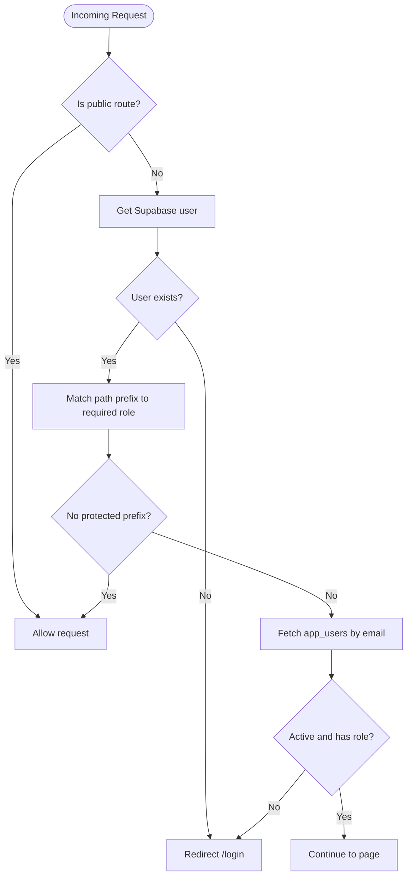
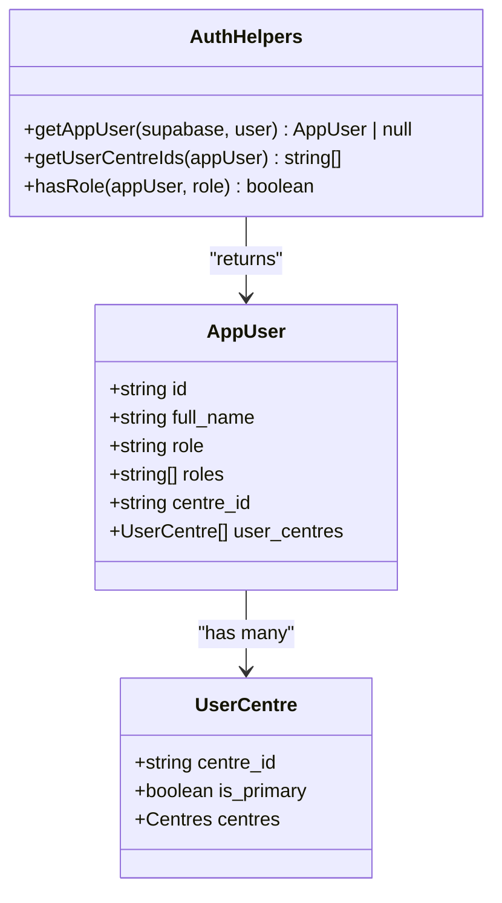
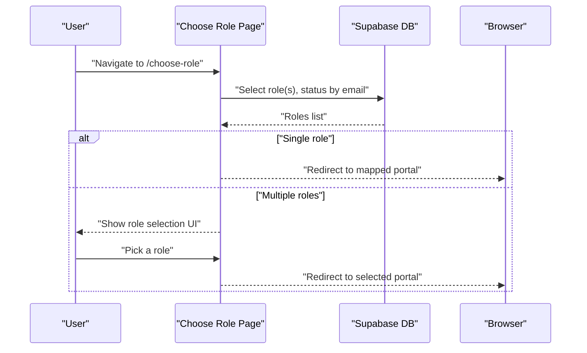
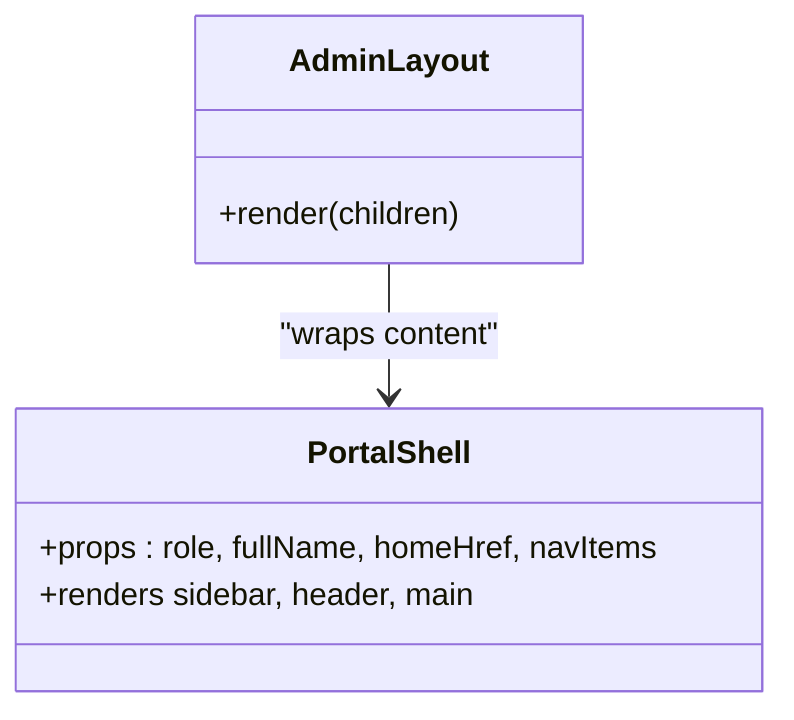
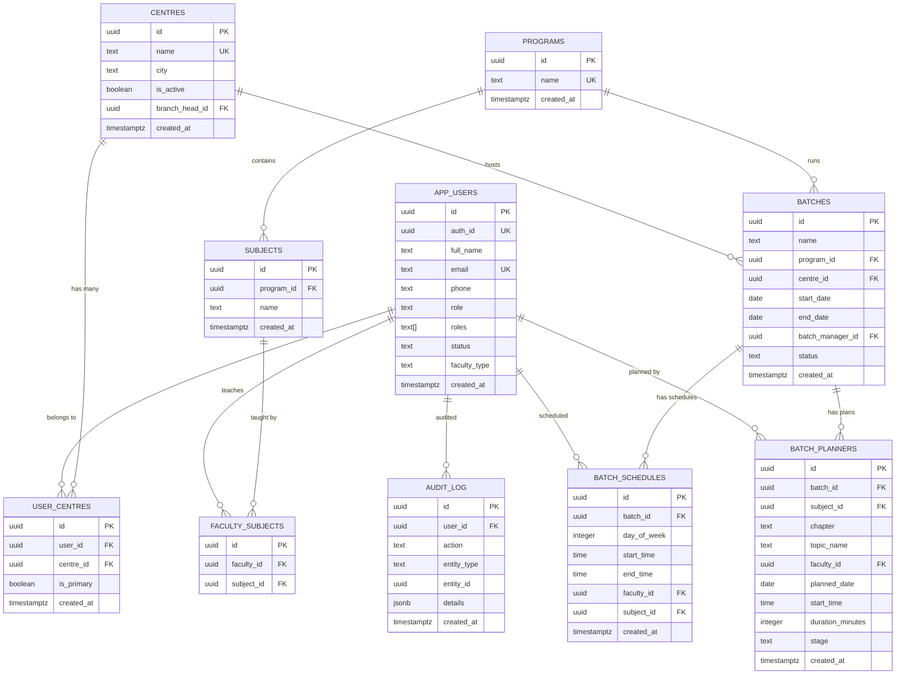
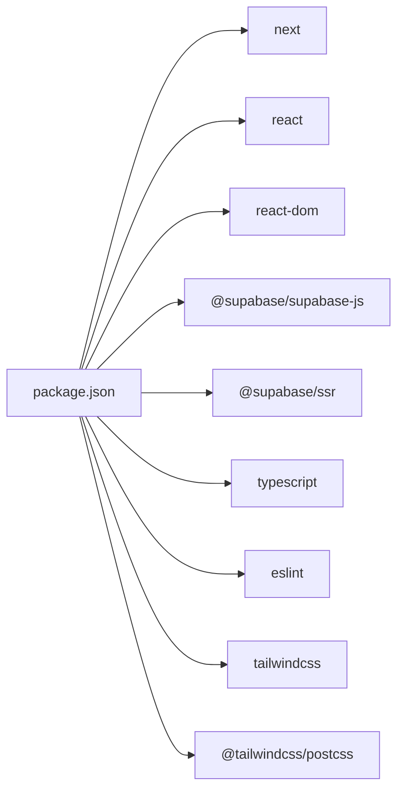

# Contribution Workflow & Best Practices

<cite>
**Referenced Files in This Document**
- [README.md](file://README.md)
- [package.json](file://package.json)
- [proxy.ts](file://proxy.ts)
- [lib/auth.ts](file://lib/auth.ts)
- [app/choose-role/page.tsx](file://app/choose-role/page.tsx)
- [app/admin/layout.tsx](file://app/admin/layout.tsx)
- [components/PortalShell.tsx](file://components/PortalShell.tsx)
- [scripts/schema.sql](file://scripts/schema.sql)
- [scripts/import-portal-data.js](file://scripts/import-portal-data.js)
- [next.config.ts](file://next.config.ts)
</cite>

## Table of Contents
1. Introduction
2. Project Structure
3. Core Components
4. Architecture Overview
5. Detailed Component Analysis
6. Dependency Analysis
7. Performance Considerations
8. Troubleshooting Guide
9. Conclusion
10. Appendices

## Introduction
This document defines the contribution workflow and best practices for developers joining the Superclass Portal project. It covers development environment setup, branch management strategy, pull request process, code review guidelines, adding new user roles, extending features while maintaining backward compatibility, commit message conventions, documentation updates, deployment procedures, collaboration tools, communication channels, and release management processes.

The project is a Next.js application with role-based portals (Admin, Central Team, Faculty, Branch Head, Batch Manager), Supabase-backed data access, and server-side routing/proxying for authentication and authorization.

## Project Structure
At a high level:
- app/: Next.js App Router pages and layouts per portal area
- components/: Shared UI shell and primitives
- lib/: Utilities, auth helpers, validation, scheduling logic
- scripts/: Database schema and CSV import utilities
- Configuration files at root (Next.js, ESLint, PostCSS, TypeScript)

**Diagram sources**
- [proxy.ts:1-103](file://proxy.ts#L1-L103)
- [lib/auth.ts:1-69](file://lib/auth.ts#L1-L69)
- [scripts/schema.sql:1-269](file://scripts/schema.sql#L1-L269)
- [scripts/import-portal-data.js:1-456](file://scripts/import-portal-data.js#L1-L456)

**Section sources**
- [README.md:1-37](file://README.md#L1-L37)
- [package.json:1-31](file://package.json#L1-L31)
- [next.config.ts:1-8](file://next.config.ts#L1-L8)

## Core Components
- Authentication and Authorization
  - Server proxy enforces login and role-based route access before rendering protected routes.
  - App-level helpers resolve user profile and roles from Supabase.
- Routing and Portals
  - Role-based redirects to dedicated portals.
  - Per-portal layout shells render navigation and context.
- Data Access
  - Supabase client usage across pages and layouts.
  - Schema and seed/import scripts manage reference data and users.

Key responsibilities:
- proxy.ts: Global middleware-like gate for authenticated access and role checks.
- lib/auth.ts: User profile retrieval, centre resolution, and role checking helpers.
- app/choose-role/page.tsx: Multi-role selection and redirect flow.
- app/admin/layout.tsx: Admin portal shell and navigation.
- components/PortalShell.tsx: Reusable shell and UI primitives.
- scripts/schema.sql: Full database schema and RLS policies.
- scripts/import-portal-data.js: Bulk import of programs, subjects, centres, users, and relationships.

**Section sources**
- [proxy.ts:1-103](file://proxy.ts#L1-L103)
- [lib/auth.ts:1-69](file://lib/auth.ts#L1-L69)
- [app/choose-role/page.tsx:1-86](file://app/choose-role/page.tsx#L1-L86)
- [app/admin/layout.tsx:1-36](file://app/admin/layout.tsx#L1-L36)
- [components/PortalShell.tsx:1-184](file://components/PortalShell.tsx#L1-L184)
- [scripts/schema.sql:1-269](file://scripts/schema.sql#L1-L269)
- [scripts/import-portal-data.js:1-456](file://scripts/import-portal-data.js#L1-L456)

## Architecture Overview
The runtime enforces security at two layers:
- Request-time enforcement via proxy.ts (auth check + role gating).
- Page-level enforcement via layouts and choose-role page.

**Diagram sources**
- [proxy.ts:12-94](file://proxy.ts#L12-L94)
- [lib/auth.ts:18-51](file://lib/auth.ts#L18-L51)

## Detailed Component Analysis

### Authentication and Role Enforcement
- The global proxy intercepts requests, ensures authentication, and validates that the user’s roles include the required role for the requested path prefix.
- If a user has multiple roles, they are redirected to their first available portal when accessing an incorrect one.
- Public routes (/login, /auth/*, /) bypass checks.

**Diagram sources**
- [proxy.ts:40-94](file://proxy.ts#L40-L94)

**Section sources**
- [proxy.ts:1-103](file://proxy.ts#L1-L103)

### User Profile and Role Helpers
- getAppUser resolves the application user by auth_id or email fallback, and auto-links auth_id for future fast lookups.
- getUserCentreIds aggregates all centres a user belongs to, supporting multi-centre assignments.
- hasRole supports both legacy single role and modern roles array.

**Diagram sources**
- [lib/auth.ts:9-69](file://lib/auth.ts#L9-L69)

**Section sources**
- [lib/auth.ts:1-69](file://lib/auth.ts#L1-L69)

### Role Selection and Redirect Flow
- The choose-role page lists active roles for the current user and either redirects automatically if there is only one role or presents a selection UI.
- Role-to-path mappings are centralized and used consistently across the app.

**Diagram sources**
- [app/choose-role/page.tsx:28-86](file://app/choose-role/page.tsx#L28-L86)

**Section sources**
- [app/choose-role/page.tsx:1-86](file://app/choose-role/page.tsx#L1-L86)

### Portal Shell and Navigation
- Each portal uses a layout that constructs navigation items and renders the shared PortalShell.
- PortalShell provides consistent branding, role label formatting, and responsive header/footer.

**Diagram sources**
- [app/admin/layout.tsx:17-35](file://app/admin/layout.tsx#L17-L35)
- [components/PortalShell.tsx:21-77](file://components/PortalShell.tsx#L21-L77)

**Section sources**
- [app/admin/layout.tsx:1-36](file://app/admin/layout.tsx#L1-L36)
- [components/PortalShell.tsx:1-184](file://components/PortalShell.tsx#L1-L184)

### Data Model and Import Pipeline
- The schema defines core entities: centres, app_users, user_centres, programs, subjects, faculty_subjects, batches, batch_schedules, batch_planners, audit_log.
- Row Level Security policies enable authenticated read/write with app-level role checks enforced in code.
- The import script orchestrates upserts for programs, subjects, centres, central team, branch heads, batch managers, and faculty, including multi-centre support and subject linking.

**Diagram sources**
- [scripts/schema.sql:25-166](file://scripts/schema.sql#L25-L166)

**Section sources**
- [scripts/schema.sql:1-269](file://scripts/schema.sql#L1-L269)
- [scripts/import-portal-data.js:144-456](file://scripts/import-portal-data.js#L144-L456)

## Dependency Analysis
- Runtime dependencies: Next.js, React, Supabase SDKs.
- Dev dependencies: TypeScript, ESLint, Tailwind CSS, PostCSS.
- Scripts rely on Node.js and Supabase service role key for imports.

**Diagram sources**
- [package.json:13-29](file://package.json#L13-L29)

**Section sources**
- [package.json:1-31](file://package.json#L1-L31)

## Performance Considerations
- Prefer count-only queries for dashboards using head:true to reduce payload size.
- Use indexes defined in the schema (e.g., faculty-day, batch-schedule-batch) to optimize frequent queries.
- Avoid unnecessary joins; fetch related data lazily where possible.
- Keep role checks centralized in proxy.ts and layouts to prevent redundant checks.

[No sources needed since this section provides general guidance]

## Troubleshooting Guide
Common issues and resolutions:
- Missing environment variables during import: Ensure NEXT_PUBLIC_SUPABASE_URL and SUPABASE_SERVICE_ROLE_KEY are set before running import scripts.
- Incorrect role mapping: Verify PROTECTED_ROLE_PATHS in proxy.ts matches the intended role names and paths.
- Multi-role redirection loops: Confirm choose-role page and proxy role resolution use consistent role arrays and fallbacks.
- Centre mapping mismatches: Update CENTRE_NAME_MAP in the import script if centre names change.

**Section sources**
- [scripts/import-portal-data.js:33-41](file://scripts/import-portal-data.js#L33-L41)
- [proxy.ts:4-10](file://proxy.ts#L4-L10)
- [app/choose-role/page.tsx:4-26](file://app/choose-role/page.tsx#L4-L26)

## Conclusion
This guide establishes a clear, repeatable workflow for contributing to the Superclass Portal. By following the environment setup, branching and PR conventions, role extension patterns, and compatibility checks outlined here, contributors can safely extend functionality while preserving system integrity and user experience.

[No sources needed since this section summarizes without analyzing specific files]

## Appendices

### Development Environment Setup
- Install dependencies and run the dev server using package scripts.
- Configure environment variables for Supabase URLs and keys.
- Initialize the database schema and seed data using provided scripts.

**Section sources**
- [README.md:3-17](file://README.md#L3-L17)
- [package.json:5-12](file://package.json#L5-L12)
- [scripts/schema.sql:267-269](file://scripts/schema.sql#L267-L269)
- [scripts/import-portal-data.js:439-456](file://scripts/import-portal-data.js#L439-L456)

### Branch Management Strategy
- Mainline branches:
  - main: Stable, production-ready code.
  - develop: Integration branch for feature work.
- Feature branches:
  - Create from develop using convention: feature/<short-description>.
  - Keep changes focused and atomic.
- Hotfixes:
  - Branch from main using hotfix/<issue-id>-<short-description>.
  - Merge back into main and develop after testing.

[No sources needed since this section provides general guidance]

### Pull Request Process
- Before opening a PR:
  - Run linter and build locally.
  - Add or update tests if applicable.
  - Ensure environment variables are documented if changed.
- PR checklist:
  - Describe purpose and scope.
  - Link related issues.
  - Include screenshots or recordings for UI changes.
  - Confirm backward compatibility notes.
- Reviewers:
  - Require at least one approval.
  - Address feedback promptly.

[No sources needed since this section provides general guidance]

### Code Review Guidelines
- Readability: Clear naming, small functions, consistent structure.
- Security: Validate inputs, avoid exposing secrets, enforce roles centrally.
- Performance: Efficient queries, minimal re-renders, leverage indexes.
- Documentation: Update README or inline comments for new features.

[No sources needed since this section provides general guidance]

### Adding New User Roles
Steps to add a new role (example: “registrar”):
- Define role constants and mappings:
  - Update roleRedirects and roleLabels in choose-role page.
  - Update PROTECTED_ROLE_PATHS in proxy.ts to map new paths to the role.
- Enforce access:
  - Add layout guards for new routes using getAppUser and hasRole.
- Database:
  - Ensure app_users.roles includes the new role value.
  - Optionally add RLS policies if needed.
- UI:
  - Add navigation entries in relevant portal layouts.
- Backward compatibility:
  - Support both legacy role field and roles array in checks.

**Section sources**
- [app/choose-role/page.tsx:4-26](file://app/choose-role/page.tsx#L4-L26)
- [proxy.ts:4-10](file://proxy.ts#L4-L10)
- [lib/auth.ts:63-69](file://lib/auth.ts#L63-L69)
- [scripts/schema.sql:37-48](file://scripts/schema.sql#L37-L48)

### Extending Existing Features
- Pages and layouts:
  - Follow app router conventions; colocate resources near pages.
- Shared components:
  - Extend PortalShell primitives rather than duplicating styles.
- Data access:
  - Use Supabase client consistently; prefer count-only queries for stats.
- Validation:
  - Centralize input validation in lib/validation.ts.

**Section sources**
- [components/PortalShell.tsx:79-184](file://components/PortalShell.tsx#L79-L184)
- [app/admin/page.tsx:10-29](file://app/admin/page.tsx#L10-L29)

### Maintaining Backward Compatibility
- Always support both legacy role and roles array in checks.
- When changing role names or paths, provide migration steps and deprecation notices.
- Preserve existing CSV import mappings until fully migrated.

**Section sources**
- [lib/auth.ts:63-69](file://lib/auth.ts#L63-L69)
- [scripts/import-portal-data.js:129-140](file://scripts/import-portal-data.js#L129-L140)

### Commit Message Conventions
Use conventional commits:
- feat: Add new role “registrar” and portal routes
- fix: Resolve redirect loop for multi-role users
- docs: Update contribution workflow
- chore: Upgrade Next.js to latest stable
- refactor: Consolidate role checks in proxy layer

Examples:
- feat(admin): add audit log viewer
- fix(auth): handle inactive users gracefully
- docs(readme): add local env setup instructions

[No sources needed since this section provides general guidance]

### Documentation Updates
- Update README for environment setup and scripts.
- Maintain inline comments for complex logic.
- Keep diagrams aligned with actual code paths.

**Section sources**
- [README.md:1-37](file://README.md#L1-L37)

### Deployment Procedures
- Build and start:
  - Use npm scripts for build and start.
- Vercel:
  - Deploy via Vercel platform; configure environment variables in dashboard.
- Supabase:
  - Apply schema migrations and seed data using scripts.

**Section sources**
- [README.md:32-37](file://README.md#L32-L37)
- [package.json:5-12](file://package.json#L5-L12)
- [scripts/schema.sql:267-269](file://scripts/schema.sql#L267-L269)

### Collaboration Tools and Communication Channels
- Issue tracking: Use repository issues for tasks and bugs.
- Discussions: Use GitHub Discussions for design questions.
- Real-time chat: Use team chat tool for quick coordination.
- Code reviews: Require approvals via pull requests.

[No sources needed since this section provides general guidance]

### Release Management Processes
- Versioning: Semantic versioning for releases.
- Pre-release:
  - Tag release candidates, run smoke tests.
- Post-release:
  - Monitor error logs and audit logs for regressions.
  - Rollback plan ready if critical issues arise.

[No sources needed since this section provides general guidance]