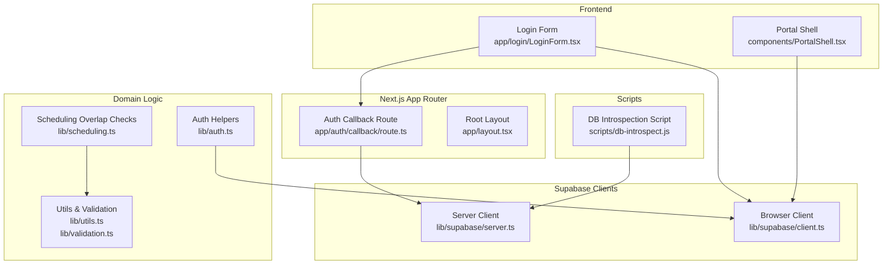
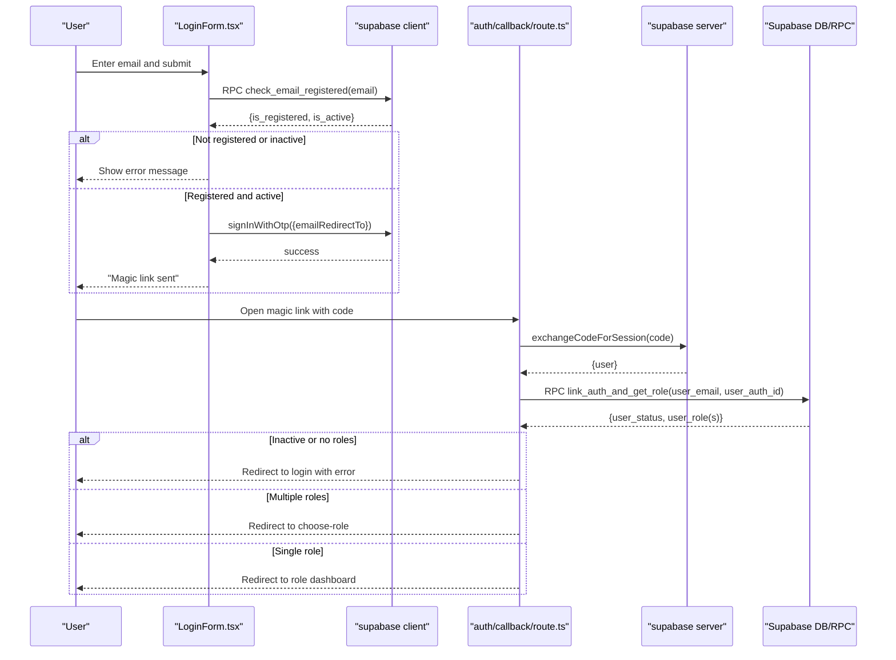
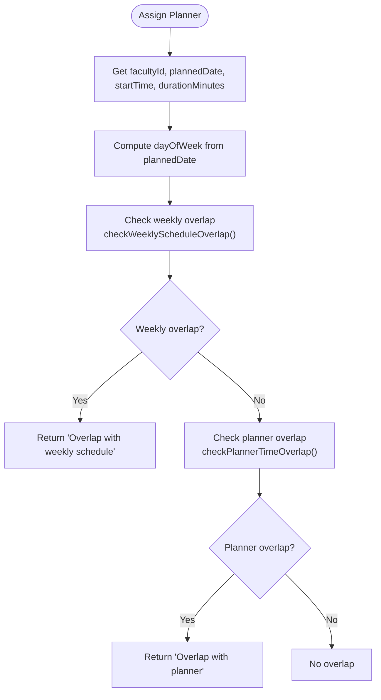
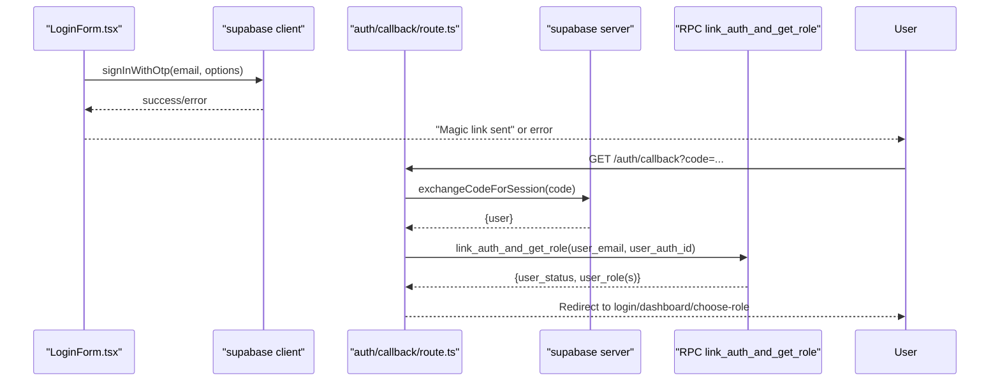
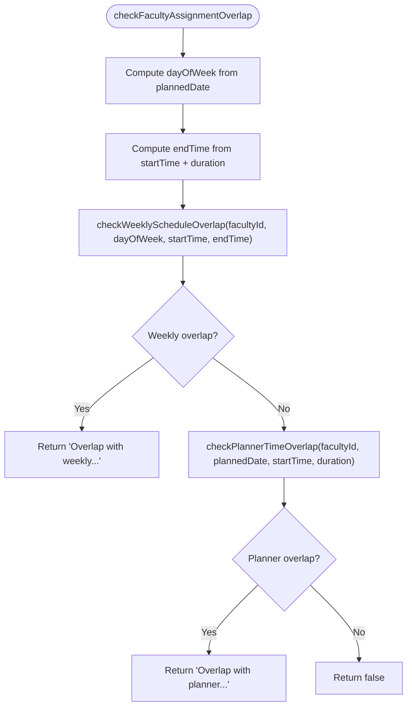
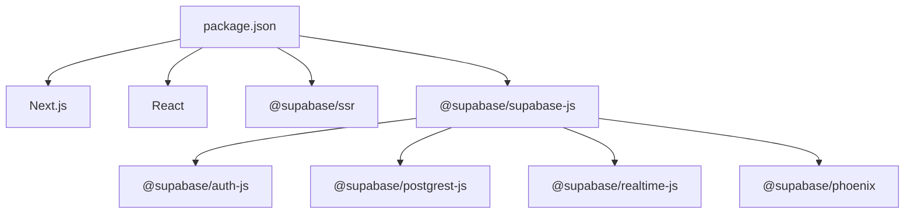

# Debugging & Troubleshooting

<cite>
**Referenced Files in This Document**
- [README.md](file://README.md)
- [package.json](file://package.json)
- [next.config.ts](file://next.config.ts)
- [app/layout.tsx](file://app/layout.tsx)
- [app/auth/callback/route.ts](file://app/auth/callback/route.ts)
- [app/login/LoginForm.tsx](file://app/login/LoginForm.tsx)
- [lib/supabase/server.ts](file://lib/supabase/server.ts)
- [lib/supabase/client.ts](file://lib/supabase/client.ts)
- [lib/auth.ts](file://lib/auth.ts)
- [lib/scheduling.ts](file://lib/scheduling.ts)
- [lib/utils.ts](file://lib/utils.ts)
- [lib/validation.ts](file://lib/validation.ts)
- [components/PortalShell.tsx](file://components/PortalShell.tsx)
- [scripts/db-introspect.js](file://scripts/db-introspect.js)
</cite>

## Table of Contents
1. Introduction
2. Project Structure
3. Core Components
4. Architecture Overview
5. Detailed Component Analysis
6. Dependency Analysis
7. Performance Considerations
8. Troubleshooting Guide
9. Conclusion
10. Appendices

## Introduction
This guide provides a comprehensive debugging and troubleshooting workflow for the Superclass Portal, focusing on:
- Authentication flows (magic link sign-in, role resolution, redirects)
- Scheduling conflicts (weekly recurring and one-off planner overlaps)
- Database queries and Supabase integrations
- API integrations and server-side routing
It also includes practical guidance for using browser developer tools, Node.js debugging, and Supabase debugging features, along with logging strategies, error monitoring, and performance profiling techniques.

## Project Structure
The project is a Next.js application that integrates with Supabase for authentication and data access. Key areas relevant to debugging include:
- Authentication UI and callback handling
- Server and client Supabase clients
- Utility functions for time overlap and validation
- Scheduling conflict checks
- Scripts for database introspection

**Diagram sources**
- [app/login/LoginForm.tsx:1-149](file://app/login/LoginForm.tsx#L1-L149)
- [app/auth/callback/route.ts:1-68](file://app/auth/callback/route.ts#L1-L68)
- [lib/supabase/server.ts:1-29](file://lib/supabase/server.ts#L1-L29)
- [lib/supabase/client.ts:1-8](file://lib/supabase/client.ts#L1-L8)
- [lib/auth.ts:1-69](file://lib/auth.ts#L1-L69)
- [lib/scheduling.ts:1-113](file://lib/scheduling.ts#L1-L113)
- [lib/utils.ts:1-74](file://lib/utils.ts#L1-L74)
- [lib/validation.ts:1-33](file://lib/validation.ts#L1-L33)
- [components/PortalShell.tsx:1-184](file://components/PortalShell.tsx#L1-L184)
- [scripts/db-introspect.js:1-55](file://scripts/db-introspect.js#L1-L55)

**Section sources**
- [README.md:1-37](file://README.md#L1-L37)
- [package.json:1-31](file://package.json#L1-L31)
- [next.config.ts:1-8](file://next.config.ts#L1-L8)
- [app/layout.tsx:1-34](file://app/layout.tsx#L1-L34)

## Core Components
- Authentication flow:
  - Login form validates email format, checks registration and active status via RPC, then sends magic link and redirects to callback.
  - Auth callback exchanges code for session, links auth identity to portal user, resolves roles, and redirects based on role or prompts for role selection.
- Supabase clients:
  - Server client uses cookies to maintain sessions on the server side.
  - Browser client initializes Supabase for client-side operations.
- Domain logic:
  - Auth helpers resolve app user by auth_id or email, compute centre IDs, and check roles.
  - Scheduling overlap checks validate weekly recurring schedules and one-off planners against faculty assignments.
- Utilities:
  - Time conversion and overlap detection utilities.
  - Date/time validation helpers.

**Section sources**
- [app/login/LoginForm.tsx:1-149](file://app/login/LoginForm.tsx#L1-L149)
- [app/auth/callback/route.ts:1-68](file://app/auth/callback/route.ts#L1-L68)
- [lib/supabase/server.ts:1-29](file://lib/supabase/server.ts#L1-L29)
- [lib/supabase/client.ts:1-8](file://lib/supabase/client.ts#L1-L8)
- [lib/auth.ts:1-69](file://lib/auth.ts#L1-L69)
- [lib/scheduling.ts:1-113](file://lib/scheduling.ts#L1-L113)
- [lib/utils.ts:1-74](file://lib/utils.ts#L1-L74)
- [lib/validation.ts:1-33](file://lib/validation.ts#L1-L33)

## Architecture Overview
The authentication and scheduling subsystems interact through Next.js routes and Supabase clients. The following sequence diagrams illustrate key flows.

**Diagram sources**
- [app/login/LoginForm.tsx:1-149](file://app/login/LoginForm.tsx#L1-L149)
- [app/auth/callback/route.ts:1-68](file://app/auth/callback/route.ts#L1-L68)
- [lib/supabase/client.ts:1-8](file://lib/supabase/client.ts#L1-L8)
- [lib/supabase/server.ts:1-29](file://lib/supabase/server.ts#L1-L29)

**Diagram sources**
- [lib/scheduling.ts:1-113](file://lib/scheduling.ts#L1-L113)
- [lib/utils.ts:1-74](file://lib/utils.ts#L1-L74)
- [lib/validation.ts:1-33](file://lib/validation.ts#L1-L33)

## Detailed Component Analysis

### Authentication Flow Debugging
Key behaviors to verify:
- Email validation and registration checks before sending magic link.
- Magic link redirect URL configuration.
- Session exchange and role resolution in the callback route.
- Role-based redirection and multi-role selection.

Common issues and diagnostics:
- Magic link not received or expired:
  - Verify email domain restrictions and rate limiting messages.
  - Confirm emailRedirectTo points to the correct callback path.
  - Inspect network requests for OTP send and callback exchange.
- Role resolution errors:
  - Ensure RPC link_auth_and_get_role returns expected fields.
  - Validate user_status and presence of user_role(s).
  - Check redirects when multiple roles exist.

Useful breakpoints and logs:
- Login form submission path and RPC responses.
- Auth callback session exchange and RPC results.
- Supabase client initialization and cookie handling on server.

**Section sources**
- [app/login/LoginForm.tsx:1-149](file://app/login/LoginForm.tsx#L1-L149)
- [app/auth/callback/route.ts:1-68](file://app/auth/callback/route.ts#L1-L68)
- [lib/supabase/client.ts:1-8](file://lib/supabase/client.ts#L1-L8)
- [lib/supabase/server.ts:1-29](file://lib/supabase/server.ts#L1-L29)

#### Authentication Sequence Diagram

**Diagram sources**
- [app/login/LoginForm.tsx:1-149](file://app/login/LoginForm.tsx#L1-L149)
- [app/auth/callback/route.ts:1-68](file://app/auth/callback/route.ts#L1-L68)
- [lib/supabase/client.ts:1-8](file://lib/supabase/client.ts#L1-L8)
- [lib/supabase/server.ts:1-29](file://lib/supabase/server.ts#L1-L29)

### Scheduling Conflict Debugging
Core responsibilities:
- Weekly recurring schedule overlap detection.
- One-off planner overlap detection.
- Combined assignment overlap check.

Common issues and diagnostics:
- Incorrect day-of-week mapping or time parsing.
- Duration calculation mismatches between minutes and time strings.
- Ignoring current record during updates (ignoreBatchId/ignorePlannerId).

Useful breakpoints and logs:
- Overlap function entry points and query parameters.
- Computed start/end times and overlap decisions.
- Batch names returned in error messages.

**Section sources**
- [lib/scheduling.ts:1-113](file://lib/scheduling.ts#L1-L113)
- [lib/utils.ts:1-74](file://lib/utils.ts#L1-L74)
- [lib/validation.ts:1-33](file://lib/validation.ts#L1-L33)

#### Scheduling Overlap Flowchart

**Diagram sources**
- [lib/scheduling.ts:1-113](file://lib/scheduling.ts#L1-L113)
- [lib/utils.ts:1-74](file://lib/utils.ts#L1-L74)
- [lib/validation.ts:1-33](file://lib/validation.ts#L1-L33)

### Database Queries and Supabase Integration
Focus areas:
- Server vs client Supabase client initialization.
- RPC calls for registration and role linking.
- Data fetching patterns for app users and centres.

Common issues and diagnostics:
- Missing environment variables for Supabase URL and keys.
- Cookie handling differences between server components and middleware.
- RPC permission or schema mismatches.

Useful breakpoints and logs:
- Supabase client creation and cookie store usage.
- RPC call inputs and outputs.
- Query result shapes and nullability.

**Section sources**
- [lib/supabase/server.ts:1-29](file://lib/supabase/server.ts#L1-L29)
- [lib/supabase/client.ts:1-8](file://lib/supabase/client.ts#L1-L8)
- [lib/auth.ts:1-69](file://lib/auth.ts#L1-L69)
- [scripts/db-introspect.js:1-55](file://scripts/db-introspect.js#L1-L55)

### API Integrations and Routing
Key integration points:
- Next.js App Router route for auth callback.
- Environment-driven Supabase client configuration.
- Role-based navigation and shell rendering.

Common issues and diagnostics:
- Incorrect redirect targets after authentication.
- Role label formatting and navigation items.
- Root layout metadata and font setup affecting SSR.

Useful breakpoints and logs:
- Route handler request parsing and response redirects.
- Environment variable values at runtime.
- Navigation state and active path highlighting.

**Section sources**
- [app/auth/callback/route.ts:1-68](file://app/auth/callback/route.ts#L1-L68)
- [app/layout.tsx:1-34](file://app/layout.tsx#L1-L34)
- [components/PortalShell.tsx:1-184](file://components/PortalShell.tsx#L1-L184)

## Dependency Analysis
External dependencies relevant to debugging:
- Supabase SDKs for authentication, PostgREST, Realtime, and Functions.
- Next.js framework and React runtime.

**Diagram sources**
- [package.json:1-31](file://package.json#L1-L31)

**Section sources**
- [package.json:1-31](file://package.json#L1-L31)

## Performance Considerations
- Minimize redundant RPC calls by caching user profile and roles where appropriate.
- Use efficient queries with selective field projection to reduce payload size.
- Avoid heavy computations on the client; leverage server-side checks for scheduling overlaps.
- Profile network requests to identify slow endpoints or large payloads.
- Monitor Supabase latency and consider connection pooling or retries for transient failures.

[No sources needed since this section provides general guidance]

## Troubleshooting Guide

### Using Browser Developer Tools
- Network tab:
  - Inspect OTP send and callback exchange requests.
  - Verify request payloads, headers, and response bodies.
  - Look for rate-limiting or CORS errors.
- Application tab:
  - Check cookies set by Supabase SSR client.
  - Inspect local storage/session storage if used.
- Console:
  - Capture JavaScript errors and warnings.
  - Add temporary console logs around critical paths (login, callback, scheduling checks).

### Node.js Debugging
- Run the development server with debugging enabled:
  - Use standard Node.js debug flags with your package manager’s dev script.
- Set breakpoints in:
  - Auth callback route handler.
  - Supabase server client initialization.
  - Scheduling overlap functions.
- Log environment variables:
  - Confirm NEXT_PUBLIC_SUPABASE_URL and NEXT_PUBLIC_SUPABASE_ANON_KEY are present.
  - For scripts requiring service role key, ensure SUPABASE_SERVICE_ROLE_KEY is set.

### Supabase Debugging Features
- Enable Supabase logs in the dashboard to inspect RPC execution and database queries.
- Use the SQL editor to validate schema and constraints referenced by the app.
- Test RPC functions directly with sample inputs to confirm behavior.
- Review Realtime subscriptions if applicable to understand event flows.

### Common Issues and Fixes

- Magic link problems:
  - Symptoms: Link expired, invalid, or not received.
  - Steps:
    - Verify email domain and address correctness.
    - Check rate-limit messages and retry after delay.
    - Confirm emailRedirectTo matches the deployed origin.
    - Inspect callback route for missing code or user email.
  - Section sources
    - [app/login/LoginForm.tsx:1-149](file://app/login/LoginForm.tsx#L1-L149)
    - [app/auth/callback/route.ts:1-68](file://app/auth/callback/route.ts#L1-L68)

- Role resolution errors:
  - Symptoms: Redirect loops, “no access”, or missing role display.
  - Steps:
    - Validate RPC link_auth_and_get_role output shape.
    - Ensure user_status is active and user_role(s) are populated.
    - Handle multi-role case by directing to role selection page.
  - Section sources
    - [app/auth/callback/route.ts:1-68](file://app/auth/callback/route.ts#L1-L68)
    - [lib/auth.ts:1-69](file://lib/auth.ts#L1-L69)

- Scheduling overlaps:
  - Symptoms: Conflicting classes or lectures assigned to the same faculty.
  - Steps:
    - Verify day-of-week computation and time parsing.
    - Confirm duration calculations and end time generation.
    - Ensure ignore parameters are passed correctly during updates.
  - Section sources
    - [lib/scheduling.ts:1-113](file://lib/scheduling.ts#L1-L113)
    - [lib/utils.ts:1-74](file://lib/utils.ts#L1-L74)
    - [lib/validation.ts:1-33](file://lib/validation.ts#L1-L33)

- Database query issues:
  - Symptoms: Null results, unexpected schema, or permission errors.
  - Steps:
    - Use db-introspect script to inspect columns and constraints.
    - Validate table names and column projections match schema.
    - Check service role permissions for admin scripts.
  - Section sources
    - [scripts/db-introspect.js:1-55](file://scripts/db-introspect.js#L1-L55)
    - [lib/supabase/server.ts:1-29](file://lib/supabase/server.ts#L1-L29)

### Logging Strategies
- Frontend:
  - Centralize error messages and map error codes to user-friendly text.
  - Log RPC call inputs and outputs with sensitive data redacted.
- Backend:
  - Log route handler entry/exit and key decision points.
  - Record Supabase client initialization and cookie handling outcomes.
- Structured logging:
  - Include timestamps, request IDs, and user context where safe.
  - Separate info, warn, and error levels for filtering.

### Error Monitoring
- Capture unhandled exceptions in route handlers and component lifecycles.
- Report critical errors to an external monitoring service with stack traces and context.
- Track user journeys (login, role selection, scheduling actions) to correlate errors with steps.

### Performance Profiling Techniques
- Use browser Performance tab to capture timelines for login and scheduling operations.
- Measure TTFB and network waterfall for Supabase requests.
- Profile server-side functions and database queries to identify bottlenecks.
- Instrument timing around overlap checks and RPC calls to quantify costs.

## Conclusion
By systematically validating authentication flows, scheduling conflict checks, and Supabase integrations—and by leveraging browser and Node.js debugging tools alongside Supabase logs—you can quickly diagnose and resolve common issues such as magic link failures, role resolution problems, and scheduling overlaps. Implement structured logging, error monitoring, and performance profiling to maintain reliability and responsiveness across the portal.

## Appendices

### Quick Reference: Key Paths and Responsibilities
- Authentication UI and flow:
  - [app/login/LoginForm.tsx:1-149](file://app/login/LoginForm.tsx#L1-L149)
  - [app/auth/callback/route.ts:1-68](file://app/auth/callback/route.ts#L1-L68)
- Supabase clients:
  - [lib/supabase/server.ts:1-29](file://lib/supabase/server.ts#L1-L29)
  - [lib/supabase/client.ts:1-8](file://lib/supabase/client.ts#L1-L8)
- Domain logic:
  - [lib/auth.ts:1-69](file://lib/auth.ts#L1-L69)
  - [lib/scheduling.ts:1-113](file://lib/scheduling.ts#L1-L113)
  - [lib/utils.ts:1-74](file://lib/utils.ts#L1-L74)
  - [lib/validation.ts:1-33](file://lib/validation.ts#L1-L33)
- UI shell and navigation:
  - [components/PortalShell.tsx:1-184](file://components/PortalShell.tsx#L1-L184)
- Database introspection:
  - [scripts/db-introspect.js:1-55](file://scripts/db-introspect.js#L1-L55)