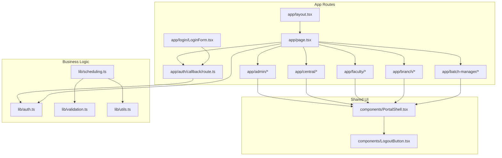
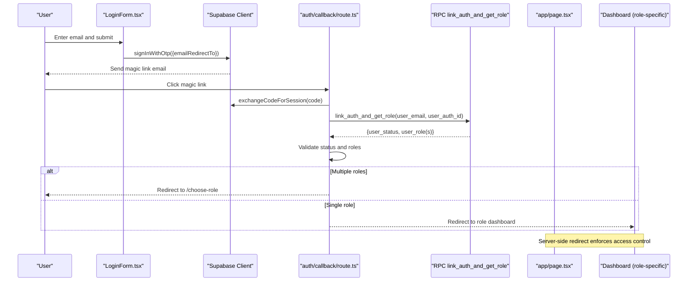
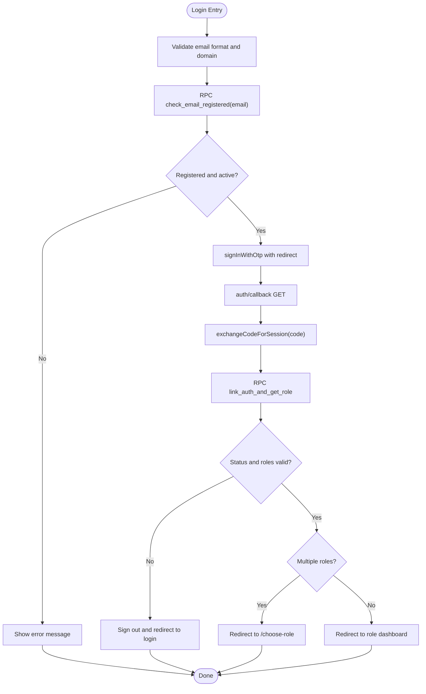
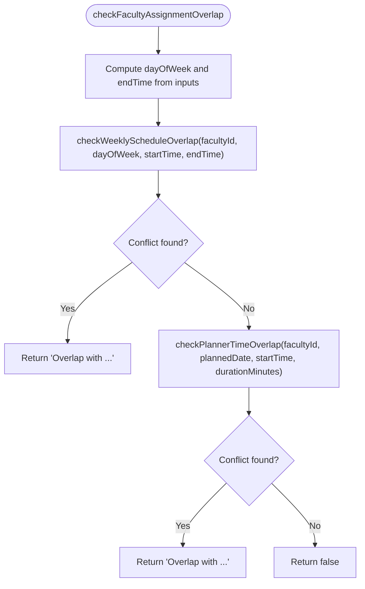
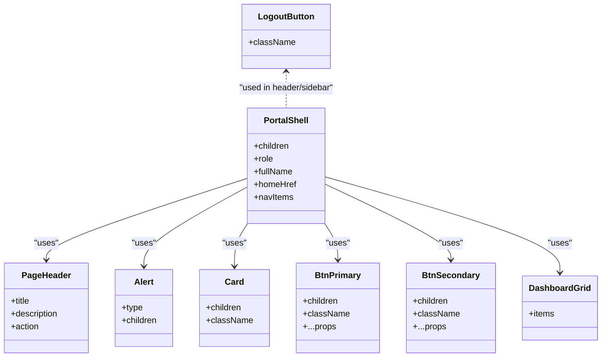
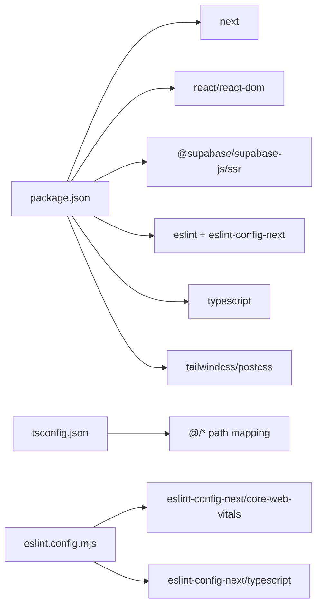

# Development Guide

<cite>
**Referenced Files in This Document**
- [package.json](file://package.json)
- [eslint.config.mjs](file://eslint.config.mjs)
- [tsconfig.json](file://tsconfig.json)
- [next.config.ts](file://next.config.ts)
- [README.md](file://README.md)
- [app/layout.tsx](file://app/layout.tsx)
- [app/page.tsx](file://app/page.tsx)
- [app/auth/callback/route.ts](file://app/auth/callback/route.ts)
- [app/login/LoginForm.tsx](file://app/login/LoginForm.tsx)
- [components/PortalShell.tsx](file://components/PortalShell.tsx)
- [components/LogoutButton.tsx](file://components/LogoutButton.tsx)
- [lib/auth.ts](file://lib/auth.ts)
- [lib/scheduling.ts](file://lib/scheduling.ts)
- [lib/validation.ts](file://lib/validation.ts)
- [lib/utils.ts](file://lib/utils.ts)
</cite>

## Table of Contents
1. Introduction
2. Project Structure
3. Core Components
4. Architecture Overview
5. Detailed Component Analysis
6. Dependency Analysis
7. Performance Considerations
8. Troubleshooting Guide
9. Conclusion
10. Appendices

## Introduction
This guide provides comprehensive development guidelines for contributing to the Superclass Portal. It covers coding standards using TypeScript and ESLint, component patterns aligned with the existing architecture, testing strategies for frontend components and business logic, debugging techniques, and operational guidance for adding user roles, extending the scheduling engine, and maintaining database schema changes. The document also includes examples of proper file organization, naming conventions, and code review practices.

## Project Structure
The project follows a Next.js App Router layout with role-based routing and shared UI primitives:
- app/: Route segments per role and feature (admin, central, faculty, branch, batch-manager), plus auth flows and login
- components/: Shared UI shell and utilities used across dashboards
- lib/: Business logic, validation helpers, scheduling algorithms, and Supabase client wrappers
- scripts/: Utility scripts for data import and DB introspection
- Root config files: package.json, eslint.config.mjs, tsconfig.json, next.config.ts

**Diagram sources**
- [app/layout.tsx:1-34](file://app/layout.tsx#L1-L34)
- [app/page.tsx:1-46](file://app/page.tsx#L1-L46)
- [app/auth/callback/route.ts:1-68](file://app/auth/callback/route.ts#L1-L68)
- [app/login/LoginForm.tsx:1-149](file://app/login/LoginForm.tsx#L1-L149)
- [components/PortalShell.tsx:1-184](file://components/PortalShell.tsx#L1-L184)
- [components/LogoutButton.tsx:1-24](file://components/LogoutButton.tsx#L1-L24)
- [lib/auth.ts:1-69](file://lib/auth.ts#L1-L69)
- [lib/scheduling.ts:1-113](file://lib/scheduling.ts#L1-L113)
- [lib/validation.ts:1-33](file://lib/validation.ts#L1-L33)
- [lib/utils.ts:1-74](file://lib/utils.ts#L1-L74)

**Section sources**
- [README.md:1-37](file://README.md#L1-L37)
- [package.json:1-31](file://package.json#L1-L31)

## Core Components
- Root layout and metadata: Defines global fonts and base HTML/body structure.
- Role-based landing page: Authenticates users via Supabase, resolves active roles, and redirects to the appropriate dashboard or role chooser.
- Auth callback route: Exchanges magic link code for a session, links auth identity to portal user, validates status and roles, and performs final redirect.
- Login form: Validates email domain, checks registration and activation via RPC, sends OTP magic link, and surfaces friendly error messages.
- Portal shell: Provides consistent sidebar navigation, header, and common UI primitives (Alert, Card, Buttons, DashboardGrid).
- Logout button: Signs out and refreshes navigation state.
- Authentication helpers: Fetches app user by auth_id or email, aggregates centre memberships, and checks roles.
- Scheduling engine: Overlap detection for recurring weekly schedules and one-off planners; composite check combining both.
- Validation and utils: Date/time parsing, range checks, time overlap math, CSV parsing, stage badge classes.

Key responsibilities and interactions are mapped in the diagrams below.

**Section sources**
- [app/layout.tsx:1-34](file://app/layout.tsx#L1-L34)
- [app/page.tsx:1-46](file://app/page.tsx#L1-L46)
- [app/auth/callback/route.ts:1-68](file://app/auth/callback/route.ts#L1-L68)
- [app/login/LoginForm.tsx:1-149](file://app/login/LoginForm.tsx#L1-L149)
- [components/PortalShell.tsx:1-184](file://components/PortalShell.tsx#L1-L184)
- [components/LogoutButton.tsx:1-24](file://components/LogoutButton.tsx#L1-L24)
- [lib/auth.ts:1-69](file://lib/auth.ts#L1-L69)
- [lib/scheduling.ts:1-113](file://lib/scheduling.ts#L1-L113)
- [lib/validation.ts:1-33](file://lib/validation.ts#L1-L33)
- [lib/utils.ts:1-74](file://lib/utils.ts#L1-L74)

## Architecture Overview
The application uses Next.js App Router with server-side redirects for authentication and role resolution. Magic link authentication is handled through Supabase, with an RPC call linking the auth identity to the portal user record. After successful authentication, the system determines the active role(s) and routes accordingly. Shared UI components encapsulate layout and common elements.

**Diagram sources**
- [app/login/LoginForm.tsx:1-149](file://app/login/LoginForm.tsx#L1-L149)
- [app/auth/callback/route.ts:1-68](file://app/auth/callback/route.ts#L1-L68)
- [app/page.tsx:1-46](file://app/page.tsx#L1-L46)

## Detailed Component Analysis

### Authentication and Authorization
- Magic link flow: Email validation, registration check, OTP send, callback session exchange, role resolution, and redirection.
- Role resolution: Supports single role and multi-role scenarios; redirects to role chooser when multiple roles exist.
- Access control: Inactive or unregistered accounts are blocked early; errors surfaced via query parameters.

**Diagram sources**
- [app/login/LoginForm.tsx:1-149](file://app/login/LoginForm.tsx#L1-L149)
- [app/auth/callback/route.ts:1-68](file://app/auth/callback/route.ts#L1-L68)

**Section sources**
- [app/login/LoginForm.tsx:1-149](file://app/login/LoginForm.tsx#L1-L149)
- [app/auth/callback/route.ts:1-68](file://app/auth/callback/route.ts#L1-L68)
- [app/page.tsx:1-46](file://app/page.tsx#L1-L46)
- [lib/auth.ts:1-69](file://lib/auth.ts#L1-L69)

### Scheduling Engine
- Weekly overlap: Queries recurring batch_schedules for a given day-of-week and time window; returns conflict details including batch name.
- Planner overlap: Checks one-off batch_planners on a specific date for time conflicts.
- Composite check: Combines weekly and planner checks to prevent any assignment conflicts.

**Diagram sources**
- [lib/scheduling.ts:1-113](file://lib/scheduling.ts#L1-L113)
- [lib/utils.ts:1-74](file://lib/utils.ts#L1-L74)
- [lib/validation.ts:1-33](file://lib/validation.ts#L1-L33)

**Section sources**
- [lib/scheduling.ts:1-113](file://lib/scheduling.ts#L1-L113)
- [lib/utils.ts:1-74](file://lib/utils.ts#L1-L74)
- [lib/validation.ts:1-33](file://lib/validation.ts#L1-L33)

### UI Shell and Shared Components
- PortalShell: Renders role-aware sidebar navigation, header, and main content area; exports reusable primitives like PageHeader, Alert, Card, buttons, and DashboardGrid.
- LogoutButton: Signs out and refreshes navigation state.

**Diagram sources**
- [components/PortalShell.tsx:1-184](file://components/PortalShell.tsx#L1-L184)
- [components/LogoutButton.tsx:1-24](file://components/LogoutButton.tsx#L1-L24)

**Section sources**
- [components/PortalShell.tsx:1-184](file://components/PortalShell.tsx#L1-L184)
- [components/LogoutButton.tsx:1-24](file://components/LogoutButton.tsx#L1-L24)

## Dependency Analysis
- Runtime dependencies include Next.js, React, and Supabase clients.
- Dev dependencies include ESLint with Next.js presets, Tailwind CSS v4, and TypeScript.
- Path aliasing configured to resolve @/* to repository root.
- ESLint configuration extends Next.js web vitals and TypeScript rules, with custom ignores for build artifacts.

**Diagram sources**
- [package.json:1-31](file://package.json#L1-L31)
- [tsconfig.json:1-35](file://tsconfig.json#L1-L35)
- [eslint.config.mjs:1-19](file://eslint.config.mjs#L1-L19)

**Section sources**
- [package.json:1-31](file://package.json#L1-L31)
- [tsconfig.json:1-35](file://tsconfig.json#L1-L35)
- [eslint.config.mjs:1-19](file://eslint.config.mjs#L1-L19)
- [next.config.ts:1-8](file://next.config.ts#L1-L8)

## Performance Considerations
- Prefer server-side redirects for authentication and role resolution to minimize client-side work and reduce re-renders.
- Use minimal queries and selective field selection when fetching user and schedule data.
- Avoid heavy computations in render paths; move logic into lib functions and memoize where necessary.
- Keep Tailwind usage consistent to leverage build-time optimizations.
- For scheduling checks, ensure database indexes exist on frequently filtered columns (e.g., faculty_id, day_of_week, planned_date).

[No sources needed since this section provides general guidance]

## Troubleshooting Guide
Common issues and how to diagnose them:
- Magic link not received or expired: Verify email domain validation and rate limiting messages; confirm emailRedirectTo points to /auth/callback.
- Not registered or inactive account: Ensure RPCs return expected results and that user records have correct status and roles.
- Multiple roles present: Confirm role chooser route exists and that role mappings are updated consistently in both callback and landing page.
- Scheduling conflicts not detected: Validate time parsing and overlap logic; ensure day-of-week calculation matches intended timezone behavior.
- Build or lint errors: Run linter locally and fix reported issues before committing.

Operational tips:
- Use browser dev tools Network tab to inspect auth callbacks and RPC calls.
- Add temporary console logs around critical decision points (e.g., role resolution, overlap checks).
- Test edge cases such as empty roles arrays, missing fields, and invalid dates/times.

**Section sources**
- [app/login/LoginForm.tsx:1-149](file://app/login/LoginForm.tsx#L1-L149)
- [app/auth/callback/route.ts:1-68](file://app/auth/callback/route.ts#L1-L68)
- [lib/scheduling.ts:1-113](file://lib/scheduling.ts#L1-L113)

## Conclusion
This guide outlines the development standards, architectural patterns, and operational procedures for contributing effectively to the Superclass Portal. By adhering to the TypeScript and ESLint configurations, following the established component patterns, implementing robust tests, and applying the troubleshooting strategies, contributors can maintain consistency, reliability, and performance across the application.

[No sources needed since this section summarizes without analyzing specific files]

## Appendices

### Coding Standards and ESLint Configuration
- Enforce strict TypeScript settings and JSX transform as configured.
- Use Next.js ESLint presets for web vitals and TypeScript compatibility.
- Respect path aliases (@/*) for imports.
- Run linter locally before pushing changes.

**Section sources**
- [tsconfig.json:1-35](file://tsconfig.json#L1-L35)
- [eslint.config.mjs:1-19](file://eslint.config.mjs#L1-L19)

### Component Development Patterns
- Place shared UI in components/ and export small, focused primitives.
- Use the PortalShell for consistent layouts and navigation across role dashboards.
- Keep client-only components marked with 'use client'.
- Prefer props-driven customization and avoid inline styles; use Tailwind utility classes.

**Section sources**
- [components/PortalShell.tsx:1-184](file://components/PortalShell.tsx#L1-L184)
- [components/LogoutButton.tsx:1-24](file://components/LogoutButton.tsx#L1-L24)

### Testing Strategies
- Frontend components:
  - Render components in isolation using a test harness.
  - Assert UI states (loading, success, error) and user interactions (click handlers).
  - Mock Supabase client methods for network-dependent components.
- Business logic:
  - Unit-test scheduling overlap functions with boundary conditions (adjacent times, same start/end).
  - Validate date/time parsing and range checks with invalid inputs.
  - Simulate RPC responses for auth flows and verify redirect outcomes.

[No sources needed since this section provides general guidance]

### Debugging Techniques
- Inspect auth callback URL parameters for error codes and map them to user-friendly messages.
- Log key variables during role resolution and scheduling checks to identify mismatches.
- Use browser dev tools to validate cookies and session state after sign-in/sign-out.

**Section sources**
- [app/login/LoginForm.tsx:1-149](file://app/login/LoginForm.tsx#L1-L149)
- [app/auth/callback/route.ts:1-68](file://app/auth/callback/route.ts#L1-L68)

### Adding New User Roles
- Update role mappings in the landing page and callback route to include the new role and its dashboard path.
- Extend role label formatting if needed in the UI shell.
- Ensure database schema supports the new role value and that RPCs return it correctly.
- Add corresponding route segment under app/ for the new role’s dashboard.

**Section sources**
- [app/page.tsx:1-46](file://app/page.tsx#L1-L46)
- [app/auth/callback/route.ts:1-68](file://app/auth/callback/route.ts#L1-L68)
- [components/PortalShell.tsx:1-184](file://components/PortalShell.tsx#L1-L184)

### Extending the Scheduling Engine
- Implement additional overlap checks in lib/scheduling.ts and compose them in the master check function.
- Reuse time conversion and overlap utilities from lib/utils.ts and lib/validation.ts.
- Ensure database queries select only required fields and filter efficiently.
- Add unit tests covering new conflict scenarios and edge cases.

**Section sources**
- [lib/scheduling.ts:1-113](file://lib/scheduling.ts#L1-L113)
- [lib/utils.ts:1-74](file://lib/utils.ts#L1-L74)
- [lib/validation.ts:1-33](file://lib/validation.ts#L1-L33)

### Maintaining Database Schema Changes
- Use provided scripts for introspection and data import to keep local environments in sync.
- Align Supabase RPCs and queries with the latest schema.
- Document schema changes and their impact on auth and scheduling modules.
- Validate migrations against sample datasets before deployment.

**Section sources**
- [package.json:1-31](file://package.json#L1-L31)

### File Organization and Naming Conventions
- Feature pages under app/<feature>/<page>.tsx; layouts at app/<feature>/layout.tsx.
- Shared UI components under components/*.tsx with descriptive names.
- Business logic under lib/*.ts with clear module boundaries (auth, scheduling, validation, utils).
- Use kebab-case for directories and PascalCase for components and types.

**Section sources**
- [app/layout.tsx:1-34](file://app/layout.tsx#L1-L34)
- [components/PortalShell.tsx:1-184](file://components/PortalShell.tsx#L1-L184)
- [lib/auth.ts:1-69](file://lib/auth.ts#L1-L69)
- [lib/scheduling.ts:1-113](file://lib/scheduling.ts#L1-L113)

### Code Review Practices
- Verify adherence to ESLint and TypeScript rules.
- Ensure authentication and authorization paths are secure and handle all error cases.
- Confirm scheduling logic handles overlapping intervals and timezone considerations.
- Check for consistent UI patterns and accessibility attributes in components.
- Validate that new features include tests and documentation updates.

[No sources needed since this section provides general guidance]