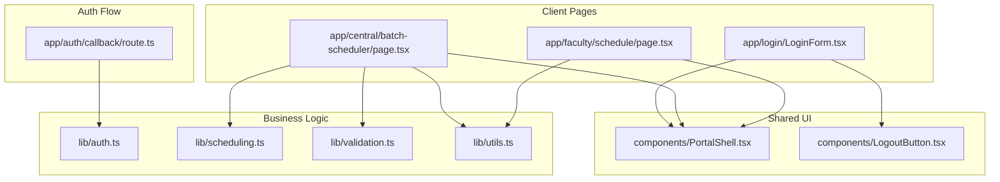
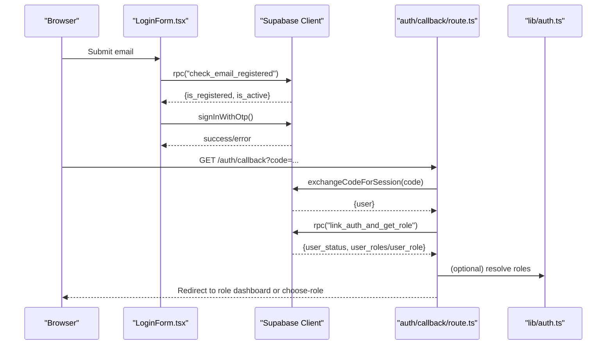
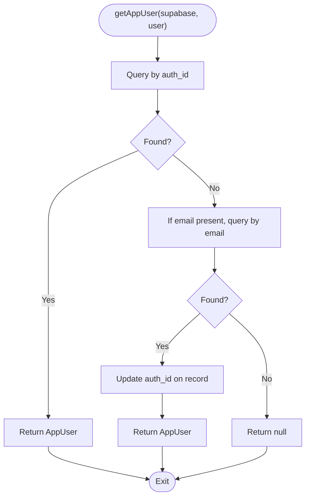
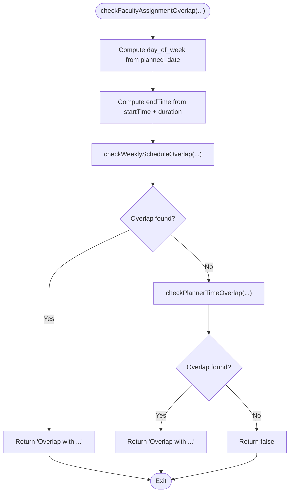
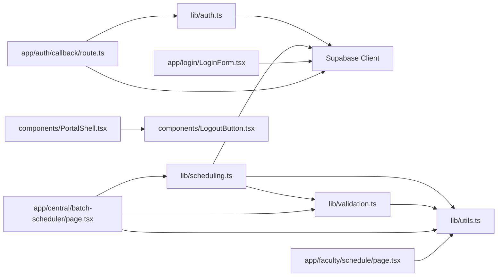

# Testing Strategy & Implementation

<cite>
**Referenced Files in This Document**
- [README.md](file://README.md)
- [package.json](file://package.json)
- [lib/auth.ts](file://lib/auth.ts)
- [lib/scheduling.ts](file://lib/scheduling.ts)
- [lib/validation.ts](file://lib/validation.ts)
- [lib/utils.ts](file://lib/utils.ts)
- [app/auth/callback/route.ts](file://app/auth/callback/route.ts)
- [components/PortalShell.tsx](file://components/PortalShell.tsx)
- [components/LogoutButton.tsx](file://components/LogoutButton.tsx)
- [app/login/LoginForm.tsx](file://app/login/LoginForm.tsx)
- [app/central/batch-scheduler/page.tsx](file://app/central/batch-scheduler/page.tsx)
- [app/faculty/schedule/page.tsx](file://app/faculty/schedule/page.tsx)
</cite>

## Table of Contents
1. Introduction
2. Project Structure
3. Core Components
4. Architecture Overview
5. Detailed Component Analysis
6. Dependency Analysis
7. Performance Considerations
8. Troubleshooting Guide
9. Conclusion

## Introduction
This document defines a comprehensive testing strategy for the Superclass Portal, covering unit tests for business logic (authentication helpers, scheduling engine, validation utilities), integration tests for Supabase interactions, component tests for React components, and end-to-end workflows. It includes setup guidance, mocking strategies for external dependencies, test data management, and best practices for role-based functionality and time-sensitive operations.

## Project Structure
The project is a Next.js application with:
- Client-side pages under app/
- Shared UI components under components/
- Business logic and utilities under lib/
- Server route handling authentication callback under app/auth/callback/route.ts

**Diagram sources**
- [app/login/LoginForm.tsx](file://app/login/LoginForm.tsx)
- [app/central/batch-scheduler/page.tsx](file://app/central/batch-scheduler/page.tsx)
- [app/faculty/schedule/page.tsx](file://app/faculty/schedule/page.tsx)
- [components/PortalShell.tsx](file://components/PortalShell.tsx)
- [components/LogoutButton.tsx](file://components/LogoutButton.tsx)
- [lib/auth.ts](file://lib/auth.ts)
- [lib/scheduling.ts](file://lib/scheduling.ts)
- [lib/validation.ts](file://lib/validation.ts)
- [lib/utils.ts](file://lib/utils.ts)
- [app/auth/callback/route.ts](file://app/auth/callback/route.ts)

**Section sources**
- [README.md](file://README.md)
- [package.json](file://package.json)

## Core Components
This section outlines what to test and how to structure tests for each core module.

- Authentication helpers (lib/auth.ts)
  - Test getAppUser behavior for auth_id and email fallback paths, including auto-linking update path.
  - Test getUserCentreIds for both user_centres array and legacy centre_id fallback.
  - Test hasRole for roles array vs single role field.
  - Mock Supabase client methods used by these functions.

- Scheduling engine (lib/scheduling.ts)
  - Test checkWeeklyScheduleOverlap for multiple rows, ignoreBatchId exclusion, and overlap detection using timesOverlap.
  - Test checkPlannerTimeOverlap for one-off planner conflicts on a specific date.
  - Test checkFacultyAssignmentOverlap combining weekly and planner checks, including day-of-week computation and endTime conversion via minutesToTimeString.
  - Mock Supabase queries and use deterministic inputs for time calculations.

- Validation utilities (lib/validation.ts)
  - Test parsePlannedDate for valid YYYY-MM-DD strings and invalid formats.
  - Test isDateInRange boundaries and edge cases at midnight.
  - Test validateBatchDates and validateTimeRange for required fields and ordering constraints.
  - Test minutesToTimeString for boundary values across hours and minutes.

- Utilities (lib/utils.ts)
  - Test toMinutes parsing and timesOverlap logic with various intervals.
  - Test formatTime formatting behavior and null handling.
  - Test stageBadgeClass mapping for all stages.
  - Test parseCSV for quoted fields and empty lines.

- Auth callback server route (app/auth/callback/route.ts)
  - Test code exchange success and failure flows.
  - Test link_auth_and_get_role RPC outcomes: inactive users, no roles, multiple roles redirect, single role redirect.
  - Mock Supabase server client and NextResponse redirects.

- Login form (app/login/LoginForm.tsx)
  - Test session check on mount and redirection if already logged in.
  - Test email validation, RPC check_email_registered responses, OTP send flow, and error messages.
  - Mock Supabase client and Next.js navigation hooks.

- Faculty schedule page (app/faculty/schedule/page.tsx)
  - Test fetching current user, loading batch_schedules and batch_planners, and updating planner stage.
  - Mock Supabase client and React state updates.

- Batch scheduler page (app/central/batch-scheduler/page.tsx)
  - Test initial data load, form validations, local overlap checks, and calls to checkWeeklyScheduleOverlap.
  - Mock Supabase client and scheduling/validation utilities as needed.

**Section sources**
- [lib/auth.ts](file://lib/auth.ts)
- [lib/scheduling.ts](file://lib/scheduling.ts)
- [lib/validation.ts](file://lib/validation.ts)
- [lib/utils.ts](file://lib/utils.ts)
- [app/auth/callback/route.ts](file://app/auth/callback/route.ts)
- [app/login/LoginForm.tsx](file://app/login/LoginForm.tsx)
- [app/faculty/schedule/page.tsx](file://app/faculty/schedule/page.tsx)
- [app/central/batch-scheduler/page.tsx](file://app/central/batch-scheduler/page.tsx)

## Architecture Overview
The following diagram maps key runtime interactions relevant to testing:

**Diagram sources**
- [app/login/LoginForm.tsx](file://app/login/LoginForm.tsx)
- [app/auth/callback/route.ts](file://app/auth/callback/route.ts)
- [lib/auth.ts](file://lib/auth.ts)

## Detailed Component Analysis

### Unit Testing: Authentication Helpers (lib/auth.ts)
Focus areas:
- User lookup by auth_id and email fallback
- Auto-linking update path
- Centre ID extraction from user_centres or legacy field
- Role checking with roles array vs single role

Recommended approach:
- Create a mock Supabase client that returns controlled results for .from('app_users').select(...).eq(...).maybeSingle() and .update(...)
- Assert returned AppUser shape and side effects (e.g., update call)
- For getUserCentreIds, assert correct mapping from user_centres and fallback behaviour
- For hasRole, assert boolean result for both roles array and single role scenarios

**Diagram sources**
- [lib/auth.ts](file://lib/auth.ts)

**Section sources**
- [lib/auth.ts](file://lib/auth.ts)

### Unit Testing: Scheduling Engine (lib/scheduling.ts)
Focus areas:
- Weekly overlap detection against existing batch_schedules
- One-off planner overlap detection against batch_planners
- Combined assignment overlap check integrating day-of-week calculation and time conversions

Recommended approach:
- Mock Supabase client to return deterministic sets of schedules/planners
- Use fixed dates and times to control day-of-week and minute arithmetic
- Validate that ignoreBatchId and ignorePlannerId parameters exclude intended records
- Ensure error messages include batch names via batchName helper

**Diagram sources**
- [lib/scheduling.ts](file://lib/scheduling.ts)
- [lib/utils.ts](file://lib/utils.ts)
- [lib/validation.ts](file://lib/validation.ts)

**Section sources**
- [lib/scheduling.ts](file://lib/scheduling.ts)
- [lib/utils.ts](file://lib/utils.ts)
- [lib/validation.ts](file://lib/validation.ts)

### Unit Testing: Validation Utilities (lib/validation.ts)
Focus areas:
- Date parsing and range checks
- Time range validation
- Minutes-to-time conversion

Recommended approach:
- Provide arrays of valid and invalid inputs for parsePlannedDate and assert outputs
- Boundary tests for isDateInRange around midnight and inclusive endpoints
- Edge cases for validateBatchDates and validateTimeRange with missing or equal values
- minutesToTimeString across hour rollovers and zero-minute cases

**Section sources**
- [lib/validation.ts](file://lib/validation.ts)

### Unit Testing: Utilities (lib/utils.ts)
Focus areas:
- toMinutes and timesOverlap correctness
- formatTime formatting and null handling
- stageBadgeClass mapping completeness
- parseCSV robustness with quoted fields

Recommended approach:
- Generate interval pairs that touch, abut, fully contain, and partially overlap to verify timesOverlap
- Verify formatTime output for known HH:mm inputs
- Confirm stageBadgeClass returns expected classes for all PLANNER_STAGES
- Feed CSV samples with quotes and commas to parseCSV and assert row counts and cell values

**Section sources**
- [lib/utils.ts](file://lib/utils.ts)

### Integration Testing: Supabase Interactions
Patterns:
- Use a test database or an isolated Supabase project for integration tests
- Seed deterministic fixtures for batches, programmes, centres, faculty, managers, user_centres, batch_schedules, and batch_planners
- Wrap Supabase client creation in a factory to inject environment-specific clients
- For server routes, mock NextResponse and Supabase server client; for client pages, mock Supabase client

Key flows to cover:
- Auth callback route: successful code exchange, linking RPC, role resolution, and redirects
- Batch scheduler page: create/update batch and batch_schedules, with overlap checks
- Faculty schedule page: read schedules and planners, update planner stage

**Section sources**
- [app/auth/callback/route.ts](file://app/auth/callback/route.ts)
- [app/central/batch-scheduler/page.tsx](file://app/central/batch-scheduler/page.tsx)
- [app/faculty/schedule/page.tsx](file://app/faculty/schedule/page.tsx)

### Component Testing: React Components
Strategies:
- Use a React testing library to render components in isolation
- Mock Supabase client and Next.js hooks (useRouter, useSearchParams, usePathname)
- For PortalShell and LogoutButton, assert navigation and UI states
- For login form, simulate form submission and verify message rendering and redirections
- For batch scheduler and faculty schedule pages, mock data fetches and assert rendered lists and actions

Best practices:
- Keep component tests focused on UI behavior and user interactions
- Avoid network calls; always mock Supabase client
- Use stable selectors or accessible labels for assertions

**Section sources**
- [components/PortalShell.tsx](file://components/PortalShell.tsx)
- [components/LogoutButton.tsx](file://components/LogoutButton.tsx)
- [app/login/LoginForm.tsx](file://app/login/LoginForm.tsx)
- [app/central/batch-scheduler/page.tsx](file://app/central/batch-scheduler/page.tsx)
- [app/faculty/schedule/page.tsx](file://app/faculty/schedule/page.tsx)

### End-to-End Testing Workflows
Approach:
- Use a browser automation tool to drive full flows: login via magic link, role selection, and navigating to dashboards
- Prepare test accounts and pre-seeded data in the test Supabase instance
- Simulate email delivery or bypass OTP by directly accessing /auth/callback with a valid code in CI
- Assert role-based routing and presence of key UI elements per role

Coverage:
- Successful login and redirect to appropriate role dashboard
- Multiple roles leading to choose-role flow
- Inactive or unregistered account errors
- Session persistence and logout behavior

[No sources needed since this section provides general workflow guidance]

### Test Setup and Configuration
Recommendations:
- Add a testing framework and React testing utilities to devDependencies
- Configure environment variables for Supabase URL and anon key pointing to a test instance
- Provide a script to seed test data into the test database before running integration tests
- Centralize mocks for Supabase client and Next.js modules to reduce duplication

**Section sources**
- [package.json](file://package.json)

### Mocking Strategies for External Dependencies
- Supabase client/server: provide a thin wrapper or factory to inject mock implementations returning controlled promises
- Next.js navigation and router: stub useRouter, useSearchParams, usePathname with desired behaviors
- Time-sensitive logic: freeze or fake timers when validating time windows and day-of-week computations
- RPC calls: mock RPC methods like check_email_registered and link_auth_and_get_role with deterministic payloads

**Section sources**
- [app/login/LoginForm.tsx](file://app/login/LoginForm.tsx)
- [app/auth/callback/route.ts](file://app/auth/callback/route.ts)

### Test Data Management
- Define fixture factories for entities such as batches, programmes, centres, faculty, managers, user_centres, batch_schedules, and batch_planners
- Use unique identifiers per test run to avoid collisions
- Reset or truncate tables between tests to ensure isolation
- Maintain small, focused datasets that exercise critical paths without unnecessary complexity

[No sources needed since this section provides general guidance]

### Best Practices for Role-Based Functionality
- Explicitly test role resolution in the auth callback route for single role, multiple roles, and no roles
- Validate that roleLabel formatting and navigation items are correct for each role
- Ensure that role checks in components and pages behave correctly with roles array vs single role field

**Section sources**
- [app/auth/callback/route.ts](file://app/auth/callback/route.ts)
- [components/PortalShell.tsx](file://components/PortalShell.tsx)
- [lib/auth.ts](file://lib/auth.ts)

### Best Practices for Time-Sensitive Operations
- Freeze system time or use deterministic inputs for overlap checks and day-of-week calculations
- Cover edge cases around midnight, DST transitions (if applicable), and exact boundary overlaps
- Validate minutes arithmetic and string formatting conversions consistently

**Section sources**
- [lib/scheduling.ts](file://lib/scheduling.ts)
- [lib/utils.ts](file://lib/utils.ts)
- [lib/validation.ts](file://lib/validation.ts)

## Dependency Analysis
The following diagram highlights key dependencies among modules relevant to testing:

**Diagram sources**
- [lib/auth.ts](file://lib/auth.ts)
- [lib/scheduling.ts](file://lib/scheduling.ts)
- [lib/validation.ts](file://lib/validation.ts)
- [lib/utils.ts](file://lib/utils.ts)
- [app/login/LoginForm.tsx](file://app/login/LoginForm.tsx)
- [app/auth/callback/route.ts](file://app/auth/callback/route.ts)
- [app/central/batch-scheduler/page.tsx](file://app/central/batch-scheduler/page.tsx)
- [app/faculty/schedule/page.tsx](file://app/faculty/schedule/page.tsx)
- [components/PortalShell.tsx](file://components/PortalShell.tsx)
- [components/LogoutButton.tsx](file://components/LogoutButton.tsx)

**Section sources**
- [lib/auth.ts](file://lib/auth.ts)
- [lib/scheduling.ts](file://lib/scheduling.ts)
- [lib/validation.ts](file://lib/validation.ts)
- [lib/utils.ts](file://lib/utils.ts)
- [app/login/LoginForm.tsx](file://app/login/LoginForm.tsx)
- [app/auth/callback/route.ts](file://app/auth/callback/route.ts)
- [app/central/batch-scheduler/page.tsx](file://app/central/batch-scheduler/page.tsx)
- [app/faculty/schedule/page.tsx](file://app/faculty/schedule/page.tsx)
- [components/PortalShell.tsx](file://components/PortalShell.tsx)
- [components/LogoutButton.tsx](file://components/LogoutButton.tsx)

## Performance Considerations
- Prefer deterministic, minimal datasets in unit and integration tests to keep runs fast
- Avoid real network calls in component tests; rely on mocks
- For overlap checks, limit the number of rows in mocked responses to realistic sizes
- Use parallelizable test suites where possible and isolate shared state

[No sources needed since this section provides general guidance]

## Troubleshooting Guide
Common issues and resolutions:
- Supabase client not initialized in tests: ensure a consistent factory provides a mock client with required methods
- Next.js hooks undefined in component tests: stub useRouter, useSearchParams, usePathname appropriately
- Time-related flakiness: freeze timers or pass explicit timestamps to avoid reliance on system clock
- Role resolution mismatches: verify both roles array and single role field handling in tests
- Overlap detection inconsistencies: confirm day-of-week computation and time conversion functions are tested with boundary cases

**Section sources**
- [app/login/LoginForm.tsx](file://app/login/LoginForm.tsx)
- [app/auth/callback/route.ts](file://app/auth/callback/route.ts)
- [lib/scheduling.ts](file://lib/scheduling.ts)
- [lib/utils.ts](file://lib/utils.ts)
- [lib/validation.ts](file://lib/validation.ts)

## Conclusion
This testing strategy ensures robust coverage across business logic, integrations, components, and end-to-end flows. By isolating external dependencies, managing test data carefully, and focusing on role-based and time-sensitive edge cases, the Superclass Portal can maintain high reliability and confidence in its scheduling and authentication features.