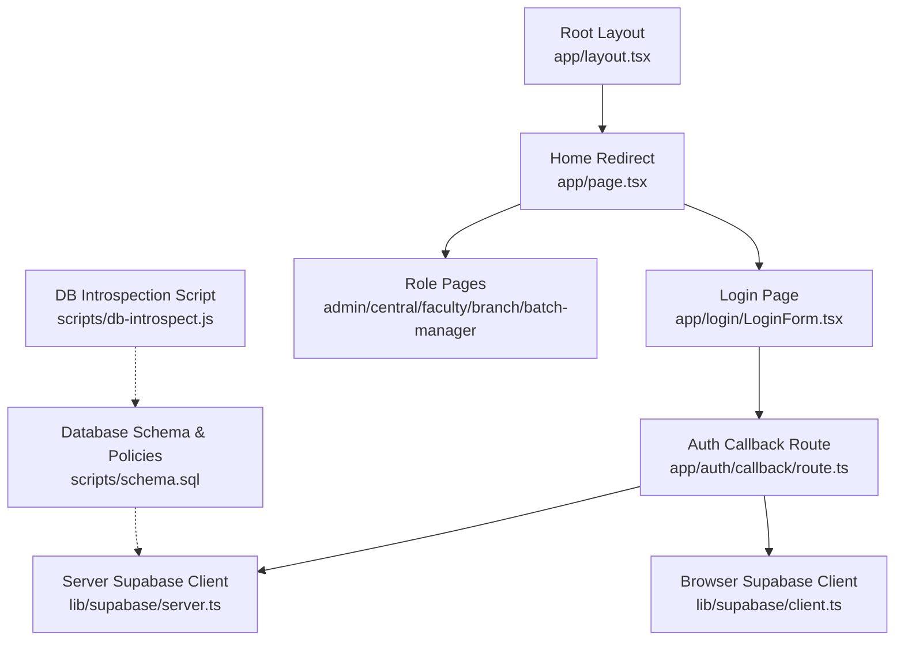
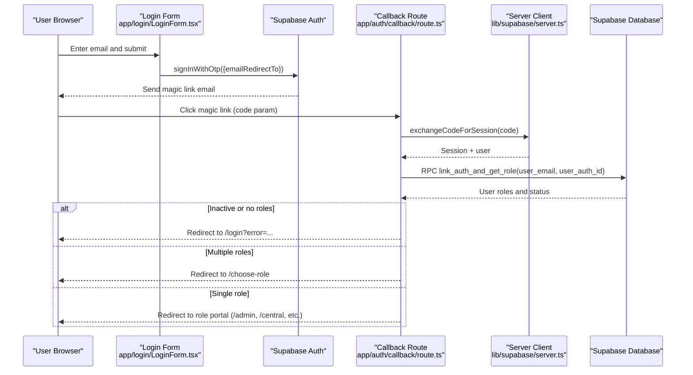
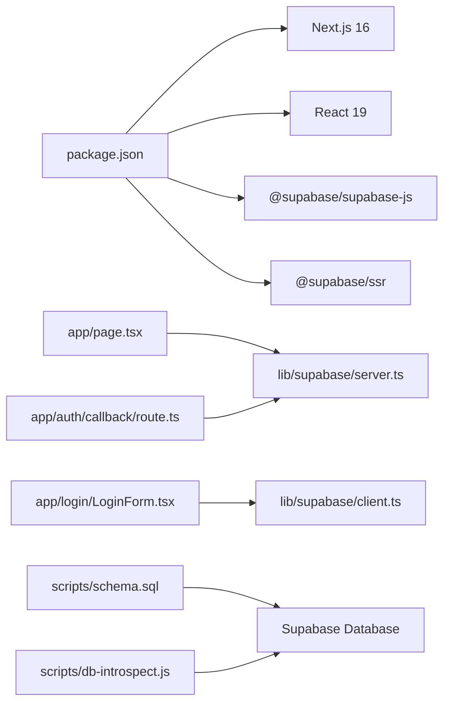

# Getting Started

<cite>
**Referenced Files in This Document**
- [README.md](file://README.md)
- [package.json](file://package.json)
- [next.config.ts](file://next.config.ts)
- [app/layout.tsx](file://app/layout.tsx)
- [app/page.tsx](file://app/page.tsx)
- [app/login/LoginForm.tsx](file://app/login/LoginForm.tsx)
- [app/auth/callback/route.ts](file://app/auth/callback/route.ts)
- [lib/supabase/server.ts](file://lib/supabase/server.ts)
- [lib/supabase/client.ts](file://lib/supabase/client.ts)
- [scripts/schema.sql](file://scripts/schema.sql)
- [scripts/db-introspect.js](file://scripts/db-introspect.js)
</cite>

## Table of Contents
1. Introduction
2. Project Structure
3. Core Components
4. Architecture Overview
5. Detailed Component Analysis
6. Dependency Analysis
7. Performance Considerations
8. Troubleshooting Guide
9. Conclusion

## Introduction
Superclass Portal is a multi-role academic management system built with Next.js and Supabase. It supports multiple user roles (Admin, Central Team, Faculty, Branch Head, Batch Manager) and provides role-based dashboards for managing centres, programs, faculty, batches, schedules, and audit logs. The platform uses magic link authentication and server-side routing to direct users to the correct portal based on their assigned roles.

This guide helps first-time users set up the local development environment, configure database access via Supabase, start the development server, create an initial admin account, and navigate the basic interfaces.

Prerequisite knowledge:
- React fundamentals (components, hooks, client vs server components)
- TypeScript basics (types, interfaces, strict mode)
- Next.js App Router (routing, server components, API routes)
- Basic understanding of Supabase (project setup, SQL editor, service role key)

## Project Structure
The application follows the Next.js App Router structure with feature folders per role and shared libraries for Supabase clients and utilities.

**Diagram sources**
- [app/layout.tsx:1-34](file://app/layout.tsx#L1-L34)
- [app/page.tsx:1-46](file://app/page.tsx#L1-L46)
- [app/login/LoginForm.tsx:1-149](file://app/login/LoginForm.tsx#L1-L149)
- [app/auth/callback/route.ts:1-68](file://app/auth/callback/route.ts#L1-L68)
- [lib/supabase/server.ts:1-29](file://lib/supabase/server.ts#L1-L29)
- [lib/supabase/client.ts:1-8](file://lib/supabase/client.ts#L1-L8)
- [scripts/schema.sql:1-269](file://scripts/schema.sql#L1-L269)
- [scripts/db-introspect.js:1-40](file://scripts/db-introspect.js#L1-L40)

**Section sources**
- [README.md:1-37](file://README.md#L1-L37)
- [package.json:1-31](file://package.json#L1-L31)
- [next.config.ts:1-8](file://next.config.ts#L1-L8)
- [app/layout.tsx:1-34](file://app/layout.tsx#L1-L34)
- [app/page.tsx:1-46](file://app/page.tsx#L1-L46)

## Core Components
- Authentication flow: Magic link login via Supabase Auth, callback route validates session and maps user roles to portals.
- Role-based routing: Home page checks user roles and redirects to the appropriate portal or role selection page.
- Supabase clients: Separate browser and server clients configured with environment variables.
- Database schema: Comprehensive schema including users, centres, programs, subjects, batches, schedules, planners, and audit log with RLS policies.

Key responsibilities:
- app/page.tsx: Authenticates user, resolves active roles, and redirects accordingly.
- app/auth/callback/route.ts: Exchanges auth code for session, links auth identity to app user, enforces status and role checks, and redirects.
- lib/supabase/server.ts and client.ts: Provide typed Supabase clients using environment variables.
- scripts/schema.sql: Defines tables, functions, and RLS policies required by the application.

**Section sources**
- [app/page.tsx:1-46](file://app/page.tsx#L1-L46)
- [app/auth/callback/route.ts:1-68](file://app/auth/callback/route.ts#L1-L68)
- [lib/supabase/server.ts:1-29](file://lib/supabase/server.ts#L1-L29)
- [lib/supabase/client.ts:1-8](file://lib/supabase/client.ts#L1-L8)
- [scripts/schema.sql:1-269](file://scripts/schema.sql#L1-L269)

## Architecture Overview
The Superclass Portal architecture centers around Next.js server components and API routes interacting with Supabase for authentication and data.

**Diagram sources**
- [app/login/LoginForm.tsx:1-149](file://app/login/LoginForm.tsx#L1-L149)
- [app/auth/callback/route.ts:1-68](file://app/auth/callback/route.ts#L1-L68)
- [lib/supabase/server.ts:1-29](file://lib/supabase/server.ts#L1-L29)

## Detailed Component Analysis

### Environment Setup and Installation
- Install dependencies and run the dev server using your preferred package manager.
- Ensure Node.js is installed (compatible with Next.js 16).
- Create a Supabase project and enable Email OTP with redirect URL pointing to your local callback route.
- Configure environment variables for Supabase URL and anon key; use service role key for scripts.

Steps:
1. Clone the repository and install dependencies.
2. Start the development server.
3. Open the app in your browser at localhost:3000.

Configuration files:
- Scripts and commands are defined in the project manifest.
- Next configuration file is present for future options.

**Section sources**
- [README.md:1-37](file://README.md#L1-L37)
- [package.json:1-31](file://package.json#L1-L31)
- [next.config.ts:1-8](file://next.config.ts#L1-L8)

### Database Initialization with Supabase
- Use the provided schema to create all necessary tables, functions, and policies.
- Run the schema in Supabase SQL Editor to initialize the database.
- Optionally use the introspection script to verify table structures.

Actions:
- Execute scripts/schema.sql in Supabase SQL Editor.
- Verify tables like app_users, centres, programs, subjects, batches, batch_schedules, batch_planners, and audit_log exist.
- Confirm RLS policies are enabled for authenticated reads/writes.

**Section sources**
- [scripts/schema.sql:1-269](file://scripts/schema.sql#L1-L269)
- [scripts/db-introspect.js:1-40](file://scripts/db-introspect.js#L1-L40)

### Environment Variables
Required environment variables:
- NEXT_PUBLIC_SUPABASE_URL: Your Supabase project URL.
- NEXT_PUBLIC_SUPABASE_ANON_KEY: Public anon key for browser and server clients.
- SUPABASE_SERVICE_ROLE_KEY: Service role key used by scripts that require elevated privileges.

Where they are used:
- Server client reads NEXT_PUBLIC_SUPABASE_URL and NEXT_PUBLIC_SUPABASE_ANON_KEY.
- Browser client reads the same public variables.
- Scripts read NEXT_PUBLIC_SUPABASE_URL and SUPABASE_SERVICE_ROLE_KEY.

**Section sources**
- [lib/supabase/server.ts:1-29](file://lib/supabase/server.ts#L1-L29)
- [lib/supabase/client.ts:1-8](file://lib/supabase/client.ts#L1-L8)
- [scripts/db-introspect.js:1-40](file://scripts/db-introspect.js#L1-L40)

### Creating Your First Admin Account
To gain administrative access:
1. Ensure the schema is applied and RLS policies are active.
2. Insert an app_user record with role 'admin' and status 'active'.
3. Link the Supabase Auth user to the app_user record using the RPC function invoked during callback.
4. Log in with the registered email to receive a magic link.
5. After clicking the link, you will be redirected to the Admin Portal if you have a single role.

Notes:
- The callback route expects the RPC link_auth_and_get_role to return user roles and status.
- If multiple roles are assigned, you will be prompted to choose a portal.

**Section sources**
- [scripts/schema.sql:1-269](file://scripts/schema.sql#L1-L269)
- [app/auth/callback/route.ts:1-68](file://app/auth/callback/route.ts#L1-L68)

### Logging In and Navigating Portals
- Access the login page and enter your registered PW email address.
- Receive a magic link via email and click it on the same device.
- The callback route validates your session and role mapping, then redirects you to the appropriate portal.
- If you have multiple roles, you will be directed to the role selection page.

Flow overview:
- Login form validates email format and registration status before sending OTP.
- Callback route exchanges code for session, verifies user status and roles, and performs redirection.

**Section sources**
- [app/login/LoginForm.tsx:1-149](file://app/login/LoginForm.tsx#L1-L149)
- [app/auth/callback/route.ts:1-68](file://app/auth/callback/route.ts#L1-L68)
- [app/page.tsx:1-46](file://app/page.tsx#L1-L46)

### Admin Dashboard Overview
Once logged in as admin:
- The Admin Dashboard displays counts for centres, programs, faculty, batches, and total users.
- Quick links provide access to manage centres, programs, faculty, central team, branch heads, batch managers, and audit logs.

Navigation tips:
- Use the dashboard grid to jump to specific management sections.
- Each section corresponds to a dedicated route under the admin folder.

**Section sources**
- [app/admin/page.tsx:1-75](file://app/admin/page.tsx#L1-L75)

## Dependency Analysis
High-level dependency relationships:
- Application pages depend on Supabase clients for authentication and data access.
- Server components rely on the server client to read cookies and maintain sessions.
- Scripts depend on environment variables and service role keys for privileged operations.

**Diagram sources**
- [package.json:1-31](file://package.json#L1-L31)
- [app/page.tsx:1-46](file://app/page.tsx#L1-L46)
- [app/login/LoginForm.tsx:1-149](file://app/login/LoginForm.tsx#L1-L149)
- [app/auth/callback/route.ts:1-68](file://app/auth/callback/route.ts#L1-L68)
- [lib/supabase/server.ts:1-29](file://lib/supabase/server.ts#L1-L29)
- [lib/supabase/client.ts:1-8](file://lib/supabase/client.ts#L1-L8)
- [scripts/schema.sql:1-269](file://scripts/schema.sql#L1-L269)
- [scripts/db-introspect.js:1-40](file://scripts/db-introspect.js#L1-L40)

**Section sources**
- [package.json:1-31](file://package.json#L1-L31)

## Performance Considerations
- Prefer server components for data fetching and role checks to reduce client-side overhead.
- Use head queries when counting records to minimize payload size.
- Keep environment variables minimal and avoid exposing sensitive keys to the browser.
- Leverage Supabase indexes defined in the schema for efficient queries.

[No sources needed since this section provides general guidance]

## Troubleshooting Guide
Common issues and resolutions:
- Missing environment variables: Ensure NEXT_PUBLIC_SUPABASE_URL and NEXT_PUBLIC_SUPABASE_ANON_KEY are set. For scripts, also set SUPABASE_SERVICE_ROLE_KEY.
- Auth callback errors: Check that the magic link redirect URL points to your local callback route and that the RPC function exists in the database.
- No access or inactive account: Verify the app_user status and roles; ensure the user is active and has at least one valid role.
- Rate limiting on OTP: If you see rate limit messages, wait before retrying.

Relevant configuration references:
- Server and browser clients read environment variables from process.env.
- Scripts load .env values and validate required keys.
- Schema defines RLS policies and functions used by the application.

**Section sources**
- [lib/supabase/server.ts:1-29](file://lib/supabase/server.ts#L1-L29)
- [lib/supabase/client.ts:1-8](file://lib/supabase/client.ts#L1-L8)
- [scripts/db-introspect.js:1-40](file://scripts/db-introspect.js#L1-L40)
- [scripts/schema.sql:1-269](file://scripts/schema.sql#L1-L269)
- [app/auth/callback/route.ts:1-68](file://app/auth/callback/route.ts#L1-L68)
- [app/login/LoginForm.tsx:1-149](file://app/login/LoginForm.tsx#L1-L149)

## Conclusion
You now have the essentials to set up and run Superclass Portal locally, configure Supabase, create an admin account, and navigate the role-based portals. Use the troubleshooting guide to resolve common setup issues and refer to the linked configuration files for deeper insights into how the application integrates with Supabase and manages authentication and data.

[No sources needed since this section summarizes without analyzing specific files]