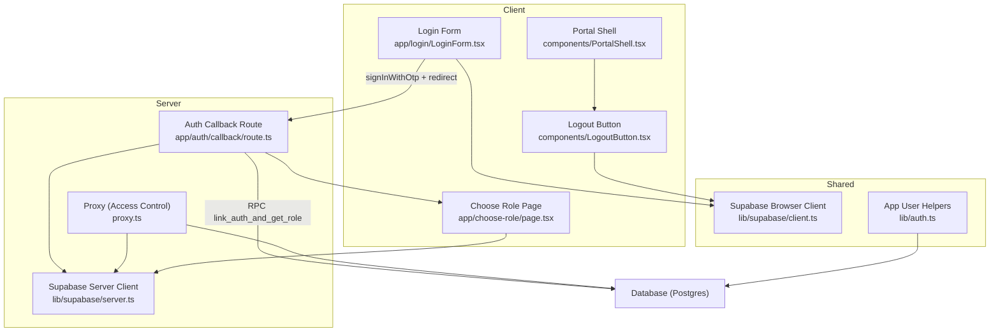
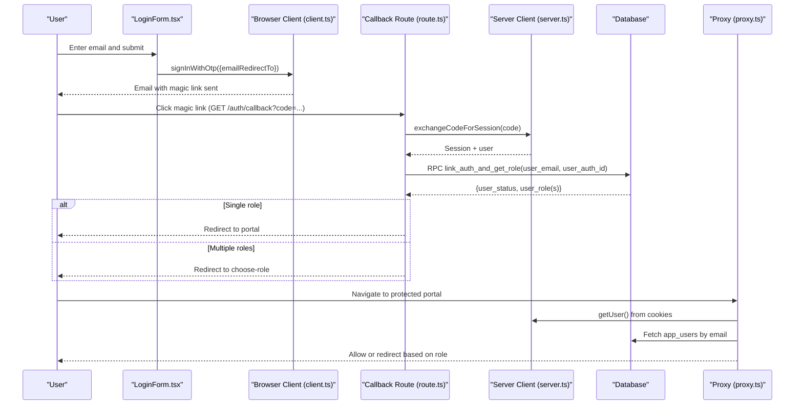
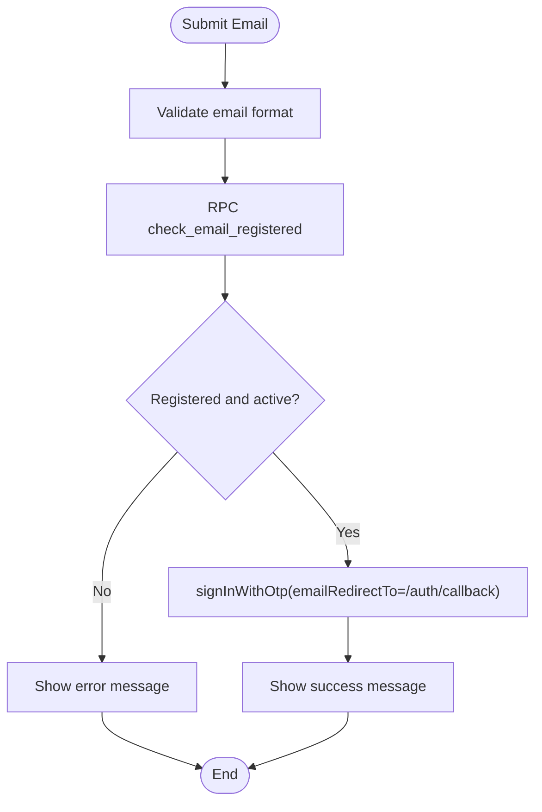
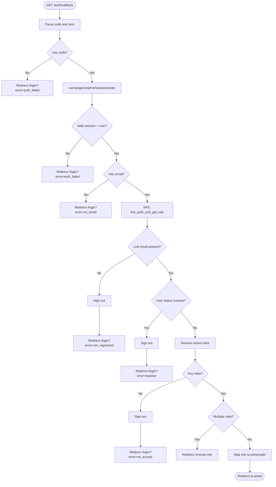
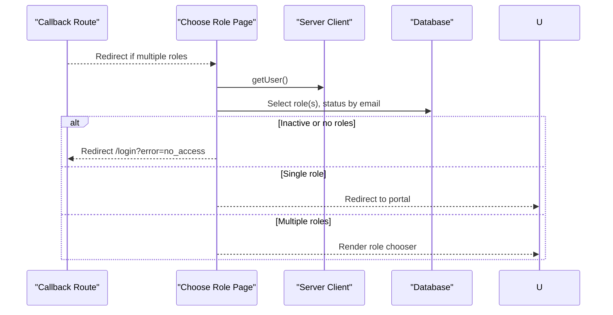
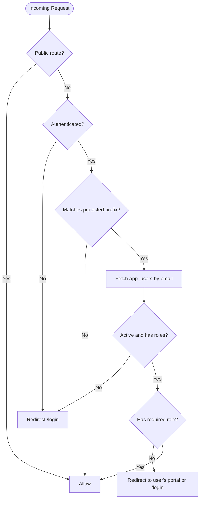
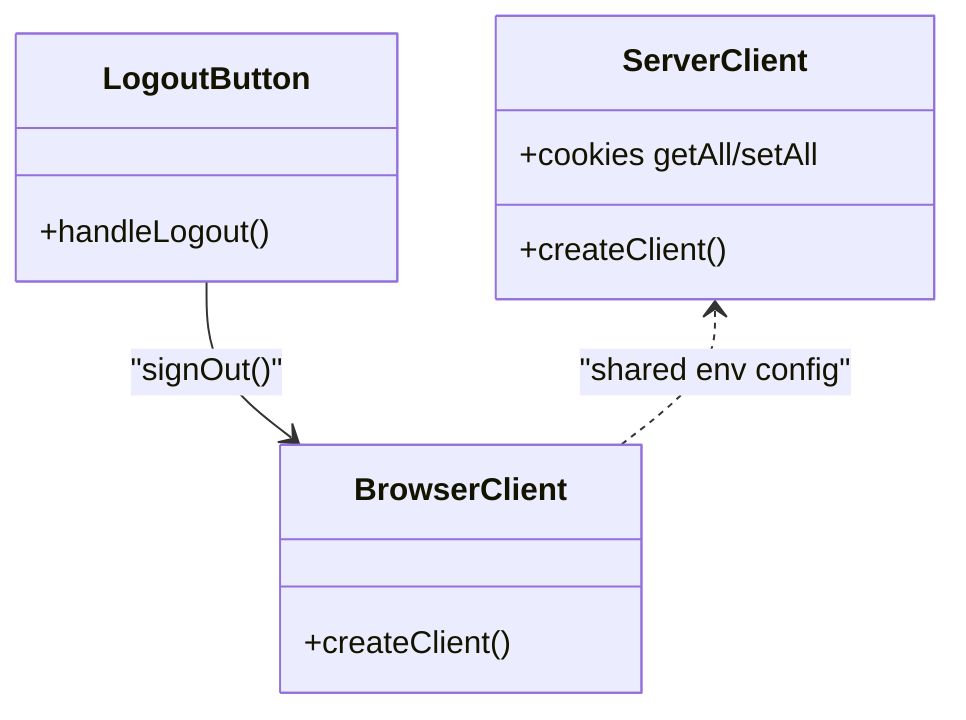
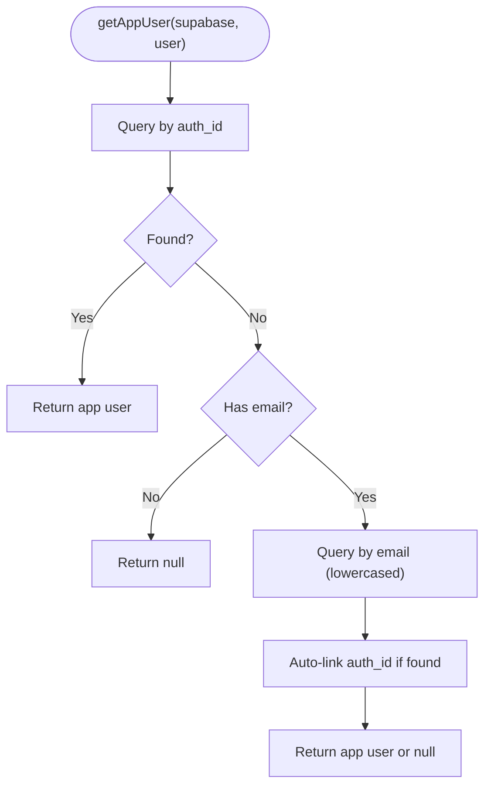
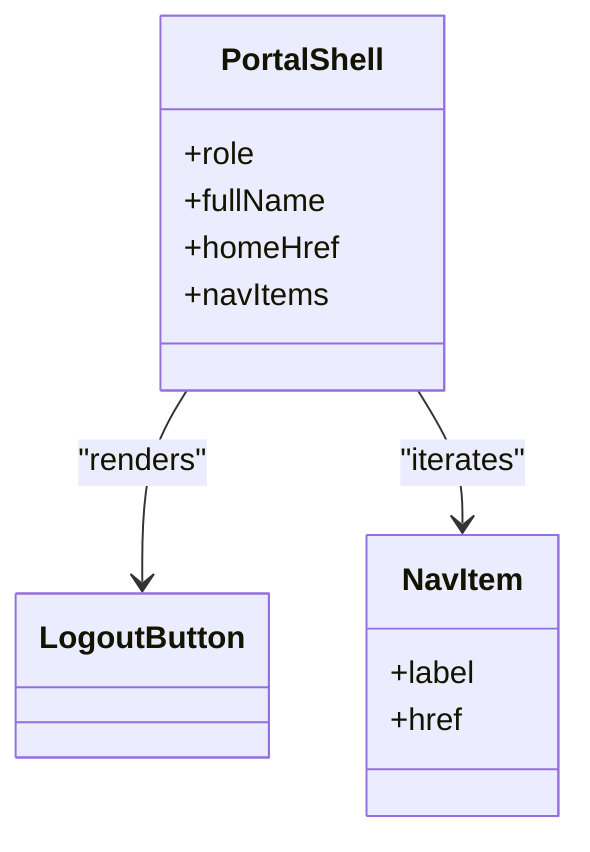
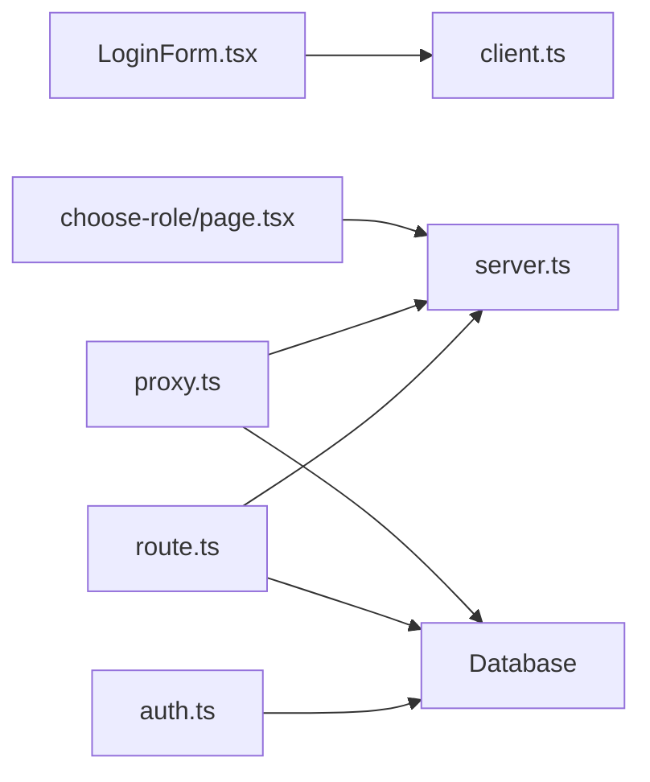

# Authentication System

<cite>
**Referenced Files in This Document**
- [route.ts](file://app/auth/callback/route.ts)
- [LoginForm.tsx](file://app/login/LoginForm.tsx)
- [page.tsx](file://app/login/page.tsx)
- [page.tsx](file://app/choose-role/page.tsx)
- [server.ts](file://lib/supabase/server.ts)
- [client.ts](file://lib/supabase/client.ts)
- [auth.ts](file://lib/auth.ts)
- [proxy.ts](file://proxy.ts)
- [LogoutButton.tsx](file://components/LogoutButton.tsx)
- [PortalShell.tsx](file://components/PortalShell.tsx)
</cite>

## Table of Contents
1. [Introduction](#introduction)
2. [Project Structure](#project-structure)
3. [Core Components](#core-components)
4. [Architecture Overview](#architecture-overview)
5. [Detailed Component Analysis](#detailed-component-analysis)
6. [Dependency Analysis](#dependency-analysis)
7. [Performance Considerations](#performance-considerations)
8. [Troubleshooting Guide](#troubleshooting-guide)
9. [Conclusion](#conclusion)

## Introduction
This document explains the Superclass Portal authentication system built on Supabase Auth with a magic link flow. It covers email validation, session management, user profile handling, callback processing, role resolution, and redirection to role-based portals. It also documents auth utility functions, error handling strategies, security considerations, and integration patterns with Next.js App Router.

## Project Structure
The authentication-related code is organized across server routes, client components, shared utilities, and middleware:

- Magic link login UI and client-side logic
- Server-side callback route that exchanges the code for a session and resolves roles
- Role selection page when multiple roles are assigned
- Middleware-like proxy that enforces access control per portal
- Shared Supabase clients for server and browser contexts
- Utility helpers for app user retrieval and role checks
- Reusable shell and logout component for authenticated portals

**Diagram sources**
- [LoginForm.tsx:1-149](file://app/login/LoginForm.tsx#L1-L149)
- [route.ts:1-68](file://app/auth/callback/route.ts#L1-L68)
- [server.ts:1-29](file://lib/supabase/server.ts#L1-L29)
- [client.ts:1-8](file://lib/supabase/client.ts#L1-L8)
- [proxy.ts:1-103](file://proxy.ts#L1-L103)
- [auth.ts:1-69](file://lib/auth.ts#L1-L69)
- [LogoutButton.tsx:1-24](file://components/LogoutButton.tsx#L1-L24)
- [PortalShell.tsx:1-184](file://components/PortalShell.tsx#L1-L184)
- [page.tsx:1-86](file://app/choose-role/page.tsx#L1-L86)

**Section sources**
- [LoginForm.tsx:1-149](file://app/login/LoginForm.tsx#L1-L149)
- [route.ts:1-68](file://app/auth/callback/route.ts#L1-L68)
- [server.ts:1-29](file://lib/supabase/server.ts#L1-L29)
- [client.ts:1-8](file://lib/supabase/client.ts#L1-L8)
- [proxy.ts:1-103](file://proxy.ts#L1-L103)
- [auth.ts:1-69](file://lib/auth.ts#L1-L69)
- [LogoutButton.tsx:1-24](file://components/LogoutButton.tsx#L1-L24)
- [PortalShell.tsx:1-184](file://components/PortalShell.tsx#L1-L184)
- [page.tsx:1-86](file://app/choose-role/page.tsx#L1-L86)

## Core Components
- Magic Link Login Flow: The login form validates emails, checks registration and status via RPC, then triggers a magic link sign-in with a configured redirect to the callback route.
- Callback Handler: Exchanges the authorization code for a session, verifies user identity, links auth identity to application user, resolves active roles, and redirects accordingly.
- Role Selection: If a user has multiple roles, they are directed to a role chooser; otherwise, they are redirected to the appropriate portal.
- Access Control Proxy: Enforces authentication and role-based access for protected routes by inspecting cookies and querying user roles.
- Shared Utilities: Provide typed app user retrieval, centre membership extraction, and role-check helpers.
- Session Management: Uses Supabase SSR cookie bridging for both server and browser contexts; logout clears session and refreshes navigation.

**Section sources**
- [LoginForm.tsx:1-149](file://app/login/LoginForm.tsx#L1-L149)
- [route.ts:1-68](file://app/auth/callback/route.ts#L1-L68)
- [page.tsx:1-86](file://app/choose-role/page.tsx#L1-L86)
- [proxy.ts:1-103](file://proxy.ts#L1-L103)
- [auth.ts:1-69](file://lib/auth.ts#L1-L69)
- [LogoutButton.tsx:1-24](file://components/LogoutButton.tsx#L1-L24)

## Architecture Overview
The authentication architecture combines client-initiated magic link flows with server-side session establishment and role-based routing.

**Diagram sources**
- [LoginForm.tsx:1-149](file://app/login/LoginForm.tsx#L1-L149)
- [client.ts:1-8](file://lib/supabase/client.ts#L1-L8)
- [route.ts:1-68](file://app/auth/callback/route.ts#L1-L68)
- [server.ts:1-29](file://lib/supabase/server.ts#L1-L29)
- [proxy.ts:1-103](file://proxy.ts#L1-L103)

## Detailed Component Analysis

### Magic Link Login (Client)
- Validates email format and domain constraints before initiating the magic link.
- Calls an RPC to verify registration and account status prior to sending the link.
- Configures the magic link redirect to the server callback route.
- Displays contextual success/error messages and handles rate-limit feedback.

**Diagram sources**
- [LoginForm.tsx:1-149](file://app/login/LoginForm.tsx#L1-L149)

**Section sources**
- [LoginForm.tsx:1-149](file://app/login/LoginForm.tsx#L1-L149)
- [page.tsx:1-15](file://app/login/page.tsx#L1-L15)

### Authentication Callback (Server)
- Extracts the authorization code and optional next parameter.
- Exchanges the code for a session using the server Supabase client.
- Ensures the user has an email; otherwise, returns to login with an error.
- Invokes an RPC to link the auth identity to the application user and retrieve role information.
- Handles inactive accounts and missing roles by signing out and redirecting with errors.
- Resolves single vs multiple roles and redirects to either the chosen portal or the role chooser.

**Diagram sources**
- [route.ts:1-68](file://app/auth/callback/route.ts#L1-L68)

**Section sources**
- [route.ts:1-68](file://app/auth/callback/route.ts#L1-L68)

### Role Resolution and Portal Routing
- When multiple roles exist, users are routed to a dedicated page to select their portal for the session.
- The role chooser fetches the current user’s roles and displays available options with descriptions.
- A single role results in direct redirection to the corresponding portal.

**Diagram sources**
- [route.ts:1-68](file://app/auth/callback/route.ts#L1-L68)
- [page.tsx:1-86](file://app/choose-role/page.tsx#L1-L86)
- [server.ts:1-29](file://lib/supabase/server.ts#L1-L29)

**Section sources**
- [page.tsx:1-86](file://app/choose-role/page.tsx#L1-L86)

### Access Control Proxy
- Intercepts requests to protected paths and ensures the user is authenticated.
- Maps URL prefixes to required roles and compares against the user’s resolved roles.
- Redirects unauthorized users to their correct portal or back to login.

**Diagram sources**
- [proxy.ts:1-103](file://proxy.ts#L1-L103)

**Section sources**
- [proxy.ts:1-103](file://proxy.ts#L1-L103)

### Supabase Clients and Session Management
- Server client bridges Supabase cookies with Next.js request/response lifecycle for server components and API routes.
- Browser client initializes a persistent session in the client context.
- Logout button signs out and navigates to the login page, refreshing state.

**Diagram sources**
- [server.ts:1-29](file://lib/supabase/server.ts#L1-L29)
- [client.ts:1-8](file://lib/supabase/client.ts#L1-L8)
- [LogoutButton.tsx:1-24](file://components/LogoutButton.tsx#L1-L24)

**Section sources**
- [server.ts:1-29](file://lib/supabase/server.ts#L1-L29)
- [client.ts:1-8](file://lib/supabase/client.ts#L1-L8)
- [LogoutButton.tsx:1-24](file://components/LogoutButton.tsx#L1-L24)

### App User Utilities
- Retrieves application user details by auth ID first, falling back to email match and auto-linking the auth ID for future lookups.
- Provides helpers to extract centre IDs and check roles, supporting both legacy single-role and modern multi-role schemas.

**Diagram sources**
- [auth.ts:1-69](file://lib/auth.ts#L1-L69)

**Section sources**
- [auth.ts:1-69](file://lib/auth.ts#L1-L69)

### Portal Shell and Navigation
- Renders a consistent layout with role label, navigation items, and user info.
- Integrates the logout button and highlights active routes.

**Diagram sources**
- [PortalShell.tsx:1-184](file://components/PortalShell.tsx#L1-L184)
- [LogoutButton.tsx:1-24](file://components/LogoutButton.tsx#L1-L24)

**Section sources**
- [PortalShell.tsx:1-184](file://components/PortalShell.tsx#L1-L184)
- [LogoutButton.tsx:1-24](file://components/LogoutButton.tsx#L1-L24)

## Dependency Analysis
- Client components depend on the browser Supabase client for OTP initiation and session checks.
- Server routes and middleware use the server Supabase client to read/write cookies and query the database.
- The callback route depends on an RPC to link identities and resolve roles.
- The proxy enforces access control by reading cookies and querying user roles.
- Shared utilities encapsulate app user retrieval and role checks used across components.

**Diagram sources**
- [LoginForm.tsx:1-149](file://app/login/LoginForm.tsx#L1-L149)
- [client.ts:1-8](file://lib/supabase/client.ts#L1-L8)
- [route.ts:1-68](file://app/auth/callback/route.ts#L1-L68)
- [server.ts:1-29](file://lib/supabase/server.ts#L1-L29)
- [proxy.ts:1-103](file://proxy.ts#L1-L103)
- [page.tsx:1-86](file://app/choose-role/page.tsx#L1-L86)
- [auth.ts:1-69](file://lib/auth.ts#L1-L69)

**Section sources**
- [LoginForm.tsx:1-149](file://app/login/LoginForm.tsx#L1-L149)
- [client.ts:1-8](file://lib/supabase/client.ts#L1-L8)
- [route.ts:1-68](file://app/auth/callback/route.ts#L1-L68)
- [server.ts:1-29](file://lib/supabase/server.ts#L1-L29)
- [proxy.ts:1-103](file://proxy.ts#L1-L103)
- [page.tsx:1-86](file://app/choose-role/page.tsx#L1-L86)
- [auth.ts:1-69](file://lib/auth.ts#L1-L69)

## Performance Considerations
- Minimize redundant database queries by leveraging the auto-linking of auth_id during user lookup.
- Prefer server-side role checks in the proxy to avoid unnecessary client round-trips.
- Use the single RPC call in the callback to reduce network latency and simplify error handling.
- Avoid heavy computations in the login flow; keep client-side validations lightweight.

[No sources needed since this section provides general guidance]

## Troubleshooting Guide
Common error scenarios and their handling:
- Invalid or expired magic link: Redirect to login with an explicit error message.
- Missing email on the authenticated user: Redirect to login with a descriptive error.
- Unregistered or inactive accounts: Sign out and redirect with appropriate errors.
- No roles assigned: Sign out and redirect to login indicating lack of access.
- Rate limiting on OTP: Inform users to retry after a short wait.

Integration tips:
- Ensure the magic link redirect points to the correct callback route.
- Verify environment variables for Supabase URL and anon key are set for both server and client clients.
- Confirm the RPC functions exist and return expected fields for role resolution.

**Section sources**
- [LoginForm.tsx:1-149](file://app/login/LoginForm.tsx#L1-L149)
- [route.ts:1-68](file://app/auth/callback/route.ts#L1-L68)

## Conclusion
The Superclass Portal implements a secure, user-friendly magic link authentication flow with robust role-based routing. By combining client-side validation, server-side session establishment, and middleware enforcement, it ensures only authorized users access the appropriate portals. Shared utilities and consistent shell components streamline development and maintenance while preserving clarity and security.

[No sources needed since this section summarizes without analyzing specific files]