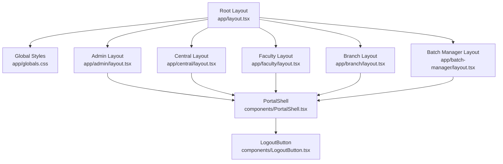
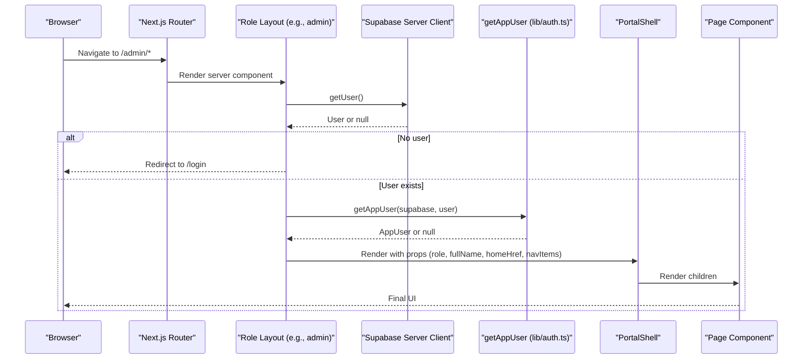
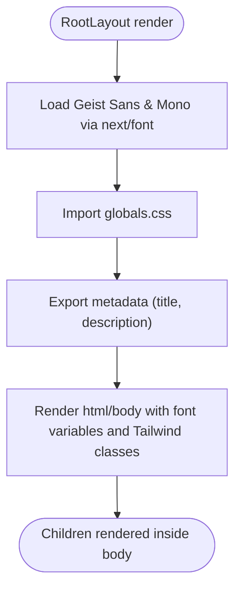
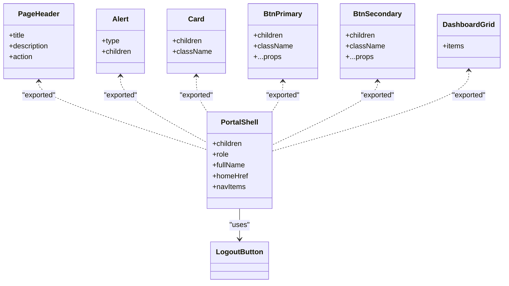
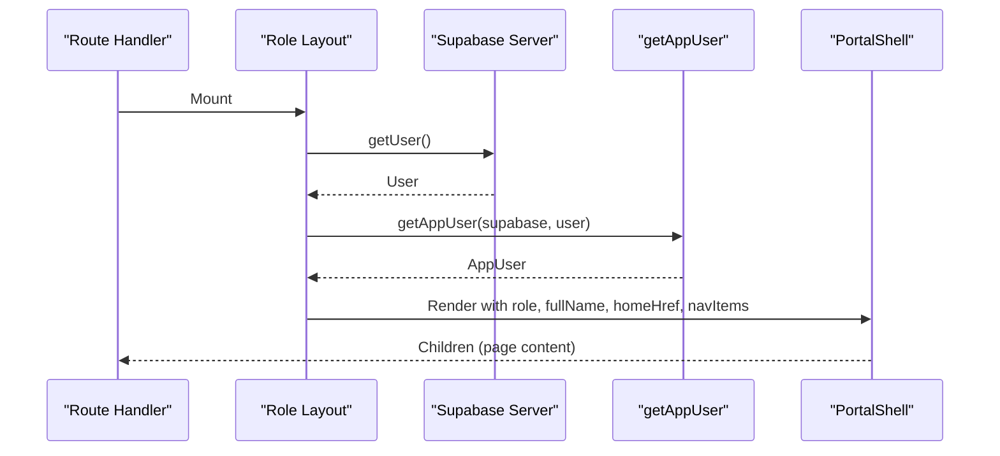
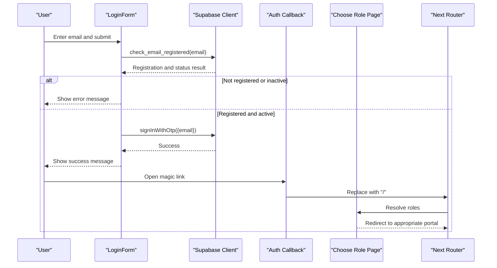
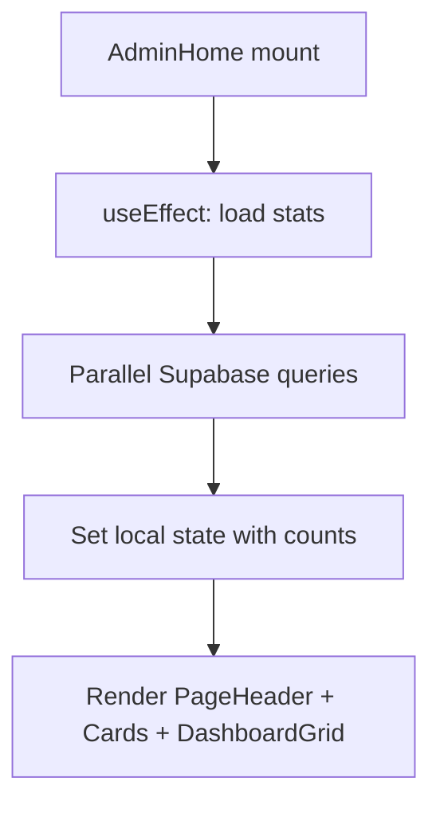
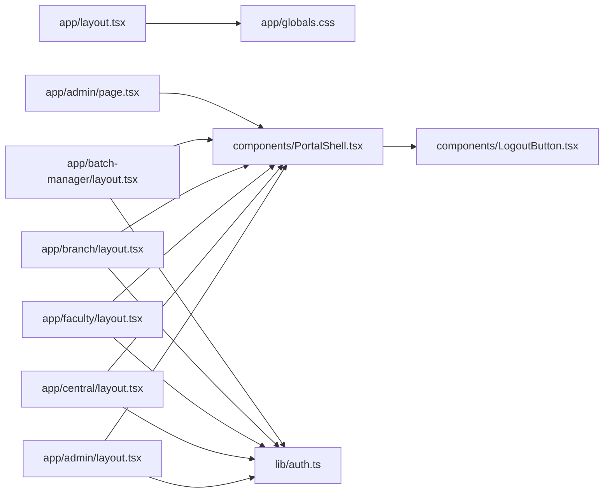

# Component Hierarchy

<cite>
**Referenced Files in This Document**
- [layout.tsx](file://app/layout.tsx)
- [globals.css](file://app/globals.css)
- [PortalShell.tsx](file://components/PortalShell.tsx)
- [LogoutButton.tsx](file://components/LogoutButton.tsx)
- [auth.ts](file://lib/auth.ts)
- [admin\layout.tsx](file://app/admin/layout.tsx)
- [central\layout.tsx](file://app/central/layout.tsx)
- [faculty\layout.tsx](file://app/faculty/layout.tsx)
- [branch\layout.tsx](file://app/branch/layout.tsx)
- [batch-manager\layout.tsx](file://app/batch-manager/layout.tsx)
- [admin\page.tsx](file://app/admin/page.tsx)
- [login\LoginForm.tsx](file://app/login/LoginForm.tsx)
- [choose-role\page.tsx](file://app/choose-role/page.tsx)
</cite>

## Table of Contents
1. [Introduction](#introduction)
2. [Project Structure](#project-structure)
3. [Core Components](#core-components)
4. [Architecture Overview](#architecture-overview)
5. [Detailed Component Analysis](#detailed-component-analysis)
6. [Dependency Analysis](#dependency-analysis)
7. [Performance Considerations](#performance-considerations)
8. [Troubleshooting Guide](#troubleshooting-guide)
9. [Conclusion](#conclusion)

## Introduction
This document explains the React component hierarchy and structure of the application, focusing on how the root layout establishes global styles, fonts, and metadata, and how the PortalShell component provides a consistent shell for all role-based portals. It also covers composition patterns, prop drilling strategies, state management approaches, lifecycle patterns, performance optimizations, and reusability techniques used across the app.

## Project Structure
The project follows Next.js App Router conventions:
- Root layout at the app root sets up HTML, body, fonts, and global CSS.
- Role-specific layouts under app/<role>/wrap content with PortalShell and enforce authentication.
- Shared UI components live under components/.
- Pages compose reusable UI primitives from PortalShell to build dashboards and feature pages.

**Diagram sources**
- [layout.tsx:1-34](file://app/layout.tsx#L1-L34)
- [globals.css:1-24](file://app/globals.css#L1-L24)
- [admin\layout.tsx:1-36](file://app/admin/layout.tsx#L1-L36)
- [central\layout.tsx:1-32](file://app/central/layout.tsx#L1-L32)
- [faculty\layout.tsx:1-30](file://app/faculty/layout.tsx#L1-L30)
- [branch\layout.tsx:1-27](file://app/branch/layout.tsx#L1-L27)
- [batch-manager\layout.tsx:1-29](file://app/batch-manager/layout.tsx#L1-L29)
- [PortalShell.tsx:1-184](file://components/PortalShell.tsx#L1-L184)
- [LogoutButton.tsx:1-24](file://components/LogoutButton.tsx#L1-L24)

**Section sources**
- [layout.tsx:1-34](file://app/layout.tsx#L1-L34)
- [globals.css:1-24](file://app/globals.css#L1-L24)

## Core Components
- RootLayout (app/layout.tsx): Defines the document-level html/body, applies Google fonts via next/font, injects global CSS, and exports site metadata (title and description).
- PortalShell (components/PortalShell.tsx): Client-side wrapper that renders a responsive sidebar navigation, header for mobile, user info, logout button, and main content area. Also exports shared UI primitives: PageHeader, Alert, Card, BtnPrimary, BtnSecondary, DashboardGrid.
- LogoutButton (components/LogoutButton.tsx): Client-side button that signs out via Supabase client and navigates back to login.

Key responsibilities:
- RootLayout manages global presentation and metadata.
- Role layouts manage auth checks and pass context to PortalShell.
- PortalShell centralizes layout and navigation while exposing composable UI building blocks.

**Section sources**
- [layout.tsx:15-33](file://app/layout.tsx#L15-L33)
- [PortalShell.tsx:1-77](file://components/PortalShell.tsx#L1-L77)
- [LogoutButton.tsx:1-24](file://components/LogoutButton.tsx#L1-L24)

## Architecture Overview
The architecture is layered:
- Presentation layer: Pages composed from PortalShell primitives.
- Shell layer: Role-specific layouts wrapping content with PortalShell.
- Authentication layer: Server-side checks in each role layout using Supabase server client; client-side logout handled by LogoutButton.
- Data access: Supabase clients (server and client) used in layouts and pages.

**Diagram sources**
- [admin\layout.tsx:17-35](file://app/admin/layout.tsx#L17-L35)
- [auth.ts:18-51](file://lib/auth.ts#L18-L51)
- [PortalShell.tsx:21-77](file://components/PortalShell.tsx#L21-L77)

## Detailed Component Analysis

### Root Layout: Global Styles, Fonts, Metadata
- Injects two font families (sans and mono) as CSS variables for Tailwind theme usage.
- Applies Tailwind base styles and custom CSS variables for background/foreground colors.
- Sets page title and description via exported metadata.
- Provides a full-height flex body to ensure consistent layout behavior.

**Diagram sources**
- [layout.tsx:5-18](file://app/layout.tsx#L5-L18)
- [globals.css:1-24](file://app/globals.css#L1-L24)

**Section sources**
- [layout.tsx:1-34](file://app/layout.tsx#L1-L34)
- [globals.css:1-24](file://app/globals.css#L1-L24)

### PortalShell: Main Wrapper and Shared UI Primitives
Responsibilities:
- Renders a fixed-width sidebar with dynamic navigation based on navItems.
- Highlights active route using pathname comparison.
- Displays user name and a logout action.
- Exposes PageHeader, Alert, Card, buttons, and DashboardGrid for reuse across pages.

Composition pattern:
- Each role layout passes role, fullName, homeHref, and navItems to PortalShell.
- Pages consume PageHeader, Card, DashboardGrid to assemble dashboards quickly.

**Diagram sources**
- [PortalShell.tsx:9-77](file://components/PortalShell.tsx#L9-L77)
- [PortalShell.tsx:79-184](file://components/PortalShell.tsx#L79-L184)
- [LogoutButton.tsx:1-24](file://components/LogoutButton.tsx#L1-L24)

**Section sources**
- [PortalShell.tsx:1-184](file://components/PortalShell.tsx#L1-L184)

### Role-Based Layouts: Authentication and Context Propagation
Each role layout:
- Creates a Supabase server client and verifies the current user.
- If no user, redirects to login.
- Fetches app user details and forwards them to PortalShell along with role-specific navigation.

Examples:
- Admin, Central, Faculty, Branch, Batch Manager layouts follow the same pattern with different roles and nav items.

**Diagram sources**
- [admin\layout.tsx:17-35](file://app/admin/layout.tsx#L17-L35)
- [central\layout.tsx:13-31](file://app/central/layout.tsx#L13-L31)
- [faculty\layout.tsx:11-29](file://app/faculty/layout.tsx#L11-L29)
- [branch\layout.tsx:8-26](file://app/branch/layout.tsx#L8-L26)
- [batch-manager\layout.tsx:10-28](file://app/batch-manager/layout.tsx#L10-L28)
- [auth.ts:18-51](file://lib/auth.ts#L18-L51)

**Section sources**
- [admin\layout.tsx:1-36](file://app/admin/layout.tsx#L1-L36)
- [central\layout.tsx:1-32](file://app/central/layout.tsx#L1-L32)
- [faculty\layout.tsx:1-30](file://app/faculty/layout.tsx#L1-L30)
- [branch\layout.tsx:1-27](file://app/branch/layout.tsx#L1-L27)
- [batch-manager\layout.tsx:1-29](file://app/batch-manager/layout.tsx#L1-L29)
- [auth.ts:1-69](file://lib/auth.ts#L1-L69)

### Login Flow and Session Handling
- LoginForm validates email format, checks registration and status via RPC, then sends a magic link OTP.
- On success, it instructs the user to open the link; redirect occurs after callback processing.
- The choose-role page resolves multiple roles and either redirects to a single portal or presents a selection screen.

**Diagram sources**
- [login\LoginForm.tsx:1-149](file://app/login/LoginForm.tsx#L1-L149)
- [choose-role\page.tsx:1-86](file://app/choose-role/page.tsx#L1-L86)

**Section sources**
- [login\LoginForm.tsx:1-149](file://app/login/LoginForm.tsx#L1-L149)
- [choose-role\page.tsx:1-86](file://app/choose-role/page.tsx#L1-L86)

### Example Page Composition: Admin Dashboard
- Uses PortalShell primitives (PageHeader, Card, DashboardGrid) to present metrics and quick links.
- Demonstrates client-side data fetching with Supabase client and parallel requests for performance.

**Diagram sources**
- [admin\page.tsx:1-75](file://app/admin/page.tsx#L1-L75)

**Section sources**
- [admin\page.tsx:1-75](file://app/admin/page.tsx#L1-L75)

## Dependency Analysis
- RootLayout depends on next/font and global CSS.
- Role layouts depend on Supabase server client and auth utilities.
- PortalShell depends on Next navigation and LogoutButton.
- Pages depend on PortalShell primitives and Supabase client.

**Diagram sources**
- [layout.tsx:1-34](file://app/layout.tsx#L1-L34)
- [globals.css:1-24](file://app/globals.css#L1-L24)
- [admin\layout.tsx:1-36](file://app/admin/layout.tsx#L1-L36)
- [central\layout.tsx:1-32](file://app/central/layout.tsx#L1-L32)
- [faculty\layout.tsx:1-30](file://app/faculty/layout.tsx#L1-L30)
- [branch\layout.tsx:1-27](file://app/branch/layout.tsx#L1-L27)
- [batch-manager\layout.tsx:1-29](file://app/batch-manager/layout.tsx#L1-L29)
- [PortalShell.tsx:1-184](file://components/PortalShell.tsx#L1-L184)
- [LogoutButton.tsx:1-24](file://components/LogoutButton.tsx#L1-L24)
- [auth.ts:1-69](file://lib/auth.ts#L1-L69)
- [admin\page.tsx:1-75](file://app/admin/page.tsx#L1-L75)

**Section sources**
- [auth.ts:1-69](file://lib/auth.ts#L1-L69)

## Performance Considerations
- Font optimization: Using next/font ensures optimized loading and variable injection without layout shifts.
- Parallel data fetching: Admin dashboard uses Promise.all to fetch multiple counts concurrently, reducing total latency.
- Minimal client components: Only necessary parts are marked 'use client' (PortalShell, LogoutButton, LoginForm, dashboard pages), keeping server rendering efficient.
- Navigation highlighting: Active route detection uses simple string comparisons, avoiding heavy computations.
- Reusable UI primitives: Reduces duplication and improves consistency; consider memoization if any primitive becomes expensive.

[No sources needed since this section provides general guidance]

## Troubleshooting Guide
Common issues and where to look:
- Redirect loops or missing redirects: Verify role layouts perform auth checks and redirect when no user is present.
- Incorrect user display: Ensure getAppUser returns full_name and falls back to email when necessary.
- Logout not working: Confirm LogoutButton calls signOut and refreshes navigation.
- Email validation errors: Check LoginForm’s regex and RPC call results before sending OTP.

**Section sources**
- [admin\layout.tsx:17-22](file://app/admin/layout.tsx#L17-L22)
- [auth.ts:18-51](file://lib/auth.ts#L18-L51)
- [LogoutButton.tsx:10-14](file://components/LogoutButton.tsx#L10-L14)
- [login\LoginForm.tsx:41-94](file://app/login/LoginForm.tsx#L41-L94)

## Conclusion
The application employs a clear, layered architecture:
- RootLayout centralizes global styling and metadata.
- Role layouts encapsulate authentication and pass minimal context to PortalShell.
- PortalShell standardizes layout and navigation while providing reusable UI primitives.
- Pages compose these primitives to deliver role-specific experiences efficiently.
This approach promotes consistency, reusability, and maintainability across the portal ecosystem.