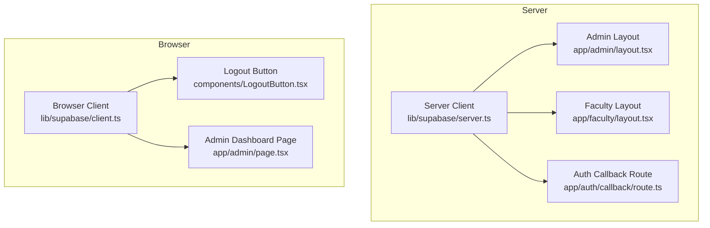
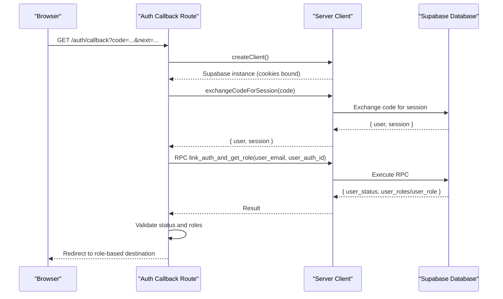
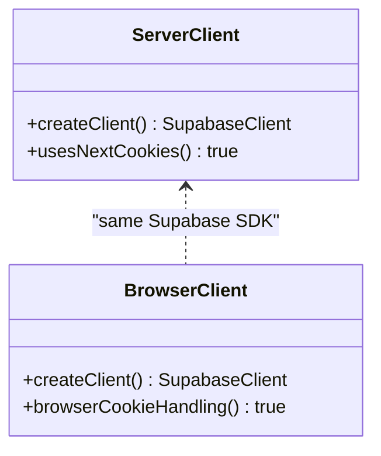
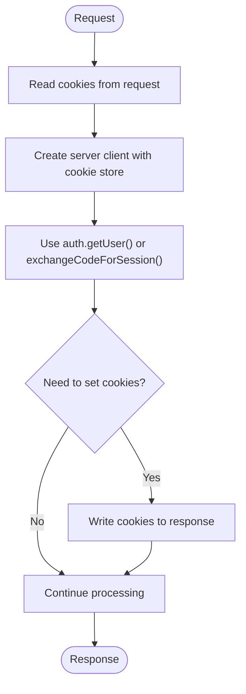
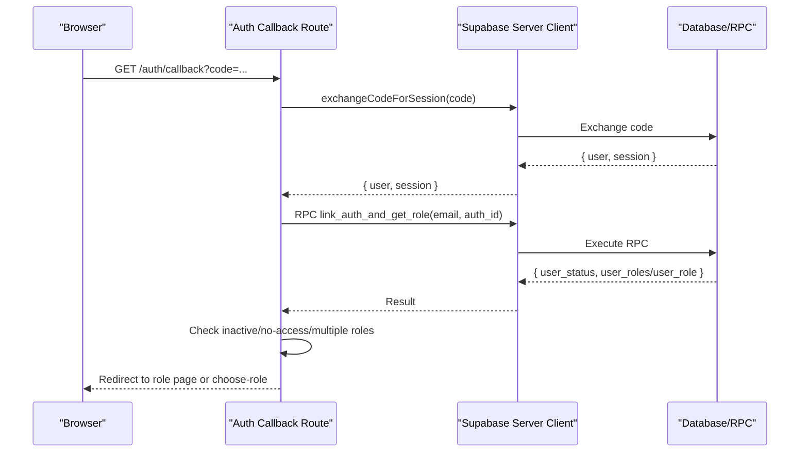
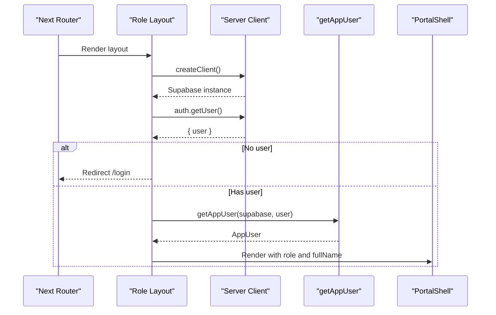
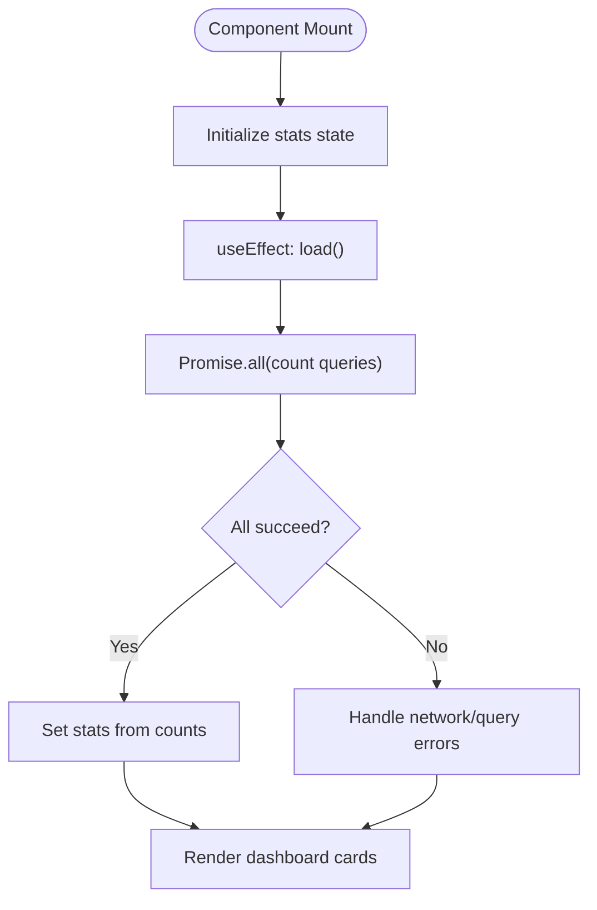
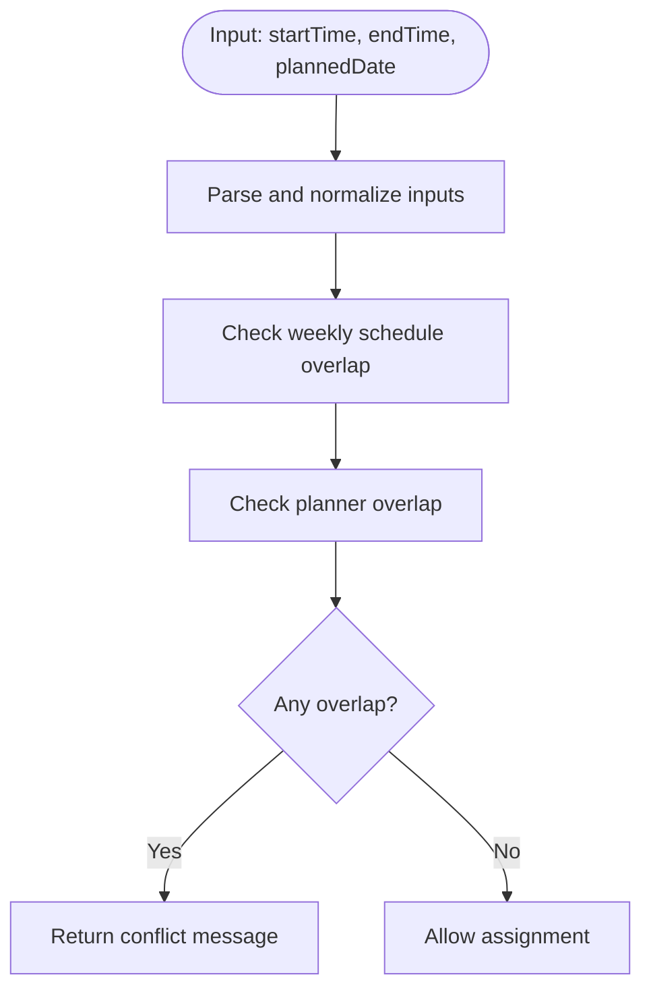
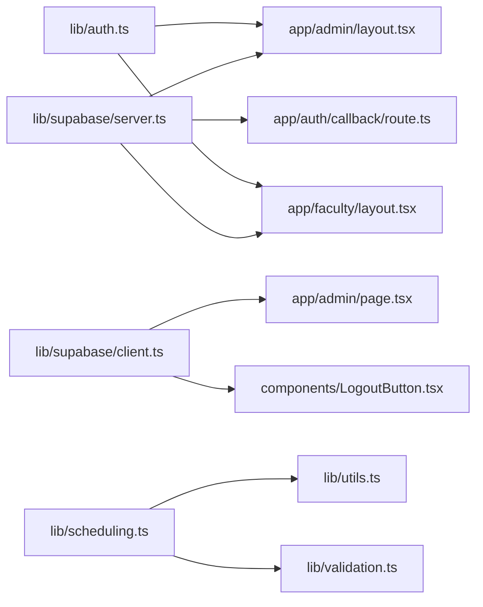

# Data Flow Patterns

<cite>
**Referenced Files in This Document**
- [client.ts](file://lib/supabase/client.ts)
- [server.ts](file://lib/supabase/server.ts)
- [auth.ts](file://lib/auth.ts)
- [route.ts](file://app/auth/callback/route.ts)
- [layout.tsx (admin)](file://app/admin/layout.tsx)
- [layout.tsx (faculty)](file://app/faculty/layout.tsx)
- [page.tsx (admin dashboard)](file://app/admin/page.tsx)
- [LogoutButton.tsx](file://components/LogoutButton.tsx)
- [scheduling.ts](file://lib/scheduling.ts)
- [utils.ts](file://lib/utils.ts)
- [validation.ts](file://lib/validation.ts)
</cite>

## Table of Contents
1. [Introduction](#introduction)
2. [Project Structure](#project-structure)
3. [Core Components](#core-components)
4. [Architecture Overview](#architecture-overview)
5. [Detailed Component Analysis](#detailed-component-analysis)
6. [Dependency Analysis](#dependency-analysis)
7. [Performance Considerations](#performance-considerations)
8. [Troubleshooting Guide](#troubleshooting-guide)
9. [Conclusion](#conclusion)

## Introduction
This document explains the data flow patterns and client architecture for database interactions in the project. It focuses on the dual client pattern for server-side and browser-side Supabase clients, cookie handling and session persistence, utility functions for common operations, error handling strategies, and data transformation patterns. It also covers configuration setup via environment variables and outlines performance optimization techniques such as optimistic updates and efficient queries.

## Project Structure
The application uses Next.js with a clear separation between server-side and client-side code:
- Server-side Supabase client is created in a dedicated module that integrates with Next.js cookies to persist sessions.
- Client-side Supabase client is created in a separate module for use in React components and client actions.
- Authentication callback routes handle exchanging authorization codes for sessions and linking user accounts.
- Layouts enforce authentication and load user context using the server client.
- Pages and components perform data operations using the appropriate client.

**Diagram sources**
- [server.ts:1-29](file://lib/supabase/server.ts#L1-L29)
- [client.ts:1-8](file://lib/supabase/client.ts#L1-L8)
- [layout.tsx (admin):1-36](file://app/admin/layout.tsx#L1-L36)
- [layout.tsx (faculty):1-30](file://app/faculty/layout.tsx#L1-L30)
- [route.ts:1-68](file://app/auth/callback/route.ts#L1-L68)
- [LogoutButton.tsx:1-24](file://components/LogoutButton.tsx#L1-L24)
- [page.tsx (admin dashboard):1-75](file://app/admin/page.tsx#L1-L75)

**Section sources**
- [server.ts:1-29](file://lib/supabase/server.ts#L1-L29)
- [client.ts:1-8](file://lib/supabase/client.ts#L1-L8)
- [layout.tsx (admin):1-36](file://app/admin/layout.tsx#L1-L36)
- [layout.tsx (faculty):1-30](file://app/faculty/layout.tsx#L1-L30)
- [route.ts:1-68](file://app/auth/callback/route.ts#L1-L68)
- [LogoutButton.tsx:1-24](file://components/LogoutButton.tsx#L1-L24)
- [page.tsx (admin dashboard):1-75](file://app/admin/page.tsx#L1-L75)

## Core Components
- Dual Supabase Clients
  - Server client: Creates a Supabase instance bound to the request’s cookie store for session persistence across server components and API routes.
  - Browser client: Creates a Supabase instance for client components and client actions, automatically managing cookies in the browser.
- Authentication Callback
  - Exchanges an authorization code for a session, validates user email, links auth identity to app users, checks role access, and redirects based on roles.
- Server-Side User Context
  - Layouts fetch the authenticated user and app user profile, then render UI shells with navigation tailored to roles.
- Client-Side Operations
  - Pages and components query counts and lists using the browser client; logout triggers sign-out and refreshes the router state.

Key responsibilities:
- Session persistence via cookies on both server and client.
- Role-based routing and layout rendering.
- Efficient counting queries for dashboards.
- Centralized utilities for time overlap checks and validation.

**Section sources**
- [server.ts:1-29](file://lib/supabase/server.ts#L1-L29)
- [client.ts:1-8](file://lib/supabase/client.ts#L1-L8)
- [route.ts:1-68](file://app/auth/callback/route.ts#L1-L68)
- [layout.tsx (admin):1-36](file://app/admin/layout.tsx#L1-L36)
- [layout.tsx (faculty):1-30](file://app/faculty/layout.tsx#L1-L30)
- [page.tsx (admin dashboard):1-75](file://app/admin/page.tsx#L1-L75)
- [LogoutButton.tsx:1-24](file://components/LogoutButton.tsx#L1-L24)

## Architecture Overview
The system follows a dual-client architecture:
- Server-side: Uses @supabase/ssr createServerClient with Next.js cookies integration to read and write session cookies during server component execution and route handlers.
- Browser-side: Uses @supabase/ssr createBrowserClient for client components and actions, which manages cookies automatically in the browser.

Data flows:
- Authentication: The callback route exchanges the code for a session, persists cookies via the server client, and performs account linking and role checks before redirecting.
- Authorization: Layouts verify the current user and fetch app user details to render role-specific navigation.
- Data retrieval: Client pages issue parallel count queries for dashboard metrics.

**Diagram sources**
- [route.ts:1-68](file://app/auth/callback/route.ts#L1-L68)
- [server.ts:1-29](file://lib/supabase/server.ts#L1-L29)

**Section sources**
- [route.ts:1-68](file://app/auth/callback/route.ts#L1-L68)
- [server.ts:1-29](file://lib/supabase/server.ts#L1-L29)

## Detailed Component Analysis

### Dual Client Pattern: Server vs Browser
- Server client
  - Integrates with Next.js cookies to read and set session cookies during server rendering and route handlers.
  - Used by layouts and server-only logic to authenticate and fetch user context.
- Browser client
  - Used by client components and actions to interact with Supabase from the browser.
  - Automatically handles cookies for session persistence in the browser.

**Diagram sources**
- [server.ts:1-29](file://lib/supabase/server.ts#L1-L29)
- [client.ts:1-8](file://lib/supabase/client.ts#L1-L8)

**Section sources**
- [server.ts:1-29](file://lib/supabase/server.ts#L1-L29)
- [client.ts:1-8](file://lib/supabase/client.ts#L1-L8)

### Cookie Handling and Session Persistence
- Server-side cookie management
  - Reads all cookies from the request and sets cookies back into the response when needed.
  - Gracefully ignores errors when setting cookies from server components if middleware handles session refresh.
- Browser-side cookie management
  - The browser client maintains session cookies automatically.
  - Logout triggers sign-out and navigates to login.

**Diagram sources**
- [server.ts:1-29](file://lib/supabase/server.ts#L1-L29)
- [LogoutButton.tsx:1-24](file://components/LogoutButton.tsx#L1-L24)

**Section sources**
- [server.ts:1-29](file://lib/supabase/server.ts#L1-L29)
- [LogoutButton.tsx:1-24](file://components/LogoutButton.tsx#L1-L24)

### Authentication Callback Flow
- Exchanges authorization code for a session.
- Validates user email presence.
- Calls an RPC to link auth identity and retrieve roles.
- Enforces user status and role requirements.
- Redirects to role-specific destinations or prompts role selection.

**Diagram sources**
- [route.ts:1-68](file://app/auth/callback/route.ts#L1-L68)
- [server.ts:1-29](file://lib/supabase/server.ts#L1-L29)

**Section sources**
- [route.ts:1-68](file://app/auth/callback/route.ts#L1-L68)

### Server-Side User Context and Layouts
- Layouts create the server client, fetch the current user, and redirect unauthenticated requests.
- They resolve app user profiles and pass role and name information to the portal shell.

**Diagram sources**
- [layout.tsx (admin):1-36](file://app/admin/layout.tsx#L1-L36)
- [layout.tsx (faculty):1-30](file://app/faculty/layout.tsx#L1-L30)
- [auth.ts:1-69](file://lib/auth.ts#L1-L69)
- [server.ts:1-29](file://lib/supabase/server.ts#L1-L29)

**Section sources**
- [layout.tsx (admin):1-36](file://app/admin/layout.tsx#L1-L36)
- [layout.tsx (faculty):1-30](file://app/faculty/layout.tsx#L1-L30)
- [auth.ts:1-69](file://lib/auth.ts#L1-L69)

### Client-Side Data Retrieval and Optimistic Updates
- Admin dashboard page uses the browser client to fetch counts in parallel for multiple tables.
- Optimistic update pattern:
  - Update local state immediately upon successful mutation (not shown here).
  - Rollback on failure and display user-friendly errors.
  - Use head:true and exact counts to minimize payload size.

**Diagram sources**
- [page.tsx (admin dashboard):1-75](file://app/admin/page.tsx#L1-L75)
- [client.ts:1-8](file://lib/supabase/client.ts#L1-L8)

**Section sources**
- [page.tsx (admin dashboard):1-75](file://app/admin/page.tsx#L1-L75)
- [client.ts:1-8](file://lib/supabase/client.ts#L1-L8)

### Utility Functions and Data Transformation
- Time utilities
  - Convert time strings to minutes and check overlaps.
  - Format times for display.
- Validation helpers
  - Parse planned dates and validate ranges.
  - Convert total minutes to time strings.
- Scheduling overlap checks
  - Combine weekly recurring schedules and one-off planner entries to detect conflicts.

**Diagram sources**
- [scheduling.ts:1-113](file://lib/scheduling.ts#L1-L113)
- [utils.ts:1-74](file://lib/utils.ts#L1-L74)
- [validation.ts:1-33](file://lib/validation.ts#L1-L33)

**Section sources**
- [scheduling.ts:1-113](file://lib/scheduling.ts#L1-L113)
- [utils.ts:1-74](file://lib/utils.ts#L1-L74)
- [validation.ts:1-33](file://lib/validation.ts#L1-L33)

### Error Handling Strategies
- Authentication callback
  - Handles missing code, no email, inactive users, and missing roles by redirecting to login with descriptive error parameters.
- Server client cookie writes
  - Catches and ignores errors when setting cookies from server components, assuming middleware refreshes sessions.
- Client logout
  - Ensures sign-out completes before navigating and refreshing the router state.

**Section sources**
- [route.ts:1-68](file://app/auth/callback/route.ts#L1-L68)
- [server.ts:1-29](file://lib/supabase/server.ts#L1-L29)
- [LogoutButton.tsx:1-24](file://components/LogoutButton.tsx#L1-L24)

## Dependency Analysis
The following diagram shows how modules depend on each other for data flow and authentication:

**Diagram sources**
- [server.ts:1-29](file://lib/supabase/server.ts#L1-L29)
- [client.ts:1-8](file://lib/supabase/client.ts#L1-L8)
- [layout.tsx (admin):1-36](file://app/admin/layout.tsx#L1-L36)
- [layout.tsx (faculty):1-30](file://app/faculty/layout.tsx#L1-L30)
- [route.ts:1-68](file://app/auth/callback/route.ts#L1-L68)
- [page.tsx (admin dashboard):1-75](file://app/admin/page.tsx#L1-L75)
- [LogoutButton.tsx:1-24](file://components/LogoutButton.tsx#L1-L24)
- [auth.ts:1-69](file://lib/auth.ts#L1-L69)
- [scheduling.ts:1-113](file://lib/scheduling.ts#L1-L113)
- [utils.ts:1-74](file://lib/utils.ts#L1-L74)
- [validation.ts:1-33](file://lib/validation.ts#L1-L33)

**Section sources**
- [server.ts:1-29](file://lib/supabase/server.ts#L1-L29)
- [client.ts:1-8](file://lib/supabase/client.ts#L1-L8)
- [layout.tsx (admin):1-36](file://app/admin/layout.tsx#L1-L36)
- [layout.tsx (faculty):1-30](file://app/faculty/layout.tsx#L1-L30)
- [route.ts:1-68](file://app/auth/callback/route.ts#L1-L68)
- [page.tsx (admin dashboard):1-75](file://app/admin/page.tsx#L1-L75)
- [LogoutButton.tsx:1-24](file://components/LogoutButton.tsx#L1-L24)
- [auth.ts:1-69](file://lib/auth.ts#L1-L69)
- [scheduling.ts:1-113](file://lib/scheduling.ts#L1-L113)
- [utils.ts:1-74](file://lib/utils.ts#L1-L74)
- [validation.ts:1-33](file://lib/validation.ts#L1-L33)

## Performance Considerations
- Use head:true with select to fetch only row counts, minimizing payload size and improving dashboard responsiveness.
- Parallelize independent queries using Promise.all to reduce total latency.
- Prefer server-side data fetching for sensitive or heavy operations to leverage caching and reduce client workload.
- Implement optimistic updates for mutations:
  - Immediately reflect changes in the UI.
  - Revert on error and show actionable feedback.
- Avoid unnecessary re-renders by memoizing derived data and keeping state minimal.
- Leverage Supabase RLS policies to offload filtering to the database layer.

[No sources needed since this section provides general guidance]

## Troubleshooting Guide
- Authentication failures
  - Missing authorization code or invalid session results in redirection to login with error parameters.
  - Ensure NEXT_PUBLIC_SUPABASE_URL and NEXT_PUBLIC_SUPABASE_ANON_KEY are correctly configured.
- Inactive or unauthorized users
  - Users marked inactive or without roles are redirected to login after signing out.
- Cookie issues
  - If setting cookies fails from server components, rely on middleware to refresh sessions.
- Logout not clearing state
  - Ensure signOut completes before navigation and call router.refresh to synchronize server state.

**Section sources**
- [route.ts:1-68](file://app/auth/callback/route.ts#L1-L68)
- [server.ts:1-29](file://lib/supabase/server.ts#L1-L29)
- [LogoutButton.tsx:1-24](file://components/LogoutButton.tsx#L1-L24)

## Conclusion
The application implements a robust dual-client architecture for Supabase interactions, integrating seamlessly with Next.js cookies for session persistence. Server-side layouts enforce authentication and provide role-aware UI shells, while client-side components perform efficient data operations. Utilities and validation helpers centralize common logic, and error handling ensures graceful recovery and clear user feedback. Following the outlined patterns will help maintain consistency, security, and performance across the portal.