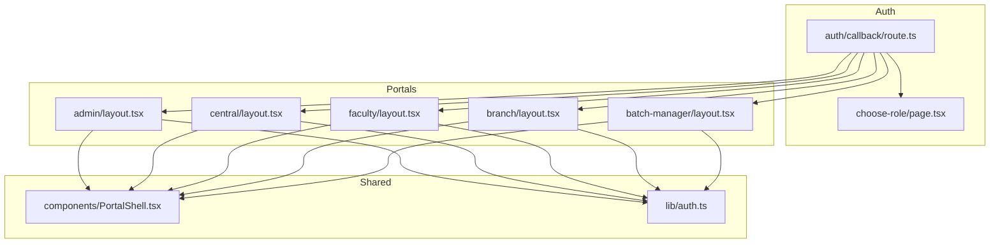
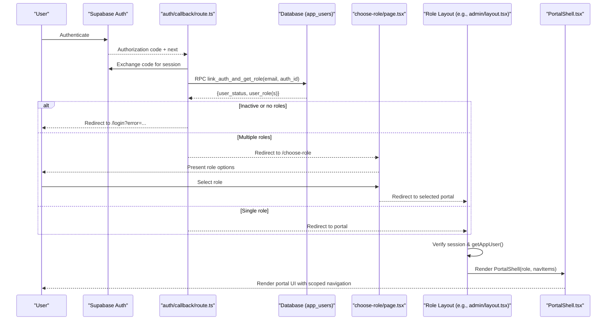
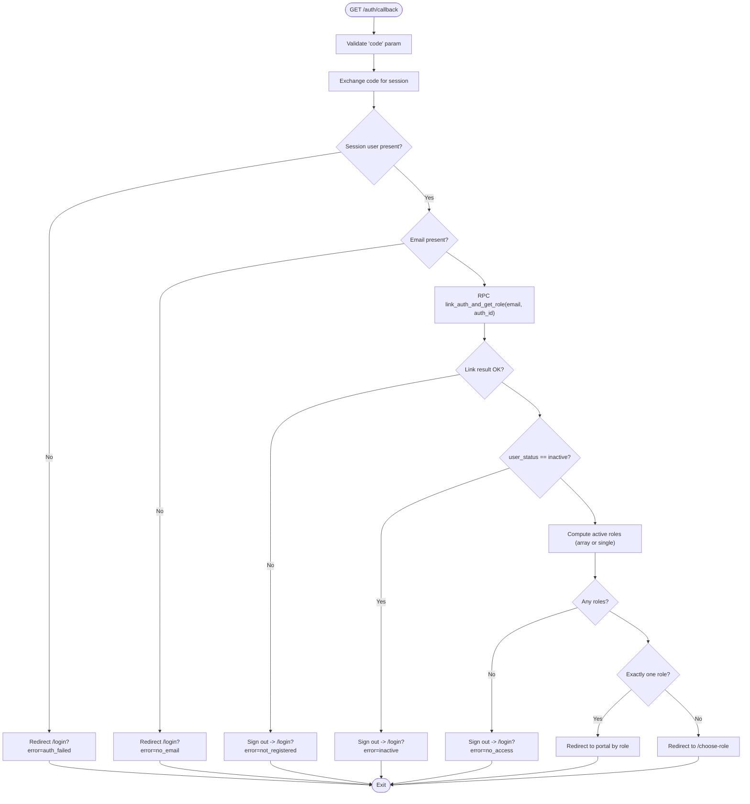
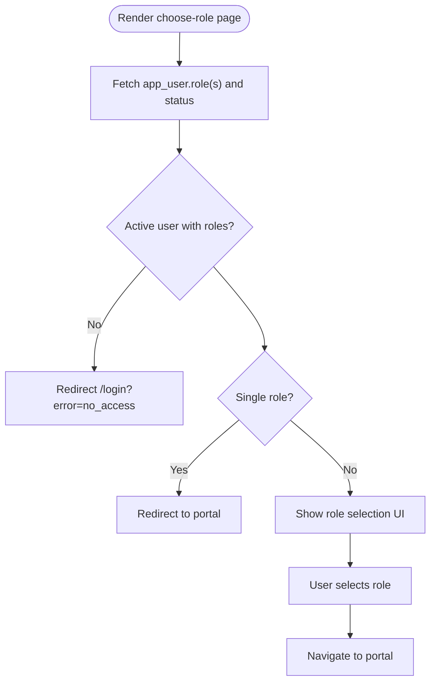
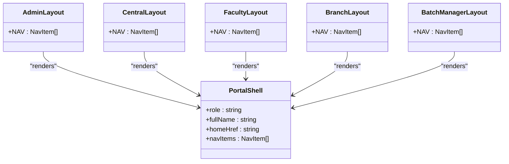
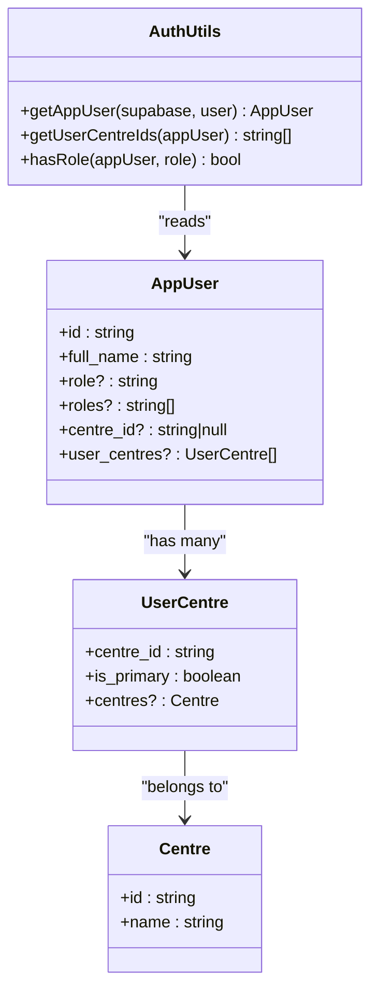
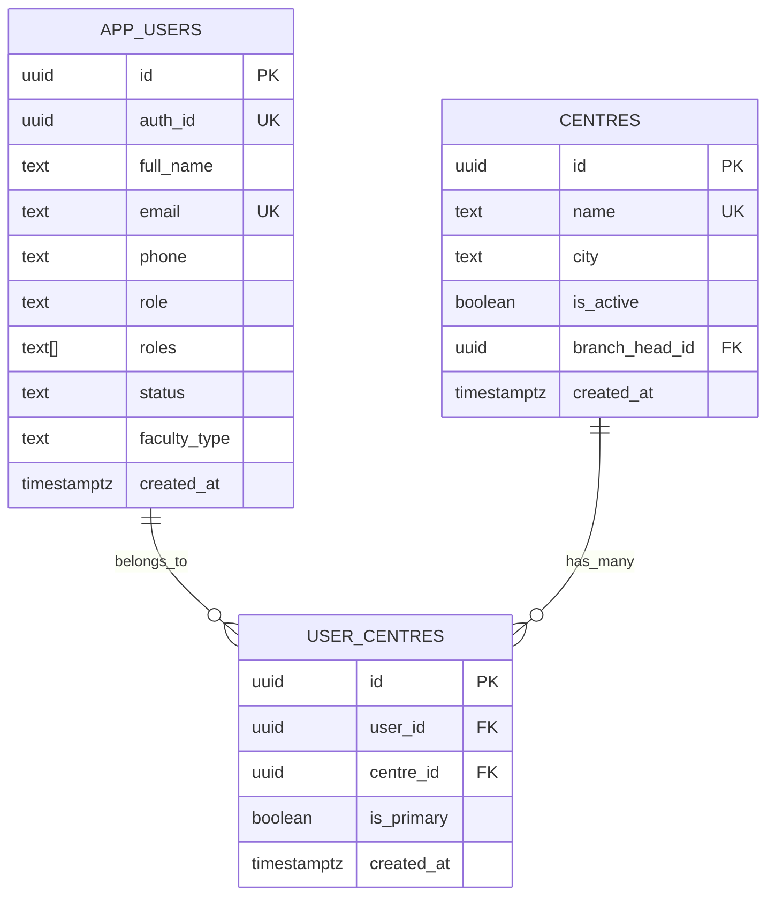
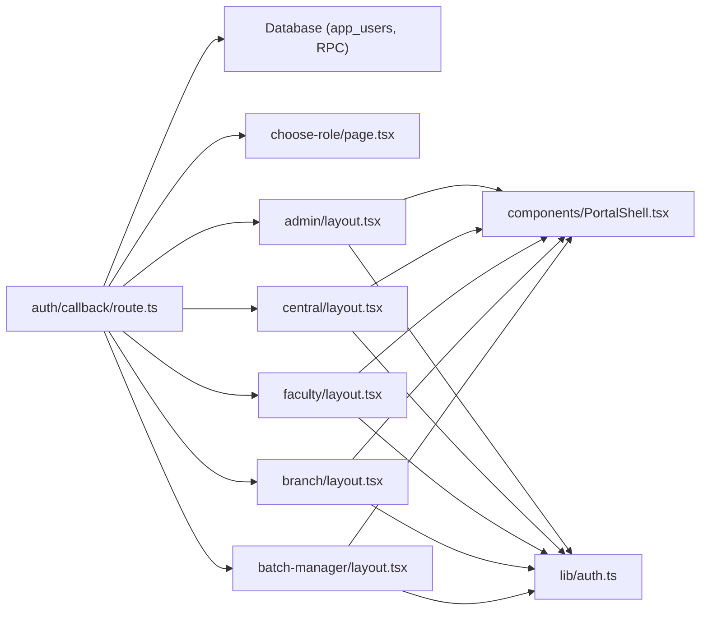

# Role-Based Architecture

<cite>
**Referenced Files in This Document**
- [app/layout.tsx](file://app/layout.tsx)
- [components/PortalShell.tsx](file://components/PortalShell.tsx)
- [lib/auth.ts](file://lib/auth.ts)
- [app/auth/callback/route.ts](file://app/auth/callback/route.ts)
- [app/choose-role/page.tsx](file://app/choose-role/page.tsx)
- [app/admin/layout.tsx](file://app/admin/layout.tsx)
- [app/central/layout.tsx](file://app/central/layout.tsx)
- [app/faculty/layout.tsx](file://app/faculty/layout.tsx)
- [app/branch/layout.tsx](file://app/branch/layout.tsx)
- [app/batch-manager/layout.tsx](file://app/batch-manager/layout.tsx)
- [scripts/schema.sql](file://scripts/schema.sql)
</cite>

## Table of Contents
1. Introduction
2. Project Structure
3. Core Components
4. Architecture Overview
5. Detailed Component Analysis
6. Dependency Analysis
7. Performance Considerations
8. Troubleshooting Guide
9. Conclusion

## Introduction
This document explains the role-based architecture that supports five distinct user roles: Admin, Central Team, Faculty, Branch Head, and Batch Manager. It covers how permissions are enforced through layout components, navigation restrictions, feature access control, role hierarchy, permission matrix, portal transitions, and multi-center support. It also documents implementation patterns for role checking, conditional rendering, and secure routing.

## Project Structure
The application is organized by role-based routes with dedicated layouts per portal. Each layout enforces authentication, resolves the app user profile (including roles and centre associations), and renders a consistent shell with navigation scoped to the role.

**Diagram sources**
- [app/auth/callback/route.ts:1-68](file://app/auth/callback/route.ts#L1-L68)
- [app/choose-role/page.tsx:1-86](file://app/choose-role/page.tsx#L1-L86)
- [app/admin/layout.tsx:1-36](file://app/admin/layout.tsx#L1-L36)
- [app/central/layout.tsx:1-32](file://app/central/layout.tsx#L1-L32)
- [app/faculty/layout.tsx:1-30](file://app/faculty/layout.tsx#L1-L30)
- [app/branch/layout.tsx:1-27](file://app/branch/layout.tsx#L1-L27)
- [app/batch-manager/layout.tsx:1-29](file://app/batch-manager/layout.tsx#L1-L29)
- [components/PortalShell.tsx:1-184](file://components/PortalShell.tsx#L1-L184)
- [lib/auth.ts:1-69](file://lib/auth.ts#L1-L69)

**Section sources**
- [app/layout.tsx:1-34](file://app/layout.tsx#L1-L34)
- [components/PortalShell.tsx:1-184](file://components/PortalShell.tsx#L1-L184)
- [lib/auth.ts:1-69](file://lib/auth.ts#L1-L69)
- [app/auth/callback/route.ts:1-68](file://app/auth/callback/route.ts#L1-L68)
- [app/choose-role/page.tsx:1-86](file://app/choose-role/page.tsx#L1-L86)
- [app/admin/layout.tsx:1-36](file://app/admin/layout.tsx#L1-L36)
- [app/central/layout.tsx:1-32](file://app/central/layout.tsx#L1-L32)
- [app/faculty/layout.tsx:1-30](file://app/faculty/layout.tsx#L1-L30)
- [app/branch/layout.tsx:1-27](file://app/branch/layout.tsx#L1-L27)
- [app/batch-manager/layout.tsx:1-29](file://app/batch-manager/layout.tsx#L1-L29)

## Core Components
- Authentication callback: Exchanges auth code for session, links auth identity to app user, validates status and roles, and redirects to the appropriate portal or role chooser.
- Role chooser: Presents available portals when a user has multiple roles; auto-redirects if only one role exists.
- Role-specific layouts: Enforce login, resolve app user, and render the shared shell with role-scoped navigation.
- Shared shell: Renders sidebar/header, active link highlighting, user info, and logout.
- Auth utilities: Resolve app user from auth identity, compute centre memberships, and check roles.

Key responsibilities:
- Secure routing via server-side checks in layouts and callback.
- Consistent UI across portals using a shared shell component.
- Multi-role support with explicit selection when needed.
- Multi-center support via junction table and helper functions.

**Section sources**
- [app/auth/callback/route.ts:1-68](file://app/auth/callback/route.ts#L1-L68)
- [app/choose-role/page.tsx:1-86](file://app/choose-role/page.tsx#L1-L86)
- [app/admin/layout.tsx:1-36](file://app/admin/layout.tsx#L1-L36)
- [app/central/layout.tsx:1-32](file://app/central/layout.tsx#L1-L32)
- [app/faculty/layout.tsx:1-30](file://app/faculty/layout.tsx#L1-L30)
- [app/branch/layout.tsx:1-27](file://app/branch/layout.tsx#L1-L27)
- [app/batch-manager/layout.tsx:1-29](file://app/batch-manager/layout.tsx#L1-L29)
- [components/PortalShell.tsx:1-184](file://components/PortalShell.tsx#L1-L184)
- [lib/auth.ts:1-69](file://lib/auth.ts#L1-L69)

## Architecture Overview
End-to-end flow from login to portal entry, including multi-role handling and role-scoped navigation.

**Diagram sources**
- [app/auth/callback/route.ts:1-68](file://app/auth/callback/route.ts#L1-L68)
- [app/choose-role/page.tsx:1-86](file://app/choose-role/page.tsx#L1-L86)
- [app/admin/layout.tsx:1-36](file://app/admin/layout.tsx#L1-L36)
- [components/PortalShell.tsx:1-184](file://components/PortalShell.tsx#L1-L184)

## Detailed Component Analysis

### Authentication Callback Flow
- Validates authorization code and establishes session.
- Ensures email presence and links auth identity to app user via RPC.
- Rejects inactive users and those without roles.
- Routes single-role users directly to their portal; multi-role users to the chooser.

**Diagram sources**
- [app/auth/callback/route.ts:1-68](file://app/auth/callback/route.ts#L1-L68)

**Section sources**
- [app/auth/callback/route.ts:1-68](file://app/auth/callback/route.ts#L1-L68)

### Role Chooser
- Loads current user’s roles from app_users.
- Auto-redirects if exactly one role is assigned.
- Displays selectable cards for each role with labels and descriptions.

**Diagram sources**
- [app/choose-role/page.tsx:1-86](file://app/choose-role/page.tsx#L1-L86)

**Section sources**
- [app/choose-role/page.tsx:1-86](file://app/choose-role/page.tsx#L1-L86)

### Role-Specific Layouts and Navigation
Each portal layout:
- Verifies authenticated session.
- Resolves app user (name, roles, centres).
- Renders PortalShell with role label and role-scoped nav items.

Navigation examples:
- Admin: Dashboard, Centres, Programs, Faculty, Central Team, Batch Managers, Branch Heads, Audit Log.
- Central Team: Dashboard, Batch Scheduler, Batch Planner, Assign Planner.
- Faculty: Dashboard, My Schedule.
- Branch Head: Dashboard.
- Batch Manager: Dashboard.

**Diagram sources**
- [components/PortalShell.tsx:1-184](file://components/PortalShell.tsx#L1-L184)
- [app/admin/layout.tsx:1-36](file://app/admin/layout.tsx#L1-L36)
- [app/central/layout.tsx:1-32](file://app/central/layout.tsx#L1-L32)
- [app/faculty/layout.tsx:1-30](file://app/faculty/layout.tsx#L1-L30)
- [app/branch/layout.tsx:1-27](file://app/branch/layout.tsx#L1-L27)
- [app/batch-manager/layout.tsx:1-29](file://app/batch-manager/layout.tsx#L1-L29)

**Section sources**
- [app/admin/layout.tsx:1-36](file://app/admin/layout.tsx#L1-L36)
- [app/central/layout.tsx:1-32](file://app/central/layout.tsx#L1-L32)
- [app/faculty/layout.tsx:1-30](file://app/faculty/layout.tsx#L1-L30)
- [app/branch/layout.tsx:1-27](file://app/branch/layout.tsx#L1-L27)
- [app/batch-manager/layout.tsx:1-29](file://app/batch-manager/layout.tsx#L1-L29)
- [components/PortalShell.tsx:1-184](file://components/PortalShell.tsx#L1-L184)

### Role Checking Utilities and Data Model
- App user model includes both primary role and an array of all roles, plus centre membership data.
- Helpers:
  - getAppUser: Resolves app user by auth_id or email, auto-links auth_id on first use.
  - getUserCentreIds: Returns all centre IDs for a user (junction or legacy field).
  - hasRole: Checks either roles array or primary role.

**Diagram sources**
- [lib/auth.ts:1-69](file://lib/auth.ts#L1-L69)

**Section sources**
- [lib/auth.ts:1-69](file://lib/auth.ts#L1-L69)

### Database Schema and Multi-Center Support
- app_users stores both role (primary) and roles (array), plus status and faculty_type.
- user_centres junction enables multi-centre membership with is_primary flag.
- RLS policies allow authenticated reads/writes at the schema level; business-level role checks are enforced in code.

**Diagram sources**
- [scripts/schema.sql:37-68](file://scripts/schema.sql#L37-L68)
- [scripts/schema.sql:25-32](file://scripts/schema.sql#L25-L32)

**Section sources**
- [scripts/schema.sql:37-68](file://scripts/schema.sql#L37-L68)
- [scripts/schema.sql:25-32](file://scripts/schema.sql#L25-L32)

## Dependency Analysis
- The authentication callback depends on Supabase Auth and database RPC to determine user eligibility and roles.
- Portals depend on layouts which depend on the shared shell and auth utilities.
- Role resolution is centralized in the callback and repeated minimally in layouts for display purposes.

**Diagram sources**
- [app/auth/callback/route.ts:1-68](file://app/auth/callback/route.ts#L1-L68)
- [app/choose-role/page.tsx:1-86](file://app/choose-role/page.tsx#L1-L86)
- [app/admin/layout.tsx:1-36](file://app/admin/layout.tsx#L1-L36)
- [app/central/layout.tsx:1-32](file://app/central/layout.tsx#L1-L32)
- [app/faculty/layout.tsx:1-30](file://app/faculty/layout.tsx#L1-L30)
- [app/branch/layout.tsx:1-27](file://app/branch/layout.tsx#L1-L27)
- [app/batch-manager/layout.tsx:1-29](file://app/batch-manager/layout.tsx#L1-L29)
- [components/PortalShell.tsx:1-184](file://components/PortalShell.tsx#L1-L184)
- [lib/auth.ts:1-69](file://lib/auth.ts#L1-L69)

**Section sources**
- [app/auth/callback/route.ts:1-68](file://app/auth/callback/route.ts#L1-L68)
- [app/choose-role/page.tsx:1-86](file://app/choose-role/page.tsx#L1-L86)
- [app/admin/layout.tsx:1-36](file://app/admin/layout.tsx#L1-L36)
- [app/central/layout.tsx:1-32](file://app/central/layout.tsx#L1-L32)
- [app/faculty/layout.tsx:1-30](file://app/faculty/layout.tsx#L1-L30)
- [app/branch/layout.tsx:1-27](file://app/branch/layout.tsx#L1-L27)
- [app/batch-manager/layout.tsx:1-29](file://app/batch-manager/layout.tsx#L1-L29)
- [components/PortalShell.tsx:1-184](file://components/PortalShell.tsx#L1-L184)
- [lib/auth.ts:1-69](file://lib/auth.ts#L1-L69)

## Performance Considerations
- Minimize redundant lookups: layouts call getAppUser once and reuse the result for display.
- Prefer server-side redirects in the callback to avoid unnecessary client work.
- Use exact counts and head queries where possible to reduce payload size.
- Cache frequently accessed reference data at the edge or via browser cache strategies if needed.

[No sources needed since this section provides general guidance]

## Troubleshooting Guide
Common issues and resolutions:
- Missing authorization code or failed exchange: Ensure the redirect URI matches and the code is valid.
- No email in session: Confirm provider returns email and it is not hidden.
- Not registered or inactive: Verify app_users record exists and status is active.
- No roles assigned: Ensure role(s) are set in app_users before login.
- Multiple roles: Expect redirection to the role chooser; ensure mapping keys exist.

Where to inspect:
- Callback error paths and redirects.
- Role chooser logic for missing mappings.
- Layouts for session checks and user resolution.

**Section sources**
- [app/auth/callback/route.ts:1-68](file://app/auth/callback/route.ts#L1-L68)
- [app/choose-role/page.tsx:1-86](file://app/choose-role/page.tsx#L1-L86)
- [app/admin/layout.tsx:1-36](file://app/admin/layout.tsx#L1-L36)
- [app/central/layout.tsx:1-32](file://app/central/layout.tsx#L1-L32)
- [app/faculty/layout.tsx:1-30](file://app/faculty/layout.tsx#L1-L30)
- [app/branch/layout.tsx:1-27](file://app/branch/layout.tsx#L1-L27)
- [app/batch-manager/layout.tsx:1-29](file://app/batch-manager/layout.tsx#L1-L29)

## Conclusion
The system implements a clear, extensible role-based architecture:
- Roles are stored both as a primary value and an array, enabling flexible multi-role support.
- Secure routing is enforced server-side during authentication and within each portal layout.
- Navigation is scoped per role via layout-defined menus rendered by a shared shell.
- Multi-center support is modeled with a junction table and helpers to derive effective centres.
- The design balances simplicity with security, deferring detailed RBAC enforcement to code while leveraging schema-level RLS for baseline protection.

[No sources needed since this section summarizes without analyzing specific files]