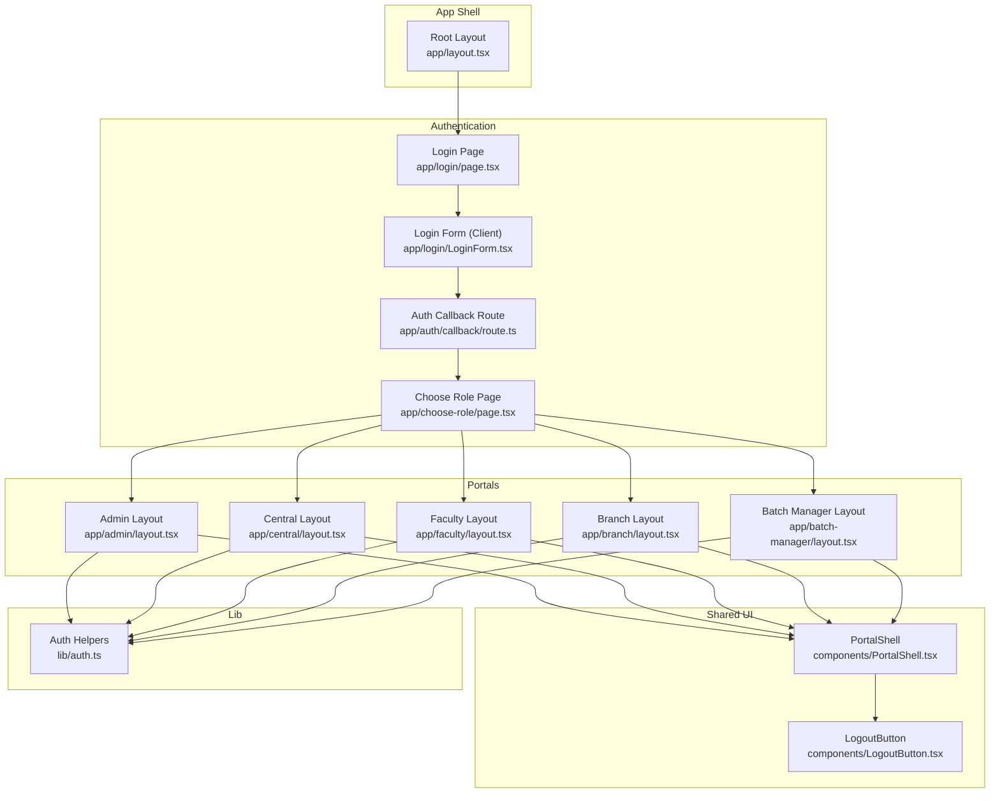
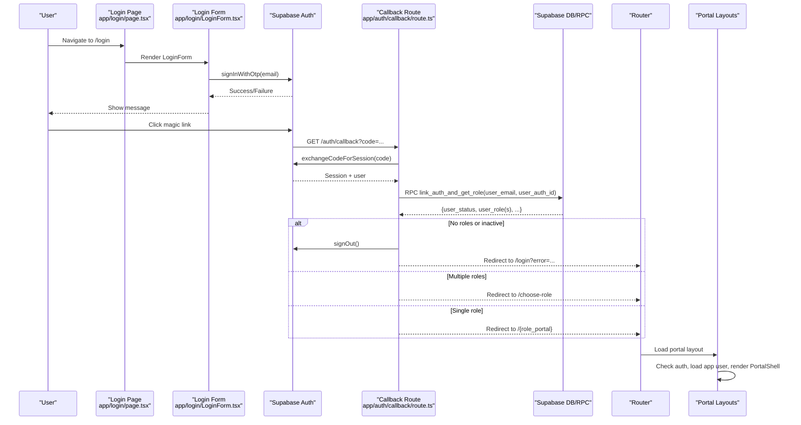
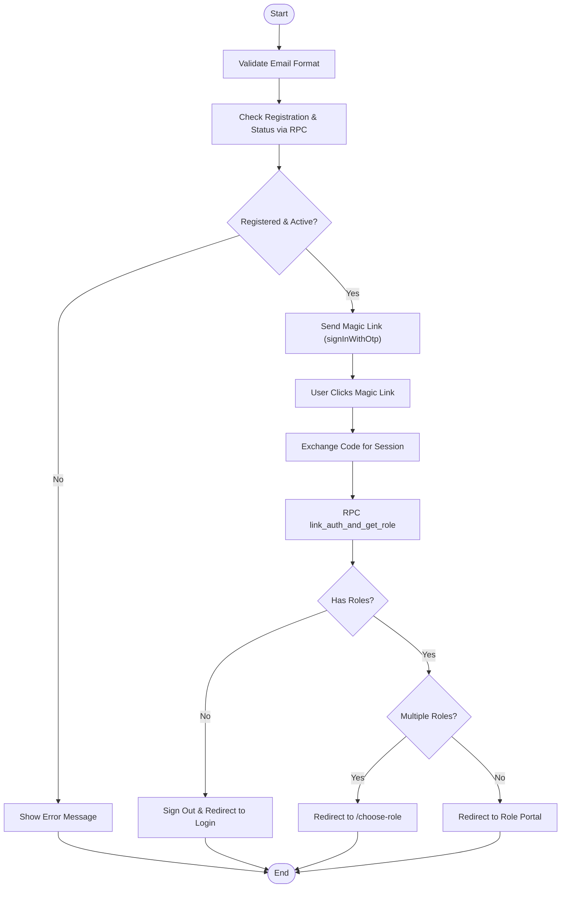
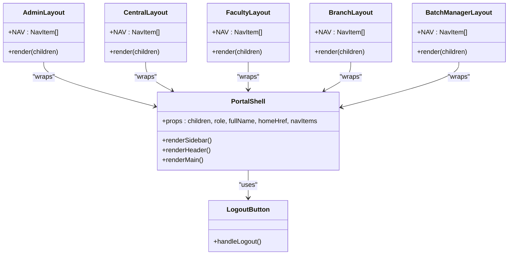
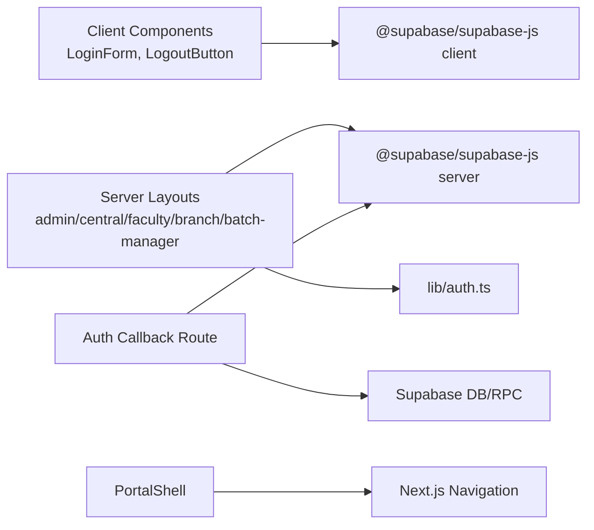

# System Architecture

<cite>
**Referenced Files in This Document**
- [README.md](file://README.md)
- [app/layout.tsx](file://app/layout.tsx)
- [components/PortalShell.tsx](file://components/PortalShell.tsx)
- [components/LogoutButton.tsx](file://components/LogoutButton.tsx)
- [lib/auth.ts](file://lib/auth.ts)
- [app/login/page.tsx](file://app/login/page.tsx)
- [app/login/LoginForm.tsx](file://app/login/LoginForm.tsx)
- [app/auth/callback/route.ts](file://app/auth/callback/route.ts)
- [app/admin/layout.tsx](file://app/admin/layout.tsx)
- [app/central/layout.tsx](file://app/central/layout.tsx)
- [app/faculty/layout.tsx](file://app/faculty/layout.tsx)
- [app/branch/layout.tsx](file://app/branch/layout.tsx)
- [app/batch-manager/layout.tsx](file://app/batch-manager/layout.tsx)
- [app/choose-role/page.tsx](file://app/choose-role/page.tsx)
</cite>

## Table of Contents
1. Introduction
2. Project Structure
3. Core Components
4. Architecture Overview
5. Detailed Component Analysis
6. Dependency Analysis
7. Performance Considerations
8. Troubleshooting Guide
9. Conclusion

## Introduction
This document describes the architecture of the Superclass Portal, a Next.js App Router application that provides role-based portals for Admin, Central Team, Faculty, Branch Head, and Batch Manager roles. It integrates with Supabase for authentication (magic link via OTP) and data access, and uses server-side layouts to enforce access control and render consistent shell UIs per portal. The system is designed around clear boundaries between frontend components, server routes, and backend services, with a multi-portal structure that isolates navigation and features by role.

## Project Structure
The project follows Next.js App Router conventions:
- app/: Route segments and layout files define portals and shared root layout
- components/: Reusable UI components including the portal shell and logout button
- lib/: Shared utilities including auth helpers and Supabase client wrappers
- scripts/: Database introspection and import utilities
- Configuration files at the repository root for Next.js, TypeScript, ESLint, PostCSS

**Diagram sources**
- [app/layout.tsx:1-34](file://app/layout.tsx#L1-L34)
- [app/login/page.tsx:1-15](file://app/login/page.tsx#L1-L15)
- [app/login/LoginForm.tsx:1-149](file://app/login/LoginForm.tsx#L1-L149)
- [app/auth/callback/route.ts:1-68](file://app/auth/callback/route.ts#L1-L68)
- [app/choose-role/page.tsx:1-86](file://app/choose-role/page.tsx#L1-L86)
- [app/admin/layout.tsx:1-36](file://app/admin/layout.tsx#L1-L36)
- [app/central/layout.tsx:1-32](file://app/central/layout.tsx#L1-L32)
- [app/faculty/layout.tsx:1-30](file://app/faculty/layout.tsx#L1-L30)
- [app/branch/layout.tsx:1-27](file://app/branch/layout.tsx#L1-L27)
- [app/batch-manager/layout.tsx:1-29](file://app/batch-manager/layout.tsx#L1-L29)
- [components/PortalShell.tsx:1-184](file://components/PortalShell.tsx#L1-L184)
- [components/LogoutButton.tsx:1-24](file://components/LogoutButton.tsx#L1-L24)
- [lib/auth.ts:1-69](file://lib/auth.ts#L1-L69)

**Section sources**
- [README.md:1-37](file://README.md#L1-L37)
- [app/layout.tsx:1-34](file://app/layout.tsx#L1-L34)

## Core Components
- PortalShell: A client component that renders a consistent sidebar/header, user info, active nav highlighting, and action area. It accepts role, full name, home route, and navigation items to tailor each portal’s look and behavior.
- LogoutButton: A client component that signs out via Supabase and redirects to login.
- Auth helpers: Server-side functions to fetch app user profile, compute centre IDs, and check roles. These are used by server layouts to gate access and personalize shells.

Key responsibilities:
- Consistent UI across portals via PortalShell
- Authentication state checks and redirection in server layouts
- Role-based navigation configuration per portal

**Section sources**
- [components/PortalShell.tsx:1-184](file://components/PortalShell.tsx#L1-L184)
- [components/LogoutButton.tsx:1-24](file://components/LogoutButton.tsx#L1-L24)
- [lib/auth.ts:1-69](file://lib/auth.ts#L1-L69)

## Architecture Overview
The system uses Next.js App Router for routing and layout composition. Authentication is handled by Supabase magic links (OTP). After clicking the magic link, the callback route exchanges the code for a session, validates the user’s registration and status, resolves active roles, and redirects to either a single portal or a role selection page. Each portal has its own layout that enforces authentication, loads user context, and wraps content with PortalShell.

**Diagram sources**
- [app/login/page.tsx:1-15](file://app/login/page.tsx#L1-L15)
- [app/login/LoginForm.tsx:1-149](file://app/login/LoginForm.tsx#L1-L149)
- [app/auth/callback/route.ts:1-68](file://app/auth/callback/route.ts#L1-L68)
- [app/admin/layout.tsx:1-36](file://app/admin/layout.tsx#L1-L36)
- [app/central/layout.tsx:1-32](file://app/central/layout.tsx#L1-L32)
- [app/faculty/layout.tsx:1-30](file://app/faculty/layout.tsx#L1-L30)
- [app/branch/layout.tsx:1-27](file://app/branch/layout.tsx#L1-L27)
- [app/batch-manager/layout.tsx:1-29](file://app/batch-manager/layout.tsx#L1-L29)

## Detailed Component Analysis

### Authentication Flow (Magic Link)
- Login form validates email format and checks registration and activation via an RPC call before sending OTP.
- On success, the user clicks the magic link; the callback route exchanges the code for a session, verifies user existence and status, resolves active roles, and handles single vs multiple roles.
- If multiple roles exist, users are directed to choose a portal; otherwise they are redirected to the corresponding portal.

**Diagram sources**
- [app/login/LoginForm.tsx:1-149](file://app/login/LoginForm.tsx#L1-L149)
- [app/auth/callback/route.ts:1-68](file://app/auth/callback/route.ts#L1-L68)

**Section sources**
- [app/login/LoginForm.tsx:1-149](file://app/login/LoginForm.tsx#L1-L149)
- [app/auth/callback/route.ts:1-68](file://app/auth/callback/route.ts#L1-L68)
- [app/choose-role/page.tsx:1-86](file://app/choose-role/page.tsx#L1-L86)

### Role-Based Routing and Portals
Each portal defines its own layout that:
- Ensures the user is authenticated
- Loads app user details using auth helpers
- Renders PortalShell with role-specific navigation

**Diagram sources**
- [components/PortalShell.tsx:1-184](file://components/PortalShell.tsx#L1-L184)
- [components/LogoutButton.tsx:1-24](file://components/LogoutButton.tsx#L1-L24)
- [app/admin/layout.tsx:1-36](file://app/admin/layout.tsx#L1-L36)
- [app/central/layout.tsx:1-32](file://app/central/layout.tsx#L1-L32)
- [app/faculty/layout.tsx:1-30](file://app/faculty/layout.tsx#L1-L30)
- [app/branch/layout.tsx:1-27](file://app/branch/layout.tsx#L1-L27)
- [app/batch-manager/layout.tsx:1-29](file://app/batch-manager/layout.tsx#L1-L29)

**Section sources**
- [app/admin/layout.tsx:1-36](file://app/admin/layout.tsx#L1-L36)
- [app/central/layout.tsx:1-32](file://app/central/layout.tsx#L1-L32)
- [app/faculty/layout.tsx:1-30](file://app/faculty/layout.tsx#L1-L30)
- [app/branch/layout.tsx:1-27](file://app/branch/layout.tsx#L1-L27)
- [app/batch-manager/layout.tsx:1-29](file://app/batch-manager/layout.tsx#L1-L29)
- [components/PortalShell.tsx:1-184](file://components/PortalShell.tsx#L1-L184)
- [components/LogoutButton.tsx:1-24](file://components/LogoutButton.tsx#L1-L24)

### Data Access Patterns and Utilities
- getAppUser: Fetches app user profile by auth ID or email, auto-links auth ID on first successful lookup, and returns enriched user data including centre relationships.
- getUserCentreIds: Normalizes centre membership from user_centres or legacy centre_id.
- hasRole: Checks if a user has a specific role considering both array and scalar role fields.

These utilities support server layouts and pages to make decisions about access and personalization.

**Section sources**
- [lib/auth.ts:1-69](file://lib/auth.ts#L1-L69)

## Dependency Analysis
High-level dependencies:
- Client components depend on Supabase client for interactive flows (login, logout)
- Server layouts depend on Supabase server client to read current user and app user profile
- Callback route orchestrates session exchange and role resolution
- PortalShell depends on Next.js navigation and local props for rendering

**Diagram sources**
- [app/login/LoginForm.tsx:1-149](file://app/login/LoginForm.tsx#L1-L149)
- [components/LogoutButton.tsx:1-24](file://components/LogoutButton.tsx#L1-L24)
- [app/auth/callback/route.ts:1-68](file://app/auth/callback/route.ts#L1-L68)
- [lib/auth.ts:1-69](file://lib/auth.ts#L1-L69)
- [components/PortalShell.tsx:1-184](file://components/PortalShell.tsx#L1-L184)

**Section sources**
- [app/login/LoginForm.tsx:1-149](file://app/login/LoginForm.tsx#L1-L149)
- [components/LogoutButton.tsx:1-24](file://components/LogoutButton.tsx#L1-L24)
- [app/auth/callback/route.ts:1-68](file://app/auth/callback/route.ts#L1-L68)
- [lib/auth.ts:1-69](file://lib/auth.ts#L1-L69)
- [components/PortalShell.tsx:1-184](file://components/PortalShell.tsx#L1-L184)

## Performance Considerations
- Prefer server-side checks in layouts to minimize client-side auth round-trips.
- Use maybeSingle queries to avoid unnecessary error handling when expecting zero or one row.
- Cache frequently accessed user metadata where appropriate to reduce repeated DB calls.
- Keep navigation lists static within layouts to avoid re-computation on each render.

[No sources needed since this section provides general guidance]

## Troubleshooting Guide
Common issues and resolutions:
- Invalid or expired magic link: Ensure the callback route successfully exchanges the code for a session and handle errors by redirecting back to login with an error parameter.
- Unregistered or inactive accounts: Verify RPC results and ensure proper redirection with descriptive error messages.
- Multiple roles: Confirm the choose-role page displays all available roles and redirects correctly based on selection.
- Missing email: Handle cases where the authenticated user lacks an email by redirecting to login with an appropriate error.

**Section sources**
- [app/auth/callback/route.ts:1-68](file://app/auth/callback/route.ts#L1-L68)
- [app/choose-role/page.tsx:1-86](file://app/choose-role/page.tsx#L1-L86)
- [app/login/LoginForm.tsx:1-149](file://app/login/LoginForm.tsx#L1-L149)

## Conclusion
The Superclass Portal leverages Next.js App Router for structured, role-based routing and Supabase for secure, passwordless authentication. Server layouts enforce access control and provide consistent shells through PortalShell, while the callback route centralizes session establishment and role resolution. This design yields clear separation of concerns, predictable navigation per role, and a scalable foundation for adding new portals or features.