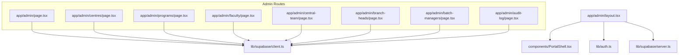
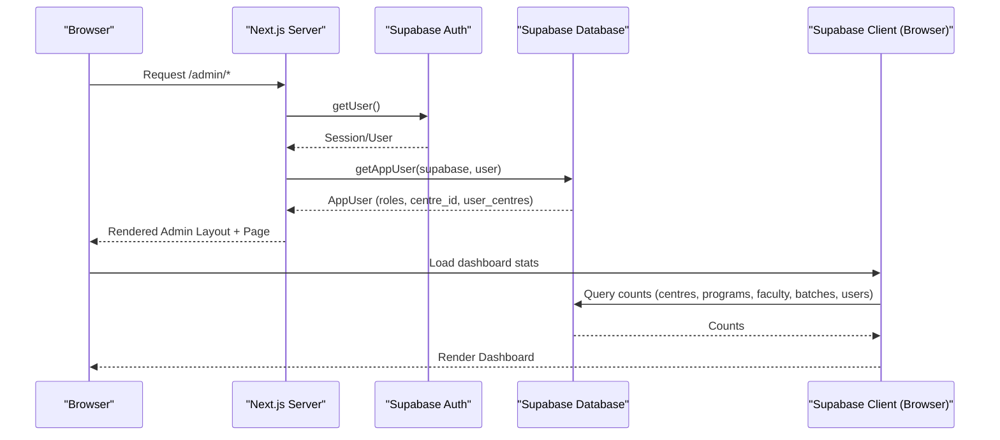
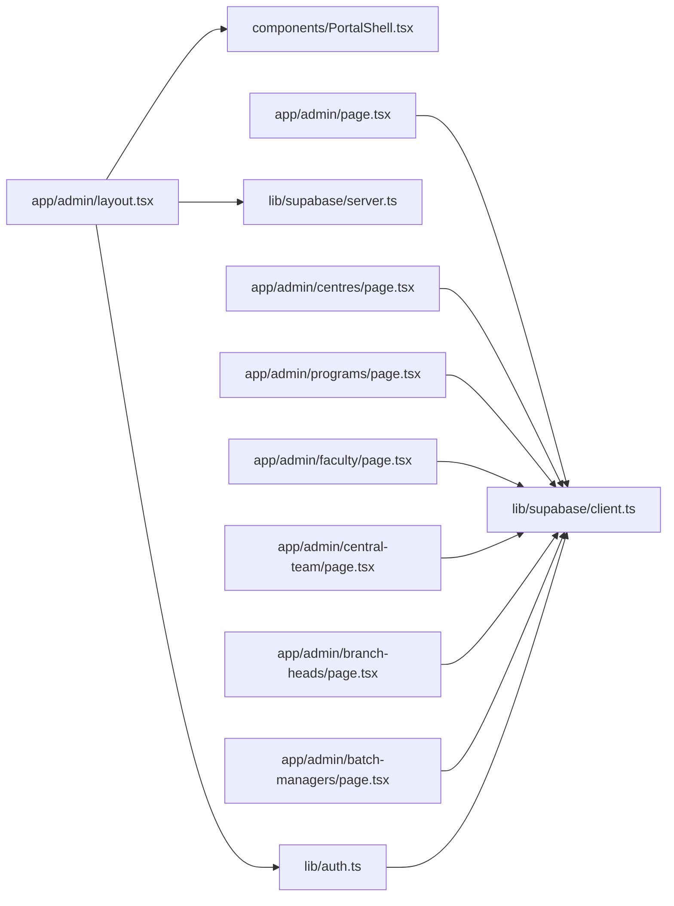

# Admin Portal

<cite>
**Referenced Files in This Document**
- [app/admin/page.tsx](file://app/admin/page.tsx)
- [app/admin/layout.tsx](file://app/admin/layout.tsx)
- [components/PortalShell.tsx](file://components/PortalShell.tsx)
- [lib/auth.ts](file://lib/auth.ts)
- [lib/supabase/client.ts](file://lib/supabase/client.ts)
- [lib/supabase/server.ts](file://lib/supabase/server.ts)
- [app/admin/centres/page.tsx](file://app/admin/centres/page.tsx)
- [app/admin/programs/page.tsx](file://app/admin/programs/page.tsx)
- [app/admin/faculty/page.tsx](file://app/admin/faculty/page.tsx)
- [app/admin/central-team/page.tsx](file://app/admin/central-team/page.tsx)
- [app/admin/branch-heads/page.tsx](file://app/admin/branch-heads/page.tsx)
- [app/admin/batch-managers/page.tsx](file://app/admin/batch-managers/page.tsx)
- [app/admin/audit-log/page.tsx](file://app/admin/audit-log/page.tsx)
</cite>

## Table of Contents
1. [Introduction](#introduction)
2. [Project Structure](#project-structure)
3. [Core Components](#core-components)
4. [Architecture Overview](#architecture-overview)
5. [Detailed Component Analysis](#detailed-component-analysis)
6. [Dependency Analysis](#dependency-analysis)
7. [Performance Considerations](#performance-considerations)
8. [Troubleshooting Guide](#troubleshooting-guide)
9. [Conclusion](#conclusion)
10. [Appendices](#appendices)

## Introduction
The Admin Portal is the primary administrative interface for system management within the Superclass platform. It provides a centralized dashboard and dedicated pages to manage centres, programs and subjects, faculty accounts, central team members, branch heads, batch managers, and audit logs. The portal enforces authentication and role-based access, presents key metrics on the dashboard, and supports common administrative workflows such as adding or editing entities, assigning roles, and toggling user status.

## Project Structure
The Admin Portal is implemented as a Next.js application using the App Router. Each admin feature is a route under app/admin with its own page component. A shared layout wraps all admin routes to enforce authentication and render the navigation shell. Shared UI components are provided by a reusable shell component.

**Diagram sources**
- [app/admin/layout.tsx:1-36](file://app/admin/layout.tsx#L1-L36)
- [components/PortalShell.tsx:1-184](file://components/PortalShell.tsx#L1-L184)
- [lib/auth.ts:1-69](file://lib/auth.ts#L1-L69)
- [lib/supabase/server.ts:1-29](file://lib/supabase/server.ts#L1-L29)
- [lib/supabase/client.ts:1-8](file://lib/supabase/client.ts#L1-L8)
- [app/admin/page.tsx:1-75](file://app/admin/page.tsx#L1-L75)
- [app/admin/centres/page.tsx:1-241](file://app/admin/centres/page.tsx#L1-L241)
- [app/admin/programs/page.tsx:1-290](file://app/admin/programs/page.tsx#L1-L290)
- [app/admin/faculty/page.tsx:1-469](file://app/admin/faculty/page.tsx#L1-L469)
- [app/admin/central-team/page.tsx:1-289](file://app/admin/central-team/page.tsx#L1-L289)
- [app/admin/branch-heads/page.tsx:1-336](file://app/admin/branch-heads/page.tsx#L1-L336)
- [app/admin/batch-managers/page.tsx:1-201](file://app/admin/batch-managers/page.tsx#L1-L201)
- [app/admin/audit-log/page.tsx:1-75](file://app/admin/audit-log/page.tsx#L1-L75)

**Section sources**
- [app/admin/layout.tsx:1-36](file://app/admin/layout.tsx#L1-L36)
- [components/PortalShell.tsx:1-184](file://components/PortalShell.tsx#L1-L184)
- [lib/auth.ts:1-69](file://lib/auth.ts#L1-L69)
- [lib/supabase/server.ts:1-29](file://lib/supabase/server.ts#L1-L29)
- [lib/supabase/client.ts:1-8](file://lib/supabase/client.ts#L1-L8)

## Core Components
- Admin Layout: Enforces authentication, resolves the current app user, and renders the shared navigation shell with admin-specific menu items.
- Dashboard Page: Displays key metrics (centres, programs, faculty, batches, total users) and quick links to all admin features.
- Shared Shell: Provides consistent sidebar navigation, header, and utility components like PageHeader, Card, Alert, and buttons.

Key responsibilities:
- Authentication and session handling via Supabase server client.
- Role resolution and user context retrieval.
- Centralized navigation and UI consistency across admin pages.

**Section sources**
- [app/admin/layout.tsx:1-36](file://app/admin/layout.tsx#L1-L36)
- [app/admin/page.tsx:1-75](file://app/admin/page.tsx#L1-L75)
- [components/PortalShell.tsx:1-184](file://components/PortalShell.tsx#L1-L184)
- [lib/auth.ts:1-69](file://lib/auth.ts#L1-L69)
- [lib/supabase/server.ts:1-29](file://lib/supabase/server.ts#L1-L29)

## Architecture Overview
The Admin Portal follows a client-server architecture:
- Server-side layout checks authentication and loads the app user profile.
- Client-side pages use the Supabase browser client to read/write data.
- Roles are stored per user and can be single or multi-role arrays.
- Data models include centres, programs, subjects, faculty assignments, and audit logs.

**Diagram sources**
- [app/admin/layout.tsx:1-36](file://app/admin/layout.tsx#L1-L36)
- [lib/auth.ts:1-69](file://lib/auth.ts#L1-L69)
- [lib/supabase/server.ts:1-29](file://lib/supabase/server.ts#L1-L29)
- [app/admin/page.tsx:1-75](file://app/admin/page.tsx#L1-L75)
- [lib/supabase/client.ts:1-8](file://lib/supabase/client.ts#L1-L8)

## Detailed Component Analysis

### Dashboard Overview
- Purpose: Provide an at-a-glance view of system health and quick access to admin functions.
- Metrics displayed:
  - Centres count
  - Programs count
  - Faculty count
  - Batches count
  - Total users
- Navigation: Grid of cards linking to each admin section.

Dashboard layout description:
- Top header with title and short description.
- Five metric cards arranged horizontally on larger screens, stacked on smaller screens.
- Below metrics, a responsive grid of action cards for each admin module.

Data flow:
- On mount, the dashboard queries counts from multiple tables concurrently and updates state.

**Section sources**
- [app/admin/page.tsx:1-75](file://app/admin/page.tsx#L1-L75)

### Centre Management
- Capabilities:
  - Add new centres with name and city.
  - Edit existing centre details.
  - Toggle active/inactive status.
  - Delete centres (with integrity constraints enforced by the database).
- Validation rules:
  - Name and city fields are required before saving.
  - Trimmed inputs are persisted.
- User workflow:
  - Open Manage Centres page.
  - Click “+ Add Centre”, fill form, submit.
  - Use Edit to modify fields; toggle Active/Inactive to control visibility.
  - Delete triggers confirmation and error alert if linked records prevent deletion.

Notes:
- Branch head assignment is managed separately in the Branch Heads page; this page focuses on centre metadata and lifecycle.

**Section sources**
- [app/admin/centres/page.tsx:1-241](file://app/admin/centres/page.tsx#L1-L241)

### Program and Subject Management
- Capabilities:
  - Create programs with optional initial subjects (comma-separated list).
  - Edit program names.
  - Expand a program to add or remove individual subjects.
  - Delete programs (subject to referential integrity).
- Validation rules:
  - Program name is required.
  - Subjects are trimmed and deduplicated by insertion logic.
- User workflow:
  - Add a program and optionally seed subjects.
  - Expand any program card to add more subjects or delete existing ones.
  - Edit program name inline via the edit action.

**Section sources**
- [app/admin/programs/page.tsx:1-290](file://app/admin/programs/page.tsx#L1-L290)

### Faculty Account Administration
- Capabilities:
  - Add new faculty or update existing users with the faculty role.
  - Assign a centre to a faculty member.
  - Select subjects taught by a faculty member (many-to-many via a join table).
  - Toggle faculty status between active and inactive.
  - Delete faculty (with integrity safeguards).
- Validation rules:
  - Full name and email are required.
  - Email is normalized to lowercase.
  - If an existing user matches the email, their roles are merged to include faculty and status set to active.
- User workflow:
  - Search/filter faculty by name/email and centre.
  - Add/Edit opens a form with fields for personal info, type, centre, and subject selection.
  - Save persists user record and synchronizes subject assignments.

**Section sources**
- [app/admin/faculty/page.tsx:1-469](file://app/admin/faculty/page.tsx#L1-L469)

### Central Team Member Management
- Capabilities:
  - Add or update central team members.
  - Merge roles if the user already exists.
  - Toggle active/inactive status.
  - Remove members (with integrity safeguards).
- Validation rules:
  - Full name and email are required.
  - Email normalization applied.
- User workflow:
  - Use the form to add a new member or edit existing details.
  - Status toggles allow quick deactivation without deletion.

**Section sources**
- [app/admin/central-team/page.tsx:1-289](file://app/admin/central-team/page.tsx#L1-L289)

### Branch Head Assignments
- Capabilities:
  - Add or update branch heads and assign them to a specific centre.
  - Update both the user’s centre association and the centre’s branch_head_id for convenience.
  - Toggle active/inactive status.
  - Remove branch heads (with integrity safeguards).
- Validation rules:
  - Full name, email, and centre are required.
  - Email normalization applied.
- User workflow:
  - Choose a centre from the dropdown when adding/editing.
  - Saving ensures both user-level and centre-level references are synchronized.

**Section sources**
- [app/admin/branch-heads/page.tsx:1-336](file://app/admin/branch-heads/page.tsx#L1-L336)

### Batch Manager Oversight
- Capabilities:
  - Add or update batch managers and assign them to a centre.
  - Maintain a user-centre mapping table to support multi-centre associations.
  - Toggle active/inactive status.
- Validation rules:
  - Full name, email, and centre are required.
  - Email normalization applied.
- User workflow:
  - Fill out the manager form and save.
  - The system upserts the user-centre relationship to mark the assigned centre as primary.

**Section sources**
- [app/admin/batch-managers/page.tsx:1-201](file://app/admin/batch-managers/page.tsx#L1-L201)

### Audit Log Monitoring
- Capabilities:
  - View recent system activity including user, action, entity type, and timestamp.
  - Sorted by most recent first, limited to last 100 entries.
- User workflow:
  - Navigate to Audit Log to review actions taken across the platform.

**Section sources**
- [app/admin/audit-log/page.tsx:1-75](file://app/admin/audit-log/page.tsx#L1-L75)

### Permission Levels and Access Control
- Authentication:
  - The admin layout requires an authenticated session; unauthenticated users are redirected to login.
- Role model:
  - Users may have a single role or multiple roles stored in an array field.
  - Helper utilities provide role checking and centre membership resolution.
- Admin scope:
  - The admin layout renders the full admin navigation for authenticated users.
  - Additional role-based guards can be added per page if stricter restrictions are needed.

Common roles used across admin pages:
- faculty
- central_team
- branch_head
- batch_manager

**Section sources**
- [app/admin/layout.tsx:1-36](file://app/admin/layout.tsx#L1-L36)
- [lib/auth.ts:1-69](file://lib/auth.ts#L1-L69)

## Dependency Analysis
This section maps how modules depend on each other and where external integrations occur.

**Diagram sources**
- [app/admin/layout.tsx:1-36](file://app/admin/layout.tsx#L1-L36)
- [components/PortalShell.tsx:1-184](file://components/PortalShell.tsx#L1-L184)
- [lib/auth.ts:1-69](file://lib/auth.ts#L1-L69)
- [lib/supabase/server.ts:1-29](file://lib/supabase/server.ts#L1-L29)
- [lib/supabase/client.ts:1-8](file://lib/supabase/client.ts#L1-L8)
- [app/admin/page.tsx:1-75](file://app/admin/page.tsx#L1-L75)
- [app/admin/centres/page.tsx:1-241](file://app/admin/centres/page.tsx#L1-L241)
- [app/admin/programs/page.tsx:1-290](file://app/admin/programs/page.tsx#L1-L290)
- [app/admin/faculty/page.tsx:1-469](file://app/admin/faculty/page.tsx#L1-L469)
- [app/admin/central-team/page.tsx:1-289](file://app/admin/central-team/page.tsx#L1-L289)
- [app/admin/branch-heads/page.tsx:1-336](file://app/admin/branch-heads/page.tsx#L1-L336)
- [app/admin/batch-managers/page.tsx:1-201](file://app/admin/batch-managers/page.tsx#L1-L201)

**Section sources**
- [app/admin/layout.tsx:1-36](file://app/admin/layout.tsx#L1-L36)
- [components/PortalShell.tsx:1-184](file://components/PortalShell.tsx#L1-L184)
- [lib/auth.ts:1-69](file://lib/auth.ts#L1-L69)
- [lib/supabase/server.ts:1-29](file://lib/supabase/server.ts#L1-L29)
- [lib/supabase/client.ts:1-8](file://lib/supabase/client.ts#L1-L8)

## Performance Considerations
- Concurrent data fetching:
  - Dashboard aggregates counts using parallel queries to minimize load time.
- Efficient filtering:
  - Faculty listing includes client-side search and centre filter to reduce re-renders.
- Minimal re-fetches:
  - Pages reload only after successful mutations to keep UI consistent.
- Recommendations:
  - Consider pagination for large datasets (e.g., audit log, faculty).
  - Cache frequently accessed reference data (centres, programs) to avoid repeated network calls.
  - Debounce search input for better responsiveness.

[No sources needed since this section provides general guidance]

## Troubleshooting Guide
- Cannot delete a centre or program:
  - Deletion may fail due to referential constraints (e.g., linked batches or planners). Prefer deactivating or removing dependencies first.
- Faculty not appearing after adding:
  - Ensure the user has the faculty role; the add/update flow merges roles automatically.
  - Check that the email was normalized and no duplicate conflicts occurred.
- Branch head not reflected on centre:
  - Saving a branch head updates both the user’s centre association and the centre’s branch_head_id. Verify both fields if discrepancies appear.
- Batch manager not assigned to centre:
  - The system upserts a user-centre mapping. Confirm the mapping entry exists if the assignment does not reflect immediately.
- Audit log empty:
  - Only recent events are shown. Ensure logging is enabled in relevant flows.

**Section sources**
- [app/admin/centres/page.tsx:101-109](file://app/admin/centres/page.tsx#L101-L109)
- [app/admin/programs/page.tsx:120-128](file://app/admin/programs/page.tsx#L120-L128)
- [app/admin/faculty/page.tsx:224-232](file://app/admin/faculty/page.tsx#L224-L232)
- [app/admin/branch-heads/page.tsx:169-177](file://app/admin/branch-heads/page.tsx#L169-L177)
- [app/admin/batch-managers/page.tsx:94-101](file://app/admin/batch-managers/page.tsx#L94-L101)
- [app/admin/audit-log/page.tsx:19-31](file://app/admin/audit-log/page.tsx#L19-L31)

## Conclusion
The Admin Portal consolidates essential administrative tasks into a cohesive interface with clear navigation, robust validation, and consistent UX patterns. It supports managing operational entities (centres, programs, subjects), user roles (faculty, central team, branch heads, batch managers), and monitoring system activity through audit logs. With role-aware layouts and efficient data operations, it provides a solid foundation for day-to-day administration and future enhancements such as advanced permissions, pagination, and richer analytics.

[No sources needed since this section summarizes without analyzing specific files]

## Appendices

### Dashboard Screenshots Description
- Header: Title “Admin Dashboard” with a brief description.
- Metrics row: Five cards showing counts for Centres, Programs, Faculty, Batches, and Total Users.
- Action grid: Cards linking to Manage Centres, Manage Programs, Manage Faculty, Central Team, Branch Heads, Batch Managers, and Audit Log.

[No sources needed since this section describes UI without analyzing specific files]

### Common Administrative Tasks
- Add a new centre:
  - Navigate to Manage Centres, click “+ Add Centre”, enter name and city, and save.
- Assign a branch head to a centre:
  - Go to Branch Heads, add a new head, select the centre, and save.
- Add a faculty member and assign subjects:
  - In Manage Faculty, open the form, fill details, choose a centre, select subjects, and save.
- Activate/deactivate a user:
  - Use the status toggle on the respective user list to switch between active and inactive.
- Review recent activity:
  - Visit Audit Log to see the latest 100 events with user, action, entity, and time.

[No sources needed since this section provides general guidance]