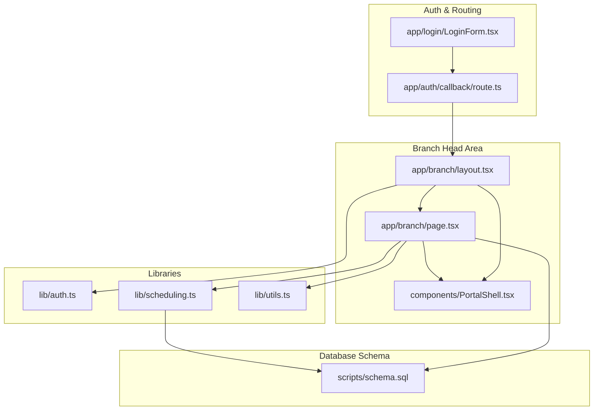
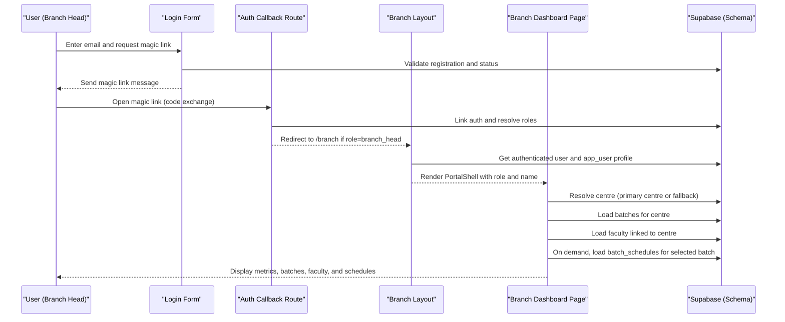
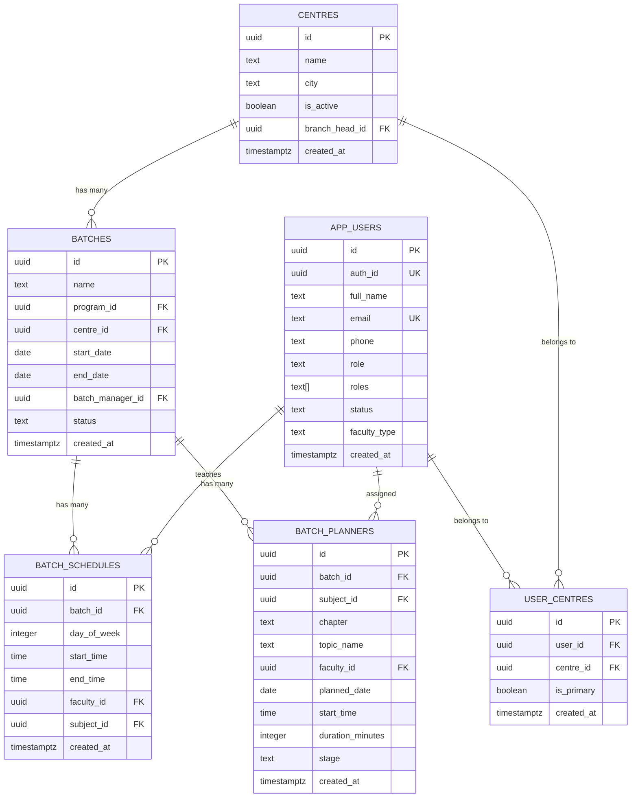
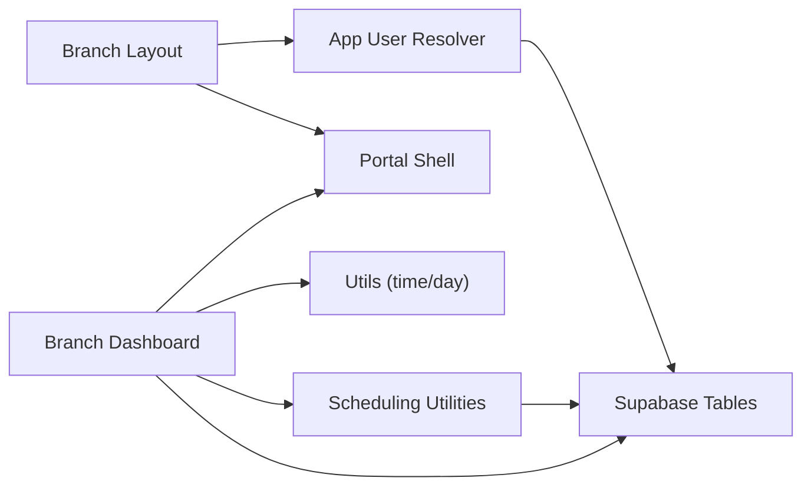

# Branch Head Portal

<cite>
**Referenced Files in This Document**
- [page.tsx](file://app/branch/page.tsx)
- [layout.tsx](file://app/branch/layout.tsx)
- [PortalShell.tsx](file://components/PortalShell.tsx)
- [auth.ts](file://lib/auth.ts)
- [scheduling.ts](file://lib/scheduling.ts)
- [utils.ts](file://lib/utils.ts)
- [schema.sql](file://scripts/schema.sql)
- [route.ts](file://app/auth/callback/route.ts)
- [LoginForm.tsx](file://app/login/LoginForm.tsx)
</cite>

## Table of Contents
1. [Introduction](#introduction)
2. [Project Structure](#project-structure)
3. [Core Components](#core-components)
4. [Architecture Overview](#architecture-overview)
5. [Detailed Component Analysis](#detailed-component-analysis)
6. [Dependency Analysis](#dependency-analysis)
7. [Performance Considerations](#performance-considerations)
8. [Troubleshooting Guide](#troubleshooting-guide)
9. [Conclusion](#conclusion)

## Introduction
The Branch Head Portal is a role-based dashboard for centre managers to oversee academic operations at their assigned location(s). It provides:
- A centre-specific overview with key metrics (total and active batches, faculty counts).
- A list of batches with expandable weekly schedules to monitor class timetables and identify conflicts.
- A view of faculty members linked to the centre, including type indicators.
- Integration points for scheduling conflict detection and escalation workflows via admin tools.

This document explains how branch heads can monitor activities, review faculty schedules, track batch progress, detect potential scheduling conflicts or resource issues, and understand reporting and escalation procedures available through the portal’s administrative features.

## Project Structure
The Branch Head experience is implemented as a Next.js App Router route with a layout wrapper and a client-side dashboard page. Shared UI components are provided by a reusable shell. Authentication and authorization flow routes users into the correct role-based area.

**Diagram sources**
- [layout.tsx:1-27](file://app/branch/layout.tsx#L1-L27)
- [page.tsx:1-242](file://app/branch/page.tsx#L1-L242)
- [PortalShell.tsx:1-184](file://components/PortalShell.tsx#L1-L184)
- [auth.ts:1-69](file://lib/auth.ts#L1-L69)
- [scheduling.ts:1-113](file://lib/scheduling.ts#L1-L113)
- [utils.ts:1-74](file://lib/utils.ts#L1-L74)
- [schema.sql:1-269](file://scripts/schema.sql#L1-L269)
- [route.ts:1-68](file://app/auth/callback/route.ts#L1-L68)
- [LoginForm.tsx:1-149](file://app/login/LoginForm.tsx#L1-L149)

**Section sources**
- [layout.tsx:1-27](file://app/branch/layout.tsx#L1-L27)
- [page.tsx:1-242](file://app/branch/page.tsx#L1-L242)
- [PortalShell.tsx:1-184](file://components/PortalShell.tsx#L1-L184)
- [auth.ts:1-69](file://lib/auth.ts#L1-L69)
- [scheduling.ts:1-113](file://lib/scheduling.ts#L1-L113)
- [utils.ts:1-74](file://lib/utils.ts#L1-L74)
- [schema.sql:1-269](file://scripts/schema.sql#L1-L269)
- [route.ts:1-68](file://app/auth/callback/route.ts#L1-L68)
- [LoginForm.tsx:1-149](file://app/login/LoginForm.tsx#L1-L149)

## Core Components
- Branch Layout: Enforces authentication and renders the role-branded shell with navigation.
- Branch Dashboard: Loads centre context, batches, faculty, and per-batch schedules; displays metrics and details.
- Portal Shell: Provides consistent sidebar/header, logout, and common UI primitives (cards, alerts, buttons).
- Auth Utilities: Resolves app user profile and roles from Supabase.
- Scheduling Utilities: Detects recurring and one-off schedule overlaps for conflict checks.
- Utils: Time formatting, day labels, overlap helpers.
- Database Schema: Defines entities such as centres, app_users, user_centres, batches, batch_schedules, and batch_planners.

Key responsibilities:
- Centre scoping: The dashboard resolves the current user’s primary centre and filters data accordingly.
- Metrics: Counts total and active batches, and lists faculty members associated with the centre.
- Schedule visibility: Expandable per-batch timetable shows recurring weekly slots and assigned faculty.
- Conflict awareness: Overlap utilities support identifying scheduling conflicts when planning or reviewing assignments.

**Section sources**
- [layout.tsx:1-27](file://app/branch/layout.tsx#L1-L27)
- [page.tsx:1-242](file://app/branch/page.tsx#L1-L242)
- [PortalShell.tsx:1-184](file://components/PortalShell.tsx#L1-L184)
- [auth.ts:1-69](file://lib/auth.ts#L1-L69)
- [scheduling.ts:1-113](file://lib/scheduling.ts#L1-L113)
- [utils.ts:1-74](file://lib/utils.ts#L1-L74)
- [schema.sql:1-269](file://scripts/schema.sql#L1-L269)

## Architecture Overview
The Branch Head Portal follows a client-server architecture with Next.js App Router and Supabase for auth and data.

**Diagram sources**
- [LoginForm.tsx:1-149](file://app/login/LoginForm.tsx#L1-L149)
- [route.ts:1-68](file://app/auth/callback/route.ts#L1-L68)
- [layout.tsx:1-27](file://app/branch/layout.tsx#L1-L27)
- [page.tsx:1-242](file://app/branch/page.tsx#L1-L242)
- [schema.sql:1-269](file://scripts/schema.sql#L1-L269)

## Detailed Component Analysis

### Branch Layout
- Purpose: Protects the branch area, ensures an authenticated session, and wraps content with the role-branded shell.
- Behavior:
  - Checks for an authenticated user and redirects to login if missing.
  - Retrieves app_user profile to display full name and role label.
  - Renders the PortalShell with a single “Dashboard” navigation item.

Operational implications:
- Ensures only authenticated users access the branch area.
- Establishes the visual identity and navigation context for branch head users.

**Section sources**
- [layout.tsx:1-27](file://app/branch/layout.tsx#L1-L27)

### Branch Dashboard Page
- Purpose: Presents a centre-scoped overview with metrics, batches, and faculty.
- Data loading:
  - Resolves the current user and fetches app_user record.
  - Determines the effective centre using either the primary centre mapping or a legacy centre reference.
  - Loads batches for that centre and faculty members linked via user-centre relationships.
- Interactions:
  - Expands a batch to reveal its weekly schedule entries, including day, time range, and assigned faculty.
  - Displays summary cards for total batches, active batches, faculty count, and permanent faculty count.

Centre scoping logic:
- Prefers the primary centre from the junction table; falls back to the legacy centre field if needed.
- Filters batches by centre_id and faculty by user-centre associations.

Schedule expansion:
- Fetches batch_schedules on demand for a specific batch and caches them locally to avoid repeated requests.

Metrics:
- Total Batches: Count of all batches under the centre.
- Active Batches: Count where status equals active.
- Faculty Members: Count of active faculty linked to the centre.
- Permanent Faculty: Subset of faculty marked as permanent.

Alerts:
- Shows informational messages when no batches or faculty exist for the centre.

**Section sources**
- [page.tsx:1-242](file://app/branch/page.tsx#L1-L242)

### Portal Shell
- Purpose: Provides a consistent layout, navigation, and shared UI components across role dashboards.
- Features:
  - Sidebar with role label and navigation items.
  - Header for mobile views with logout.
  - Reusable components: PageHeader, Alert, Card, buttons, and a dashboard grid helper.

Usage in Branch Head:
- Receives role="branch_head", full name from app_user, and a home link to the branch dashboard.

**Section sources**
- [PortalShell.tsx:1-184](file://components/PortalShell.tsx#L1-L184)

### Authentication and Role Resolution
- Login Flow:
  - Validates email domain and checks registration and status via RPC before sending a magic link.
  - On callback, exchanges code for session and links auth identity to the portal user.
  - Resolves active roles and redirects to the appropriate area; branch_head maps to /branch.
- App User Resolution:
  - Fetches app_user by auth_id or email, auto-linking auth_id for future fast lookups.
  - Provides helpers to get centre IDs and check roles.

Security considerations:
- Inactive accounts are blocked from proceeding.
- Users without any roles are redirected back to login.

**Section sources**
- [LoginForm.tsx:1-149](file://app/login/LoginForm.tsx#L1-L149)
- [route.ts:1-68](file://app/auth/callback/route.ts#L1-L68)
- [auth.ts:1-69](file://lib/auth.ts#L1-L69)

### Scheduling Utilities
- Weekly Overlap Check:
  - Compares a proposed recurring slot against existing batch_schedules for the same faculty and day-of-week.
- One-off Planner Overlap Check:
  - Compares a planned lecture date/time/duration against existing batch_planners for the same faculty and date.
- Combined Assignment Check:
  - Evaluates both recurring and planner overlaps to prevent double-booking.

Use cases for Branch Heads:
- While reviewing schedules, these utilities can be leveraged to detect potential conflicts when changes are made elsewhere in the system.

**Section sources**
- [scheduling.ts:1-113](file://lib/scheduling.ts#L1-L113)

### Utilities
- Day labels and time formatting helpers used throughout the dashboard to present readable schedules.
- Overlap calculation functions used by scheduling utilities.

**Section sources**
- [utils.ts:1-74](file://lib/utils.ts#L1-L74)

### Database Schema Highlights
- Centres: Location records with optional branch_head linkage.
- App Users: Staff profiles with roles array and status.
- User-Centres: Junction table enabling multi-centre membership and primary centre designation.
- Batches: Programme-linked offerings scoped to a centre with start/end dates and manager assignment.
- Batch Schedules: Recurring weekly timetable entries linking batches, days, times, and faculty.
- Batch Planners: One-off planned lectures with date, time, duration, and stage.
- Row-Level Security Policies: Allow authenticated reads/writes with application-level role checks.

Data model diagram:

**Diagram sources**
- [schema.sql:1-269](file://scripts/schema.sql#L1-L269)

## Dependency Analysis
The Branch Head feature depends on:
- Authentication and routing to ensure proper access control and role-based redirection.
- App user resolution to determine the effective centre and display the correct context.
- Data queries for batches, faculty, and schedules scoped to the resolved centre.
- Scheduling utilities for overlap detection during planning or review flows.

**Diagram sources**
- [layout.tsx:1-27](file://app/branch/layout.tsx#L1-L27)
- [page.tsx:1-242](file://app/branch/page.tsx#L1-L242)
- [auth.ts:1-69](file://lib/auth.ts#L1-L69)
- [scheduling.ts:1-113](file://lib/scheduling.ts#L1-L113)
- [utils.ts:1-74](file://lib/utils.ts#L1-L74)
- [schema.sql:1-269](file://scripts/schema.sql#L1-L269)

**Section sources**
- [layout.tsx:1-27](file://app/branch/layout.tsx#L1-L27)
- [page.tsx:1-242](file://app/branch/page.tsx#L1-L242)
- [auth.ts:1-69](file://lib/auth.ts#L1-L69)
- [scheduling.ts:1-113](file://lib/scheduling.ts#L1-L113)
- [utils.ts:1-74](file://lib/utils.ts#L1-L74)
- [schema.sql:1-269](file://scripts/schema.sql#L1-L269)

## Performance Considerations
- Lazy loading of schedules: Per-batch schedules are fetched on demand and cached in component state to minimize initial payload and network calls.
- Minimal server round-trips: The dashboard performs targeted queries for centre, batches, and faculty, avoiding unnecessary joins.
- Efficient overlap checks: Scheduling utilities use indexed columns (faculty_id, day_of_week, planned_date) to reduce query cost.

Recommendations:
- Consider pagination for large batch lists if the number of batches grows significantly.
- Add simple caching strategies for frequently accessed reference data (e.g., programmes, subjects) if needed.

[No sources needed since this section provides general guidance]

## Troubleshooting Guide
Common issues and resolutions:
- No centre displayed:
  - Ensure the user has a primary centre entry in the junction table or a valid legacy centre reference.
  - Verify the user’s account status is active.
- Empty faculty list:
  - Confirm faculty users are linked to the centre via the junction table and have active status and faculty roles.
- Missing batch schedules:
  - Check that batch_schedules exist for the selected batch and day-of-week.
- Login failures:
  - If the email is not registered or inactive, the login flow will block access and show an error.
  - For expired or invalid magic links, re-request a new link.

Escalation procedures:
- Admin management of branch heads and centres:
  - Administrators can add/edit branch heads and assign them to centres.
  - Administrators can manage centre metadata and activation status.
- Reporting:
  - Use the admin pages to verify assignments and statuses.
  - For operational escalations (e.g., persistent scheduling conflicts), coordinate with central team resources to adjust batch_planners or batch_schedules.

**Section sources**
- [LoginForm.tsx:1-149](file://app/login/LoginForm.tsx#L1-L149)
- [route.ts:1-68](file://app/auth/callback/route.ts#L1-L68)
- [schema.sql:1-269](file://scripts/schema.sql#L1-L269)

## Conclusion
The Branch Head Portal equips centre managers with a focused dashboard to monitor centre-specific metrics, review faculty and batch information, and inspect weekly schedules. With robust authentication, clear centre scoping, and scheduling utilities, it supports proactive oversight and quick identification of potential conflicts. Administrative tools complement the portal by enabling assignment management and escalation workflows.

[No sources needed since this section summarizes without analyzing specific files]