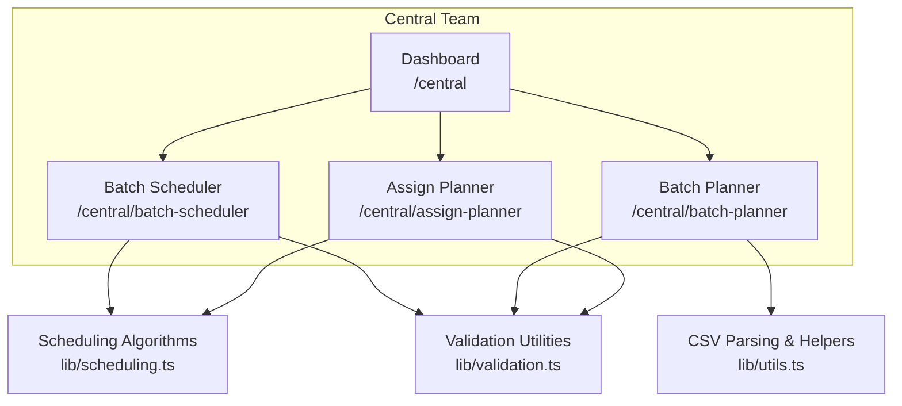
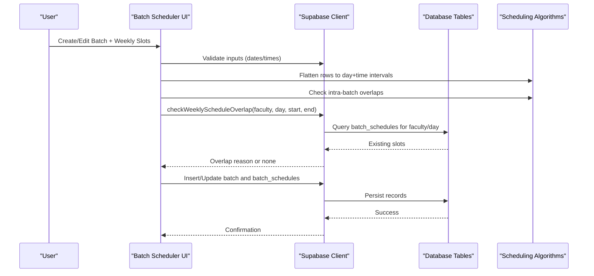
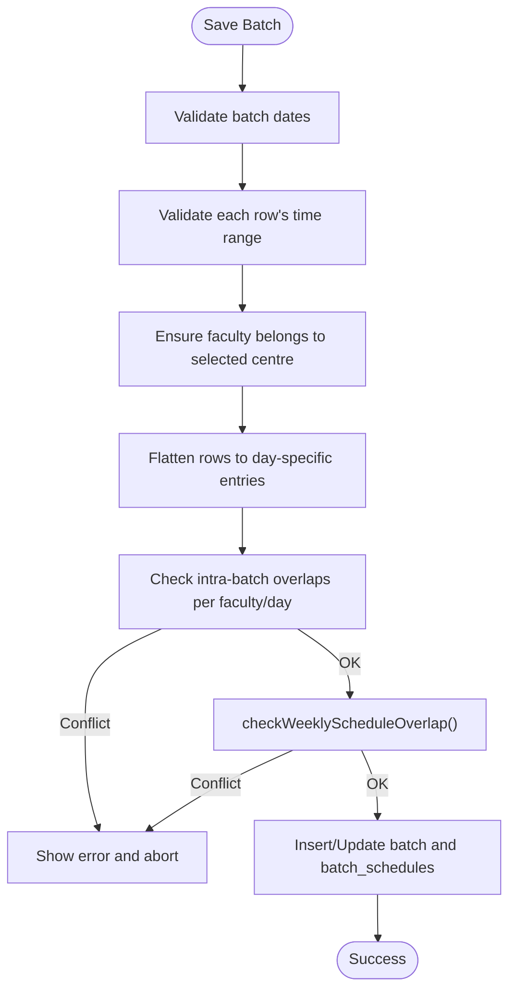
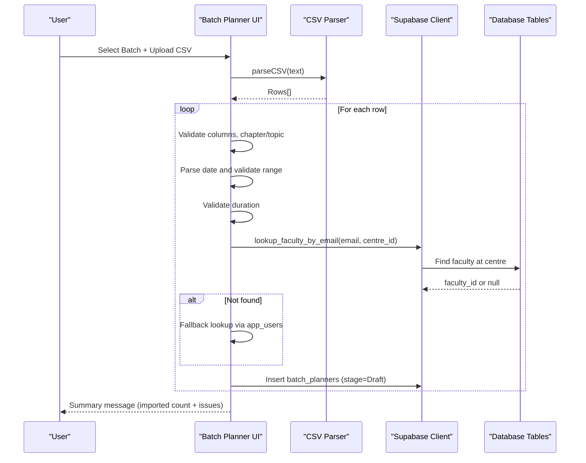
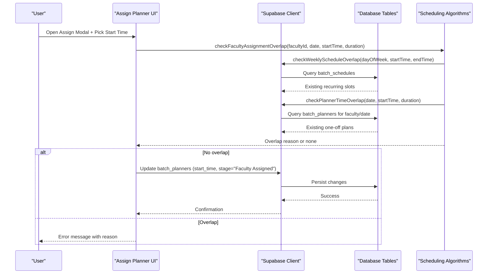
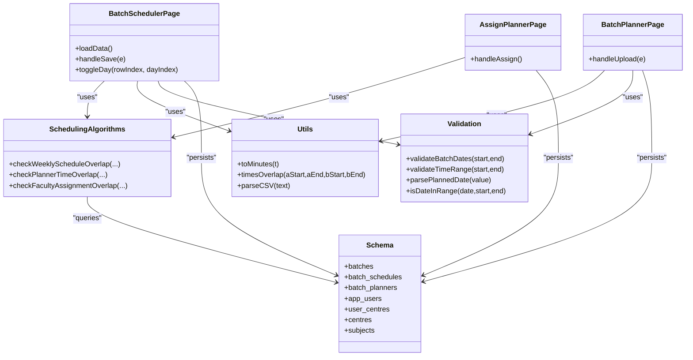
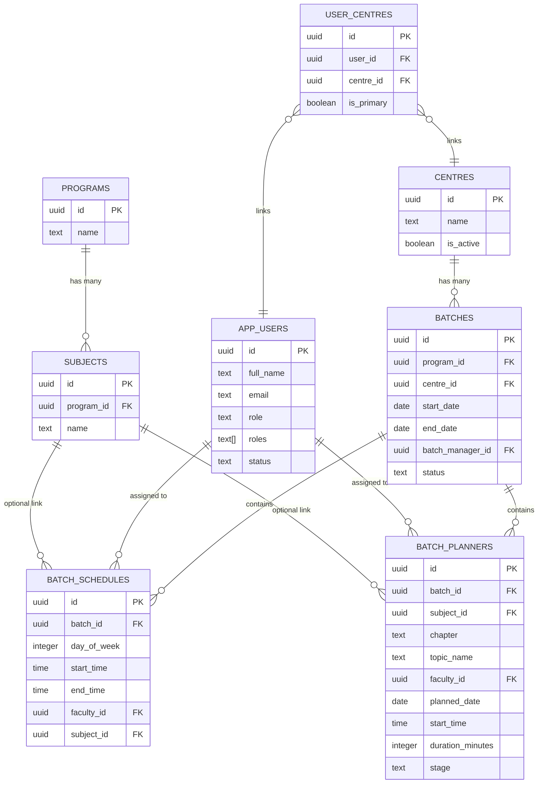

# Central Team Portal

<cite>
**Referenced Files in This Document**
- [layout.tsx](file://app/central/layout.tsx)
- [page.tsx](file://app/central/page.tsx)
- [batch-scheduler/page.tsx](file://app/central/batch-scheduler/page.tsx)
- [batch-planner/page.tsx](file://app/central/batch-planner/page.tsx)
- [assign-planner/page.tsx](file://app/central/assign-planner/page.tsx)
- [scheduling.ts](file://lib/scheduling.ts)
- [utils.ts](file://lib/utils.ts)
- [validation.ts](file://lib/validation.ts)
- [PortalShell.tsx](file://components/PortalShell.tsx)
- [schema.sql](file://scripts/schema.sql)
</cite>

## Table of Contents
1. [Introduction](#introduction)
2. [Project Structure](#project-structure)
3. [Core Components](#core-components)
4. [Architecture Overview](#architecture-overview)
5. [Detailed Component Analysis](#detailed-component-analysis)
6. [Dependency Analysis](#dependency-analysis)
7. [Performance Considerations](#performance-considerations)
8. [Troubleshooting Guide](#troubleshooting-guide)
9. [Conclusion](#conclusion)
10. [Appendices](#appendices)

## Introduction
The Central Team Portal is a Next.js application designed for academic coordinators to manage batch schedules and lecture planning across multiple centres. It provides three core features:
- Batch Scheduler: Create recurring weekly timetables with conflict detection against existing faculty schedules.
- Batch Planner: One-off lecture planning with CSV import, including validation and integration with the broader academic calendar (batch date ranges).
- Assign Planner: Distribute lectures to faculty members by assigning start times with overlap checks against both recurring schedules and other one-off plans.

This document explains the scheduling algorithms, time overlap detection, faculty assignment workflows, and how these features integrate with the central data model.

## Project Structure
The portal uses a feature-based layout under app/central for the Central Team role. The main pages are:
- Dashboard: High-level stats and quick links to tools.
- Batch Scheduler: Recurring weekly schedule creation and editing.
- Batch Planner: CSV-driven bulk creation of planned lectures.
- Assign Planner: Assign timings and manage planner stages.

**Diagram sources**
- [layout.tsx:6-11](file://app/central/layout.tsx#L6-L11)
- [page.tsx:55-61](file://app/central/page.tsx#L55-L61)
- [batch-scheduler/page.tsx:1-10](file://app/central/batch-scheduler/page.tsx#L1-L10)
- [batch-planner/page.tsx:1-10](file://app/central/batch-planner/page.tsx#L1-L10)
- [assign-planner/page.tsx:1-10](file://app/central/assign-planner/page.tsx#L1-L10)
- [scheduling.ts:1-10](file://lib/scheduling.ts#L1-L10)
- [utils.ts:1-10](file://lib/utils.ts#L1-L10)
- [validation.ts:1-10](file://lib/validation.ts#L1-L10)

**Section sources**
- [layout.tsx:1-32](file://app/central/layout.tsx#L1-L32)
- [page.tsx:1-65](file://app/central/page.tsx#L1-L65)

## Core Components
- Batch Scheduler
  - Creates batches and assigns recurring weekly slots per faculty member.
  - Validates dates, times, centre membership, and detects overlaps within the same batch and across all batches using shared faculty schedules.
- Batch Planner
  - Accepts CSV files to create one-off planned lectures for a selected batch.
  - Validates rows, resolves faculty by email at the correct centre, ensures dates fall within the batch range, and persists as Draft stage entries.
- Assign Planner
  - Lists planned lectures with stage filters.
  - Assigns a start time to a plan after checking for conflicts against both recurring schedules and other one-off plans on the same date.

Key utilities:
- Time overlap detection and minute conversion helpers.
- Date/time validation functions.
- CSV parsing utility that respects quoted fields.

**Section sources**
- [batch-scheduler/page.tsx:85-120](file://app/central/batch-scheduler/page.tsx#L85-L120)
- [batch-planner/page.tsx:19-48](file://app/central/batch-planner/page.tsx#L19-L48)
- [assign-planner/page.tsx:22-53](file://app/central/assign-planner/page.tsx#L22-L53)
- [scheduling.ts:10-43](file://lib/scheduling.ts#L10-L43)
- [utils.ts:7-18](file://lib/utils.ts#L7-L18)
- [validation.ts:16-26](file://lib/validation.ts#L16-L26)

## Architecture Overview
The system integrates UI components with Supabase-backed tables and server-side RPC functions. Overlap checks are performed both client-side (for immediate feedback) and server-side via database queries.

**Diagram sources**
- [batch-scheduler/page.tsx:249-404](file://app/central/batch-scheduler/page.tsx#L249-L404)
- [scheduling.ts:10-43](file://lib/scheduling.ts#L10-L43)
- [schema.sql:118-131](file://scripts/schema.sql#L118-L131)

## Detailed Component Analysis

### Batch Scheduler
Purpose:
- Define a batch (program, centre, manager, date range).
- Build a weekly timetable by selecting faculty, start/end times, and days.
- Enforce constraints:
  - Centre membership for faculty and managers.
  - Valid date and time ranges.
  - No overlapping slots for the same faculty on the same day within the batch.
  - No overlap with any existing weekly schedule for the faculty across all batches.

Data flow:
- Load reference data (programs, centres, faculty, managers, user-centre mappings).
- On save:
  - Validate form fields.
  - Flatten multi-day rows into individual day entries.
  - Detect intra-batch overlaps using time overlap logic.
  - Call server-side overlap check against batch_schedules.
  - Upsert batch and its schedules.

**Diagram sources**
- [batch-scheduler/page.tsx:249-404](file://app/central/batch-scheduler/page.tsx#L249-L404)
- [scheduling.ts:10-43](file://lib/scheduling.ts#L10-L43)
- [utils.ts:12-18](file://lib/utils.ts#L12-L18)
- [validation.ts:16-26](file://lib/validation.ts#L16-L26)

**Section sources**
- [batch-scheduler/page.tsx:133-176](file://app/central/batch-scheduler/page.tsx#L133-L176)
- [batch-scheduler/page.tsx:249-404](file://app/central/batch-scheduler/page.tsx#L249-L404)
- [scheduling.ts:10-43](file://lib/scheduling.ts#L10-L43)
- [schema.sql:118-131](file://scripts/schema.sql#L118-L131)

### Batch Planner
Purpose:
- Upload a CSV to create one-off planned lectures for a selected batch.
- Validate each row:
  - Required columns and values.
  - Subject existence.
  - Faculty resolution by email within the batch’s centre.
  - Planned date within the batch’s date range.
  - Duration within allowed bounds.
- Persist as Draft stage entries.

CSV format:
- Columns: Subject, Chapter, Topic Name, Faculty Email, Planned Date (YYYY-MM-DD), Duration (minutes).

**Diagram sources**
- [batch-planner/page.tsx:50-162](file://app/central/batch-planner/page.tsx#L50-L162)
- [utils.ts:32-58](file://lib/utils.ts#L32-L58)
- [validation.ts:2-14](file://lib/validation.ts#L2-L14)
- [schema.sql:135-151](file://scripts/schema.sql#L135-L151)
- [schema.sql:196-213](file://scripts/schema.sql#L196-L213)

**Section sources**
- [batch-planner/page.tsx:19-48](file://app/central/batch-planner/page.tsx#L19-L48)
- [batch-planner/page.tsx:50-162](file://app/central/batch-planner/page.tsx#L50-L162)
- [utils.ts:32-58](file://lib/utils.ts#L32-L58)
- [validation.ts:2-14](file://lib/validation.ts#L2-L14)
- [schema.sql:135-151](file://scripts/schema.sql#L135-L151)

### Assign Planner
Purpose:
- Display planned lectures with stage filters.
- Allow assigning a start time to a plan after verifying no conflicts exist.
- Update stage to “Faculty Assigned” upon successful assignment.

Assignment workflow:
- Compute end time from start time and duration.
- Check overlap with:
  - Recurring weekly schedules for the faculty on the corresponding day-of-week.
  - Other one-off plans for the faculty on the same date.
- If no conflicts, persist start_time and update stage.

**Diagram sources**
- [assign-planner/page.tsx:73-118](file://app/central/assign-planner/page.tsx#L73-L118)
- [scheduling.ts:79-112](file://lib/scheduling.ts#L79-L112)
- [schema.sql:135-151](file://scripts/schema.sql#L135-L151)

**Section sources**
- [assign-planner/page.tsx:22-53](file://app/central/assign-planner/page.tsx#L22-L53)
- [assign-planner/page.tsx:73-118](file://app/central/assign-planner/page.tsx#L73-L118)
- [scheduling.ts:79-112](file://lib/scheduling.ts#L79-L112)

## Dependency Analysis
High-level dependencies between modules and data structures:

**Diagram sources**
- [batch-scheduler/page.tsx:1-10](file://app/central/batch-scheduler/page.tsx#L1-L10)
- [batch-planner/page.tsx:1-10](file://app/central/batch-planner/page.tsx#L1-L10)
- [assign-planner/page.tsx:1-10](file://app/central/assign-planner/page.tsx#L1-L10)
- [scheduling.ts:1-10](file://lib/scheduling.ts#L1-L10)
- [utils.ts:1-10](file://lib/utils.ts#L1-L10)
- [validation.ts:1-10](file://lib/validation.ts#L1-L10)
- [schema.sql:103-151](file://scripts/schema.sql#L103-L151)

**Section sources**
- [scheduling.ts:10-112](file://lib/scheduling.ts#L10-L112)
- [utils.ts:7-58](file://lib/utils.ts#L7-L58)
- [validation.ts:2-26](file://lib/validation.ts#L2-L26)
- [schema.sql:103-151](file://scripts/schema.sql#L103-L151)

## Performance Considerations
- Use indexes defined in the schema for efficient queries:
  - batch_schedules: faculty_id + day_of_week, batch_id.
  - batch_planners: faculty_id + planned_date, batch_id.
- Keep CSV imports incremental; avoid extremely large uploads without chunking.
- Prefer server-side lookups (RPC functions) for faculty resolution to reduce client-side complexity.
- Avoid redundant re-renders by memoizing derived lists where possible (e.g., centre-filtered faculty/managers).

[No sources needed since this section provides general guidance]

## Troubleshooting Guide
Common issues and resolutions:
- Overlap errors in Batch Scheduler
  - Cause: Same faculty assigned overlapping times on the same day within the batch or across other batches.
  - Resolution: Adjust start/end times or days; ensure no recurring slot conflicts.
- Faculty not found during CSV import
  - Cause: Email does not match an active faculty at the selected centre.
  - Resolution: Verify email spelling and ensure faculty has the correct roles and centre association.
- Date outside batch range
  - Cause: Planned date falls outside the batch’s start_date and end_date.
  - Resolution: Correct the date to be within the batch range.
- Invalid duration
  - Cause: Duration less than 15 minutes or greater than 480 minutes.
  - Resolution: Adjust duration to be within the allowed range.
- Assignment blocked due to conflicts
  - Cause: Selected start time overlaps with either a recurring schedule or another one-off plan on the same date.
  - Resolution: Choose a different start time or resolve existing assignments first.

**Section sources**
- [batch-scheduler/page.tsx:249-404](file://app/central/batch-scheduler/page.tsx#L249-L404)
- [batch-planner/page.tsx:50-162](file://app/central/batch-planner/page.tsx#L50-L162)
- [assign-planner/page.tsx:73-118](file://app/central/assign-planner/page.tsx#L73-L118)
- [scheduling.ts:79-112](file://lib/scheduling.ts#L79-L112)

## Conclusion
The Central Team Portal streamlines academic scheduling by combining recurring weekly timetables with flexible one-off lecture planning and robust conflict detection. Its modular design separates UI concerns from scheduling algorithms and validation, while leveraging Supabase for data persistence and efficient querying. Coordinators can confidently manage complex schedules across centres with clear error messaging and actionable guidance.

[No sources needed since this section summarizes without analyzing specific files]

## Appendices

### Data Model Overview

**Diagram sources**
- [schema.sql:25-151](file://scripts/schema.sql#L25-L151)