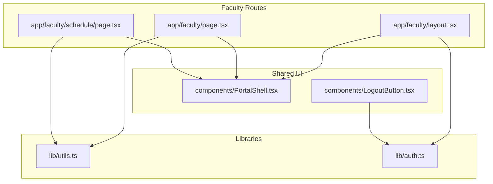
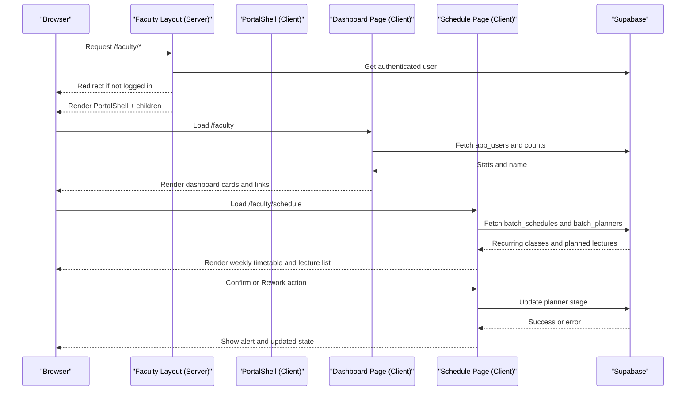
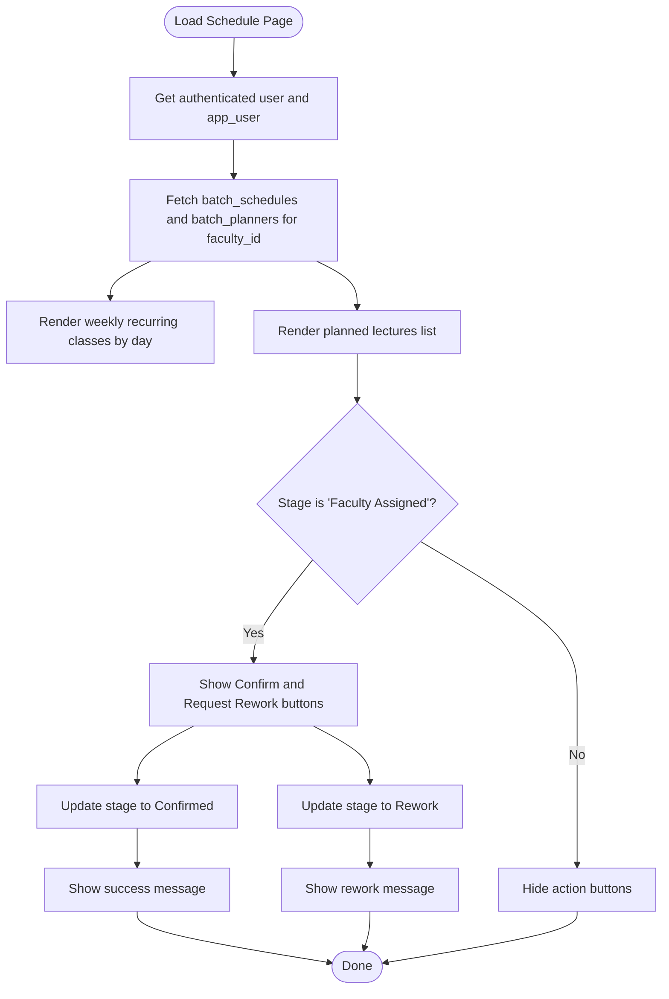
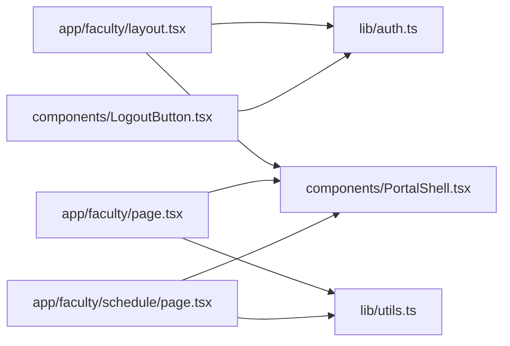

# Faculty Portal

<cite>
**Referenced Files in This Document**
- [app/faculty/page.tsx](file://app/faculty/page.tsx)
- [app/faculty/layout.tsx](file://app/faculty/layout.tsx)
- [app/faculty/schedule/page.tsx](file://app/faculty/schedule/page.tsx)
- [components/PortalShell.tsx](file://components/PortalShell.tsx)
- [lib/utils.ts](file://lib/utils.ts)
- [lib/auth.ts](file://lib/auth.ts)
- [components/LogoutButton.tsx](file://components/LogoutButton.tsx)
</cite>

## Table of Contents
1. [Introduction](#introduction)
2. [Project Structure](#project-structure)
3. [Core Components](#core-components)
4. [Architecture Overview](#architecture-overview)
5. [Detailed Component Analysis](#detailed-component-analysis)
6. [Dependency Analysis](#dependency-analysis)
7. [Performance Considerations](#performance-considerations)
8. [Troubleshooting Guide](#troubleshooting-guide)
9. [Conclusion](#conclusion)

## Introduction
The Faculty Portal provides instructors with a personal academic workspace to manage their teaching responsibilities. It includes:
- A dashboard overview showing current teaching load, upcoming lectures, and confirmation status
- A schedule view that displays weekly recurring classes and planned lectures
- Actions for faculty to confirm or request rework for assigned lectures
- Clear presentation of batch associations and lecture details

This documentation explains how the portal works, what information is shown, and how faculty can interpret schedules, conflicts, and batch hierarchies.

## Project Structure
The Faculty Portal is implemented as a Next.js application using server-side layout guards and client-side pages. Key areas include:
- Faculty routes under app/faculty
- Shared UI shell and components under components
- Utilities for time formatting and stage badges under lib/utils
- Authentication helpers under lib/auth

**Diagram sources**
- [app/faculty/layout.tsx:1-30](file://app/faculty/layout.tsx#L1-L30)
- [app/faculty/page.tsx:1-70](file://app/faculty/page.tsx#L1-L70)
- [app/faculty/schedule/page.tsx:1-194](file://app/faculty/schedule/page.tsx#L1-L194)
- [components/PortalShell.tsx:1-184](file://components/PortalShell.tsx#L1-L184)
- [lib/utils.ts:1-74](file://lib/utils.ts#L1-L74)
- [lib/auth.ts:1-69](file://lib/auth.ts#L1-L69)

**Section sources**
- [app/faculty/layout.tsx:1-30](file://app/faculty/layout.tsx#L1-L30)
- [app/faculty/page.tsx:1-70](file://app/faculty/page.tsx#L1-L70)
- [app/faculty/schedule/page.tsx:1-194](file://app/faculty/schedule/page.tsx#L1-L194)
- [components/PortalShell.tsx:1-184](file://components/PortalShell.tsx#L1-L184)
- [lib/utils.ts:1-74](file://lib/utils.ts#L1-L74)
- [lib/auth.ts:1-69](file://lib/auth.ts#L1-L69)

## Core Components
- Faculty Dashboard: Displays counts for weekly slots, planned lectures, and confirmed lectures. Provides quick navigation to the schedule page.
- Schedule Page: Shows weekly recurring classes grouped by day and a list of planned lectures with topic, subject, chapter, batch, time, duration, and stage. Includes actions to confirm or request rework when assigned.
- Portal Shell: Renders role-based navigation, header, and user controls (logout).
- Utilities: Time formatting, overlap detection, and stage badge styling.
- Authentication Helpers: Resolves the application user profile from Supabase auth.

**Section sources**
- [app/faculty/page.tsx:1-70](file://app/faculty/page.tsx#L1-L70)
- [app/faculty/schedule/page.tsx:1-194](file://app/faculty/schedule/page.tsx#L1-L194)
- [components/PortalShell.tsx:1-184](file://components/PortalShell.tsx#L1-L184)
- [lib/utils.ts:1-74](file://lib/utils.ts#L1-L74)
- [lib/auth.ts:1-69](file://lib/auth.ts#L1-L69)

## Architecture Overview
The Faculty Portal uses a Next.js App Router structure with server-side layout protection and client-side data fetching. The flow is:
- Server-side layout checks authentication and redirects unauthenticated users
- Client-side pages fetch user profile and related data from Supabase
- UI renders dashboard metrics and schedule views
- User actions update lecture stages via Supabase updates

**Diagram sources**
- [app/faculty/layout.tsx:1-30](file://app/faculty/layout.tsx#L1-L30)
- [app/faculty/page.tsx:1-70](file://app/faculty/page.tsx#L1-L70)
- [app/faculty/schedule/page.tsx:1-194](file://app/faculty/schedule/page.tsx#L1-L194)
- [components/PortalShell.tsx:1-184](file://components/PortalShell.tsx#L1-L184)

## Detailed Component Analysis

### Faculty Dashboard
Purpose:
- Provide an at-a-glance overview of teaching load and planning status
- Offer quick access to the schedule page

Key behaviors:
- Loads the current user’s full name from the application user table
- Counts weekly scheduled slots, total planned lectures, and confirmed lectures
- Displays summary cards and a navigation grid item to the schedule page

Data model interactions:
- Reads app_users for identity
- Queries batch_schedules for weekly slot count
- Queries batch_planners for lecture counts filtered by faculty_id and stage

User experience:
- Personalized greeting with the instructor’s name
- Clear numeric indicators for workload and planning progress

**Section sources**
- [app/faculty/page.tsx:1-70](file://app/faculty/page.tsx#L1-L70)
- [components/PortalShell.tsx:79-97](file://components/PortalShell.tsx#L79-L97)
- [components/PortalShell.tsx:164-183](file://components/PortalShell.tsx#L164-L183)

### Schedule View
Purpose:
- Display weekly recurring classes by day
- List planned lectures with actionable statuses
- Present batch associations and lecture details

Key features:
- Weekly timetable grouped by day with start/end times and batch names
- Planned lectures list including topic, chapter, subject, batch, date/time, duration, and stage badge
- Actions to confirm or request rework when a lecture is “Faculty Assigned”
- Alerts for success or error feedback

Data model interactions:
- Fetches batch_schedules for recurring classes per faculty_id
- Fetches batch_planners for planned lectures per faculty_id, ordered by planned_date
- Updates planner stage on confirm or rework actions

Interpreting schedule conflicts:
- The utilities provide a function to detect overlapping time intervals; while the schedule page does not explicitly render conflict warnings, the same logic can be used to identify clashes between recurring slots and planned lectures.

Batch hierarchy understanding:
- Each schedule and planner entry includes a batch object with a name and centre identifier. This indicates which batch and centre the class belongs to. The portal shows the batch name directly in the UI.

Venue information:
- The current implementation does not display venue fields in the schedule or planner records. If venues are required, they would need to be added to the data model and rendered in the UI.

Course materials:
- The current implementation does not include course material links or attachments. Any such feature would require additional data fields and UI elements.

**Diagram sources**
- [app/faculty/schedule/page.tsx:1-194](file://app/faculty/schedule/page.tsx#L1-L194)
- [lib/utils.ts:20-26](file://lib/utils.ts#L20-L26)
- [lib/utils.ts:60-73](file://lib/utils.ts#L60-L73)

**Section sources**
- [app/faculty/schedule/page.tsx:1-194](file://app/faculty/schedule/page.tsx#L1-L194)
- [lib/utils.ts:1-74](file://lib/utils.ts#L1-L74)

### Portal Shell and Navigation
Purpose:
- Provide consistent layout, navigation, and user controls across faculty pages
- Display role label and active navigation state

Key behaviors:
- Renders sidebar navigation with active highlighting based on current path
- Shows user’s full name and logout button
- Supports mobile-responsive header with logout control

Navigation items:
- Dashboard link to /faculty
- My Schedule link to /faculty/schedule

**Section sources**
- [components/PortalShell.tsx:1-184](file://components/PortalShell.tsx#L1-L184)
- [app/faculty/layout.tsx:6-9](file://app/faculty/layout.tsx#L6-L9)

### Authentication and User Profile Resolution
Purpose:
- Ensure only authenticated users access the faculty area
- Resolve application user profile for personalized content

Key behaviors:
- Server-side layout checks Supabase auth and redirects to login if missing
- Uses helper to resolve app_user by auth_id or email fallback
- Auto-links auth_id for future fast lookups

Role and centre handling:
- Helper functions support retrieving centre IDs and checking roles, enabling future role-based restrictions if needed

**Section sources**
- [app/faculty/layout.tsx:1-30](file://app/faculty/layout.tsx#L1-L30)
- [lib/auth.ts:18-51](file://lib/auth.ts#L18-L51)
- [lib/auth.ts:53-69](file://lib/auth.ts#L53-L69)
- [components/LogoutButton.tsx:1-24](file://components/LogoutButton.tsx#L1-L24)

## Dependency Analysis
High-level dependencies among core files:
- Faculty layout depends on Supabase server client and auth helpers to protect routes
- Dashboard and schedule pages depend on Supabase client to fetch data and perform updates
- Both pages use shared UI components from PortalShell
- Schedule page uses utility functions for time formatting and stage badges
- Logout button triggers Supabase sign-out and navigates back to login

**Diagram sources**
- [app/faculty/layout.tsx:1-30](file://app/faculty/layout.tsx#L1-L30)
- [app/faculty/page.tsx:1-70](file://app/faculty/page.tsx#L1-L70)
- [app/faculty/schedule/page.tsx:1-194](file://app/faculty/schedule/page.tsx#L1-L194)
- [components/PortalShell.tsx:1-184](file://components/PortalShell.tsx#L1-L184)
- [lib/utils.ts:1-74](file://lib/utils.ts#L1-L74)
- [lib/auth.ts:1-69](file://lib/auth.ts#L1-L69)
- [components/LogoutButton.tsx:1-24](file://components/LogoutButton.tsx#L1-L24)

**Section sources**
- [app/faculty/layout.tsx:1-30](file://app/faculty/layout.tsx#L1-L30)
- [app/faculty/page.tsx:1-70](file://app/faculty/page.tsx#L1-L70)
- [app/faculty/schedule/page.tsx:1-194](file://app/faculty/schedule/page.tsx#L1-L194)
- [components/PortalShell.tsx:1-184](file://components/PortalShell.tsx#L1-L184)
- [lib/utils.ts:1-74](file://lib/utils.ts#L1-L74)
- [lib/auth.ts:1-69](file://lib/auth.ts#L1-L69)
- [components/LogoutButton.tsx:1-24](file://components/LogoutButton.tsx#L1-L24)

## Performance Considerations
- Data loading:
  - Dashboard aggregates counts using separate queries; consider batching or server-side aggregation if counts grow large
  - Schedule page loads both recurring schedules and planned lectures concurrently using parallel requests
- Rendering:
  - Weekly timetable filters and sorts by day index and start time; this is efficient for typical weekly loads
- State updates:
  - Local state updates reflect confirm/rework actions immediately, improving perceived performance
- Caching:
  - No explicit caching is implemented; consider adding lightweight client-side caching or Supabase real-time subscriptions if frequent updates are expected

[No sources needed since this section provides general guidance]

## Troubleshooting Guide
Common issues and resolutions:
- Not logged in or redirected to login:
  - Ensure Supabase session exists; the layout redirects unauthenticated users to the login route
- Missing profile or empty name:
  - Verify app_users record exists for the authenticated email; the dashboard and schedule pages rely on this lookup
- No recurring classes or planned lectures:
  - Check that batch_schedules and batch_planners entries exist for the faculty_id
- Confirm or Rework action fails:
  - Inspect error messages displayed by alerts; ensure the planner record exists and permissions allow updates
- Logout not working:
  - Confirm Supabase client initialization and router refresh after sign-out

Operational tips:
- Use browser network tab to verify API responses for counts and lists
- Validate time formats and stage values match expected constants

**Section sources**
- [app/faculty/layout.tsx:11-17](file://app/faculty/layout.tsx#L11-L17)
- [app/faculty/page.tsx:11-38](file://app/faculty/page.tsx#L11-L38)
- [app/faculty/schedule/page.tsx:38-79](file://app/faculty/schedule/page.tsx#L38-L79)
- [app/faculty/schedule/page.tsx:81-97](file://app/faculty/schedule/page.tsx#L81-L97)
- [components/LogoutButton.tsx:10-14](file://components/LogoutButton.tsx#L10-L14)

## Conclusion
The Faculty Portal delivers a focused workspace for instructors with:
- A clear dashboard summarizing teaching load and planning status
- A comprehensive schedule view combining weekly recurring classes and planned lectures
- Simple actions to confirm or request rework for assigned lectures
- Transparent presentation of batch associations and lecture details

Future enhancements could include:
- Venue information display for classes
- Course materials integration
- Explicit conflict detection and warnings
- Real-time updates for schedule changes

[No sources needed since this section summarizes without analyzing specific files]