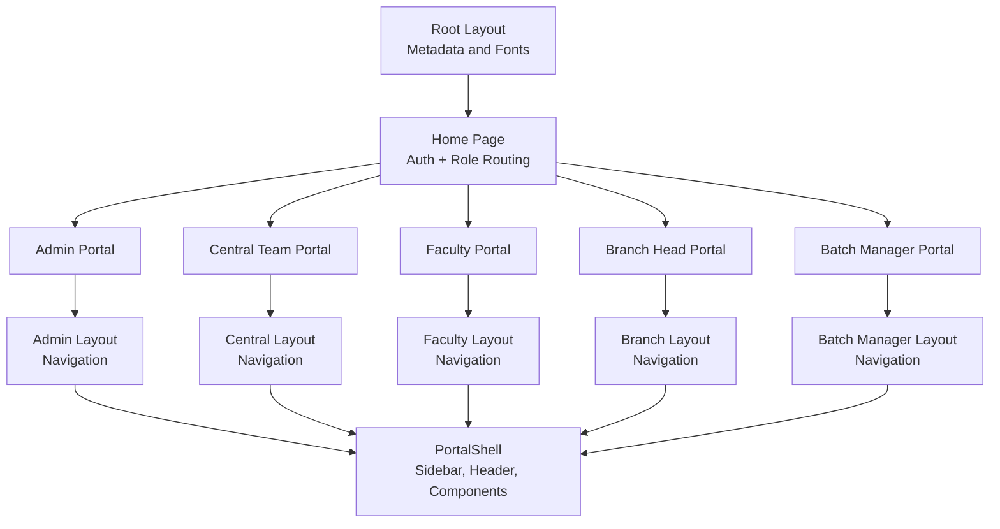
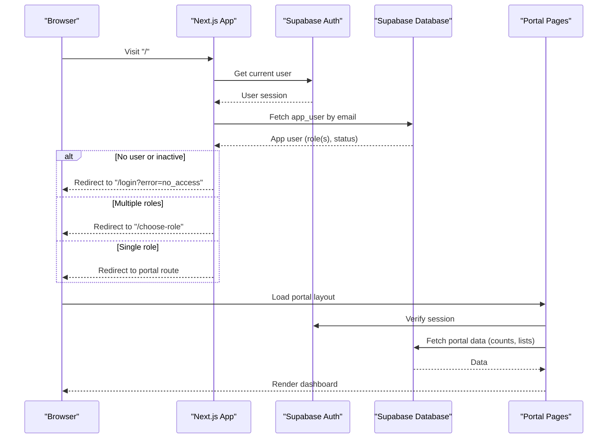
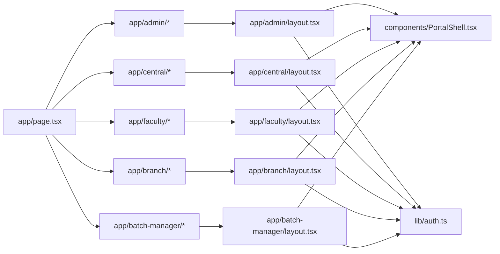

# User Portals

<cite>
**Referenced Files in This Document**
- [README.md](file://README.md)
- [app/layout.tsx](file://app/layout.tsx)
- [app/page.tsx](file://app/page.tsx)
- [components/PortalShell.tsx](file://components/PortalShell.tsx)
- [lib/auth.ts](file://lib/auth.ts)
- [app/admin/layout.tsx](file://app/admin/layout.tsx)
- [app/admin/page.tsx](file://app/admin/page.tsx)
- [app/central/layout.tsx](file://app/central/layout.tsx)
- [app/central/page.tsx](file://app/central/page.tsx)
- [app/faculty/layout.tsx](file://app/faculty/layout.tsx)
- [app/faculty/page.tsx](file://app/faculty/page.tsx)
- [app/branch/layout.tsx](file://app/branch/layout.tsx)
- [app/branch/page.tsx](file://app/branch/page.tsx)
- [app/batch-manager/layout.tsx](file://app/batch-manager/layout.tsx)
- [app/batch-manager/page.tsx](file://app/batch-manager/page.tsx)
</cite>

## Table of Contents
1. Introduction
2. Project Structure
3. Core Components
4. Architecture Overview
5. Detailed Component Analysis
6. Dependency Analysis
7. Performance Considerations
8. Troubleshooting Guide
9. Conclusion

## Introduction
This document explains the five user portals in the Superclass Portal system: Admin, Central Team, Faculty, Branch Head, and Batch Manager. It covers each portal’s purpose, user workflow, key features, navigation structure, role-specific permissions, common use cases, and descriptive screenshots to help users understand what they will see and do.

The application is a Next.js project that authenticates users, resolves their roles, and redirects them to the appropriate portal. Each portal provides a consistent shell with a sidebar navigation, header, and main content area.

## Project Structure
At a high level:
- The root layout sets up global metadata and fonts.
- The home page performs authentication and role-based routing to one of the five portals.
- Each portal has its own layout (defining navigation) and dashboard page.
- A shared UI shell provides consistent branding, navigation, and components across portals.

**Diagram sources**
- [app/layout.tsx:15-18](file://app/layout.tsx#L15-L18)
- [app/page.tsx:4-45](file://app/page.tsx#L4-L45)
- [app/admin/layout.tsx:6-15](file://app/admin/layout.tsx#L6-L15)
- [app/central/layout.tsx:6-11](file://app/central/layout.tsx#L6-L11)
- [app/faculty/layout.tsx:6-9](file://app/faculty/layout.tsx#L6-L9)
- [app/branch/layout.tsx:6-6](file://app/branch/layout.tsx#L6-L6)
- [app/batch-manager/layout.tsx:6-8](file://app/batch-manager/layout.tsx#L6-L8)
- [components/PortalShell.tsx:21-77](file://components/PortalShell.tsx#L21-L77)

**Section sources**
- [README.md:1-37](file://README.md#L1-L37)
- [app/layout.tsx:15-18](file://app/layout.tsx#L15-L18)
- [app/page.tsx:4-45](file://app/page.tsx#L4-L45)

## Core Components
- Authentication and user resolution:
  - The home page checks authentication and fetches the app user record to determine active roles and redirect accordingly. If multiple roles exist, the user is sent to a role selection page; otherwise, they are redirected to the matching portal route.
- Shared UI shell:
  - The PortalShell renders a responsive sidebar with navigation items, a header on small screens, and reusable components for cards, alerts, buttons, and dashboards.
- Role utilities:
  - Helper functions retrieve the app user by auth ID or email, compute centre associations, and check roles.

Key responsibilities:
- Route guards per portal layout ensure only authenticated users can access portal pages.
- Navigation arrays define each portal’s menu.
- Dashboard pages present role-specific metrics and entry points.

**Section sources**
- [app/page.tsx:4-45](file://app/page.tsx#L4-L45)
- [components/PortalShell.tsx:21-77](file://components/PortalShell.tsx#L21-L77)
- [lib/auth.ts:18-69](file://lib/auth.ts#L18-L69)

## Architecture Overview
The system uses client-side data fetching from Supabase within React components after server-side authentication checks in layouts. Each portal layout wraps its pages with the shared shell and enforces authentication before rendering.

**Diagram sources**
- [app/page.tsx:4-45](file://app/page.tsx#L4-L45)
- [app/admin/layout.tsx:17-35](file://app/admin/layout.tsx#L17-L35)
- [app/central/layout.tsx:13-31](file://app/central/layout.tsx#L13-L31)
- [app/faculty/layout.tsx:11-29](file://app/faculty/layout.tsx#L11-L29)
- [app/branch/layout.tsx:8-26](file://app/branch/layout.tsx#L8-L26)
- [app/batch-manager/layout.tsx:10-28](file://app/batch-manager/layout.tsx#L10-L28)

## Detailed Component Analysis

### Admin Portal
Purpose:
- System administration including centres, programs, faculty, central team members, branch heads, batch managers, and audit logs.

User workflow:
- Log in as admin → land on Admin Dashboard → view aggregate stats → navigate via sidebar to manage entities.

Key features:
- Aggregate counters for centres, programs, faculty, batches, and total users.
- Quick links to management sections.

Navigation structure:
- Dashboard
- Centres
- Programs
- Faculty
- Central Team
- Batch Managers
- Branch Heads
- Audit Log

Role-specific permissions:
- Accessible to users with the admin role.
- Server-side guard ensures unauthenticated users are redirected to login.

Common use cases:
- Add/edit centres and assign branch heads.
- Manage programs and subjects.
- Activate/deactivate faculty accounts.
- Manage central team membership.
- Assign branch heads to centres.
- Manage batch managers across centres.
- Review audit log entries.

Screenshots description:
- Admin Dashboard shows five metric cards (Centres, Programs, Faculty, Batches, Total Users) and a grid of action tiles linking to management pages.

**Section sources**
- [app/admin/layout.tsx:6-15](file://app/admin/layout.tsx#L6-L15)
- [app/admin/page.tsx:7-74](file://app/admin/page.tsx#L7-L74)

### Central Team Portal
Purpose:
- Batch scheduling and planning across all centres, including creating batches, setting weekly schedules, bulk uploading lecture plans, and assigning planner stages.

User workflow:
- Log in as central team member → land on Central Team Dashboard → view counts (active centres, total batches, active faculty, planned lectures) → navigate to scheduler/planner tools.

Key features:
- Metrics summarizing operational scope.
- Entry points to Batch Scheduler, Batch Planner, and Assign Planner.

Navigation structure:
- Dashboard
- Batch Scheduler
- Batch Planner
- Assign Planner

Role-specific permissions:
- Accessible to users with the central_team role.
- Server-side guard ensures unauthenticated users are redirected to login.

Common use cases:
- Create new batches and set week-wise faculty schedules.
- Upload CSV to bulk-create lecture plans.
- Assign timings and manage planner stages.

Screenshots description:
- Central Team Dashboard displays four metric cards (Active Centres, Total Batches, Active Faculty, Planned Lectures) and three action tiles for scheduling and planning tasks.

**Section sources**
- [app/central/layout.tsx:6-11](file://app/central/layout.tsx#L6-L11)
- [app/central/page.tsx:7-64](file://app/central/page.tsx#L7-L64)

### Faculty Portal
Purpose:
- Personal schedule management for individual faculty members.

User workflow:
- Log in as faculty → land on Faculty Dashboard → view personal overview (weekly slots, planned lectures, confirmed count) → open My Schedule.

Key features:
- Personalized greeting using full name.
- Counts for weekly classes, planned lectures, and confirmed lectures.
- Direct link to schedule view.

Navigation structure:
- Dashboard
- My Schedule

Role-specific permissions:
- Accessible to users with the faculty role.
- Server-side guard ensures unauthenticated users are redirected to login.

Common use cases:
- Check upcoming weekly classes.
- Review planned lectures and confirmations.
- Navigate to detailed schedule view.

Screenshots description:
- Faculty Dashboard shows three metric cards (Weekly Slots, Planned Lectures, Confirmed) and a single action tile to “My Schedule.”

**Section sources**
- [app/faculty/layout.tsx:6-9](file://app/faculty/layout.tsx#L6-L9)
- [app/faculty/page.tsx:7-69](file://app/faculty/page.tsx#L7-L69)

### Branch Head Portal
Purpose:
- Centre oversight for branch heads, including monitoring batches and faculty at their assigned centre.

User workflow:
- Log in as branch head → land on Branch Head Dashboard → centre is auto-detected → view stats (total/active batches, faculty counts) → expand batch cards to see schedules → review faculty list.

Key features:
- Auto-detection of primary centre via user_centres or fallback centre_id.
- Batches list with program names, date ranges, status badges, and expandable schedules.
- Faculty table showing name, email, and type (Permanent vs other).

Navigation structure:
- Dashboard

Role-specific permissions:
- Accessible to users with the branch_head role.
- Server-side guard ensures unauthenticated users are redirected to login.

Common use cases:
- Monitor active and total batches at the centre.
- Inspect weekly schedules per batch.
- View faculty roster and types.

Screenshots description:
- Branch Head Dashboard includes four metric cards (Total Batches, Active Batches, Faculty Members, Permanent Faculty), an expandable list of batches with schedules, and a faculty table.

**Section sources**
- [app/branch/layout.tsx:6-6](file://app/branch/layout.tsx#L6-L6)
- [app/branch/page.tsx:32-241](file://app/branch/page.tsx#L32-L241)

### Batch Manager Portal
Purpose:
- Batch monitoring for assigned batches, including viewing schedules and planned lectures.

User workflow:
- Log in as batch manager → land on Batch Manager Dashboard → load batches managed by the user → expand a batch to view its schedule table.

Key features:
- List of assigned batches with program and centre names, date range, and status badge.
- Expandable schedule view with day, time, and faculty name.

Navigation structure:
- Dashboard

Role-specific permissions:
- Accessible to users with the batch_manager role.
- Server-side guard ensures unauthenticated users are redirected to login.

Common use cases:
- Track progress and status of assigned batches.
- Review weekly schedules and faculty assignments.

Screenshots description:
- Batch Manager Dashboard shows a list of cards for each batch with details and an expandable schedule table.

**Section sources**
- [app/batch-manager/layout.tsx:6-8](file://app/batch-manager/layout.tsx#L6-L8)
- [app/batch-manager/page.tsx:28-152](file://app/batch-manager/page.tsx#L28-L152)

## Dependency Analysis
The following diagram maps how portals depend on shared components and utilities.

**Diagram sources**
- [app/page.tsx:4-45](file://app/page.tsx#L4-L45)
- [app/admin/layout.tsx:17-35](file://app/admin/layout.tsx#L17-L35)
- [app/central/layout.tsx:13-31](file://app/central/layout.tsx#L13-L31)
- [app/faculty/layout.tsx:11-29](file://app/faculty/layout.tsx#L11-L29)
- [app/branch/layout.tsx:8-26](file://app/branch/layout.tsx#L8-L26)
- [app/batch-manager/layout.tsx:10-28](file://app/batch-manager/layout.tsx#L10-L28)
- [components/PortalShell.tsx:21-77](file://components/PortalShell.tsx#L21-L77)
- [lib/auth.ts:18-69](file://lib/auth.ts#L18-L69)

**Section sources**
- [app/page.tsx:4-45](file://app/page.tsx#L4-L45)
- [components/PortalShell.tsx:21-77](file://components/PortalShell.tsx#L21-L77)
- [lib/auth.ts:18-69](file://lib/auth.ts#L18-L69)

## Performance Considerations
- Use exact-count queries where possible to avoid loading full datasets for counters.
- Prefer lazy/expansion patterns for schedules to reduce initial payload size.
- Cache frequently accessed reference data (e.g., programmes, centres) if needed.
- Ensure database indexes on commonly filtered fields (e.g., role, centre_id, batch_manager_id) to speed up lookups.

[No sources needed since this section provides general guidance]

## Troubleshooting Guide
Common issues and resolutions:
- Redirected to login immediately:
  - Ensure the user is authenticated and not inactive. The home page redirects to login when no user is found or when the account is inactive.
- Redirected to choose-role:
  - Occurs when multiple roles are associated with the user. Select the intended role to proceed.
- No data visible in a portal:
  - For Branch Head and Batch Manager, verify that the user is linked to a centre or assigned to batches respectively.
- Incorrect role shown in sidebar:
  - Confirm the user’s role mapping and that the correct portal layout is being used.

Relevant implementation references:
- Authentication and role-based redirection logic.
- Per-portal layout guards.
- App user retrieval and role checking helpers.

**Section sources**
- [app/page.tsx:8-34](file://app/page.tsx#L8-L34)
- [app/admin/layout.tsx:17-23](file://app/admin/layout.tsx#L17-L23)
- [app/central/layout.tsx:13-19](file://app/central/layout.tsx#L13-L19)
- [app/faculty/layout.tsx:11-17](file://app/faculty/layout.tsx#L11-L17)
- [app/branch/layout.tsx:8-14](file://app/branch/layout.tsx#L8-L14)
- [app/batch-manager/layout.tsx:10-16](file://app/batch-manager/layout.tsx#L10-L16)
- [lib/auth.ts:18-69](file://lib/auth.ts#L18-L69)

## Conclusion
The Superclass Portal provides five distinct, role-based interfaces built on a consistent shell and robust authentication flow. Each portal focuses on its domain—administration, cross-centre scheduling and planning, personal teaching schedules, centre oversight, and batch monitoring—while sharing common UI patterns and security checks. By understanding the workflows, navigation, and permissions outlined here, users can efficiently perform their responsibilities within the system.

[No sources needed since this section summarizes without analyzing specific files]